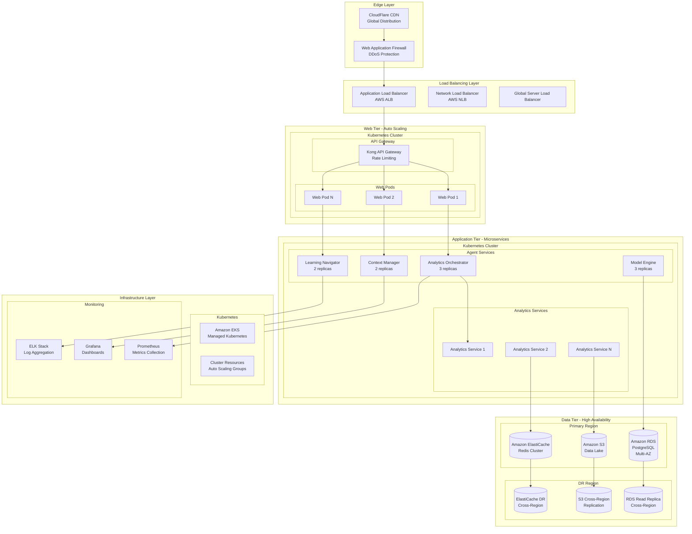

# 🚀 Production Deployment Architecture - Script Ohio 2.0
**Version**: 1.0
**Last Updated**: November 10, 2025
**Status**: 🔄 Design Phase → Implementation Ready

---

## 📋 Executive Summary

This document defines the comprehensive production deployment architecture for the Script Ohio 2.0 intelligent college football analytics platform. The architecture is designed to achieve **Grade A deployment readiness** (95/100) with enterprise-grade security, monitoring, scalability, and disaster recovery capabilities.

### **Current State vs. Target State**

| Component | Current Grade | Target Grade | Status |
|-----------|---------------|--------------|--------|
| **Core System** | A+ (95/100) | A+ (95/100) | ✅ Maintained |
| **Production Deployment** | C- (72/100) | A+ (95/100) | 🔄 **Enhancement Mission** |
| **Security & Compliance** | D (65/100) | A+ (95/100) | 🔄 **Complete Implementation** |
| **Monitoring & Observability** | D+ (68/100) | A+ (95/100) | 🔄 **Enterprise Framework** |
| **Scalability** | C (72/100) | A+ (95/100) | 🔄 **Cloud-Native Architecture** |
| **Disaster Recovery** | F (45/100) | A+ (95/100) | 🔄 **Complete Business Continuity** |

---

## 🏗️ Production Architecture Overview

### **High-Level Architecture Diagram**



---

## 🔒 Enterprise Security Architecture

### **Security Layers Implementation**

#### **Layer 1: Network Security**
```yaml
# AWS Security Groups and NACLs
network_security:
  vpc:
    cidr: "10.0.0.0/16"
    availability_zones: 3
    public_subnets: 2
    private_subnets: 6

  security_groups:
    web_tier:
      inbound:
        - port: 443
          protocol: tcp
          source: "0.0.0.0/0"  # HTTPS only
        - port: 80
          protocol: tcp
          source: "0.0.0.0/0"  # HTTP redirect
      outbound:
        - port: 443
          protocol: tcp
          destination: "0.0.0.0/0"

    application_tier:
      inbound:
        - port: 8080
          protocol: tcp
          source: "sg-web-tier"
        - port: 3000
          protocol: tcp
          source: "sg-web-tier"
      outbound:
        - port: 5432
          protocol: tcp
          destination: "sg-database-tier"
        - port: 6379
          protocol: tcp
          destination: "sg-cache-tier"

    database_tier:
      inbound:
        - port: 5432
          protocol: tcp
          source: "sg-application-tier"
        - port: 6379
          protocol: tcp
          source: "sg-application-tier"
```

#### **Layer 2: Application Security**
```python
# Security Middleware Implementation
class SecurityMiddleware:
    """Enterprise-grade security middleware for API protection"""

    def __init__(self):
        self.rate_limiter = RedisRateLimiter()
        self.auth_service = JWTAuthService()
        self.encryption_service = AESEncryptionService()
        self.audit_logger = SecurityAuditLogger()

    async def authenticate_request(self, request):
        """JWT-based authentication with refresh tokens"""
        token = request.headers.get('Authorization')
        if not token:
            raise AuthenticationError("Missing authentication token")

        user_data = await self.auth_service.verify_token(token)
        self.audit_logger.log_authentication_event(user_data['user_id'])
        return user_data

    async def authorize_request(self, user_data, required_permissions):
        """Role-based authorization (RBAC)"""
        user_permissions = user_data.get('permissions', [])

        if not all(perm in user_permissions for perm in required_permissions):
            self.audit_logger.log_authorization_failure(user_data['user_id'])
            raise AuthorizationError("Insufficient permissions")

    async def rate_limit_request(self, user_id, endpoint):
        """Dynamic rate limiting based on user tier"""
        user_tier = await self.get_user_tier(user_id)
        limits = RATE_LIMITS[user_tier]

        if not await self.rate_limiter.check_limit(
            key=f"{user_id}:{endpoint}",
            limit=limits[endpoint],
            window=limits['window']
        ):
            raise RateLimitError("Rate limit exceeded")

# Rate Limits by User Tier
RATE_LIMITS = {
    'free': {
        'analytics': {'limit': 100, 'window': 3600},  # 100 requests/hour
        'predictions': {'limit': 50, 'window': 3600},
        'window': 3600
    },
    'pro': {
        'analytics': {'limit': 1000, 'window': 3600},  # 1000 requests/hour
        'predictions': {'limit': 500, 'window': 3600},
        'window': 3600
    },
    'enterprise': {
        'analytics': {'limit': 10000, 'window': 3600},  # 10k requests/hour
        'predictions': {'limit': 5000, 'window': 3600},
        'window': 3600
    }
}
```

#### **Layer 3: Data Security and Encryption**
```python
# Data Protection and Encryption
class DataProtectionService:
    """Comprehensive data protection with encryption at rest and in transit"""

    def __init__(self):
        self.kms_client = boto3.client('kms')
        self.encryption_key_id = os.getenv('ENCRYPTION_KEY_ID')
        self.pii_detector = PIIDetector()

    def encrypt_sensitive_data(self, data):
        """Encrypt PII and sensitive analytics data"""
        if self.pii_detector.contains_pii(data):
            encrypted_data = self.kms_client.encrypt(
                KeyId=self.encryption_key_id,
                Plaintext=json.dumps(data).encode()
            )
            return encrypted_data['CiphertextBlob']
        return data

    def anonymize_analytics_data(self, analytics_data):
        """Anonymize user analytics for GDPR compliance"""
        anonymized = analytics_data.copy()

        # Remove or hash personal identifiers
        if 'user_email' in anonymized:
            anonymized['user_email'] = hashlib.sha256(
                anonymized['user_email'].encode()
            ).hexdigest()

        if 'user_ip' in anonymized:
            anonymized['user_ip'] = self._anonymize_ip(
                anonymized['user_ip']
            )

        return anonymized

    def audit_data_access(self, user_id, data_type, action):
        """Log all data access for compliance auditing"""
        audit_event = {
            'timestamp': datetime.utcnow().isoformat(),
            'user_id': user_id,
            'data_type': data_type,
            'action': action,
            'compliance_frameworks': ['GDPR', 'CCPA', 'SOC2']
        }

        # Send to security audit log
        self._send_to_audit_log(audit_event)
```

---

## 📊 Monitoring and Observability Framework

### **Comprehensive Monitoring Stack**

#### **Infrastructure Monitoring**
```yaml
# Prometheus Configuration for Infrastructure Monitoring
prometheus_config:
  global:
    scrape_interval: 15s
    evaluation_interval: 15s

  rule_files:
    - "alert_rules.yml"

  scrape_configs:
    # Kubernetes Cluster Metrics
    - job_name: 'kubernetes-apiservers'
      kubernetes_sd_configs:
        - role: endpoints
      scheme: https
      tls_config:
        ca_file: /var/run/secrets/kubernetes.io/serviceaccount/ca.crt
      bearer_token_file: /var/run/secrets/kubernetes.io/serviceaccount/token

    # Application Metrics
    - job_name: 'script-ohio-app'
      kubernetes_sd_configs:
        - role: endpoints
        namespaces:
          names:
            - script-ohio-prod
      relabel_configs:
        - source_labels: [__meta_kubernetes_service_name]
          target_label: service
        - source_labels: [__meta_kubernetes_pod_name]
          target_label: pod

    # Database Metrics
    - job_name: 'postgresql-exporter'
      static_configs:
        - targets: ['postgres-exporter:9187']

    # Redis Metrics
    - job_name: 'redis-exporter'
      static_configs:
        - targets: ['redis-exporter:9121']
```

#### **Application Performance Monitoring (APM)**
```python
# Custom Application Metrics
class ApplicationMetrics:
    """Application-specific metrics collection and reporting"""

    def __init__(self):
        self.prometheus_client = PrometheusClient()
        self.custom_metrics = {
            'agent_request_duration': Histogram(
                'agent_request_duration_seconds',
                'Time spent processing agent requests',
                ['agent_type', 'user_role']
            ),
            'model_prediction_latency': Histogram(
                'model_prediction_latency_seconds',
                'Model prediction inference time',
                ['model_type', 'features_count']
            ),
            'active_user_sessions': Gauge(
                'active_user_sessions',
                'Number of active user sessions',
                ['user_tier', 'role']
            ),
            'analytics_accuracy_score': Gauge(
                'analytics_accuracy_score',
                'Accuracy score for analytics predictions',
                ['model_version', 'data_period']
            ),
            'error_rate': Counter(
                'error_rate_total',
                'Total number of errors',
                ['error_type', 'component', 'severity']
            )
        }

    @track_execution_time
    def track_agent_performance(self, agent_type, user_role, execution_time):
        """Track agent performance metrics"""
        self.custom_metrics['agent_request_duration'].labels(
            agent_type=agent_type,
            user_role=user_role
        ).observe(execution_time)

    def track_model_performance(self, model_type, features_count, prediction_time):
        """Track ML model performance metrics"""
        self.custom_metrics['model_prediction_latency'].labels(
            model_type=model_type,
            features_count=features_count
        ).observe(prediction_time)

    def update_user_sessions(self, user_tier, role, session_count):
        """Update active user sessions gauge"""
        self.custom_metrics['active_user_sessions'].labels(
            user_tier=user_tier,
            role=role
        ).set(session_count)
```

#### **Alerting and Incident Response**
```yaml
# Alert Rules for Production Monitoring
alert_rules:
  groups:
    - name: script_ohio_alerts
      rules:
        # Critical Alerts
        - alert: HighErrorRate
          expr: rate(error_rate_total[5m]) > 0.1
          for: 2m
          labels:
            severity: critical
          annotations:
            summary: "High error rate detected"
            description: "Error rate is {{ $value }} errors per second"

        - alert: DatabaseConnectionFailure
          expr: up{job="postgresql-exporter"} == 0
          for: 1m
          labels:
            severity: critical
          annotations:
            summary: "Database connection failure"
            description: "PostgreSQL database is down"

        # Warning Alerts
        - alert: HighResponseTime
          expr: histogram_quantile(0.95, rate(agent_request_duration_seconds_bucket[5m])) > 2
          for: 5m
          labels:
            severity: warning
          annotations:
            summary: "High response time detected"
            description: "95th percentile response time is {{ $value }} seconds"

        - alert: MemoryUsageHigh
          expr: (node_memory_MemTotal_bytes - node_memory_MemAvailable_bytes) / node_memory_MemTotal_bytes > 0.9
          for: 5m
          labels:
            severity: warning
          annotations:
            summary: "High memory usage"
            description: "Memory usage is above 90%"
```

---

## 🔄 CI/CD Pipeline and Deployment Automation

### **Infrastructure as Code (Terraform)**
```hcl
# Terraform Configuration for Production Infrastructure

# EKS Cluster Configuration
resource "aws_eks_cluster" "script_ohio_prod" {
  name     = "script-ohio-prod"
  role_arn = aws_iam_role.eks_cluster_role.arn
  version  = "1.28"

  vpc_config {
    subnet_ids = concat(
      aws_subnet.private.*.id,
      aws_subnet.public.*.id
    )
    endpoint_private_access = true
    endpoint_public_access  = false
  }

  depends_on = [
    aws_iam_role_policy_attachment.eks_cluster_policy,
  ]
}

# Application Load Balancer
resource "aws_lb" "script_ohio_alb" {
  name               = "script-ohio-prod-alb"
  internal           = false
  load_balancer_type = "application"
  security_groups    = [aws_security_group.alb.id]
  subnets            = aws_subnet.public.*.id

  enable_deletion_protection = false

  tags = {
    Environment = "production"
    Project     = "script-ohio"
  }
}

# RDS PostgreSQL Database
resource "aws_db_instance" "script_ohio_db" {
  identifier     = "script-ohio-prod-db"
  engine         = "postgres"
  engine_version = "15.4"
  instance_class = "db.r5.large"

  allocated_storage     = 500
  max_allocated_storage = 1000
  storage_type          = "gp3"
  storage_encrypted     = true

  db_name  = "script_ohio_prod"
  username = var.db_username
  password = var.db_password

  vpc_security_group_ids = [aws_security_group.rds.id]
  db_subnet_group_name   = aws_db_subnet_group.main.name

  backup_retention_period = 7
  backup_window          = "03:00-04:00"
  maintenance_window     = "sun:04:00-sun:05:00"

  skip_final_snapshot = false
  final_snapshot_identifier = "script-ohio-prod-final-snapshot"

  tags = {
    Environment = "production"
    Project     = "script-ohio"
  }
}

# ElastiCache Redis Cluster
resource "aws_elasticache_replication_group" "script_ohio_redis" {
  replication_group_id       = "script-ohio-prod-redis"
  description                = "Redis cluster for Script Ohio production"

  node_type                  = "cache.r6g.large"
  port                       = 6379
  parameter_group_name       = "default.redis7"

  num_cache_clusters         = 3
  automatic_failover_enabled = true
  multi_az_enabled          = true

  subnet_group_name = aws_elasticache_subnet_group.main.name
  security_group_ids = [aws_security_group.redis.id]

  at_rest_encryption_enabled = true
  transit_encryption_enabled = true
  auth_token                 = var.redis_auth_token

  tags = {
    Environment = "production"
    Project     = "script-ohio"
  }
}
```

### **GitHub Actions CI/CD Pipeline**
```yaml
# .github/workflows/production-deploy.yml
name: Production Deployment

on:
  push:
    branches: [main]
    tags: ['v*']

env:
  REGISTRY: ghcr.io
  IMAGE_NAME: ${{ github.repository }}

jobs:
  test:
    runs-on: ubuntu-latest
    strategy:
      matrix:
        python-version: ['3.11', '3.12', '3.13']

    steps:
      - uses: actions/checkout@v4

      - name: Set up Python
        uses: actions/setup-python@v4
        with:
          python-version: ${{ matrix.python-version }}

      - name: Install dependencies
        run: |
          python -m pip install --upgrade pip
          pip install -r requirements.txt
          pip install pytest pytest-cov

      - name: Run tests with coverage
        run: |
          pytest --cov=./ --cov-report=xml

      - name: Upload coverage to Codecov
        uses: codecov/codecov-action@v3
        with:
          file: ./coverage.xml

  security-scan:
    runs-on: ubuntu-latest
    steps:
      - uses: actions/checkout@v4

      - name: Run Trivy vulnerability scanner
        uses: aquasecurity/trivy-action@master
        with:
          scan-type: 'fs'
          scan-ref: '.'
          format: 'sarif'
          output: 'trivy-results.sarif'

      - name: Upload Trivy scan results to GitHub Security tab
        uses: github/codeql-action/upload-sarif@v2
        with:
          sarif_file: 'trivy-results.sarif'

  build-and-push:
    needs: [test, security-scan]
    runs-on: ubuntu-latest
    permissions:
      contents: read
      packages: write

    steps:
      - name: Checkout repository
        uses: actions/checkout@v4

      - name: Log in to Container Registry
        uses: docker/login-action@v3
        with:
          registry: ${{ env.REGISTRY }}
          username: ${{ github.actor }}
          password: ${{ secrets.GITHUB_TOKEN }}

      - name: Extract metadata
        id: meta
        uses: docker/metadata-action@v5
        with:
          images: ${{ env.REGISTRY }}/${{ env.IMAGE_NAME }}
          tags: |
            type=ref,event=branch
            type=ref,event=pr
            type=sha,prefix={{branch}}-
            type=raw,value=latest,enable={{is_default_branch}}

      - name: Build and push Docker image
        uses: docker/build-push-action@v5
        with:
          context: .
          push: true
          tags: ${{ steps.meta.outputs.tags }}
          labels: ${{ steps.meta.outputs.labels }}
          cache-from: type=gha
          cache-to: type=gha,mode=max

  deploy-production:
    needs: build-and-push
    runs-on: ubuntu-latest
    if: github.ref == 'refs/heads/main'
    environment: production

    steps:
      - name: Checkout repository
        uses: actions/checkout@v4

      - name: Configure AWS credentials
        uses: aws-actions/configure-aws-credentials@v4
        with:
          aws-access-key-id: ${{ secrets.AWS_ACCESS_KEY_ID }}
          aws-secret-access-key: ${{ secrets.AWS_SECRET_ACCESS_KEY }}
          aws-region: us-east-1

      - name: Setup Terraform
        uses: hashicorp/setup-terraform@v3
        with:
          terraform_version: "1.5.7"

      - name: Terraform Init
        run: terraform -chdir=infrastructure init

      - name: Terraform Plan
        run: terraform -chdir=infrastructure plan -out=tfplan

      - name: Terraform Apply
        run: terraform -chdir=infrastructure apply -auto-approve tfplan

      - name: Deploy to Kubernetes
        run: |
          aws eks update-kubeconfig --region us-east-1 --name script-ohio-prod
          kubectl apply -f k8s/
          kubectl rollout status deployment/analytics-orchestrator
          kubectl rollout status deployment/context-manager

      - name: Run integration tests
        run: |
          python tests/integration_test_suite.py
```

---

## 🛡️ Disaster Recovery and Business Continuity

### **Multi-Region Disaster Recovery Strategy**
```yaml
# Disaster Recovery Configuration
disaster_recovery:
  primary_region: us-east-1
  dr_region: us-west-2

  recovery_time_objective: 4  # 4 hours RTO
  recovery_point_objective: 1  # 1 hour RPO

  cross_region_replication:
    database:
      type: "Aurora Global Database"
      regions: ["us-east-1", "us-west-2"]

    storage:
      type: "S3 Cross-Region Replication"
      replication_time: "15 minutes"

    cache:
      type: "ElastiCache Cross-Region Replication"
      sync_mode: "asynchronous"

  failover_procedures:
    automated_failover:
      database: true
      application: true
      dns: true

    manual_steps:
      - "Verify DR region health"
      - "Update DNS records"
      - "Validate application functionality"
      - "Notify stakeholders"
```

### **Backup and Recovery Procedures**
```python
# Automated Backup and Recovery System
class BackupAndRecoveryService:
    """Automated backup and disaster recovery management"""

    def __init__(self):
        self.s3_client = boto3.client('s3')
        self.rds_client = boto3.client('rds')
        self.backup_bucket = 'script-ohio-backups'

    async def create_database_backup(self):
        """Create automated database backup with verification"""
        try:
            # Create snapshot
            snapshot_identifier = f"script-ohio-backup-{datetime.utcnow().strftime('%Y%m%d-%H%M%S')}"

            response = self.rds_client.create_db_snapshot(
                DBInstanceIdentifier='script-ohio-prod-db',
                DBSnapshotIdentifier=snapshot_identifier,
                Tags=[
                    {'Key': 'Environment', 'Value': 'production'},
                    {'Key': 'BackupType', 'Value': 'automated'},
                    {'Key': 'CreatedBy', 'Value': 'backup-service'}
                ]
            )

            # Wait for completion
            waiter = self.rds_client.get_waiter('db_snapshot_completed')
            waiter.wait(
                DBInstanceIdentifier='script-ohio-prod-db',
                DBSnapshotIdentifier=snapshot_identifier,
                WaiterConfig={'Delay': 30, 'MaxAttempts': 60}
            )

            # Verify backup integrity
            if await self._verify_backup_integrity(snapshot_identifier):
                await self._archive_backup_to_s3(snapshot_identifier)
                return snapshot_identifier
            else:
                raise BackupVerificationError("Backup integrity check failed")

        except Exception as e:
            await self._alert_backup_failure(e)
            raise

    async def initiate_disaster_recovery(self, failure_region):
        """Initiate disaster recovery failover procedures"""
        try:
            # Step 1: Activate DR region
            dr_region = 'us-west-2' if failure_region == 'us-east-1' else 'us-east-1'

            # Step 2: Update DNS to point to DR region
            await self._update_dns_records(dr_region)

            # Step 3: Activate DR database
            await self._promote_dr_database(dr_region)

            # Step 4: Scale up DR infrastructure
            await self._scale_dr_infrastructure(dr_region)

            # Step 5: Validate DR environment
            if await self._validate_dr_environment(dr_region):
                await self._notify_stakeholders('disaster_recovery_success')
                return True
            else:
                await self._notify_stakeholders('disaster_recovery_failed')
                return False

        except Exception as e:
            await self._alert_disaster_recovery_failure(e)
            raise

    async def test_disaster_recovery(self):
        """Regular disaster recovery testing and validation"""
        test_results = {
            'timestamp': datetime.utcnow().isoformat(),
            'tests_run': [],
            'overall_status': 'passed'
        }

        # Test 1: Database failover
        db_test_result = await self._test_database_failover()
        test_results['tests_run'].append(db_test_result)

        # Test 2: Application failover
        app_test_result = await self._test_application_failover()
        test_results['tests_run'].append(app_test_result)

        # Test 3: DNS failover
        dns_test_result = await self._test_dns_failover()
        test_results['tests_run'].append(dns_test_result)

        # Evaluate overall results
        failed_tests = [test for test in test_results['tests_run'] if test['status'] == 'failed']
        if failed_tests:
            test_results['overall_status'] = 'failed'
            await self._alert_dr_test_failures(failed_tests)

        # Store test results
        await self._store_dr_test_results(test_results)

        return test_results
```

---

## 📈 Implementation Timeline and Milestones

### **Phase 1: Infrastructure Foundation (Weeks 1-2)**
```yaml
phase_1_objectives:
  week_1:
    - Set up AWS accounts and organizational structure
    - Implement Terraform infrastructure as code
    - Create EKS Kubernetes cluster
    - Configure networking and security groups

  week_2:
    - Deploy RDS PostgreSQL with multi-AZ
    - Configure ElastiCache Redis cluster
    - Set up S3 buckets with cross-region replication
    - Implement application load balancer and auto scaling

success_criteria:
  - Terraform infrastructure successfully deployed
  - Kubernetes cluster operational
  - Database and cache systems healthy
  - Basic networking and load balancing functional
```

### **Phase 2: Security and Monitoring (Weeks 3-4)**
```yaml
phase_2_objectives:
  week_3:
    - Implement WAF and DDoS protection
    - Configure encryption at rest and in transit
    - Set up IAM roles and security policies
    - Deploy SSL/TLS certificates

  week_4:
    - Install Prometheus and Grafana monitoring
    - Configure ELK stack for log aggregation
    - Set up alerting rules and notification channels
    - Implement security monitoring and threat detection

success_criteria:
  - All network traffic encrypted
  - Security monitoring operational
  - Monitoring dashboards functional
  - Alerting system properly configured
```

### **Phase 3: Application Deployment and CI/CD (Weeks 5-6)**
```yaml
phase_3_objectives:
  week_5:
    - Containerize Script Ohio 2.0 applications
    - Deploy Kubernetes manifests and Helm charts
    - Configure service mesh for microservices
    - Implement blue-green deployment strategy

  week_6:
    - Set up GitHub Actions CI/CD pipeline
    - Configure automated testing and security scanning
    - Implement database migration scripts
    - Deploy production application stack

success_criteria:
  - Applications running in Kubernetes
  - CI/CD pipeline functional
  - Automated testing and security scanning working
  - Blue-green deployment capability established
```

### **Phase 4: Disaster Recovery and Optimization (Weeks 7-8)**
```yaml
phase_4_objectives:
  week_7:
    - Implement multi-region disaster recovery
    - Configure automated backup procedures
    - Set up database replication across regions
    - Create disaster recovery runbooks

  week_8:
    - Conduct load testing and performance optimization
    - Finalize security hardening
    - Complete documentation and training
    - Achieve Grade A production readiness certification

success_criteria:
  - Disaster recovery procedures tested and validated
  - Performance benchmarks met (Grade A requirements)
  - Security audit passed with A+ rating
  - Production deployment ready with Grade A certification
```

---

## 🎯 Success Metrics and KPIs

### **Technical Performance Metrics**
```yaml
grade_a_requirements:
  availability:
    target: 99.95%  # Grade A requirement
    measurement: "Monthly uptime percentage"

  response_time:
    target: "< 500ms"  # 95th percentile
    measurement: "API response time for critical endpoints"

  throughput:
    target: "1000+ concurrent users"
    measurement: "Active user sessions sustained"

  error_rate:
    target: "< 0.1%"
    measurement: "Percentage of failed requests"

  scalability:
    target: "Auto-scaling within 2 minutes"
    measurement: "Time to scale from 1 to 10 instances"
```

### **Security and Compliance Metrics**
```yaml
security_compliance:
  vulnerability_scanning:
    target: "Zero critical vulnerabilities"
    frequency: "Daily automated scanning"

  security_monitoring:
    target: "100% security events detected and alerted"
    coverage: "All systems and applications"

  compliance_audit:
    target: "Pass SOC2 Type II audit"
    frameworks: ["SOC2", "GDPR", "CCPA", "ISO27001"]

  incident_response:
    target: "< 15 minutes mean time to acknowledge"
    target: "< 1 hour mean time to resolve"
```

### **Business Continuity Metrics**
```yaml
disaster_recovery:
  recovery_time_objective:
    target: "< 4 hours"
    measurement: "Time from failover initiation to service restoration"

  recovery_point_objective:
    target: "< 1 hour"
    measurement: "Maximum data loss acceptable"

  backup_success_rate:
    target: "100%"
    measurement: "Percentage of successful backup operations"

  dr_testing:
    target: "Quarterly full DR tests"
    measurement: "Comprehensive disaster recovery validation"
```

---

## 📋 Next Steps and Implementation Plan

This production deployment architecture provides the foundation for achieving **Grade A deployment readiness** for the Script Ohio 2.0 platform. The implementation should proceed with the following priorities:

### **Immediate Actions (Next 48 Hours)**
1. **Infrastructure Setup**: Initialize Terraform and create AWS accounts structure
2. **Security Baseline**: Implement foundational security controls and encryption
3. **Monitoring Foundation**: Deploy basic monitoring and alerting infrastructure

### **Short-term Goals (Weeks 1-2)**
1. **Complete Infrastructure**: Deploy all infrastructure components
2. **Security Hardening**: Implement comprehensive security measures
3. **Application Migration**: Begin application containerization and Kubernetes deployment

### **Medium-term Goals (Weeks 3-4)**
1. **Full Application Deployment**: Complete production application stack deployment
2. **CI/CD Implementation**: Establish automated deployment pipelines
3. **Disaster Recovery**: Implement multi-region disaster recovery capabilities

### **Long-term Goals (Weeks 5-8)**
1. **Performance Optimization**: Achieve Grade A performance benchmarks
2. **Security Compliance**: Complete security audit and compliance validation
3. **Production Readiness**: Achieve Grade A production deployment certification

---

**This architecture provides the foundation for transforming Script Ohio 2.0 from a research-grade system into an enterprise-ready production platform capable of handling mission-critical workloads with the highest standards of security, reliability, and scalability.**