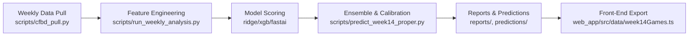
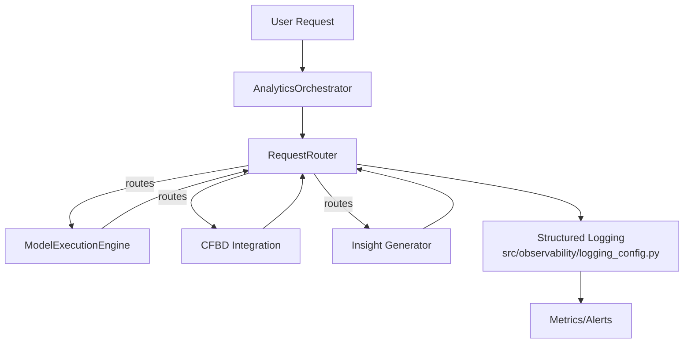

# Architecture & Runbooks

This document provides quick-reference diagrams and execution runbooks for the
weekly analytics pipeline and the multi-agent orchestration layer.

## Diagrams

## Weekly Pipeline Runbook

1. **Prep environment**
   - `python3.13 -m venv venv && source venv/bin/activate`
   - `pip install -r requirements.txt`
2. **Fetch data**
   - `python3 scripts/cfbd_pull.py --season 2025 --week <WEEK>`
3. **Run feature + model pipeline**
   - `python3 scripts/run_weekly_analysis.py --week <WEEK>`
   - `python3 scripts/predict_week14_proper.py` (or week-specific variant)
4. **Validate outputs**
   - Predictions saved to `predictions/week<WW>/`
   - Reports in `reports/`
   - Front-end data refreshed in `web_app/src/data/`
5. **Observability**
   - Structured logs via `src/observability/logging_config.py`
   - Error taxonomy via `src/observability/error_taxonomy.py`
6. **Smoke tests**
   - `python3 agents/test_agent_system.py`
   - `python3 -m pytest agents/tests -q`

## Agent Workflow Runbook

1. **Start orchestrator**
   - Import and instantiate `AnalyticsOrchestrator` or `WorkflowAutomatorAgent`
2. **Submit requests**
   - Build `AgentRequest` payloads and pass through `RequestRouter`
3. **Monitor progress**
   - Use `RequestRouter.get_queue_status()` for queue depth
   - Inspect structured logs for events: `agent_execute`, `permission_denied`,
     and `feature_detection_failed`
4. **Handle errors**
   - Errors carry taxonomy fields (`error.category`, `error.severity`,
     optional remediation)
5. **Shut down cleanly**
   - Call `AgentFactory.destroy_agent(<agent_id>)` or dispose orchestrator

Keep these runbooks in sync with any pipeline or agent capability changes.
