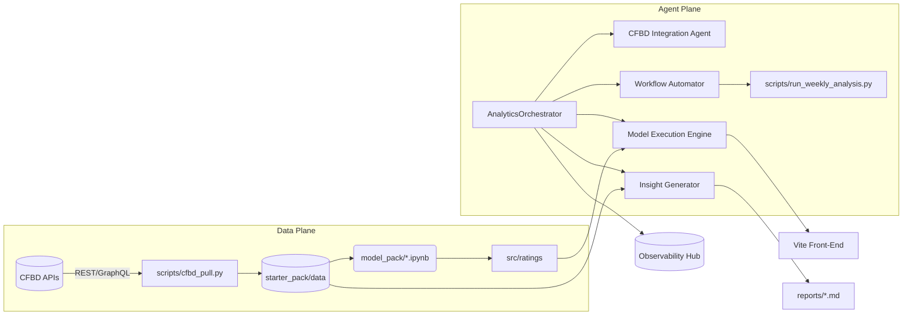
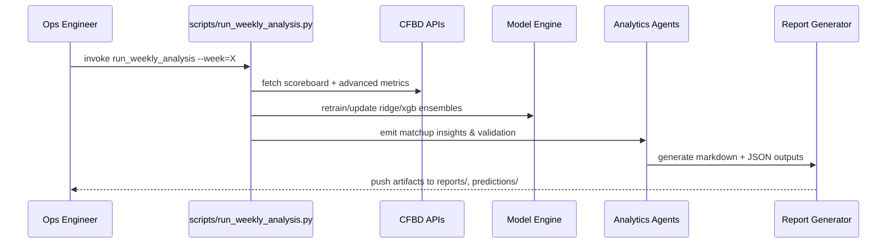

## System Architecture

```mermaid
flowchart LR
    subgraph Data Plane
        CFBD[(CFBD APIs)] -->|REST/GraphQL| Ingest[scripts/cfbd_pull.py]
        Ingest --> FeatureStore[(starter_pack/data)]
        FeatureStore --> Models(model_pack/*.ipynb)
        Models --> RatingLibrary[src/ratings]
    end

    subgraph Agent Plane
        AnalyticsOrch[AnalyticsOrchestrator] --> CFBDIntegration[CFBD Integration Agent]
        AnalyticsOrch --> ModelEngine[Model Execution Engine]
        AnalyticsOrch --> InsightAgent[Insight Generator]
        AnalyticsOrch --> WorkflowAuto[Workflow Automator]
        WorkflowAuto --> WeeklyPlan[scripts/run_weekly_analysis.py]
    end

    RatingLibrary --> ModelEngine
    FeatureStore --> InsightAgent
    ModelEngine --> WebApp[Vite Front-End]
    InsightAgent --> Reports[reports/*.md]
    AnalyticsOrch --> Observability[(Observability Hub)]
```

## Weekly Pipeline (10k-foot view)

```mermaid
sequenceDiagram
    participant Ops as Ops Engineer
    participant Script as scripts/run_weekly_analysis.py
    participant CFBD as CFBD APIs
    participant Models as Model Engine
    participant Agents as Analytics Agents
    participant Reports as Report Generator

    Ops->>Script: invoke run_weekly_analysis --week=X
    Script->>CFBD: fetch scoreboard + advanced metrics
    Script->>Models: retrain/update ridge/xgb ensembles
    Script->>Agents: emit matchup insights & validation
    Agents->>Reports: generate markdown + JSON outputs
    Reports-->>Ops: push artifacts to reports/, predictions/
```

