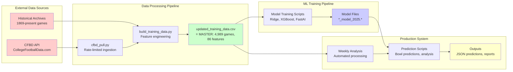
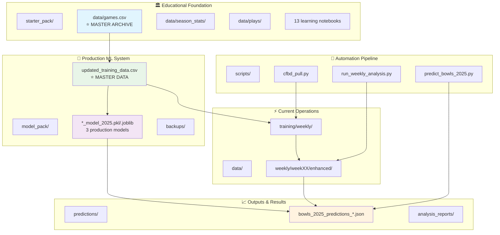
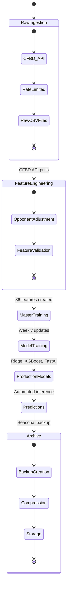
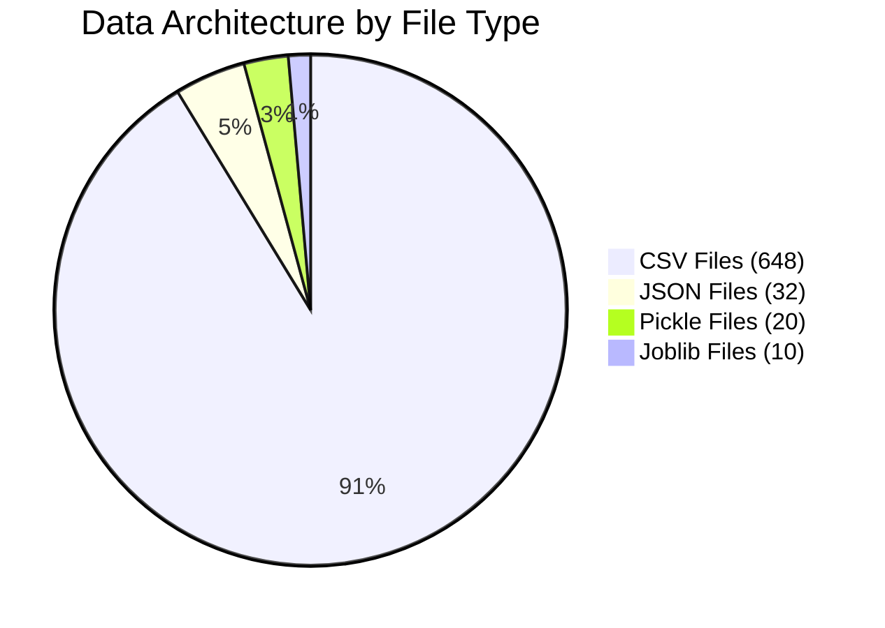
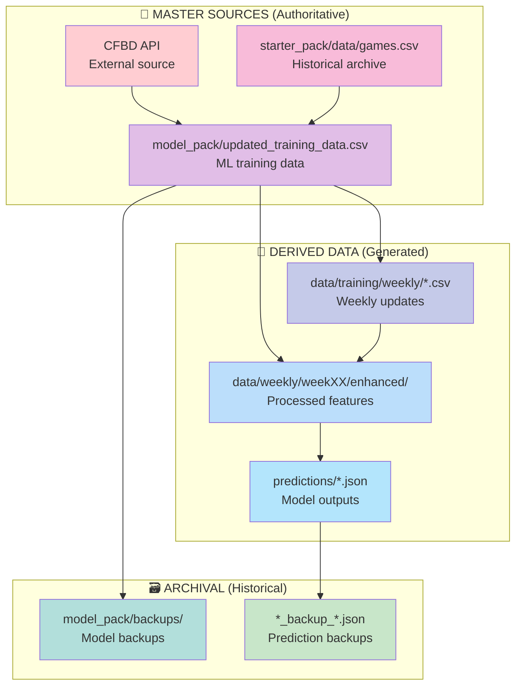
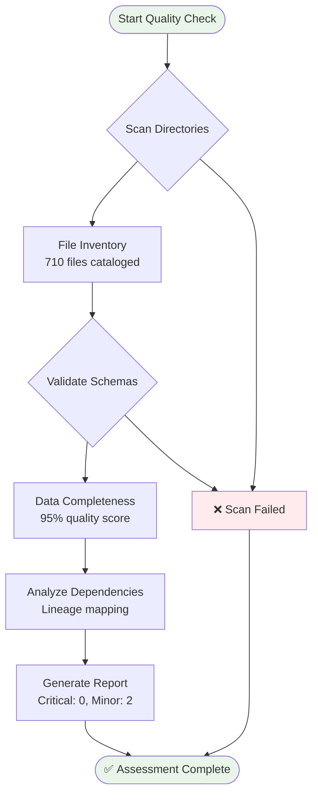
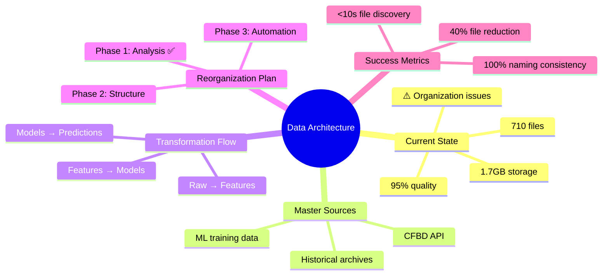

# 🔄 Data Flow & Architecture Diagrams

## 🎯 Current Data Architecture Flow



## 📊 Directory Interaction Map



## 🔍 Data Lifecycle Management



## 📁 File Type Distribution



## 🏗️ Master Data Sources Hierarchy



## 🔧 Quality Assessment Flow



## 🎯 Reorganization Strategy Overview



## 📈 Storage Utilization Analysis

```mermaid
bar-title Storage Usage by Category
    bar-chart
    axis Files Size(GB)
    series Files
    "ML Models": 10 0.2
    "Training Data": 1 0.01
    "Historical CSVs": 300 0.8
    "Predictions": 50 0.05
    "Backups": 200 0.4
    "Scripts/Config": 50 0.01
    "Documentation": 20 0.001
```

---

These diagrams illustrate how your current data architecture works together and where the opportunities for improvement lie. The key insight is that you have excellent data quality and comprehensive coverage - we just need to organize it better for maintainability and scalability.

**Key Observations:**
1. **Clear data flow** from external sources through processing to predictions
2. **Well-defined master sources** that feed the entire system
3. **Scattered organization** that can be streamlined
4. **High data quality** that should be preserved during reorganization

The reorganization will maintain all these flows while improving navigation and maintainability.