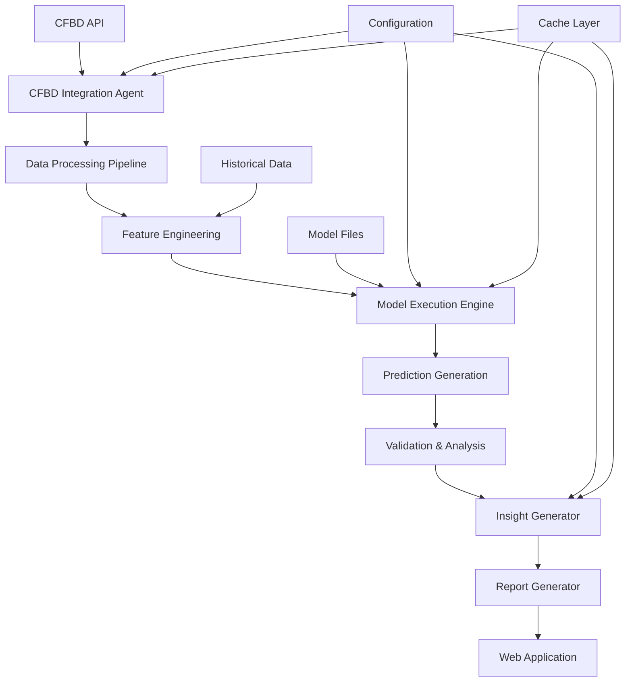
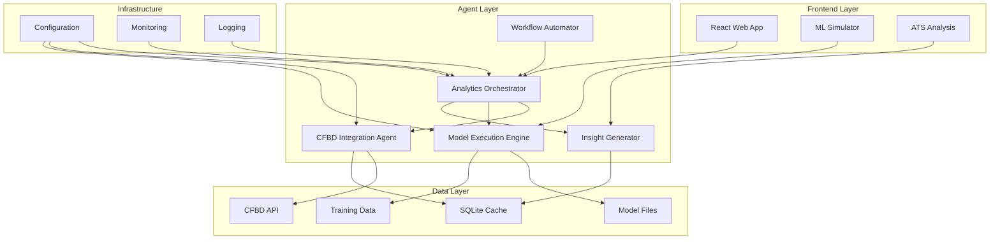
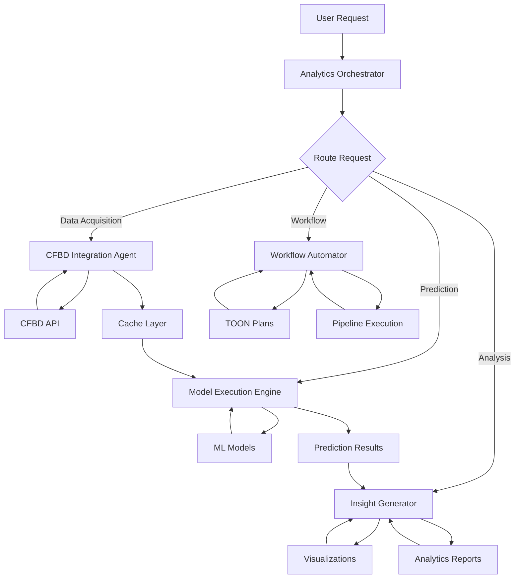
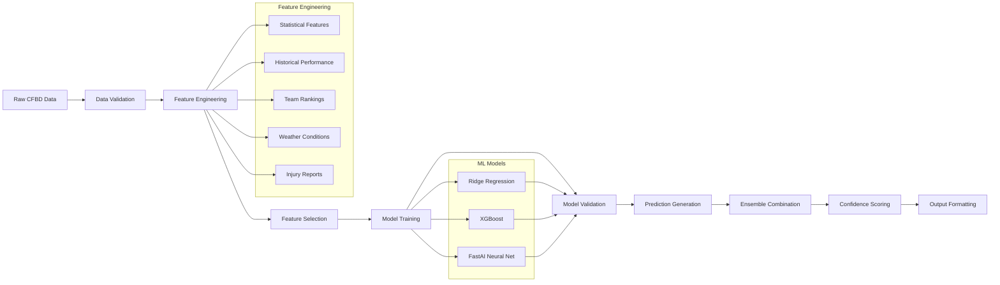
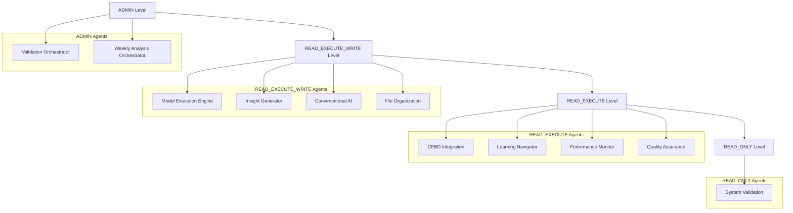
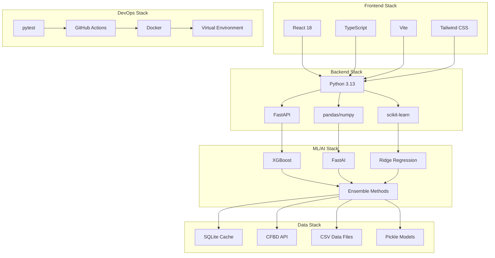

# Script Ohio 2.0 - Repository Architecture Analysis

## Executive Summary

Script Ohio 2.0 is a sophisticated college football analytics platform that combines machine learning predictions, multi-agent architecture, and real-time data processing. The system employs a modular design with specialized agents for different aspects of football analytics, from data acquisition to prediction generation and visualization.

## 1. Repository Structure

### Core Directories

```
Script_Ohio_2.0/
├── agents/                    # Multi-agent system architecture
│   ├── core/                 # Agent framework and base classes
│   └── [agent_modules].py    # Specialized analytics agents
├── src/                       # Core Python modules
│   ├── cfbd_client/           # CFBD API integration
│   ├── models/                # Machine learning models
│   ├── config/                # Configuration management
│   ├── observability/         # Logging and monitoring
│   └── ratings/              # Power rating systems
├── web_app/                   # React frontend application
│   ├── src/                   # TypeScript/React source
│   └── public/                # Static assets
├── starter_pack/              # Educational notebooks (13)
├── model_pack/                # ML modeling notebooks (7)
├── tests/                     # Comprehensive test suite
├── scripts/                   # Utility and automation scripts
├── docs/                      # Documentation and guides
├── data/                      # Data organization
│   ├── weekly/               # Weekly enhanced features
│   ├── training/             # Training datasets
│   └── metadata/             # Data schemas
├── predictions/               # Weekly prediction outputs
├── reports/                   # Analysis reports
├── .cursor/plans/            # TOON workflow plans
└── mcp_servers/              # Model Context Protocol servers
```

### Directory Purposes

- **agents/**: Production-ready multi-agent architecture with specialized analytics agents
- **src/**: Reusable Python modules and core business logic
- **web_app/**: React/TypeScript frontend for user interaction
- **starter_pack/**: Educational Jupyter notebooks for learning
- **model_pack/**: ML modeling notebooks and trained models
- **tests/**: Comprehensive test suite with unit, integration, and E2E tests
- **scripts/**: Automation scripts for data processing and deployment
- **docs/**: Technical documentation, guides, and API references
- **data/**: Organized data storage with weekly and training datasets
- **predictions/**: Generated prediction outputs and analysis results
- **reports/**: Performance reports and benchmarking results
- **.cursor/plans/**: TOON (Token-Optimized Object Notation) workflow definitions
- **mcp_servers/**: Model Context Protocol servers for enhanced integration

## 2. Technology Stack

### Backend Technologies

- **Python 3.13+**: Primary programming language
- **Machine Learning**: 
  - scikit-learn (Ridge Regression)
  - XGBoost (Gradient Boosting)
  - FastAI (Neural Networks)
  - pandas (Data manipulation)
  - numpy (Numerical computing)
- **Data Processing**:
  - SQLite (Caching with TTL)
  - requests (HTTP client)
  - aiohttp (Async HTTP)
- **API Integration**:
  - CFBD (CollegeFootballData.com) REST API
  - CFBD GraphQL API (Patreon Tier 3+)
- **Testing**: pytest with coverage reporting
- **Code Quality**: black, mypy, ruff, bandit

### Frontend Technologies

- **React 18**: UI framework
- **TypeScript**: Type-safe JavaScript
- **Vite**: Build tool and dev server
- **Tailwind CSS**: Utility-first CSS framework
- **Vitest**: Testing framework
- **React Testing Library**: Component testing

### DevOps & Infrastructure

- **Git**: Version control
- **GitHub Actions**: CI/CD pipeline (planned)
- **Docker**: Containerization (implied)
- **Virtual Environment**: Python dependency management
- **TOON**: Custom workflow optimization format

## 3. Architecture Patterns

### Multi-Agent Architecture

The system implements a sophisticated multi-agent pattern where each agent has:

- **Specific Responsibilities**: Each agent handles a distinct domain
- **Permission Levels**: READ_ONLY, READ_EXECUTE, READ_EXECUTE_WRITE, ADMIN
- **Capability Definitions**: Explicit action definitions with parameters
- **Hierarchical Orchestration**: Meta-agents coordinate specialized agents

### Key Architectural Principles

1. **Modularity**: Clear separation of concerns with well-defined interfaces
2. **Extensibility**: Easy addition of new agents and capabilities
3. **Permission-Based Access**: Granular control over agent operations
4. **Fault Tolerance**: Graceful degradation and error handling
5. **Caching Strategy**: SQLite-based caching with TTL for performance
6. **Data-Driven**: ML models trained on historical college football data

### Design Patterns

- **Strategy Pattern**: Different ML models (Ridge, XGBoost, FastAI) with unified interface
- **Observer Pattern**: Performance monitoring and health checks
- **Factory Pattern**: Agent instantiation and registration
- **Command Pattern**: Agent capabilities as executable actions
- **Repository Pattern**: Data access abstraction

## 4. Key Components

### Core Agent System

1. **AnalyticsOrchestrator**: Main routing and coordination hub
2. **CFBD Integration Agent**: Data acquisition from CollegeFootballData.com
3. **Model Execution Engine**: ML model predictions and analysis
4. **Insight Generator**: Advanced analytics and visualizations
5. **Workflow Automator**: TOON plan execution and pipeline management

### Specialized Agents

- **Weekly Analysis Agents**: Matchup analysis, model validation, prediction generation
- **Quality Assurance**: System health and validation
- **Performance Monitor**: Real-time metrics and optimization
- **Learning Navigator**: Educational guidance
- **Conversational AI**: Natural language interactions
- **File Organization**: Project structure management

### Data Processing Pipeline

1. **Data Acquisition**: CFBD API integration (REST + GraphQL)
2. **Feature Engineering**: 86 predictive features from multiple sources
3. **Model Training**: Historical data (2016-2025, 4,989 games)
4. **Prediction Generation**: Ensemble of ML models with confidence scoring
5. **Validation**: Continuous model performance monitoring

### Frontend Components

1. **ML Simulator**: Interactive prediction interface
2. **ATS Analysis**: Against-the-spread betting analysis
3. **Data Visualization**: Charts and analytics dashboards
4. **Model Comparison**: Side-by-side model performance

## 5. Data Flow Architecture



### Data Processing Flow

1. **Ingestion**: CFBD API provides real-time and historical data
2. **Processing**: Feature engineering creates 86 predictive features
3. **Model Execution**: Three ML models generate predictions
4. **Ensemble**: Weighted combination of model predictions
5. **Validation**: Performance metrics and confidence scoring
6. **Visualization**: Results presented in web interface

### Caching Strategy

- **SQLite-based**: Local caching with TTL (Time-To-Live)
- **Rate Limiting**: 6 requests/second for CFBD API compliance
- **Graceful Degradation**: Fallback mechanisms for API failures

## 6. Entry Points and Interfaces

### Python Entry Points

1. **Agent System**: [`agents/analytics_orchestrator.py`](agents/analytics_orchestrator.py:1)
   - Main orchestrator for routing requests
   - Agent registration and capability management

2. **Weekly Analysis**: [`scripts/run_weekly_analysis.py`](scripts/run_weekly_analysis.py:1)
   - Command-line interface for weekly predictions
   - Automated pipeline execution

3. **Model Execution**: [`src/models/execution/engine.py`](src/models/execution/engine.py:1)
   - ML model prediction interface
   - Batch processing capabilities

4. **CFBD Integration**: [`agents/cfbd_integration_agent.py`](agents/cfbd_integration_agent.py:1)
   - Data acquisition and normalization
   - REST and GraphQL API support

### Web Application Entry Points

1. **React App**: [`web_app/src/App.tsx`](web_app/src/App.tsx:1)
   - Main application component
   - Route management and state

2. **ML Simulator**: [`web_app/src/components/MLSimulator.tsx`](web_app/src/components/MLSimulator.tsx:1)
   - Interactive prediction interface
   - Model selection and parameter tuning

3. **Prediction Logic**: [`web_app/src/utils/predictionLogic.ts`](web_app/src/utils/predictionLogic.ts:1)
   - Client-side prediction calculations
   - Ensemble model implementation

### API Interfaces

1. **CFBD REST API**: Standard college football data
2. **CFBD GraphQL API**: Enhanced data for Patreon subscribers
3. **Internal Agent APIs**: Capability-based request/response
4. **Web App APIs**: Data loading and prediction endpoints

## 7. Dependencies

### Core Python Dependencies

- **pandas**: Data manipulation and analysis
- **numpy**: Numerical computing and array operations
- **scikit-learn**: Machine learning (Ridge Regression)
- **xgboost**: Gradient boosting models
- **fastai**: Neural network frameworks
- **requests**: HTTP client for API calls
- **sqlite3**: Local database and caching
- **python-dotenv**: Environment variable management

### Development Dependencies

- **pytest**: Testing framework with fixtures and mocks
- **pytest-cov**: Coverage reporting
- **black**: Code formatting (PEP 8)
- **mypy**: Static type checking
- **ruff**: Fast Python linter
- **bandit**: Security vulnerability scanning

### Frontend Dependencies

- **react**: UI framework
- **typescript**: Type-safe JavaScript
- **vite**: Build tool and dev server
- **tailwindcss**: Utility-first CSS
- **vitest**: Testing framework
- **@testing-library/react**: Component testing

### External Services

- **CollegeFootballData.com (CFBD)**: Primary data source
  - REST API: Basic statistics and scores
  - GraphQL API: Advanced analytics (Patreon Tier 3+)
- **GitHub**: Version control and collaboration
- **NPM**: Package management for frontend

## 8. Configuration Management

### Environment-Based Configuration

- **Environment Variables**: Sensitive data (API keys, secrets)
- **Configuration Classes**: Centralized settings management
- **Feature Flags**: Runtime behavior control
- **Model Configuration**: ML model parameters and weights

### Key Configuration Files

1. **CFBD Config**: [`src/config/cfbd_config.py`](src/config/cfbd_config.py:1)
   - API endpoints and authentication
   - Rate limiting and retry policies

2. **App Constants**: [`web_app/src/config/constants.ts`](web_app/src/config/constants.ts:1)
   - UI configuration and defaults
   - File naming patterns and paths

3. **Model Config**: [`src/models/config/model_config.py`](src/models/config/model_config.py:1)
   - ML model parameters
   - Feature weights and thresholds

### Security Configuration

- **API Keys**: Environment variables only (never hardcoded)
- **Rate Limiting**: Configurable request throttling
- **Access Control**: Permission-based agent operations
- **Data Validation**: Input sanitization and type checking

## 9. Testing Strategy

### Test Organization

1. **Unit Tests**: Individual component testing
   - Agent capabilities and methods
   - Model prediction accuracy
   - Data processing functions

2. **Integration Tests**: Multi-component workflows
   - Agent orchestration
   - API integration
   - Data pipeline validation

3. **End-to-End Tests**: Complete user workflows
   - Weekly analysis pipeline
   - Web application interactions
   - Model training and prediction

### Test Tools and Frameworks

- **pytest**: Primary testing framework
- **pytest-cov**: Coverage reporting (target: 80%+)
- **pytest-mock**: Mocking and fixtures
- **responses**: HTTP request mocking
- **Vitest**: Frontend testing
- **React Testing Library**: Component testing

### Quality Assurance

- **Smoke Tests**: Quick system health checks
- **Syntax Validation**: Python compilation checks
- **Performance Tests**: Load testing for critical paths
- **Security Tests**: Vulnerability scanning

### Test Data Management

- **Fixtures**: Centralized test data in [`tests/fixtures/`](tests/fixtures/:1)
- **Mock Data**: Synthetic data for consistent testing
- **CI/CD Integration**: Automated test execution

## 10. Documentation Quality

### Existing Documentation

1. **Comprehensive Guides**: 
   - [`docs/ARCHITECTURE_OVERVIEW.md`](docs/ARCHITECTURE_OVERVIEW.md:1)
   - [`docs/SECURITY_BEST_PRACTICES.md`](docs/SECURITY_BEST_PRACTICES.md:1)
   - [`docs/CODE_QUALITY_GUIDELINES.md`](docs/CODE_QUALITY_GUIDELINES.md:1)

2. **API Documentation**:
   - Agent capability references
   - CFBD integration guides
   - Model documentation

3. **Educational Content**:
   - 13 Jupyter notebooks in starter_pack/
   - 7 ML modeling notebooks
   - Step-by-step tutorials

### Documentation Gaps

1. **API Reference**: Complete API documentation integration
2. **Troubleshooting Guides**: Common issue resolution
3. **Performance Tuning**: Optimization guidelines
4. **Deployment Guides**: Production deployment procedures

## 11. Security Considerations

### Current Security Practices

✅ **Strong Practices**:
- Environment variable usage for API keys
- Input validation and sanitization
- Permission-based access control
- Rate limiting for external APIs
- Security scanning with bandit
- Dependency vulnerability checks

⚠️ **Areas for Improvement**:
- API key rotation mechanism
- Data encryption at rest
- Comprehensive audit logging
- HTTPS enforcement in production

### Security Architecture

1. **Authentication**: CFBD API key management
2. **Authorization**: Permission levels for agent operations
3. **Input Validation**: Type hints and parameter checking
4. **Data Protection**: Sensitive data exclusion from commits
5. **Dependency Security**: Automated vulnerability scanning

### Security Recommendations

1. **Implement API key rotation** mechanism
2. **Encrypt sensitive data** (cache files, models)
3. **Add comprehensive audit logging**
4. **Implement HTTPS enforcement** for production
5. **Enhance input sanitization** for all external inputs

## 12. Missing Best Practices & Recommendations

### Critical Improvements

1. **Security Hardening**:
   - Implement dependency vulnerability scanning in CI/CD
   - Add API key rotation mechanism
   - Encrypt sensitive data at rest

2. **Scalability Preparation**:
   - Migrate from SQLite to Redis for distributed caching
   - Implement message queue system for async tasks
   - Design for horizontal scaling

3. **Code Quality**:
   - Add type hints to all public APIs
   - Implement automated linting in CI
   - Set up code coverage reporting

### Performance Optimizations

1. **Async Operations**: Refactor I/O operations to use async/await
2. **Connection Pooling**: Implement for database/cache connections
3. **Performance Monitoring**: Integrate APM tools
4. **Caching Strategy**: Enhance with Redis for distributed systems

### Testing Enhancements

1. **E2E Testing**: Complete workflow testing
2. **Load Testing**: Performance under stress
3. **Test Coverage**: Achieve 80%+ coverage for core components
4. **Test Data**: Centralize fixtures and mocks

### Documentation Improvements

1. **API Reference**: Complete integration
2. **Troubleshooting**: Common issue guides
3. **Performance Tuning**: Optimization guidelines
4. **Deployment**: Production procedures

## 13. System Architecture Diagrams

### High-Level Architecture



### Agent Interaction Flow



### Data Processing Pipeline



### Agent Permission Hierarchy



### Technology Stack Integration




## Conclusion

Script Ohio 2.0 represents a well-architected college football analytics platform with strong foundations in multi-agent design, machine learning, and data processing. The system demonstrates excellent modularity, comprehensive testing, and thoughtful security practices.

Key strengths include:
- Sophisticated multi-agent architecture with clear separation of concerns
- Comprehensive ML pipeline with multiple model types
- Strong testing strategy with good coverage
- Excellent documentation and educational resources
- Thoughtful configuration management

Areas for improvement focus on:
- Security hardening (encryption, key rotation)
- Scalability preparation (Redis, message queues)
- Performance optimization (async operations, connection pooling)
- Enhanced monitoring and observability

The repository shows mature software engineering practices and provides a solid foundation for a production analytics platform.