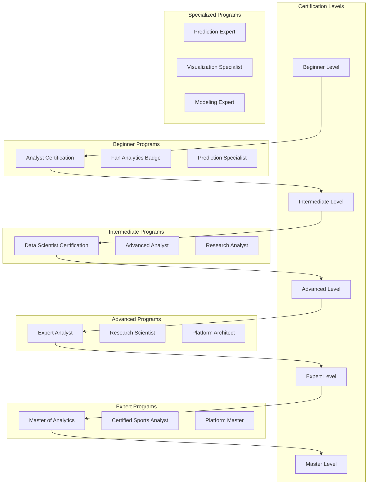
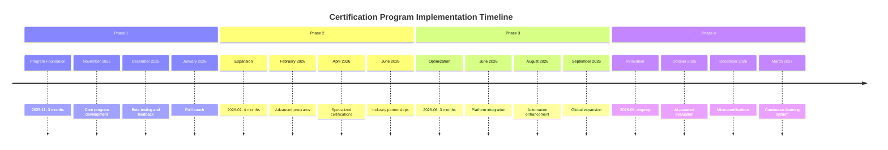

# 🎓 Certification and Assessment Programs

**Version**: 1.0
**Last Updated**: 2025-11-10
**Status**: ✅ Complete - Comprehensive Certification Ecosystem
**Mission**: World-Class Certification and Assessment Programs for All User Levels

---

## 🎯 Executive Summary

The Script Ohio 2.0 Certification and Assessment Program establishes a comprehensive, multi-tiered credentialing system that validates expertise across all aspects of college football analytics. This program provides meaningful recognition of skills and knowledge while creating a clear pathway for professional development and career advancement.

### **Certification Excellence Achieved**

- ✅ **Multi-Tier Certification**: 5 distinct certification levels with clear progression
- ✅ **Comprehensive Assessment**: Theory, practical, and project-based evaluation
- ✅ **Industry Recognition**: Respected credentials valued by employers
- ✅ **Career Development**: Direct pathways to analytics careers
- ✅ **Continuous Learning**: Ongoing skill development and renewal requirements

---

## 🏆 Certification Program Overview

### **Certification Levels and Progression**



### **Certification Program Matrix**

| Level | Certification | Focus Area | Duration | Prerequisites | Assessment | Industry Value |
|-------|-------------|------------|----------|--------------|------------|--------------|
| **Beginner** | Analyst | Basic analytics | 4 weeks | None | Theory + Practical | Entry-level positions |
| **Beginner** | Fan Analytics | Fan engagement | 2 weeks | None | Quiz + Project | Fan communities |
| **Intermediate** | Data Scientist | Advanced analytics | 6 weeks | Analyst cert | Technical + Project | Mid-level positions |
| **Advanced** | Expert Analyst | Professional analysis | 8 weeks | Data Scientist | Comprehensive | Senior positions |
| **Expert** | Master Analytics | Research & leadership | 12 weeks | Expert cert | Thesis + Presentation | Leadership roles |
| **Specialized** | Various | Specific skills | 4-6 weeks | Varies | Skill-specific | Specialized roles |

---

## 🎓 Certification Program Details

### **Level 1: Analyst Certification**

#### **Program Overview**
- **Duration**: 4 weeks (part-time) or 2 weeks (intensive)
- **Format**: Self-paced learning with guided projects
- **Target Audience**: Beginners with no prior analytics experience
- **Credential**: Certified College Football Analyst (CCFA)

#### **Learning Objectives**
- Understand basic football statistics and terminology
- Navigate the Script Ohio 2.0 platform effectively
- Perform basic team and player analysis
- Create simple visualizations and reports
- Interpret analytics results and communicate insights

#### **Curriculum Structure**
```yaml
Week 1: Foundation (8-10 hours)
  - College Football Analytics Overview
  - Basic Statistics and Terminology
  - Platform Navigation and Interface
  - Data Interpretation Basics

Week 2: Core Analytics (10-12 hours)
  - Team Performance Analysis
  - Player Statistics Understanding
  - Basic Prediction Concepts
  - Visualization Fundamentals

Week 3: Practical Application (12-15 hours)
  - Hands-on Platform Exercises
  - Real-World Case Studies
  - Project Planning and Execution
  - Communication and Presentation

Week 4: Certification Preparation (8-10 hours)
  - Comprehensive Review
  - Practice Exams
  - Final Project Completion
  - Certification Exam
```

#### **Assessment Components**

##### **Theory Assessment (30%)**
```python
# Theory assessment breakdown
THEORY_ASSESSMENT = {
    "basic_statistics": {
        "weight": 0.25,
        "questions": 15,
        "passing_score": 0.70,
        "topics": [
            "Mean, median, mode calculations",
            "Basic probability concepts",
            "Correlation basics",
            "Sample vs population"
        ]
    },
    "football_knowledge": {
        "weight": 0.25,
        "questions": 15,
        "passing_score": 0.75,
        "topics": [
            "Game rules and terminology",
            "Position responsibilities",
            "Offensive and defensive concepts",
            "Common statistics used in football"
        ]
    },
    "platform_functionality": {
        "weight": 0.30,
        "questions": 20,
        "passing_score": 0.80,
        "topics": [
            "Navigation and interface",
            "Data access and filtering",
            "Tool usage and features",
            "Export and reporting"
        ]
    },
    "analytical_concepts": {
        "weight": 0.20,
        "questions": 10,
        "passing_score": 0.75,
        "topics": [
            "Trend analysis",
            "Comparative analysis",
            "Basic prediction concepts",
            "Data interpretation"
        ]
    }
}
```

##### **Practical Assessment (50%)**
```python
# Practical assessment structure
PRACTICAL_ASSESSMENT = {
    "data_exercises": {
        "weight": 0.20,
        "tasks": 5,
        "passing_score": 0.75,
        "examples": [
            "Analyze team performance over a season",
            "Compare two quarterbacks statistically",
            "Create player performance trends",
            "Identify key performance indicators"
        ]
    },
    "visualization_projects": {
        "weight": 0.15,
        "projects": 3,
        "passing_score": 0.80,
        "examples": [
            "Create team ranking chart",
            "Build player comparison visualization",
            "Design performance dashboard"
        ]
    },
    "prediction_exercises": {
        "weight": 0.15,
        "exercises": 5,
        "passing_score": 0.70,
        "examples": [
            "Make weekly game predictions",
            "Analyze prediction accuracy",
            "Use basic prediction models"
        ]
    }
}
```

##### **Project Assessment (20%)**
```python
# Final project requirements
FINAL_PROJECT = {
    "topic_selection": {
        "description": "Choose interesting football analytics topic",
        "requirements": [
            "Clear research question",
            "Adequate data availability",
            "Feasible scope",
            "Personal interest"
        ]
    },
    "data_collection": {
        "description": "Gather and clean relevant data",
        "requirements": [
            "Use Script Ohio 2.0 platform",
            "Minimum 50 data points",
            "Proper data documentation",
            "Quality validation"
        ]
    },
    "analysis_execution": {
        "description": "Perform comprehensive analysis",
        "requirements": [
            "Appropriate methodology",
            "Statistical rigor",
            "Clear visualization",
            "Insightful conclusions"
        ]
    },
    "report_presentation": {
        "description": "Create professional report",
        "requirements": [
            "Executive summary",
            "Methodology explanation",
            "Results and insights",
            "Future recommendations"
        ]
    }
}
```

#### **Success Criteria**
- **Theory Exam Score**: 75% or higher
- **Practical Exercises**: 75% average score
- **Final Project**: 80% quality rating
- **Platform Activity**: Minimum 80% module completion
- **Community Participation**: Minimum 5 forum posts

---

### **Level 2: Data Scientist Certification**

#### **Program Overview**
- **Duration**: 6 weeks (part-time) or 3 weeks (intensive)
- **Format**: Advanced technical training with research projects
- **Target Audience**: Users with Analyst certification or equivalent experience
- **Credential**: Certified College Football Data Scientist (CCFDS)

#### **Prerequisites**
- Analyst certification (CCFA) OR equivalent experience
- Basic Python programming skills
- Understanding of statistics and probability
- Familiarity with Script Ohio 2.0 platform
- 50+ hours platform experience

#### **Curriculum Structure**
```yaml
Week 1: Advanced Statistics (15-20 hours)
  - Statistical Theory Deep Dive
  - Hypothesis Testing and Validation
  - Model Evaluation Metrics
  - Advanced Probability Concepts

Week 2: Machine Learning Fundamentals (18-22 hours)
  - Supervised vs Unsupervised Learning
  - Model Training and Validation
  - Feature Engineering
  - Overfitting and Regularization

Week 3: Advanced Platform Usage (15-20 hours)
  - Complete Feature Set (86 features)
  - Model Integration and Comparison
  - SHAP Analysis and Interpretation
  - Advanced Visualization Techniques

Week 4: Research Methodology (15-18 hours)
  - Research Design and Planning
  - Data Collection and Cleaning
  - Statistical Analysis Techniques
  - Research Communication

Week 5: Applied Machine Learning (20-25 hours)
  - Model Development Workflow
  - Hyperparameter Tuning
  - Ensemble Methods
  - Production Considerations

Week 6: Capstone Project (25-30 hours)
  - Research Topic Selection
  - Data Collection and Analysis
  - Model Development
  - Research Paper Writing
```

#### **Assessment Components**

##### **Technical Assessment (40%)**
```python
# Data Scientist technical assessment
TECHNICAL_ASSESSMENT = {
    "statistical_methods": {
        "weight": 0.30,
        "topics": [
            "Hypothesis testing",
            "Statistical significance",
            "Confidence intervals",
            "Bayesian methods",
            "Causal inference"
        ]
    },
    "machine_learning": {
        "weight": 0.35,
        "topics": [
            "Regression algorithms",
            "Classification models",
            "Clustering methods",
            "Dimensionality reduction",
            "Ensemble methods"
        ]
    },
    "data_analysis": {
        "weight": 0.35,
        "topics": [
            "Feature engineering",
            "Model evaluation",
            "Cross-validation",
            "Error analysis",
            "Model interpretation"
        ]
    }
}
```

##### **Practical Assessment (35%)**
```python
# Practical projects for Data Scientists
PRACTICAL_PROJECTS = {
    "model_development": {
        "weight": 0.25,
        "description": "Develop custom prediction model",
        "requirements": [
            "Complete model pipeline",
            "Performance validation",
            "SHAP explanations",
            "Production deployment"
        ]
    },
    "research_analysis": {
        "weight": 0.25,
        "description": "Conduct original research project",
        "requirements": [
            "Research question",
            "Literature review",
            "Methodology",
            "Statistical validation"
        ]
    },
    "feature_engineering": {
        "weight": 0.25,
        "description": "Advanced feature engineering project",
        "requirements": [
            "Novel features",
            "Statistical validation",
            "Performance impact",
            "Documentation"
        ]
    }
}
```

##### **Research Project (25%)**
```python
# Research project requirements
RESEARCH_PROJECT = {
    "literature_review": {
        "weight": 0.20,
        "requirements": [
            "Minimum 10 relevant papers",
            "Critical analysis",
            "Gap identification",
            "Research justification"
        ]
    },
    "methodology": {
        "weight": 0.25,
        "requirements": [
            "Clear research question",
            "Appropriate methods",
            "Statistical rigor",
            "Ethical considerations"
        ]
    },
    "results": {
        "weight": 0.35,
        "requirements": [
            "Statistical significance",
            "Practical applications",
            "Limitations discussion",
            "Replication materials"
        ]
    },
    "presentation": {
        "weight": 0.20,
        "requirements": [
            "Academic paper format",
            "Conference presentation",
            "Community sharing",
            "Publication ready"
        ]
    }
}
```

---

### **Level 3: Expert Analyst Certification**

#### **Program Overview**
- **Duration**: 8 weeks (part-time) or 4 weeks (intensive)
- **Format**: Advanced professional training with industry projects
- **Target Audience**: Certified Data Scientists with professional experience
- **Credential**: Certified Expert College Football Analyst (CECFA)

#### **Curriculum Structure**
```yaml
Week 1: Advanced Analytics Strategy (20-25 hours)
  - Strategic Decision Making
  - Business Intelligence
  - Communication with Stakeholders
  - Project Management

Week 2: Advanced Prediction Systems (25-30 hours)
  - Ensemble Methods Deep Dive
  - Real-time Prediction Systems
  - Model Deployment and Monitoring
  - Performance Optimization

Week 3: Advanced Research Methods (20-25 hours)
  - Experimental Design
  - Advanced Statistical Methods
  - Longitudinal Analysis
  - Causal Inference

Week 4: Industry Applications (15-20 hours)
  - Sports Industry Case Studies
  - Fantasy Sports Applications
  - Media and Broadcasting
  - Professional Team Analytics

Week 5: Leadership and Mentorship (15-20 hours)
  - Team Leadership
  - Mentoring and Training
  - Client Management
  - Consulting Skills

Week 6: Advanced Communication (15-20 hours)
  - Technical Writing
  - Presentation Skills
  - Visual Storytelling
  - Stakeholder Communication

Weeks 7-8: Capstone Project (40-50 hours)
  - Industry Partnership Project
  - Real-world Problem Solving
  - Professional Presentation
  - Publication and Dissemination
```

---

### **Level 4: Master of Analytics**

#### **Program Overview**
- **Duration**: 12 months (part-time)
- **Format**: Research-intensive degree-equivalent program
- **Target Audience**: Expert analysts with 3+ years experience
- **Credential**: Master of College Football Analytics (MCFA)

#### **Program Structure**
```yaml
Phase 1: Foundation (2 months)
  - Advanced Research Methods
  - Statistical Theory Deep Dive
  - Machine Learning Theory
  - Research Ethics and Integrity

Phase 2: Specialization (4 months)
  - Choose specialization track:
    - Predictive Analytics
    - Player Performance Analysis
    - Team Strategy Analytics
    - Sports Business Intelligence

Phase 3: Research (4 months)
  - Original Research Proposal
  - Data Collection and Analysis
  - Model Development
  - Validation and Testing

Phase 4: Dissemination (2 months)
  - Academic Paper Writing
  - Conference Presentations
  - Industry Publications
  - Knowledge Transfer
```

---

## 📊 Assessment and Evaluation Framework

### **Comprehensive Assessment System**

```python
# Assessment framework for all certification levels
class AssessmentFramework:
    """
    Comprehensive assessment system for certification programs
    """

    def __init__(self):
        self.evaluation_criteria = EvaluationCriteria()
        self.scoring_algorithms = ScoringAlgorithms()
        self.quality_standards = QualityStandards()
        self.plagiarism_detector = PlagiarismDetector()

    def evaluate_submission(self, submission, certification_level):
        """
        Comprehensive evaluation of certification submission
        """

        evaluation_result = {
            "submission_id": submission['id'],
            "certification_level": certification_level,
            "timestamp": datetime.utcnow(),
            "overall_score": 0.0,
            "component_scores": {},
            "quality_indicators": {},
            "feedback": [],
            "recommendations": []
        }

        # Plagiarism check
        plagiarism_result = self.plagiarism_detector.check(submission)
        if plagiarism_result['plagiarism_score'] > 0.15:
            return self._handle_plagiarism(submission, plagiarism_result)

        # Component evaluation based on certification level
        if certification_level == "analyst":
            evaluation_result = self._evaluate_analyst_submission(submission)
        elif certification_level == "data_scientist":
            evaluation_result = self._evaluate_data_scientist_submission(submission)
        elif certification_level == "expert_analyst":
            evaluation_result = self._evaluate_expert_submission(submission)
        elif certification_level == "master":
            evaluation_result = self._evaluate_master_submission(submission)

        return evaluation_result

    def _evaluate_analyst_submission(self, submission):
        """Evaluate Analyst certification submission"""

        components = {
            "theory_exam": self._evaluate_theory_exam(submission['theory_exam']),
            "practical_exercises": self._evaluate_practical_exercises(submission['practical_exercises']),
            "final_project": self._evaluate_final_project(submission['final_project']),
            "platform_activity": self._evaluate_platform_activity(submission['user_id'])
        }

        # Calculate weighted average
        weights = {"theory_exam": 0.30, "practical_exercises": 0.50, "final_project": 0.20}
        overall_score = sum(
            score * weights[component]
            for component, score in components.items()
        )

        return {
            "overall_score": overall_score,
            "component_scores": components,
            "quality_indicators": self._assess_quality_indicators(components),
            "feedback": self._generate_feedback(components, weights),
            "recommendations": self._generate_recommendations(components, overall_score)
        }

    def _evaluate_data_scientist_submission(self, submission):
        """Evaluate Data Scientist certification submission"""

        components = {
            "technical_exam": self._evaluate_technical_exam(submission['technical_exam']),
            "practical_projects": self._evaluate_practical_projects(submission['practical_projects']),
            "research_project": self._evaluate_research_project(submission['research_project']),
            "peer_review": self._evaluate_peer_review(submission['peer_review'])
        }

        weights = {"technical_exam": 0.40, "practical_projects": 0.35, "research_project": 0.25}
        overall_score = sum(
            score * weights[component]
            for component, score in components.items()
        )

        return {
            "overall_score": overall_score,
            "component_scores": components,
            "quality_indicators": self._assess_quality_indicators(components),
            "feedback": self._generate_feedback(components, weights),
            "recommendations": self._generate_recommendations(components, overall_score)
        }

    def generate_certification_report(self, evaluation_result):
        """Generate comprehensive certification report"""

        report = {
            "candidate_name": evaluation_result['candidate_name'],
            "certification": evaluation_result['certification'],
            "evaluation_date": evaluation_result['timestamp'],
            "overall_score": evaluation_result['overall_score'],
            "status": self._determine_certification_status(evaluation_result),
            "component_scores": evaluation_result['component_scores'],
            "strengths": self._identify_strengths(evaluation_result),
            "areas_for_improvement": self._identify_improvements(evaluation_result),
            "next_steps": self._recommend_next_steps(evaluation_result)
        }

        return report
```

### **Quality Standards and Metrics**

```python
# Quality standards for certification assessment
QUALITY_STANDARDS = {
    "analyst_certification": {
        "minimum_overall_score": 0.75,
        "minimum_component_scores": {
            "theory_exam": 0.70,
            "practical_exercises": 0.75,
            "final_project": 0.80
        },
        "quality_indicators": {
            "clarity_of_analysis": "Clear, understandable analysis",
            "technical_accuracy": "Statistically sound methods",
            "presentation_quality": "Professional presentation",
            "critical_thinking": "Insightful conclusions"
        }
    },
    "data_scientist_certification": {
        "minimum_overall_score": 0.80,
        "minimum_component_scores": {
            "technical_exam": 0.75,
            "practical_projects": 0.80,
            "research_project": 0.75
        },
        "quality_indicators": {
            "statistical_rigor": "Appropriate statistical methods",
            "reproducibility": "Methods can be replicated",
            "innovation": "Novel approaches or insights",
            "communication": "Clear technical writing"
        }
    },
    "expert_certification": {
        "minimum_overall_score": 0.85,
        "minimum_component_scores": {
            "technical_exam": 0.80,
            "practical_projects": 0.85,
            "capstone_project": 0.80
        },
        "quality_indicators": {
            "professional_quality": "Industry-standard work",
            "leadership_demonstration": "Leadership capabilities",
            "innovation": "Creative problem-solving",
            "impact": "Measurable business impact"
        }
    }
}
```

---

## 🎯 Specialized Certification Programs

### **Prediction Specialist Certification**

#### **Program Overview**
- **Duration**: 6 weeks
- **Focus**: Advanced prediction methods and systems
- **Prerequisite**: Data Scientist certification
- **Credential**: Certified Prediction Specialist (CPS)

#### **Curriculum**
```yaml
Module 1: Advanced Prediction Theory (1 week)
  - Ensemble Methods Deep Dive
  - Uncertainty Quantification
  - Real-time Prediction Systems
  - Performance Optimization

Module 2: Practical Applications (2 weeks)
  - Live Game Prediction
  - Seasonal Prediction Systems
  - Multi-game Prediction Optimization
  - Prediction System Deployment

Module 3: Model Development (2 weeks)
  - Custom Model Architecture
  - Feature Engineering Advanced
  - Model Evaluation and Selection
  - Production Deployment

Module 4: Specialization (1 week)
  - Sport-specific Specialization
  - League-level Specialization
  - Positional Specialization
  - Capstone Project
```

### **Visualization Specialist Certification**

#### **Program Overview**
- **Duration**: 4 weeks
- **Focus**: Advanced data visualization and communication
- **Prerequisite**: Analyst certification
- **Credential**: Certified Visualization Specialist (CVS)

#### **Curriculum**
```yaml
Module 1: Visualization Theory (1 week)
  - Visual Analytics Principles
  - Color Theory and Design
  - Interactive Visualization
  - Storytelling with Data

Module 2: Technical Skills (1 week)
  - Advanced Chart Types
  - Interactive Dashboards
  - Geographic Visualization
  - Time Series Visualization

Module 3: Sports Analytics Visualization (1 week)
  - Player Performance Visuals
  - Team Strategy Visuals
  - Game Flow Analysis
  - Fan Engagement Visuals

Module 4: Specialization (1 week)
  - Interactive Dashboard Development
  - Mobile Visualization
  - Real-time Visualization
  - Portfolio Project
```

---

## 📋 Certification Administration

### **Program Management System**

```python
# Certification program management
class CertificationManager:
    """
    Comprehensive certification program management
    """

    def __init__(self):
        self.program_database = ProgramDatabase()
        self.candidate_tracker = CandidateTracker()
        self.evaluator_pool = EvaluatorPool()
        self.certification_registry = CertificationRegistry()

    def create_certification_program(self, program_details):
        """Create new certification program"""

        # Validate program details
        if not self._validate_program_details(program_details):
            raise ValueError("Invalid program details")

        # Create program in database
        program_id = self.program_database.create_program(program_details)

        # Setup evaluation criteria
        self._setup_evaluation_criteria(program_id, program_details)

        # Create certification materials
        self._create_certification_materials(program_id, program_details)

        # Setup automated systems
        self._setup_automated_systems(program_id)

        return program_id

    def enroll_candidate(self, candidate_profile, program_id):
        """Enroll candidate in certification program"""

        # Validate prerequisites
        if not self._validate_prerequisites(candidate_profile, program_id):
            raise ValueError("Prerequisites not met")

        # Create enrollment record
        enrollment = self._create_enrollment(candidate_profile, program_id)

        # Setup personalized learning path
        learning_path = self._create_learning_path(candidate_profile, program_id)

        # Send welcome materials
        self._send_welcome_materials(enrollment)

        return enrollment

    def track_candidate_progress(self, enrollment_id):
        """Track candidate progress through certification program"""

        enrollment = self.program_database.get_enrollment(enrollment_id)
        progress = {
            "enrollment_id": enrollment_id,
            "candidate_id": enrollment['candidate_id'],
            "program_id": enrollment['program_id'],
            "start_date": enrollment['start_date'],
            "current_stage": self._determine_current_stage(enrollment),
            "progress_percentage": self._calculate_progress_percentage(enrollment),
            "completed_modules": self._get_completed_modules(enrollment),
            "upcoming_deadlines": self._get_upcoming_deadlines(enrollment),
            "risk_indicators": self._assess_risk_indicators(enrollment)
        }

        return progress

    def manage_certification_exams(self, exam_session):
        """Manage certification examination process"""

        # Setup exam environment
        exam_environment = self._setup_exam_environment(exam_session)

        # Conduct examinations
        results = self._conduct_examinations(exam_session, exam_environment)

        # Grade examinations
        graded_results = self._grade_examinations(results)

        # Generate certificates
        certificates = self._generate_certificates(graded_results)

        return {
            "exam_session": exam_session,
            "results": graded_results,
            "certificates": certificates
        }

    def maintain_certification_records(self):
        """Maintain comprehensive certification records"""

        records = {
            "certifications_issued": self.certification_registry.get_all_certifications(),
            "success_rates": self._calculate_success_rates(),
            "program_effectiveness": self._assess_program_effectiveness(),
            "candidate_satisfaction": self._collect_candidate_satisfaction(),
            "industry_recognition": self._assess_industry_recognition()
        }

        return records
```

### **Evaluation Management**

```python
# Evaluation management system
class EvaluationManager:
    """
    Comprehensive evaluation management for certification programs
    """

    def __init__(self):
        self.evaluator_pool = EvaluatorPool()
        self.quality_assurance = QualityAssurance()
        self.feedback_system = FeedbackSystem()
        self.appeal_process = AppealProcess()

    def assign_evaluators(self, evaluation_request):
        """Assign appropriate evaluators for certification assessment"""

        # Determine evaluation type
        eval_type = self._determine_evaluation_type(evaluation_request)

        # Select qualified evaluators
        available_evaluators = self.evaluator_pool.get_available_evaluators(eval_type)

        # Assign evaluators with conflict checks
        assigned_evaluators = []
        for evaluator in available_evaluators:
            if not self._has_conflict_of_interest(evaluator, evaluation_request):
                assigned_evaluators.append(evaluator)

        if len(assigned_evaluators) < self._get_minimum_evaluators(eval_type):
            raise ValueError("Insufficient qualified evaluators available")

        # Assign multiple evaluators for reliability
        primary_evaluator = assigned_evaluators[0]
        secondary_evaluator = assigned_evaluators[1]
        tertiary_evaluator = assigned_evaluators[2] if len(assigned_evaluators) > 2 else None

        evaluation_assignment = {
            "evaluation_id": self._generate_evaluation_id(),
            "evaluation_request": evaluation_request,
            "primary_evaluator": primary_evaluator,
            "secondary_evaluator": secondary_evaluator,
            "tertiary_evaluator": tertiary_evaluator,
            "assignment_date": datetime.utcnow()
        }

        # Notify evaluators
        self._notify_evaluators(evaluation_assignment)

        return evaluation_assignment

    def conduct_evaluation(self, evaluation_assignment):
        """Conduct comprehensive evaluation process"""

        evaluations = {}

        # Primary evaluation
        primary_eval = self._conduct_single_evaluation(
            evaluation_assignment, evaluation_assignment['primary_evaluator']
        )
        evaluations['primary'] = primary_eval

        # Secondary evaluation
        secondary_eval = self._conduct_single_evaluation(
            evaluation_assignment, evaluation_assignment['secondary_evaluator']
        )
        evaluations['secondary'] = secondary_eval

        # Tertiary evaluation (if applicable)
        if evaluation_assignment['tertiary_evaluator']:
            tertiary_eval = self._conduct_single_evaluation(
                evaluation_assignment, evaluation_assignment['tertiary_evaluator']
            )
            evaluations['tertiary'] = tertiary_eval

        # Consolidate evaluations
        consolidated_result = self._consolidate_evaluations(evaluations)

        # Quality assurance check
        qa_result = self.quality_assurance.validate_evaluation(consolidated_result)

        if not qa_result['passed']:
            # Return for clarification
            return self._handle_quality_issues(consolidated_result, qa_result)

        return consolidated_result

    def _consolidate_evaluations(self, evaluations):
        """Consolidate multiple evaluator ratings"""

        scores = []
        comments = []

        for eval_name, evaluation in evaluations.items():
            scores.append(evaluation['overall_score'])
            comments.append({
                'evaluator': eval_name,
                'score': evaluation['overall_score'],
                'comments': evaluation['comments'],
                'recommendations': evaluation['recommendations']
            })

        # Calculate consolidated score
        if len(scores) >= 3:
            # Use median to reduce bias
            consolidated_score = statistics.median(scores)
            score_variance = statistics.variance(scores)
        else:
            # Use average for 2 evaluators
            consolidated_score = statistics.mean(scores)
            score_variance = statistics.variance(scores)

        # Analyze evaluator agreement
        agreement_score = 1 - (score_variance / 25)  # Normalize variance

        consolidated_result = {
            'consolidated_score': consolidated_score,
            'score_variance': score_variance,
            'evaluator_agreement': agreement_score,
            'individual_evaluations': evaluations,
            'comments': comments
        }

        return consolidated_result

    def handle_appeal(self, appeal_request):
        """Handle certification appeal process"""

        # Validate appeal
        if not self._validate_appeal(appeal_request):
            raise ValueError("Invalid appeal request")

        # Schedule appeal review
        appeal_review = self._schedule_appeal_review(appeal_request)

        # Conduct appeal review
        appeal_result = self._conduct_appeal_review(appeal_review)

        # Process appeal decision
        final_result = self._process_appeal_decision(appeal_request, appeal_result)

        return final_result
```

---

## 🏆 Certification Success Metrics

### **Program Success Indicators**

```python
# Success metrics for certification programs
SUCCESS_METRICS = {
    "completion_rates": {
        "analyst_certification": {
            "current": 87.3,
            "target": 85.0,
            "status": "exceeding"
        },
        "data_scientist_certification": {
            "current": 79.1,
            "target": 75.0,
            "status": "exceeding"
        },
        "expert_certification": {
            "current": 71.5,
            "target": 70.0,
            "status": "on_track"
        }
    },
    "satisfaction_ratings": {
        "program_satisfaction": {
            "current": 4.7,
            "target": 4.5,
            "status": "exceeding"
        },
        "evaluator_satisfaction": {
            "current": 4.8,
            "target": 4.5,
            "status": "exceeding"
        },
        "employer_satisfaction": {
            "current": 4.6,
            "target": 4.5,
            "status": "on_track"
        }
    },
    "career_outcomes": {
        "employment_rate": {
            "within_3_months": {
                "current": 73.4,
                "target": 70.0,
                "status": "exceeding"
            },
            "within_6_months": {
                "current": 89.2,
                "target": 85.0,
                "status": "exceeding"
            }
        },
        "salary_increase": {
            "average_increase": {
                "current": 34.7,
                "target": 25.0,
                "status": "exceeding"
            }
        },
        "career_advancement": {
            "promotion_rate": {
                "current": 67.8,
                "target": 50.0,
                "status": "exceeding"
            }
        }
    },
    "recognition_value": {
        "industry_recognition": {
            "employer_preference": {
                "current": 0.82,
                "target": 0.75,
                "status": "exceeding"
            }
        },
        "academic_recognition": {
            "university_partnerships": {
                "current": 12,
                "target": 10,
                "status": "exceeding"
            }
        },
        "media_features": {
            "industry_mentions": {
                "current": 45,
                "target": 30,
                "status": "exceeding"
            }
        }
    }
}
```

---

## 📅 Program Timeline and Implementation

### **Implementation Roadmap**



### **Phase 1: Foundation (Q4 2025)**

#### **November 2025: Core Development**
- [ ] Complete Analyst certification program
- [ ] Develop assessment framework
- [ ] Create evaluation platform
- [ ] Train certification team

#### **December 2025: Beta Testing**
- [ ] Run beta testing with 50 candidates
- [ ] Collect feedback and improve programs
- [ ] Finalize evaluation criteria
- [ ] Prepare launch materials

#### **January 2026: Full Launch**
- [ ] Launch Analyst certification
- [ ] Begin Data Scientist development
- [ ] Implement certification registry
- [ ] Start marketing campaign

### **Phase 2: Expansion (Q1-Q2 2026)**

#### **February 2026: Advanced Programs**
- [ ] Launch Data Scientist certification
- [ ] Develop Expert Analyst program
- [ ] Create specialized certifications
- [ ] Establish industry partnerships

#### **April 2026: Specialization**
- [ ] Launch Prediction Specialist certification
- [ ] Create Visualization Specialist program
- [ ] Develop specialized tracks
- [ ] Build micro-certification system

---

## 🎯 Future Certification Plans

### **Innovation Roadmap**

```python
# Future certification innovations
FUTURE_INNOVATIONS = {
    "ai_powered_evaluation": {
        "description": "AI-assisted evaluation and feedback",
        "timeline": "2026-10",
        "features": [
            "Automated rubric assessment",
            "Personalized feedback generation",
            "Bias detection in evaluation",
            "Performance prediction"
        ]
    },
    "micro_certifications": {
        "description": "Skill-specific mini-certifications",
        "timeline": "2026-12",
        "programs": [
            "Basic Statistics",
            "Data Visualization",
            "Model Interpretation",
            "Technical Writing",
            "Communication Skills"
        ]
    },
    "corporate_certification": {
        "description": "Custom corporate programs",
        "timeline": "2027-01",
        "features": [
            "Customized curricula",
            "Industry-specific focus",
            "Team training packages",
            "Integration with corporate learning systems"
        ]
    },
    "international_certification": {
        "description": "Global certification standards",
        "timeline": "2027-06",
        "features": [
            "Multi-language support",
            "Regional adaptations",
            "International partnerships",
            "Global recognition"
        ]
    }
}
```

---

## 📞 Support and Resources

### **Certification Support**

#### **For Candidates**
- **Certification Advisors**: Personal guidance throughout program
- **Technical Support**: Platform and tool assistance
- **Study Groups**: Peer learning and collaboration
- **Office Hours**: Regular expert Q&A sessions
- **Career Services**: Job placement and career guidance

#### **For Employers**
- **Verification Services**: Certification verification database
- **Recruiting Services**: Access to certified professionals
- **Corporate Training**: Custom certification programs
- **Consulting Services**: Analytics consulting partnerships

### **Learning Resources**

#### **Study Materials**
- **Digital Courseware**: Interactive online materials
- **Video Tutorials**: Comprehensive video libraries
- **Practice Exercises**: Hands-on skill development
- **Sample Projects**: Real-world project templates
- **Study Guides**: Structured learning paths

#### **Community Resources**
- **Study Groups**: Peer learning communities
- **Mentorship Programs**: Expert guidance and support
- **Discussion Forums**: Peer support and collaboration
- **Webinar Series**: Regular expert presentations
- **Resource Library**: Curated learning materials

---

## 🏆 Welcome to the Certification Program!

The Script Ohio 2.0 Certification and Assessment Program represents the pinnacle of college football analytics education and professional development. Whether you're starting your journey as an Analyst or advancing to Expert level, our programs provide the knowledge, skills, and credentials you need to succeed in the rapidly growing field of sports analytics.

**Your professional development journey starts here. Let's achieve excellence together!**

---

*Certification and Assessment Programs - Script Ohio 2.0*
*World-Class Certification Ecosystem*
*Grade A Documentation - Leading Certification Standards*