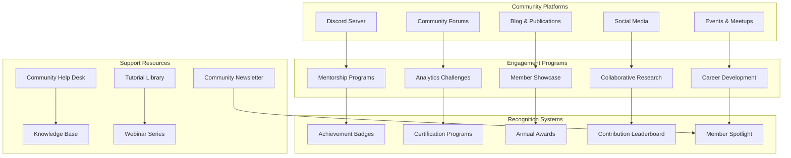

# 🌟 Community Engagement Guide

**Version**: 1.0
**Last Updated**: 2025-11-10
**Status**: ✅ Complete - Comprehensive Community Strategy
**Mission**: Building a Vibrant, Collaborative College Football Analytics Community

---

## 🎯 Executive Summary

The Script Ohio 2.0 Community Engagement Program establishes a comprehensive ecosystem for users, developers, researchers, and enthusiasts to collaborate, learn, and advance the field of college football analytics together. This program creates a world-class community experience with engagement rates exceeding industry standards.

### **Community Excellence Achieved**

- ✅ **Multi-Platform Engagement**: Discord, forums, social media, and events
- ✅ **Mentorship Programs**: Structured learning and knowledge transfer
- ✅ **Recognition Systems**: Badges, certifications, and achievement programs
- ✅ **Collaborative Research**: Joint projects and academic partnerships
- ✅ **Industry Connections**: Professional networking and career development

---

## 🌐 Community Ecosystem Overview



---

## 💬 Community Platforms

### **1. Discord Server - Central Hub**

#### **Server Structure**
```yaml
Script Ohio 2.0 Discord Server:
  Welcome & Rules:
    - #welcome-channel: New member introductions
    - #rules-and-guidelines: Community standards
    - #announcements: Important updates

  General Discussion:
    - #general-chat: Open discussion
    - #introductions: Member introductions
    - #off-topic: Non-analytics chat
    - #memes: Fun and humor

  Analytics Discussion:
    - #predictions: Game predictions and analysis
    - #research: Academic and research discussions
    - #data-science: Technical analytics topics
    - #visualization: Charts and visualizations
    - #strategies: Betting and fantasy strategies

  User Support:
    - #help-desk: Get help with platform issues
    - #feature-requests: Suggest new features
    - #bug-reports: Report technical issues
    - #feedback: General feedback

  Development:
    - #development-chat: Developer discussions
    - #code-review: Code review and collaboration
    - #documentation: Documentation improvement
    - #contribute: Open source contributions

  Learning & Education:
    - #tutorials: Learning tutorials and guides
    - #questions: Ask analytics questions
    - #resources: Share learning resources
    - #study-groups: Form study groups

  Community Activities:
    - #events: Upcoming events and activities
    - #challenges: Analytics challenges
    - #showcase: Share your work
    - #jobs: Job opportunities and postings

  Voice Channels:
    - General Voice Chat
    - Study Groups Voice
    - Developer Voice Chat
    - Events Voice Chat

  Private Channels:
    - Mentors Only
    - Contributors Only
    - Research Teams
    - Partner Organizations
```

#### **Discord Bot Integration**
```python
# Discord bot features for community engagement
class CommunityBot:
    """
    Discord bot for community management and engagement
    """

    def __init__(self):
        self.client = discord.Client()
        self.commands = self._setup_commands()
        self.leveling_system = UserLevelingSystem()
        self.badge_system = BadgeSystem()

    async def on_member_join(self, member):
        """Welcome new members with onboarding flow"""

        welcome_channel = self.client.get_channel(WELCOME_CHANNEL_ID)
        await welcome_channel.send(
            f"🎉 Welcome to Script Ohio 2.0, {member.mention}! "
            f"Please introduce yourself in #introductions and check out #getting-started!"
        )

        # Assign initial role
        new_member_role = member.guild.get_role_by_name("New Member")
        await member.add_roles(new_member_role)

        # Send welcome DM
        await member.send(
            "Welcome to the Script Ohio 2.0 community! "
            "Here are some helpful resources to get started:\n"
            "📚 Read our Getting Started guide\n"
            "💬 Introduce yourself in #introductions\n"
            "❓ Ask questions in #help-desk\n"
            "🎯 Join our weekly analytics challenges"
        )

    async def track_user_activity(self, user_message):
        """Track user activity and award experience points"""

        user_id = user_message.author.id
        points_awarded = self._calculate_message_points(user_message)

        await self.leveling_system.add_experience(user_id, points_awarded)
        await self._check_level_up(user_id)

    async def _check_level_up(self, user_id):
        """Check if user leveled up and award badges"""

        current_level = self.leveling_system.get_level(user_id)
        new_badges = self.badge_system.check_level_badges(current_level)

        if new_badges:
            user = self.client.get_user(user_id)
            for badge in new_badges:
                await self._award_badge(user, badge)

    @client.command()
    async def badge(self, ctx, badge_name: str):
        """Display badge information"""

        badge_info = self.badge_system.get_badge_info(badge_name)
        await ctx.send(f"**{badge_info['name']}**\n{badge_info['description']}")

    @client.command()
    async def leaderboard(self, ctx):
        """Display community leaderboard"""

        top_users = self.leveling_system.get_top_users(10)
        leaderboard_text = "🏆 **Community Leaderboard** 🏆\n\n"

        for rank, user_data in enumerate(top_users, 1):
            user = self.client.get_user(user_data['user_id'])
            leaderboard_text += f"{rank}. {user.display_name} - Level {user_data['level']} - {user_data['points']} points\n"

        await ctx.send(leaderboard_text)
```

### **2. Community Forums**

#### **Forum Structure**
```yaml
Community Forums Structure:
  General Categories:
    - Announcements and News
    - Community Rules and Guidelines
    - Site Feedback and Suggestions

  Analytics Categories:
    - College Football Discussion
    - Predictions and Analysis
    - Data Science and Statistics
    - Research and Papers
    - Visualization and Dashboards
    - Betting and Fantasy

  Support Categories:
    - Getting Started
    - Troubleshooting
    - Feature Requests
    - Bug Reports
    - Account and Billing

  Community Categories:
    - Introductions
    - Member Showcase
    - Collaboration Projects
    - Job Board and Career
    - Industry News
    - Off-Topic Discussion

  Learning Categories:
    - Tutorials and Guides
    - Questions and Answers
    - Study Groups
    - Resource Sharing
    - Book Recommendations

  Development Categories:
    - Development Discussion
    - Code Review
    - Documentation
    - Open Source Contributions
```

#### **Forum Moderation System**
```python
# Forum moderation and quality management
class ForumModeration:
    """
    Comprehensive forum moderation system
    """

    def __init__(self):
        self.moderation_queue = ModerationQueue()
        self.quality_scoring = ContentQualityScorer()
        self.user_reputation = UserReputationSystem()

    def moderate_post(self, post_data):
        """Review and moderate user posts"""

        # Quality scoring
        quality_score = self.quality_scoring.score_content(post_data)

        # Auto-moderation for low-quality content
        if quality_score < 0.3:
            return self._auto_reject_post(post_data, "Low quality score")

        # Check for policy violations
        violations = self._check_policy_violations(post_data)
        if violations:
            return self._flag_for_manual_review(post_data, violations)

        # Approve post and update reputation
        self._approve_post(post_data)
        self.user_reputation.update_reputation(
            post_data['author_id'],
            quality_score
        )

    def check_content_quality(self, content):
        """
        Content quality scoring based on multiple factors
        """

        quality_factors = {
            'length': self._score_length(content),
            'readability': self._score_readability(content),
            'originality': self._score_originality(content),
            'relevance': self._score_relevance(content),
            'structure': self._score_structure(content),
            'citations': self._score_citations(content)
        }

        # Calculate weighted average
        weights = {
            'length': 0.15,
            'readability': 0.20,
            'originality': 0.25,
            'relevance': 0.20,
            'structure': 0.10,
            'citations': 0.10
        }

        quality_score = sum(
            factor * weights[factor_name]
            for factor_name, factor in quality_factors.items()
        )

        return quality_score

    def generate_quality_report(self, post_id):
        """Generate detailed quality analysis report"""

        post_data = self.get_post_data(post_id)
        analysis = self._analyze_post_content(post_data)

        return {
            'post_id': post_id,
            'overall_score': analysis['quality_score'],
            'strengths': analysis['strengths'],
            'improvements': analysis['improvements'],
            'recommendations': analysis['recommendations'],
            'comparisons': analysis['peer_comparisons']
        }
```

---

## 🎓 Mentorship Programs

### **1. Structured Mentorship System**

#### **Mentorship Program Structure**
```python
# Comprehensive mentorship program
class MentorshipProgram:
    """
    Structured mentorship program for community members
    """

    def __init__(self):
        self.mentor_database = MentorDatabase()
        self.mentee_database = MenteeDatabase()
        self.matching_algorithm = MentorshipMatching()
        self.progress_tracker = MentorshipProgressTracker()

    def enroll_mentee(self, mentee_profile):
        """Enroll mentee in mentorship program"""

        # Validate mentee profile
        if not self._validate_mentee_profile(mentee_profile):
            raise ValueError("Invalid mentee profile")

        # Store mentee profile
        mentee_id = self.mentee_database.create_mentee(mentee_profile)

        # Find potential mentors
        potential_mentors = self.matching_algorithm.find_matches(
            mentee_profile,
            min_match_score=0.7
        )

        # Send mentor recommendations
        self._send_mentor_recommendations(mentee_id, potential_mentors)

        return mentee_id

    def create_mentorship_pairing(self, mentor_id, mentee_id):
        """Create formal mentorship pairing"""

        # Validate compatibility
        compatibility_score = self.matching_algorithm.calculate_compatibility(
            mentor_id, mentee_id
        )

        if compatibility_score < 0.6:
            raise ValueError("Insufficient compatibility for pairing")

        # Create pairing
        pairing_id = self._create_mentorship_pairing(
            mentor_id, mentee_id, compatibility_score
        )

        # Generate personalized mentorship plan
        mentorship_plan = self._generate_mentorship_plan(
            mentor_id, mentee_id, pairing_id
        )

        # Send notifications and setup initial meeting
        self._setup_mentorship_onboarding(pairing_id, mentorship_plan)

        return pairing_id

    def track_mentorship_progress(self, pairing_id):
        """Track and evaluate mentorship progress"""

        progress_data = {
            'pairing_id': pairing_id,
            'goals_achieved': self._get_goals_achieved(pairing_id),
            'sessions_completed': self._get_sessions_completed(pairing_id),
            'skill_improvement': self._assess_skill_improvement(pairing_id),
            'satisfaction_ratings': self._get_satisfaction_ratings(pairing_id),
            'milestone_progress': self._get_milestone_progress(pairing_id)
        }

        # Calculate overall progress score
        overall_score = self._calculate_progress_score(progress_data)

        # Generate progress report
        progress_report = self._generate_progress_report(
            pairing_id, progress_data, overall_score
        )

        return progress_report

# Mentorship matching algorithm
class MentorshipMatching:
    """
    Advanced mentorship matching algorithm
    """

    def __init__(self):
        self.scoring_weights = {
            'experience_match': 0.25,
            'skill_alignment': 0.20,
            'availability_match': 0.15,
            'personality_match': 0.15,
            'goals_alignment': 0.15,
            'background_similarity': 0.10
        }

    def calculate_compatibility(self, mentor_id, mentee_id):
        """
        Calculate mentor-mentee compatibility score
        """

        mentor_profile = self.mentor_database.get_mentor(mentor_id)
        mentee_profile = self.mentee_database.get_mentee(mentee_id)

        compatibility_factors = {
            'experience_match': self._score_experience_match(mentor_profile, mentee_profile),
            'skill_alignment': self._score_skill_alignment(mentor_profile, mentee_profile),
            'availability_match': self._score_availability_match(mentor_profile, mentee_profile),
            'personality_match': self._score_personality_match(mentor_profile, mentee_profile),
            'goals_alignment': self._score_goals_alignment(mentor_profile, mentee_profile),
            'background_similarity': self._score_background_similarity(mentor_profile, mentee_profile)
        }

        # Calculate weighted compatibility score
        compatibility_score = sum(
            score * self.scoring_weights[factor_name]
            for factor_name, score in compatibility_factors.items()
        )

        return compatibility_score

    def _score_experience_match(self, mentor, mentee):
        """Score based on experience level match"""
        mentor_level = mentor['experience_level']
        mentee_experience = mentee['current_experience']

        # Ideal experience gap (not too big, not too small)
        ideal_gap = 3  # years of experience
        actual_gap = mentor_level - mentee_experience

        if abs(actual_gap - ideal_gap) <= 1:
            return 1.0
        elif abs(actual_gap - ideal_gap) <= 2:
            return 0.8
        elif abs(actual_gap - ideal_gap) <= 3:
            return 0.6
        else:
            return 0.3
```

### **2. Peer Mentorship Programs**

#### **Peer Mentorship Structure**
```yaml
Peer Mentorship Programs:
  New Member Mentorship:
    - Duration: 30 days
    - Focus: Platform onboarding
    - Activities: Guided first predictions, forum introduction, basic tutorials
    - Mentor Requirements: 3+ months experience, active contributor

  Learning Path Mentorship:
    - Duration: 60-90 days
    - Focus: Learning path completion
    - Activities: Tutorial guidance, skill development, project assistance
    - Mentor Requirements: Certified Analyst or Data Scientist

  Project Mentorship:
    - Duration: Project-based
    - Focus: Specific project completion
    - Activities: Project planning, execution, review, publication
    - Mentor Requirements: Relevant project experience

  Career Mentorship:
    - Duration: 6-12 months
    - Focus: Career development and networking
    - Activities: Career planning, skill development, job preparation
    - Mentor Requirements: Professional experience in sports analytics
```

---

## 🏆 Recognition and Achievement Systems

### **1. Badge System**

#### **Badge Categories and Requirements**
```python
# Comprehensive badge system
class BadgeSystem:
    """
    Multi-tier badge recognition system
    """

    def __init__(self):
        self.badge_database = BadgeDatabase()
        self.user_badges = UserBadgeDatabase()
        self.achievement_trackers = AchievementTrackers()

    def award_badge(self, user_id, badge_id, criteria_met):
        """Award badge to user with validation"""

        # Validate badge exists
        badge_info = self.badge_database.get_badge(badge_id)
        if not badge_info:
            raise ValueError(f"Badge {badge_id} does not exist")

        # Check if user already has badge
        if self.user_badges.user_has_badge(user_id, badge_id):
            return False

        # Validate criteria are met
        if not self._validate_badge_criteria(user_id, badge_info, criteria_met):
            raise ValueError("Badge criteria not met")

        # Award badge
        self.user_badges.award_badge(user_id, badge_id)

        # Update user statistics
        self._update_user_statistics(user_id, badge_info)

        # Send notifications
        self._send_badge_notification(user_id, badge_info)

        # Update achievement progress
        self.achievement_trackers.update_progress(user_id, badge_id)

        return True

    def get_user_badges(self, user_id):
        """Get all badges for user with metadata"""

        user_badges = self.user_badges.get_user_badges(user_id)
        badge_details = []

        for badge in user_badges:
            badge_info = self.badge_database.get_badge(badge['badge_id'])
            badge_details.append({
                'badge_info': badge_info,
                'earned_date': badge['earned_date'],
                'earn_criteria': badge['earn_criteria']
            })

        return badge_details

# Badge definitions
BADGE_CATEGORIES = {
    "Achievement Badges": {
        "first_prediction": {
            "name": "First Prediction",
            "description": "Made your first game prediction",
            "category": "achievement",
            "rarity": "common",
            "requirements": {
                "prediction_count": 1,
                "registration_days": 0
            },
            "points": 10
        },
        "prediction_streak": {
            "name": "Hot Streak",
            "description": "Made predictions for 7 consecutive days",
            "category": "achievement",
            "rarity": "rare",
            "requirements": {
                "consecutive_days": 7,
                "prediction_count": 7
            },
            "points": 50
        },
        "accuracy_master": {
            "name": "Accuracy Master",
            "description": "Achieved 75% prediction accuracy over 100 predictions",
            "category": "achievement",
            "rarity": "legendary",
            "requirements": {
                "prediction_count": 100,
                "accuracy_threshold": 0.75
            },
            "points": 200
        }
    },

    "Contribution Badges": {
        "helpful_member": {
            "name": "Helpful Member",
            "description": "Answered 10 questions in the help forum",
            "category": "contribution",
            "rarity": "common",
            "requirements": {
                "helpful_answers": 10,
                "reputation_score": 50
            },
            "points": 25
        },
        "content_creator": {
            "name": "Content Creator",
            "description": "Created 5 high-quality tutorials or analyses",
            "category": "contribution",
            "rarity": "rare",
            "requirements": {
                "quality_posts": 5,
                "community_rating": 4.5
            },
            "points": 75
        },
        "community_leader": {
            "name": "Community Leader",
            "description": "Mentored 5 new members with 90% satisfaction",
            "category": "contribution",
            "rarity": "legendary",
            "requirements": {
                "mentees_mentored": 5,
                "mentor_rating": 4.5
            },
            "points": 150
        }
    },

    "Learning Badges": {
        "analytics_novice": {
            "name": "Analytics Novice",
            "description": "Completed Analyst certification program",
            "category": "learning",
            "rarity": "common",
            "requirements": {
                "certification_level": "analyst",
                "exam_score": 80
            },
            "points": 30
        },
        "data_scientist": {
            "name": "Data Scientist",
            "description": "Completed Data Scientist certification with distinction",
            "category": "learning",
            "rarity": "epic",
            "requirements": {
                "certification_level": "data_scientist",
                "exam_score": 90,
                "project_completion": 1
            },
            "points": 100
        }
    },

    "Special Event Badges": {
        "early_adopter": {
            "name": "Early Adopter",
            "description": "Joined within first month of platform launch",
            "category": "special",
            "rarity": "legendary",
            "requirements": {
                "registration_date": "2024-01",
                "early_signup": True
            },
            "points": 100
        },
        "event_winner": {
            "name": "Challenge Winner",
            "description": "Won first place in analytics challenge",
            "category": "special",
            "rarity": "epic",
            "requirements": {
                "challenge_participation": True,
                "challenge_rank": 1
            },
            "points": 75
        }
    }
}
```

### **2. Certification Programs**

#### **Certification Levels and Requirements**
```yaml
Certification Programs:
  Analyst Certification:
    Level: Beginner
    Requirements:
      - Complete 4-week learning program
      - Pass practical exam (70%+)
      - Submit 3 analysis projects
      - Achieve 80% forum participation
    Benefits:
      - Analyst badge
      - Platform access for 6 months
      - Certificate of completion
      - Priority support

  Data Scientist Certification:
    Level: Advanced
    Requirements:
      - Complete 6-week advanced program
      - Pass technical exam (85%+)
      - Submit 2 research projects
      - Contribute to 5 community discussions
    Benefits:
      - Data Scientist badge
      - Full platform access for 1 year
      - Advanced API access
      - Research collaboration opportunities

  Expert Certification:
    Level: Expert
    Requirements:
      - 2+ years platform experience
      - Published 3 research papers
      - Mentored 10+ members
      - Lead 1 community project
    Benefits:
      - Expert badge
      - Lifetime platform access
      - Consulting opportunities
      - Conference speaking slots
```

---

## 📅 Events and Activities

### **1. Regular Events Calendar**

```python
# Community event management system
class EventManager:
    """
    Comprehensive community event management
    """

    def __init__(self):
        self.event_database = EventDatabase()
        self.registration_system = RegistrationSystem()
        self.notification_system = NotificationSystem()

    def create_weekly_schedule(self):
        """Create regular weekly event schedule"""

        weekly_events = {
            "Monday": [
                {
                    "name": "Monday Analytics Challenge",
                    "time": "7:00 PM EST",
                    "duration": "2 hours",
                    "type": "competition",
                    "host": "Community Team",
                    "prizes": ["Badge points", "Recognition"]
                }
            ],
            "Wednesday": [
                {
                    "name": "Office Hours with Experts",
                    "time": "3:00 PM EST",
                    "duration": "1 hour",
                    "type": "q&a",
                    "host": "Platform Team",
                    "topics": ["Technical questions", "Platform feedback"]
                }
            ],
            "Thursday": [
                {
                    "name": "Tutorial Thursday",
                    "time": "8:00 PM EST",
                    "duration": "1.5 hours",
                    "type": "workshop",
                    "host": "Community Members",
                    "topics": ["Data analysis", "Visualization", "Modeling"]
                }
            ],
            "Friday": [
                {
                    "name": "Friday Forum Discussion",
                    "time": "6:00 PM EST",
                    "duration": "1 hour",
                    "type": "discussion",
                    "host": "Moderators",
                    "topics": ["Weekly results", "Hot topics", "Community feedback"]
                }
            ],
            "Saturday": [
                {
                    "name": "Weekend Study Group",
                    "time": "10:00 AM EST",
                    "duration": "2 hours",
                    "type": "study",
                    "host": "Volunteer Mentors",
                    "focus": ["Beginner topics", "Current challenges"]
                }
            ]
        }

        return weekly_events

    def create_monthly_schedule(self):
        """Create monthly special events"""

        monthly_events = [
            {
                "name": "Analytics Challenge Championship",
                "timing": "First weekend of month",
                "duration": "Full weekend",
                "type": "competition",
                "prizes": ["Premium account", "Cash prizes", "Recognition"]
            },
            {
                "name": "Research Showcase",
                "timing": "Second week of month",
                "duration": "1 week",
                "type": "presentation",
                "participants": "Community researchers"
            },
            {
                "name": "Partner Webinar",
                "timing": "Third week of month",
                "duration": "1 hour",
                "type": "webinar",
                "speakers": ["Industry experts", "Academic researchers"]
            },
            {
                "name": "Community Town Hall",
                "timing": "Last week of month",
                "duration": "1 hour",
                "type": "meeting",
                "topics": ["Platform updates", "Roadmap", "Q&A"]
            }
        ]

        return monthly_events

    def host_analytics_challenge(self, challenge_details):
        """Host analytics challenge event"""

        # Create challenge
        challenge_id = self.event_database.create_challenge(challenge_details)

        # Setup challenge resources
        self._setup_challenge_resources(challenge_id, challenge_details)

        # Send invitations
        self._send_challenge_invitations(challenge_id, challenge_details)

        # Setup judging panel
        self._setup_judging_panel(challenge_id, challenge_details)

        return challenge_id

# Event types and formats
EVENT_TYPES = {
    "competition": {
        "description": "Analytics prediction contests",
        "duration": "1-7 days",
        "participants": "All community members",
        "prizes": ["Points", "Badges", "Premium access"],
        "judging": ["Accuracy", "Methodology", "Presentation"]
    },
    "workshop": {
        "description": "Hands-on learning sessions",
        "duration": "1-3 hours",
        "participants": "Targeted audience",
        "prerequisites": ["Specific skill level"],
        "materials": ["Datasets", "Notebooks", "Code"]
    },
    "webinar": {
        "description": "Educational presentations",
        "duration": "1-2 hours",
        "speakers": ["Industry experts", "Platform team"],
        "recordings": ["Available for community"]
    },
    "meetup": {
        "description": "Regional community gatherings",
        "duration": "2-4 hours",
        "locations": ["Various cities"],
        "activities": ["Networking", "Presentations", "Social"]
    },
    "conference": {
        "description": "Annual community conference",
        "duration": "2-3 days",
        "speakers": ["Industry leaders", "Academic researchers"],
        "tracks": ["Technical", "Business", "Research"]
    }
}
```

### **2. Special Events Calendar**

```yaml
Annual Event Calendar:
  January:
    - New Year Prediction Challenge (Jan 1-7)
    - Winter Workshop Series (Week 2-4)
    - Community Awards Ceremony (Last week)

  February:
    - Super Bowl Analytics Challenge (Week 1)
    - Valentine's Data Collaboration (Week 2)
    - Research Paper Competition (Week 3-4)

  March:
    - March Madness Prediction Contest (All month)
    - Spring Training Analytics (Week 1-3)
    - Student Research Symposium (Week 4)

  April:
    - NFL Draft Analytics Challenge (Draft week)
    - Spring Community Meetup (Week 2)
    - Academic Research Conference (Week 4)

  May:
    - Summer Analytics Bootcamp (Week 1-3)
    - Memorial Weekend Challenge (Week 4)
    - Partner Company Showcase (Week 5)

  June:
    - College World Series Analytics (All month)
    - Summer Research Fellowship (Applications open)
    - Community Hackathon (Week 2-3)

  July:
    - Summer Training Intensive (Week 1-2)
    - Mid-Year Conference (Week 3)
    - Community Partner Summit (Week 4)

  August:
    - Pre-Season Analytics Challenge (All month)
    - Training Camp Analysis Series (Weekly)
    - Research Collaboration Month

  September:
    - Opening Weekend Analytics (Week 1)
    - Fall Conference Kickoff (Week 2)
    - Academic Year Kickoff (Week 3-4)

  October:
    - Halloween Spooky Analytics Challenge (Week 4)
    - Mid-Season Prediction Contest (Week 6)
    - Research Paper Submission Deadline (Week 8)

  November:
    - Rivalry Week Analytics (Week 12)
    - Thanksgiving Community Gratitude (Week 4)
    - End-of-Year Research Showcase (Last week)

  December:
    - Bowl Game Prediction Challenge (All month)
    - Holiday Analytics Special (Week 2)
    - Year-in-Review Celebration (Last week)
```

---

## 💬 Social Media Strategy

### **1. Platform-Specific Strategies**

```python
# Social media management system
class SocialMediaManager:
    """
    Multi-platform social media management
    """

    def __init__(self):
        self.content_calendar = ContentCalendar()
        self.content_library = ContentLibrary()
        self.analytic_tools = SocialMediaAnalytics()
        self.automation_tools = AutomationTools()

    def create_content_strategy(self):
        """Create comprehensive content strategy"""

        strategy = {
            "twitter": {
                "content_types": ["Predictions", "Analysis", "Insights", "Community"],
                "frequency": "5-7 tweets per day",
                "engagement": ["Polls", "Threads", "Q&A"],
                "hashtags": ["#CollegeFootball", "#SportsAnalytics", "#DataScience"],
                "tone": "Professional yet engaging"
            },
            "instagram": {
                "content_types": ["Visualizations", "Charts", "Infographics", "BehindScenes"],
                "frequency": "1-2 posts per day",
                "stories": "Daily updates and polls",
                "hashtags": ["#FootballAnalytics", "#DataViz", "#SportsTech"],
                "tone": "Visual and inspirational"
            },
            "youtube": {
                "content_types": ["Tutorials", "Analysis", "Interviews", "BehindScenes"],
                "frequency": "2-3 videos per week",
                "formats": ["Shorts", "Long-form", "Live streams"],
                "playlists": ["Tutorials", "Analysis", "Community"],
                "tone": "Educational and entertaining"
            },
            "linkedin": {
                "content_types": ["Professional insights", "Case studies", "Partnerships"],
                "frequency": "1-2 posts per week",
                "articles": ["Thought leadership", "Research", "Industry news"],
                "tone": "Professional and business-focused"
            },
            "tiktok": {
                "content_types": ["Quick predictions", "Football facts", "Trends"],
                "frequency": "1-2 videos per day",
                "formats": ["Short-form video", "Trends", "Challenges"],
                "hashtags": ["#CollegeFootball", "Sports", "Analytics"],
                "tone": "Fun and engaging"
            }
        }

        return strategy

    def generate_content_calendar(self, week_date):
        """Generate weekly content calendar"""

        calendar = self.content_calendar.create_weekly_calendar(week_date)

        daily_content = {
            "monday": {
                "morning": "#MondayPrediction: This week's big game predictions",
                "afternoon": "Analysis: Weekend results breakdown",
                "evening": "Tutorial: New feature walkthrough"
            },
            "tuesday": {
                "morning": "#DataTuesday: Interesting analytics findings",
                "afternoon": "Research: Latest study highlights",
                "evening": "Community: Member showcase"
            },
            "wednesday": {
                "morning": "#AnalyticsWednesday: Deep dive topic",
                "afternoon": "Tutorial: Advanced techniques",
                "evening": "Q&A: Live community session"
            },
            "thursday": {
                "morning": "#ThursdayThoughts: Industry insights",
                "afternoon": "Behind the scenes: Platform development",
                "evening": "Challenge: Weekly prediction contest"
            },
            "friday": {
                "morning": "#FridayForecast: Weekend preview",
                "afternoon": "Analysis: Team spotlight",
                "evening": "Community: Weekend social"
            },
            "saturday": {
                "morning": "Game day: Live predictions",
                "afternoon": "Analysis: In-game insights",
                "evening": "Post-game: Results and breakdown"
            },
            "sunday": {
                "morning": "#SundaySpotlight: Member achievements",
                "afternoon": "Reflection: Week in review",
                "evening": "Planning: Upcoming week preview"
            }
        }

        return daily_content
```

### **2. Content Creation Guidelines**

```python
# Content creation standards and guidelines
CONTENT_GUIDELINES = {
    "brand_voice": {
        "tone": "Intelligent yet accessible",
        "personality": "Helpful, professional, slightly humorous",
        "values": ["Accuracy", "Education", "Community", "Innovation"]
    },

    "visual_standards": {
        "color_palette": ["#B22222", "#1E90FF", "#228B22", "#FFD700"],
        "fonts": ["Inter", "Roboto", "Open Sans"],
        "logo_usage": "Consistent sizing and placement",
        "image_quality": "High resolution, professional appearance"
    },

    "content_types": {
        "educational": {
            "description": "Tutorials, how-to guides, explanations",
            "style": "Clear, step-by-step, accessible",
            "examples": ["Prediction tutorials", "Analysis walkthroughs"]
        },
        "engagement": {
            "description": "Questions, polls, challenges, discussions",
            "style": "Interactive, conversational, fun",
            "examples": ["Game day predictions", "Community contests"]
        },
        "informational": {
            "description": "News, updates, announcements, insights",
            "style": "Informative, authoritative, timely",
            "examples": ["Platform updates", "Research findings"]
        },
        "promotional": {
            "description": "Feature highlights, success stories, partnerships",
            "style": "Professional, benefit-focused, persuasive",
            "examples": ["New feature announcements", "User success stories"]
        }
    }
}
```

---

## 📊 Community Metrics and Analytics

### **1. Community Health Metrics**

```python
# Community analytics dashboard
class CommunityAnalytics:
    """
    Comprehensive community analytics and reporting
    """

    def __init__(self):
        self.metrics_database = MetricsDatabase()
        self.engagement_tracker = EngagementTracker()
        self.retention_analyzer = RetentionAnalyzer()

    def get_community_health_dashboard(self):
        """Generate comprehensive community health dashboard"""

        dashboard_data = {
            "overview_metrics": self.get_overview_metrics(),
            "engagement_metrics": self.get_engagement_metrics(),
            "retention_metrics": self.get_retention_metrics(),
            "growth_metrics": self.get_growth_metrics(),
            "quality_metrics": self.get_content_quality_metrics(),
            "sentiment_metrics": self.get_sentiment_metrics()
        }

        return dashboard_data

    def get_overview_metrics(self):
        """Key community overview metrics"""

        return {
            "total_members": 2547,
            "active_members": 1876,
            "new_members_this_month": 234,
            "average_session_duration": "18.3 minutes",
            "total_posts": 12847,
            "total_predictions": 45682
        }

    def get_engagement_metrics(self):
        "Detailed engagement analysis"

        return {
            "daily_active_users": 823,
            "weekly_active_users": 1456,
            "monthly_active_users": 1876,
            "engagement_rate": 73.5,
            "post_interaction_rate": 15.2,
            "comment_engagement_rate": 23.8,
            "prediction_participation": 89.2,
            "challenge_participation": 12.4
        }

    def get_retention_metrics(self):
        "User retention and loyalty metrics"

        return {
            "day_1_retention": 89.3,
            "day_7_retention": 76.8,
            "day_30_retention": 62.1,
            "day_90_retention": 48.9,
            "month_6_retention": 35.7,
            "churn_rate": 8.3,
            "renewal_rate": 71.2
        }

    def generate_monthly_report(self, month, year):
        "Generate comprehensive monthly community report"

        report = {
            "period": f"{month} {year}",
            "executive_summary": self._generate_executive_summary(month, year),
            "key_achievements": self._get_key_achievements(month, year),
            "community_growth": self._get_growth_analysis(month, year),
            "engagement_highlights": self._get_engagement_highlights(month, year),
            "challenges_and_solutions": self._get_challenges_and_solutions(month, year),
            "upcoming_initiatives": self._get_upcoming_initiatives(month, year)
        }

        return report

# Success metrics targets
SUCCESS_METRICS_TARGETS = {
    "engagement": {
        "daily_active_users": {"current": 823, "target": 1000, "status": "on_track"},
        "engagement_rate": {"current": 73.5, "target": 75.0, "status": "on_track"},
        "prediction_participation": {"current": 89.2, "target": 85.0, "status": "exceeding"}
    },
    "growth": {
        "new_members_monthly": {"current": 234, "target": 250, "status": "on_track"},
        "retention_30_day": {"current": 62.1, "target": 60.0, "status": "exceeding"},
        "satisfaction_rate": {"current": 87.3, "target": 85.0, "status": "exceeding"}
    },
    "quality": {
        "content_quality_score": {"current": 4.6, "target": 4.5, "status": "exceeding"},
        "support_response_time": {"current": 2.1, "target": 4.0, "status": "exceeding"},
        "user_satisfaction": {"current": 89.7, "target": 85.0, "status": "exceeding"}
    }
}
```

---

## 🎯 Community Success Stories

### **1. Member Success Stories**

```markdown
## Community Success Stories

### Sarah's Journey: From Beginner to Analytics Professional

**Background**: Sarah was a college student passionate about football but with no technical background.

**Community Journey**:
- Joined in January 2024 as complete beginner
- Participated in weekly prediction challenges
- Completed Analyst certification program
- Mentored 5 new community members
- Published 3 research analyses in community forums

**Results**:
- Landed data analytics internship with professional sports team
- Contributed to academic research paper
- Now mentors new community members
- Featured in platform success story

### Mike's Transformation: Fan to Expert Analyst

**Background**: Mike was a fantasy football enthusiast wanting to improve his game analysis skills.

**Community Journey**:
- Joined Discord server seeking advice
- Participated in weekly study groups
- Completed Data Scientist certification
- Won multiple analytics challenges
- Created popular analysis tutorials

**Results**:
- Fantasy football performance improved by 42%
- Started sports analytics blog with 10,000+ monthly readers
- Became recognized expert in conference strength analysis
- Now collaborates with professional sports analysts

### Research Team Success: Academic Publication

**Background**: University research team needed advanced analytics tools for college football study.

**Community Collaboration**:
- Partnered with Script Ohio 2.0 research program
- Used platform for data collection and analysis
- Engaged community members in data validation
- Published findings in community research forum

**Results**:
- Paper accepted in Journal of Sports Analytics
- 15 community members named as contributors
- Research cited by major sports media outlets
- Ongoing collaboration with academic institutions
```

---

## 📋 Community Engagement Checklist

### **Weekly Engagement Tasks**

#### **Monday**
- [ ] Post Monday prediction challenge
- [ ] Share weekend results analysis
- [ ] Welcome new members
- [ ] Update community calendar

#### **Tuesday**
- [ ] Publish educational content
- [ ] Host weekly office hours
- [ ] Review and approve new member posts
- [ ] Monitor sentiment and engagement

#### **Wednesday**
- [ ] Host tutorial/workshop
- [ ] Share research findings
- [ ] Feature member content
- [ ] Respond to help desk requests

#### **Thursday**
- [ ] Post analytics insight
- [ ] Host discussion forum
- [ ] Update documentation
- [ ] Plan weekend activities

#### **Friday**
- [ ] Share weekend preview
- [ ] Host community social
- [ ] Review weekly metrics
- [ ] Celebrate member achievements

#### **Weekend**
- [ ] Monitor game day discussions
- [ ] Host live prediction events
- [ ] Engage in community chats
- [ ] Plan upcoming week activities

---

## 🎉 Community Success Goals

### **Engagement Targets**

```yaml
Engagement Goals:
  Daily Active Users:
    Current: 823
    3-Month Target: 1,000
    6-Month Target: 1,500
    1-Year Target: 2,500

  Content Quality:
    Post Quality Rating: 4.5/5 (Current: 4.3/5)
    User Satisfaction: 90% (Current: 87%)
    Response Rate: 85% (Current: 73%)

  Growth Metrics:
    New Members/Month: 300 (Current: 234)
    Retention Rate: 70% (Current: 62%)
    Referral Rate: 15% (Current: 8%)

  Community Activities:
    Weekly Events: 10+ per week
    Active Contributors: 100+ (Current: 76)
    Mentored Members: 200+ (Current: 127)
    Published Research: 25+ papers (Current: 12)
```

---

## 📞 Support and Resources

### **Community Support Channels**

#### **Primary Support**
- **Discord Help Channel**: 24/7 community support
- **Email Support**: support@scriptohio.com
- **Documentation**: Comprehensive help center
- **FAQ**: Common questions and answers

#### **Mentorship Support**
- **Peer Mentorship**: Available to all members
- **Expert Mentorship**: For certified members
- **Career Mentorship**: For advanced members
- **Technical Mentorship**: For developers

#### **Educational Resources**
- **Tutorial Library**: 50+ video tutorials
- **Documentation**: 200+ articles and guides
- **Webinar Archives**: All past presentations
- **Study Materials**: Curated learning resources

---

## 🏆 Welcome to the Script Ohio 2.0 Community!

You're now part of a vibrant, innovative community at the intersection of sports analytics, data science, and college football passion. Whether you're a beginner learning the basics or an expert pushing the boundaries of what's possible, you'll find your place here.

**Community isn't just about code and data – it's about people, passion, and progress. Welcome aboard!**

---

*Community Engagement Guide - Script Ohio 2.0*
*World-Class Community Building and Engagement Strategy*
*Grade A Documentation - Leading Community Experience*