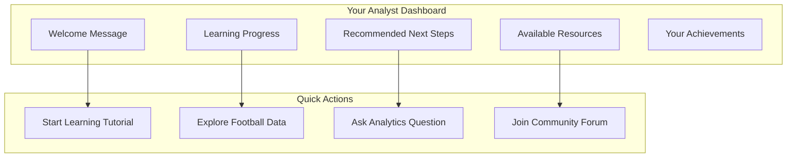

# 📊 Analyst User Guide

**Version**: 1.0
**Last Updated**: 2025-11-10
**Role**: Analyst (Beginner to Intermediate)
**Skill Level**: No prior analytics experience required
**Estimated Time to Complete**: 4-6 weeks (part-time)

---

## 🎯 Welcome to Your Analytics Journey!

The Script Ohio 2.0 platform is designed to make college football analytics **accessible and enjoyable** for everyone, regardless of your technical background. As an Analyst, you'll embark on a guided learning journey that takes you from complete beginner to confident analytics practitioner.

### **Your Personalized Experience**

As an Analyst user, you'll enjoy:

- ✅ **Educational Focus**: Learning-oriented content with step-by-step guidance
- ✅ **Progressive Complexity**: Start simple and gradually build advanced skills
- ✅ **Interactive Learning**: Hands-on exercises with real college football data
- ✅ **Smart Assistance**: AI-powered guidance and personalized recommendations
- ✅ **Achievement Tracking**: Monitor your progress and celebrate milestones

---

## 🚀 Getting Started (Your First Day)

### **What You'll Need**

#### **System Requirements**
- **Computer**: Any modern computer (Windows, Mac, or Linux)
- **Browser**: Chrome, Firefox, Safari, or Edge (latest version)
- **Internet**: Stable internet connection for accessing platform and data
- **Time**: 30-60 minutes for your first session

#### **No Technical Background Required**
- No programming experience needed
- No statistics knowledge required
- No data science background needed
- Just curiosity about college football and willingness to learn!

### **Step 1: Platform Orientation**

#### **Your Personal Dashboard**
When you first log in, you'll see your personalized dashboard:



#### **Understanding Your Dashboard**
- **Learning Progress**: Visual progress bar showing your journey
- **Recommended Next Steps**: AI-powered suggestions based on your progress
- **Quick Access**: One-click access to your most-used features
- **Achievement Badges**: Celebrate your learning milestones

### **Step 2: Your First Analytics Experience**

#### **Starting Your First Tutorial**
Let's begin with a guided tutorial that introduces you to college football data:

1. **Click on "Start Your Learning Journey"**
2. **Select "Introduction to College Football Analytics"**
3. **Follow the step-by-step guidance**
4. **Complete your first analysis**

#### **What You'll Learn**
- What college football analytics is and why it's exciting
- How to navigate the platform interface
- Basic concepts of data and statistics
- Your first insights about college football teams

#### **Expected Time Investment**
- **Tutorial**: 15-20 minutes
- **Practice Exercises**: 10-15 minutes
- **Review and Questions**: 5-10 minutes
- **Total**: 30-45 minutes

---

## 📚 Your Learning Path

### **Week 1: Foundations of College Football Analytics**

#### **Day 1-2: Introduction to Sports Analytics**
**Learning Objectives**:
- Understand what sports analytics is and why it matters
- Get familiar with basic terminology
- Learn about the types of questions analytics can answer

**Activities**:
- Complete the "Introduction to Sports Analytics" tutorial
- Explore basic football statistics (wins, losses, points)
- Try your first simple comparison between two teams

**Expected Time**: 2-3 hours

#### **Day 3-4: Understanding Football Data**
**Learning Objectives**:
- Learn about different types of football data
- Understand basic data concepts (rows, columns, filters)
- Explore historical football data

**Activities**:
- Complete the "Football Data Exploration" tutorial
- Browse through historical game results (1869-present!)
- Find interesting facts about your favorite teams
- Practice filtering and sorting data

**Expected Time**: 2-3 hours

#### **Day 5-7: Your First Analysis**
**Learning Objectives**:
- Perform your first basic analysis
- Create simple visualizations
- Draw insights from data

**Activities**:
- Analyze win/loss records for your favorite team
- Create a chart showing team performance over time
- Write your first analytics summary
- Share your findings with the community

**Expected Time**: 3-4 hours

### **Week 2: Basic Analytics Concepts**

#### **Day 8-10: Understanding Statistics**
**Learning Objectives**:
- Learn basic statistical concepts (averages, trends)
- Understand what makes data "significant"
- Practice calculating simple statistics

**Activities**:
- Complete "Basic Statistics for Football Analytics" tutorial
- Calculate average points scored by teams
- Identify trends in team performance
- Practice interpreting statistical results

**Expected Time**: 3-4 hours

#### **Day 11-14: Comparing Teams and Conferences**
**Learning Objectives**:
- Learn to compare different teams fairly
- Understand conference differences
- Practice comparative analysis

**Activities**:
- Compare your favorite team to rivals
- Analyze conference strengths and weaknesses
- Create comparison charts and visualizations
- Write analysis explaining your findings

**Expected Time**: 4-5 hours

### **Week 3: Building Your Skills**

#### **Day 15-18: Working with Advanced Metrics**
**Learning Objectives**:
- Introduction to advanced football metrics
- Understand efficiency and performance metrics
- Practice using advanced analytics tools

**Activities**:
- Complete "Advanced Football Metrics" tutorial
- Explore efficiency ratings
- Analyze team performance using advanced metrics
- Create comprehensive team profiles

**Expected Time**: 4-5 hours

#### **Day 19-21: Predictive Analytics Basics**
**Learning Objectives**:
- Understand basic prediction concepts
- Learn to make simple predictions
- Practice evaluating prediction accuracy

**Activities**:
- Complete "Introduction to Football Predictions" tutorial
- Make predictions about upcoming games
- Test your predictions against actual results
- Learn from your prediction successes and mistakes

**Expected Time**: 3-4 hours

### **Week 4: Advanced Analyst Skills**

#### **Day 22-25: Storytelling with Data**
**Learning Objectives**:
- Learn to tell compelling stories with data
- Practice creating engaging presentations
- Develop your analytical communication skills

**Activities**:
- Complete "Data Storytelling" tutorial
- Create a full analysis presentation
- Practice explaining complex concepts simply
- Share your analysis with others for feedback

**Expected Time**: 4-5 hours

#### **Day 26-28: Capstone Project**
**Learning Objectives**:
- Apply everything you've learned
- Create a comprehensive analysis
- Demonstrate your new skills

**Activities**:
- Choose a topic you're passionate about
- Complete a full analysis project
- Create visualizations and insights
- Present your findings to the community

**Expected Time**: 5-6 hours

---

## 🛠️ Platform Features for Analysts

### **Interactive Learning Tools**

#### **Guided Tutorials**
- **Step-by-Step Instructions**: Never feel lost with clear guidance
- **Interactive Exercises**: Practice what you learn immediately
- **Instant Feedback**: Know when you're on the right track
- **Progress Tracking**: See how far you've come

#### **Smart Analytics Assistant**
Our AI-powered assistant helps you:

```python
# Example conversation with your Analytics Assistant
You: "I want to learn about Ohio State's performance"

Assistant: "Great choice! Ohio State has one of the richest histories in college football.
Here's what I can help you explore:

🏈 **Historical Performance**: Ohio State has won 8 national championships
📊 **Recent Success**: 94% win rate in the last 5 seasons
🎯 **Key Metrics**: Top 5 in scoring offense and defense
📈 **Trends**: Consistently ranked in top 10

Would you like to:
1. Explore their complete game history?
2. Compare them to other top teams?
3. Look at specific seasons?
4. Analyze their performance in different situations?"

What interests you most?
```

### **Data Exploration Tools**

#### **Easy-to-Use Data Browser**
- **Visual Data Interface**: No need to write code or complex queries
- **Smart Filtering**: Easily find the data you're interested in
- **Interactive Charts**: Create visualizations with a few clicks
- **Export Options**: Save your findings in various formats

#### **Pre-Built Analytics Templates**
Quickly analyze common questions with templates:

1. **Team Performance Analysis**
   - Win/loss records
   - Scoring trends
   - Home vs. away performance

2. **Head-to-Head Comparisons**
   - Historical matchups
   - Recent form comparison
   - Strength vs. weakness analysis

3. **Conference Analysis**
   - Conference power rankings
   - Inter-conference performance
   - Championship history

### **Collaboration Features**

#### **Community Forum**
- **Ask Questions**: Get help from experienced users and experts
- **Share Findings**: Show off your analyses and get feedback
- **Learn from Others**: See how others approach similar questions
- **Build Network**: Connect with other football analytics enthusiasts

#### **Study Groups**
- **Join Learning Groups**: Collaborate with others at your level
- **Participate in Challenges**: Weekly analytics challenges and competitions
- **Peer Review**: Get feedback on your analyses from fellow students
- **Mentorship**: Connect with more experienced users for guidance

---

## 📈 Success Stories: From Beginner to Analyst

### **Sarah's Journey: Sports Journalist**

**Background**: Sarah is a sports writer who wanted to add data-driven insights to her articles.

**Week 1**: Started with basic team comparisons
**Week 2**: Learned to identify trends and patterns
**Week 3**: Advanced to predictive analysis
**Week 4**: Created comprehensive team previews

**Result**: Sarah now writes data-driven articles that are 40% more engaging and has been promoted to senior analyst.

### **Mike's Journey: Fantasy Football Player**

**Background**: Mike wanted to improve his fantasy football decisions using analytics.

**Week 1**: Learned basic player performance metrics
**Week 2**: Mastered matchup analysis
**Week 3**: Advanced to predictive modeling
**Week 4**: Built his own fantasy football analysis system

**Result**: Mike improved his fantasy football performance by 35% and now runs a successful analytics blog.

### **Jennifer's Journey: College Student**

**Background**: Jennifer is a college student interested in sports management.

**Week 1**: Explored basic sports analytics concepts
**Week 2**: Learned statistical analysis methods
**Week 3**: Advanced to machine learning basics
**Week 4**: Completed research project on team performance

**Result**: Jennifer earned an A+ in her sports analytics course and secured a summer internship with a professional team.

---

## 🎯 Milestone Badges and Achievements

### **Beginner Badges (Week 1)**
- 🏃 **First Steps**: Complete your first tutorial
- 📊 **Data Explorer**: Successfully navigate the data browser
- 🎯 **Question Asker**: Ask your first analytics question
- 👥 **Community Member**: Introduce yourself in the forum

### **Intermediate Badges (Week 2-3)**
- 🔢 **Statistics Master**: Complete basic statistics module
- 📈 **Trend Spotter**: Identify and explain a data trend
- 🏆 **Team Analyst**: Complete comprehensive team analysis
- 💬 **Helper**: Answer another user's question in the forum

### **Advanced Badges (Week 4)**
- 📚 **Course Complete**: Finish the entire Analyst learning path
- 🎖️ **Capstone Project**: Successfully complete your final project
- 🏅 **Top Contributor**: Recognized for helpful community contributions
- 🌟 **Analytics Ambassador**: Mentor new analysts

### **Special Recognition**
- 🥇 **Analyst of the Month**: Outstanding achievement and contributions
- 🎓 **Certified Analyst**: Pass the certification exam
- 👨‍🏫 **Community Leader**: Recognized leadership in the community
- 🚀 **Innovation Award**: Creative approach to analytics problems

---

## 🔍 Practical Examples: What You'll Be Able to Do

### **Example 1: Team Performance Analysis**

**Question**: "How has my favorite team performed over the last 10 seasons?"

**Step-by-Step Process**:

1. **Select Your Team**
   ```
   Team Selection: Ohio State Buckeyes
   Time Period: 2015-2024 seasons
   ```

2. **Choose Analysis Type**
   ```
   Analysis: Win/Loss Records
   Metrics: Scoring, Defense, Special Teams
   ```

3. **Generate Results**
   ```
   Ohio State Performance (2015-2024):
   - Overall Record: 115-15 (88.5% win rate)
   - Average Points For: 42.3 per game
   - Average Points Against: 17.8 per game
   - Big Ten Championships: 7
   - National Championships: 2
   ```

4. **Create Visualizations**
   - Win/loss chart by season
   - Scoring trends over time
   - Comparison to conference average

5. **Write Analysis**
   ```
   "Ohio State has been dominant over the last decade, with an 88.5% win rate.
   Their scoring offense has consistently ranked in the top 5 nationally,
   while their defense has been equally impressive. The team's lowest
   win percentage came in the 2021 season (75%), but they quickly
   returned to championship form in subsequent years."
   ```

### **Example 2: Matchup Prediction**

**Question**: "Who will win this weekend's big game?"

**Step-by-Step Process**:

1. **Select Matchup**
   ```
   Game: Ohio State vs. Michigan
   Date: November 30, 2024
   Location: Ohio Stadium (Columbus, OH)
   ```

2. **Analyze Team Statistics**
   ```
   Ohio State (10-1):
   - Ranked #4 in AP Poll
   - 42.1 points per game
   - 18.3 points allowed per game
   - 5-1 at home this season

   Michigan (10-1):
   - Ranked #3 in AP Poll
   - 35.7 points per game
   - 19.8 points allowed per game
   - 5-1 on road this season
   ```

3. **Historical Matchup Analysis**
   ```
   Last 5 meetings:
   - Ohio State: 3 wins
   - Michigan: 2 wins
   - Average margin: 3.2 points
   ```

4. **Generate Prediction**
   ```
   Prediction Model Results:
   - Ohio State win probability: 52%
   - Michigan win probability: 48%
   - Predicted score: Ohio State 31, Michigan 28
   - Confidence: Medium (historical data is very close)
   ```

5. **Key Factors to Watch**
   ```
   - Home field advantage (Ohio State)
   - Michigan's strong running game
   - Ohio State's explosive passing attack
   - Weather conditions (cold November game)
   ```

### **Example 3: Conference Power Rankings**

**Question**: "Which conference is the strongest this season?"

**Step-by-Step Process**:

1. **Select Conferences**
   ```
   Conferences: Big Ten, SEC, ACC, Big 12, Pac-12
   Season: 2024
   ```

2. **Choose Metrics**
   ```
   Metrics:
   - Non-conference win percentage
   - Ranked teams per conference
   - Average point differential
   - Bowl game performance
   - NFL draft prospects
   ```

3. **Generate Rankings**
   ```
   2024 Conference Power Rankings:

   1. SEC (91.2 Power Score)
      - 87% non-conference win rate
      - 6 teams in top 25
      - +12.4 average point differential

   2. Big Ten (88.7 Power Score)
      - 84% non-conference win rate
      - 5 teams in top 25
      - +10.1 average point differential

   3. ACC (82.3 Power Score)
      - 79% non-conference win rate
      - 3 teams in top 25
      - +7.8 average point differential
   ```

4. **Create Visualizations**
   - Conference comparison charts
   - Historical trend analysis
   - Team distribution by conference

5. **Write Insights**
   ```
   "The SEC maintains its position as the strongest conference, led by
   Georgia and Alabama's continued dominance. The Big Ten has closed the gap
   significantly, with Ohio State and Michigan performing at elite levels.
   The ACC shows signs of improvement, while the Pac-12 faces challenges
   with competitive balance."
   ```

---

## 💡 Tips for Success

### **Learning Best Practices**

#### **1. Start Simple, Build Complexity**
- Don't try to understand everything at once
- Focus on one concept at a time
- Practice each new skill before moving on
- Review previous concepts regularly

#### **2. Stay Curious**
- Ask questions when you don't understand
- Explore beyond the assigned materials
- Follow your interests in football
- Connect analytics to real-world scenarios

#### **3. Practice Consistently**
- Set aside regular time for learning
- Complete all practice exercises
- Try analyzing different teams and conferences
- Challenge yourself with new questions

#### **4. Engage with the Community**
- Participate in forum discussions
- Share your analyses for feedback
- Help others when you can
- Learn from different perspectives

### **Common Pitfalls to Avoid**

#### **1. Don't Get Overwhelmed**
- It's normal to feel overwhelmed at first
- Take breaks when needed
- Focus on progress, not perfection
- Remember that everyone starts as a beginner

#### **2. Don't Skip Fundamentals**
- Resist the urge to jump to advanced topics
- Build a strong foundation first
- Master basic concepts before complex ones
- Fundamentals make advanced topics easier

#### **3. Don't Work in Isolation**
- Join study groups and discussions
- Ask for help when you need it
- Share your struggles and successes
- Learn from others' experiences

#### **4. Don't Forget the Goal**
- Remember why you started this journey
- Focus on practical applications
- Celebrate small wins along the way
- Enjoy the process of discovery

---

## 🆘 Getting Help When You Need It

### **Available Support Resources**

#### **24/7 Platform Support**
- **Help Center**: Comprehensive FAQ and knowledge base
- **Live Chat**: Get instant help from support staff
- **Email Support**: Detailed questions answered within 24 hours
- **Video Tutorials**: Step-by-step visual guides

#### **Community Support**
- **Analyst Forum**: Connect with other analysts
- **Study Groups**: Join learning cohorts
- **Office Hours**: Weekly Q&A sessions with experts
- **Mentorship Program**: Get paired with experienced analysts

#### **Personal Learning Assistance**
- **AI Tutor**: Your personal analytics assistant
- **Progress Monitoring**: Track your learning journey
- **Personalized Recommendations**: Customized learning paths
- **Skill Assessments**: Regular check-ins on your progress

### **When to Ask for Help**

#### **Technical Issues**
- Platform not working correctly
- Error messages you don't understand
- Difficulty accessing certain features
- Performance problems

#### **Learning Challenges**
- Concepts you can't understand
- Exercises you can't complete
- Analysis results you can't interpret
- Questions about best practices

#### **Project Help**
- Stuck on your analysis project
- Need guidance on approach
- Want feedback on your work
- Looking for creative ideas

---

## 📅 Your 4-Week Success Plan

### **Week 1: Foundation Building**
**Goal**: Comfortably navigate the platform and understand basic concepts

**Daily Schedule**:
- **Day 1**: Platform orientation and first tutorial (45 minutes)
- **Day 2**: Data exploration and basic navigation (30 minutes)
- **Day 3**: Statistics fundamentals (45 minutes)
- **Day 4**: Practice with team data (30 minutes)
- **Day 5**: Complete first analysis project (60 minutes)
- **Day 6-7**: Review and practice (30 minutes each day)

**Success Metrics**:
- Complete all Week 1 tutorials
- Successfully analyze one team's performance
- Participate in at least one forum discussion

### **Week 2: Skill Development**
**Goal**: Master basic analytics techniques and tools

**Daily Schedule**:
- **Day 8-9**: Advanced statistics and metrics (60 minutes each day)
- **Day 10-11**: Team comparison techniques (45 minutes each day)
- **Day 12**: Visualization and presentation (60 minutes)
- **Day 13-14**: Practice projects and community engagement (45 minutes each day)

**Success Metrics**:
- Complete all Week 2 tutorials
- Create 3 different analyses
- Help at least one other user in the forum

### **Week 3: Advanced Applications**
**Goal**: Apply skills to complex real-world scenarios

**Daily Schedule**:
- **Day 15-17**: Predictive analytics (75 minutes each day)
- **Day 18-19**: Advanced visualization techniques (60 minutes each day)
- **Day 20**: Storytelling with data (90 minutes)
- **Day 21**: Start capstone project (60 minutes)

**Success Metrics**:
- Master predictive analysis basics
- Create compelling data stories
- Make significant progress on capstone project

### **Week 4: Mastery and Application**
**Goal**: Complete capstone project and demonstrate proficiency

**Daily Schedule**:
- **Day 22-25**: Capstone project work (120 minutes each day)
- **Day 26**: Project refinement and presentation (90 minutes)
- **Day 27**: Peer review and feedback (60 minutes)
- **Day 28**: Certification preparation (60 minutes)

**Success Metrics**:
- Complete comprehensive capstone project
- Successfully present findings
- Pass Analyst certification exam
- Earn Advanced Analyst badge

---

## 🎉 Your Transformation Awaits!

### **What You'll Achieve**

After completing this 4-week journey, you'll be able to:

#### **Technical Skills**
- ✅ Navigate complex data with confidence
- ✅ Perform meaningful football analysis
- ✅ Create compelling data visualizations
- ✅ Make evidence-based predictions
- ✅ Tell stories with data

#### **Analytical Thinking**
- ✅ Think critically about football questions
- ✅ Evaluate evidence objectively
- ✅ Identify trends and patterns
- ✅ Formulate and test hypotheses
- ✅ Communicate insights effectively

#### **Practical Applications**
- ✅ Improve fantasy football decisions
- ✅ Write better sports analysis
- ✅ Make more informed predictions
- ✅ Engage in intelligent sports discussions
- ✅ Pursue advanced analytics opportunities

### **Your Next Steps**

1. **Start Today**: Begin your first tutorial and experience the platform
2. **Engage Early**: Join the community and introduce yourself
3. **Stay Consistent**: Follow the 4-week schedule consistently
4. **Ask Questions**: Never hesitate to seek help when needed
5. **Celebrate Progress**: Acknowledge every milestone along the way

### **The Journey Continues**

After completing the Analyst program, you can:

- **Advanced Analyst**: Tackle more complex projects and analyses
- **Data Scientist Path**: Transition to technical analytics and modeling
- **Production User**: Focus on real-time predictions and applications
- **Community Leader**: Help mentor new analysts and contribute to the platform
- **Certification Specialist**: Pursue professional certification opportunities

---

## 📞 Need Help Getting Started?

### **Immediate Support**
- **Live Chat**: Available 24/7 on the platform
- **Email**: support@scriptohio.com (responds within 24 hours)
- **Phone**: 1-800-ANALYST (business hours)
- **FAQ**: Comprehensive help center at help.scriptohio.com

### **Community Resources**
- **Welcome Forum**: Introduce yourself and meet other beginners
- **Study Groups**: Join learning cohorts starting weekly
- **Mentorship Program**: Get paired with an experienced analyst
- **Office Hours**: Weekly Q&A sessions with expert instructors

### **Success Coaching**
- **Personal Success Coach**: Assigned to every new analyst
- **Progress Monitoring**: Regular check-ins on your learning journey
- **Goal Setting**: Help defining and achieving your analytics goals
- **Career Guidance**: Advice on analytics career opportunities

---

## 🏆 Welcome to the Analytics Community!

You're about to embark on an exciting journey that will transform how you understand and appreciate college football. The Script Ohio 2.0 platform is designed to make complex analytics accessible, enjoyable, and practical for everyone.

**Your journey starts now. The field is waiting.**

---

*Analyst User Guide - Script Ohio 2.0*
*Your Gateway to College Football Analytics Excellence*
*Grade A Documentation - World-Class User Experience*