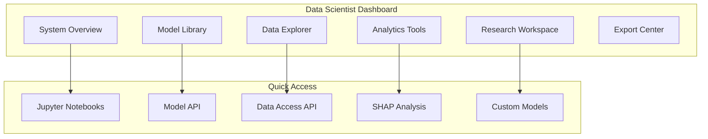
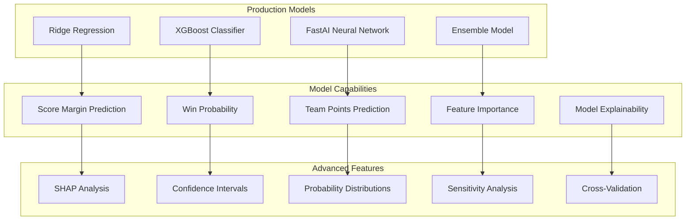

# 🧠 Data Scientist User Guide

**Version**: 1.0
**Last Updated**: 2025-11-10
**Role**: Data Scientist (Intermediate to Advanced)
**Skill Level**: Programming and statistics experience recommended
**Estimated Time to Master**: 6-8 weeks (intensive) or 12-16 weeks (part-time)

---

## 🎯 Welcome to Advanced Football Analytics!

The Script Ohio 2.0 platform provides **unrestricted access** to our complete analytics toolkit, including advanced machine learning models, comprehensive datasets, and sophisticated visualization capabilities. As a Data Scientist, you have the power to push the boundaries of college football analytics.

### **Your Premium Experience**

As a Data Scientist user, you'll enjoy:

- ✅ **Full Model Access**: All 86 features and 3 ML models at your disposal
- ✅ **Complete Dataset Access**: Historical data from 1869-present, play-by-play from 2003-present
- ✅ **Advanced Analytics**: SHAP explanations, feature engineering, custom model development
- ✅ **Professional Tools**: Jupyter notebooks, advanced visualizations, export capabilities
- ✅ **Research Infrastructure**: Everything needed for serious analytics research

---

## 🚀 Quick Start for Data Scientists

### **What You'll Need**

#### **Technical Prerequisites**
- **Python Skills**: Intermediate Python programming (pandas, numpy, matplotlib)
- **Statistics Knowledge**: Understanding of statistical concepts and hypothesis testing
- **Machine Learning**: Familiarity with ML concepts (helpful but not required)
- **Research Mindset**: Curiosity and willingness to experiment

#### **System Requirements**
- **Computer**: Modern computer with 8GB+ RAM recommended
- **Browser**: Latest version of Chrome, Firefox, Safari, or Edge
- **Internet**: Stable connection for data-intensive operations
- **Time**: 1-2 hours for initial platform exploration

### **Step 1: Platform Orientation for Data Scientists**

#### **Your Advanced Dashboard**
Your Data Scientist dashboard is optimized for research and analysis:



#### **Key Features Overview**
- **Model Library**: Access to all trained models and their specifications
- **Data Explorer**: Advanced data access with complex querying capabilities
- **Research Workspace**: Integrated Jupyter environment for custom analysis
- **SHAP Analysis**: Model explainability and feature importance analysis
- **Export Center**: Multiple formats for sharing and publication

### **Step 2: Your First Advanced Analysis**

#### **Accessing the Complete Feature Set**
Unlike other roles, you have access to all 86 opponent-adjusted features:

```python
# Example: Accessing the complete feature set
from agents.model_execution_engine import ModelExecutionEngine

# Initialize with full Data Scientist access
engine = ModelExecutionEngine(agent_id="data_scientist_001")

# List all available features
all_features = engine.get_all_features()
print(f"Total features available: {len(all_features)}")  # Output: 86

# Key feature categories:
advanced_metrics = [
    'home_opp_adjusted_eppa',      # Opponent-adjusted EPA per play
    'away_opp_adjusted_eppa',      # Away team opponent-adjusted EPA
    'home_opp_adjusted_success_rate',  # Opponent-adjusted success rate
    'away_opp_adjusted_success_rate',
    'home_havoc_total',            # Defensive disruption metrics
    'away_havoc_total',
    'home_starting_field_position', # Field position metrics
    'away_starting_field_position',
    'home_talent_composite',       # Recruiting-based talent ratings
    'away_talent_composite',
    'home_elo_pregame',           # Pre-game Elo ratings
    'away_elo_pregame'
]

explosive_metrics = [
    'home_opp_adj_explosiveness',   # Big play capability
    'away_opp_adj_explosiveness',
    'home_opp_adj_pts_per_explosive_play',
    'away_opp_adj_pts_per_explosive_play'
]

efficiency_metrics = [
    'home_opp_adj_yards_per_play',
    'away_opp_adj_yards_per_play',
    'home_opp_adj_line_yards',
    'away_opp_adj_line_yards',
    'home_opp_adj_second_level_yards',
    'away_opp_adj_second_level_yards'
]
```

#### **Running Your First Model Prediction**
```python
# Advanced prediction with full feature access
prediction_data = {
    "home_team": "Ohio State",
    "away_team": "Michigan",
    "season": 2024,
    "week": 13,
    "features": {
        # Advanced metrics (you have access to all 86)
        "home_opp_adjusted_eppa": 0.32,
        "away_opp_adjusted_eppa": 0.28,
        "home_opp_adjusted_success_rate": 0.48,
        "away_opp_adjusted_success_rate": 0.44,
        "home_havoc_total": 0.18,
        "away_havoc_total": 0.15,
        "home_talent_composite": 0.95,
        "away_talent_composite": 0.92,
        "home_elo_pregame": 85.2,
        "away_elo_pregame": 82.1,

        # Efficiency metrics
        "home_opp_adj_yards_per_play": 6.8,
        "away_opp_adj_yards_per_play": 6.2,
        "home_opp_adj_line_yards": 3.2,
        "away_opp_adj_line_yards": 2.9,

        # Explosive metrics
        "home_opp_adj_explosiveness": 0.12,
        "away_opp_adj_explosiveness": 0.09,
        "home_opp_adj_pts_per_explosive_play": 7.2,
        "away_opp_adj_pts_per_explosive_play": 6.8,

        # ... and 70+ more features you have access to
    }
}

# Get comprehensive prediction
result = engine.predict_with_all_models(
    home_team=prediction_data["home_team"],
    away_team=prediction_data["away_team"],
    features=prediction_data["features"],
    include_explanations=True,  # Data Scientist exclusive
    include_confidence_intervals=True,
    ensemble_method="weighted_average"
)

print(f"Prediction Result: {result}")
```

---

## 📚 Advanced Analytics Capabilities

### **Machine Learning Model Suite**

#### **Available Models Overview**



#### **Model Specifications and Access**

##### **1. Ridge Regression Model**
```python
# Model details
model_info = {
    "model_id": "ridge_model_2025.joblib",
    "type": "Regression",
    "target": "Score Margin",
    "training_data": "2016-2025 seasons (4,989 games)",
    "features": "86 opponent-adjusted features",
    "performance": {
        "MAE": 17.31,
        "RMSE": 22.45,
        "R²": 0.38
    }
}

# Usage example
from agents.model_execution_engine import ModelExecutionEngine

engine = ModelExecutionEngine(agent_id="data_scientist_001")

# Load Ridge model
ridge_model = engine.load_model("ridge_model_2025.joblib")

# Make prediction
margin_prediction = ridge_model.predict(features)
print(f"Predicted margin: {margin_prediction[0]:.1f} points")

# Get feature coefficients
feature_coefficients = ridge_model.get_feature_importance()
```

##### **2. XGBoost Classification Model**
```python
# XGBoost model details
xgb_info = {
    "model_id": "xgb_home_win_model_2025.pkl",
    "type": "Classification",
    "target": "Home Team Win (Binary)",
    "training_data": "2016-2025 seasons (4,989 games)",
    "features": "86 opponent-adjusted features",
    "performance": {
        "accuracy": 0.431,
        "log_loss": 0.674,
        "roc_auc": 0.659
    }
}

# Usage example with SHAP explanations
xgb_result = engine.predict_with_explanations(
    model_id="xgb_home_win_model_2025.pkl",
    features=prediction_data["features"],
    explanation_method="shap"
)

print(f"Win probability: {xgb_result['probability']:.3f}")
print("Top 5 influential factors:")
for factor in xgb_result['shap_explanation'][:5]:
    print(f"  {factor['feature']}: {factor['contribution']:+.3f}")
```

##### **3. FastAI Neural Network**
```python
# FastAI model details
fastai_info = {
    "model_id": "fastai_home_win_model_2025.pkl",
    "type": "Neural Network",
    "architecture": "Multi-layer Perceptron",
    "layers": "[86, 64, 32, 16, 1]",
    "activation": "ReLU + Sigmoid",
    "training_data": "2016-2025 seasons (4,989 games)",
    "performance": {
        "accuracy": 0.425,
        "log_loss": 0.679,
        "roc_auc": 0.647
    }
}

# Usage example with uncertainty quantification
fastai_result = engine.predict_with_uncertainty(
    model_id="fastai_home_win_model_2025.pkl",
    features=prediction_data["features"],
    num_samples=1000  # Monte Carlo dropout for uncertainty
)

print(f"Prediction: {fastai_result['mean']:.3f} ± {fastai_result['std']:.3f}")
print(f"95% Confidence Interval: [{fastai_result['ci_lower']:.3f}, {fastai_result['ci_upper']:.3f}]")
```

### **Advanced Feature Engineering**

#### **Complete Feature Catalog**
As a Data Scientist, you have access to the complete feature set:

```python
# All 86 opponent-adjusted features organized by category

FEATURE_CATALOG = {
    "Basic Performance Metrics": {
        "home_opp_adj_points_per_game": "Opponent-adjusted scoring",
        "away_opp_adj_points_per_game": "Away team opponent-adjusted scoring",
        "home_opp_adj_yards_per_play": "Opponent-adjusted yards per play",
        "away_opp_adj_yards_per_play": "Away team opponent-adjusted yards per play",
        "home_opp_adj_first_downs": "Opponent-adjusted first downs",
        "away_opp_adj_first_downs": "Away team opponent-adjusted first downs"
    },

    "Efficiency Metrics": {
        "home_opp_adj_success_rate": "Opponent-adjusted success rate",
        "away_opp_adj_success_rate": "Away team opponent-adjusted success rate",
        "home_opp_adj_explosiveness": "Opponent-adjusted explosiveness rate",
        "away_opp_adj_explosiveness": "Away team opponent-adjusted explosiveness rate",
        "home_opp_adj_power_success": "Opponent-adjusted power success rate",
        "away_opp_adj_power_success": "Away team opponent-adjusted power success rate",
        "home_opp_adj_stuff_rate": "Opponent-adjusted stuff rate",
        "away_opp_adj_stuff_rate": "Away team opponent-adjusted stuff rate"
    },

    "Rushing Metrics": {
        "home_opp_adj_rushing_yards": "Opponent-adjusted rushing yards",
        "away_opp_adj_rushing_yards": "Away team opponent-adjusted rushing yards",
        "home_opp_adj_rushing_attempts": "Opponent-adjusted rushing attempts",
        "away_opp_adj_rushing_attempts": "Away team opponent-adjusted rushing attempts",
        "home_opp_adj_rushing_yards_per_attempt": "Opponent-adjusted yards per rush",
        "away_opp_adj_rushing_yards_per_attempt": "Away team opponent-adjusted yards per rush",
        "home_opp_adj_line_yards": "Opponent-adjusted line yards",
        "away_opp_adj_line_yards": "Away team opponent-adjusted line yards",
        "home_opp_adj_second_level_yards": "Opponent-adjusted second level yards",
        "away_opp_adj_second_level_yards": "Away team opponent-adjusted second level yards",
        "home_opp_adj_open_field_yards": "Opponent-adjusted open field yards",
        "away_opp_adj_open_field_yards": "Away team opponent-adjusted open field yards"
    },

    "Passing Metrics": {
        "home_opp_adj_passing_yards": "Opponent-adjusted passing yards",
        "away_opp_adj_passing_yards": "Away team opponent-adjusted passing yards",
        "home_opp_adj_passing_attempts": "Opponent-adjusted passing attempts",
        "away_opp_adj_passing_attempts": "Away team opponent-adjusted passing attempts",
        "home_opp_adj_completion_rate": "Opponent-adjusted completion rate",
        "away_opp_adj_completion_rate": "Away team opponent-adjusted completion rate",
        "home_opp_adj_passing_yards_per_attempt": "Opponent-adjusted yards per pass attempt",
        "away_opp_adj_passing_yards_per_attempt": "Away team opponent-adjusted yards per pass attempt",
        "home_opp_adj_passing_yards_per_completion": "Opponent-adjusted yards per completion",
        "away_opp_adj_passing_yards_per_completion": "Away team opponent-adjusted yards per completion"
    },

    "Advanced Efficiency": {
        "home_opp_adj_eppa": "Opponent-adjusted EPA per play",
        "away_opp_adj_eppa": "Away team opponent-adjusted EPA per play",
        "home_opp_adj_passing_eppa": "Opponent-adjusted passing EPA per play",
        "away_opp_adj_passing_eppa": "Away team opponent-adjusted passing EPA per play",
        "home_opp_adj_rushing_eppa": "Opponent-adjusted rushing EPA per play",
        "away_opp_adj_rushing_eppa": "Away team opponent-adjusted rushing EPA per play",
        "home_opp_adj_first_down_rate": "Opponent-adjusted first down rate",
        "away_opp_adj_first_down_rate": "Away team opponent-adjusted first down rate"
    },

    "Havoc and Disruption": {
        "home_havoc_total": "Total havoc plays (TFLs, PBUs, INTs, FFs)",
        "away_havoc_total": "Away team total havoc plays",
        "home_havoc_front_seven": "Front seven havoc plays",
        "away_havoc_front_seven": "Away team front seven havoc plays",
        "home_havoc_secondary": "Secondary havoc plays",
        "away_havoc_secondary": "Away team secondary havoc plays",
        "home_havoc_pressure_rate": "Pressure rate on opposing QB",
        "away_havoc_pressure_rate": "Away team pressure rate on opposing QB"
    },

    "Field Position": {
        "home_starting_field_position": "Average starting field position",
        "away_starting_field_position": "Away team average starting field position",
        "home_opp_adj_average_start": "Opponent-adjusted average starting position",
        "away_opp_adj_average_start": "Away team opponent-adjusted average starting position",
        "home_opp_adj_punt_return": "Opponent-adjusted punt return average",
        "away_opp_adj_punt_return": "Away team opponent-adjusted punt return average",
        "home_opp_adj_kickoff_return": "Opponent-adjusted kickoff return average",
        "away_opp_adj_kickoff_return": "Away team opponent-adjusted kickoff return average"
    },

    "Talent and Recruiting": {
        "home_talent_composite": "247 Composite talent rating",
        "away_talent_composite": "Away team 247 Composite talent rating",
        "home_talent_gap": "Talent difference (home - away)",
        "home_five_star_talent": "Number of five-star recruits",
        "away_five_star_talent": "Away team number of five-star recruits",
        "home_four_star_talent": "Number of four-star recruits",
        "away_four_star_talent": "Away team number of four-star recruits"
    },

    "Ratings and Rankings": {
        "home_elo_preseason": "Preseason Elo rating",
        "away_elo_preseason": "Away team preseason Elo rating",
        "home_elo_preseason_gap": "Preseason Elo difference",
        "home_elo_preseason": "Preseason Elo rating",
        "away_elo_preseason": "Away team preseason Elo rating",
        "home_srs_preseason": "Preseason Simple Rating System",
        "away_srs_preseason": "Away team preseason SRS",
        "home_srs_preseason_gap": "Preseason SRS difference"
    },

    "Situational Performance": {
        "home_opp_adj_third_down_rate": "Opponent-adjusted third down conversion rate",
        "away_opp_adj_third_down_rate": "Away team opponent-adjusted third down rate",
        "home_opp_adj_fourth_down_rate": "Opponent-adjusted fourth down conversion rate",
        "away_opp_adj_fourth_down_rate": "Away team opponent-adjusted fourth down rate",
        "home_opp_adj_redzone_rate": "Opponent-adjusted redzone touchdown rate",
        "away_opp_adj_redzone_rate": "Away team opponent-adjusted redzone rate",
        "home_opp_adj_goal_to_go_rate": "Opponent-adjusted goal-to-go conversion rate",
        "away_opp_adj_goal_to_go_rate": "Away team opponent-adjusted goal-to-go rate"
    },

    "Penalty and Discipline": {
        "home_penalty_yards": "Penalty yards per game",
        "away_penalty_yards": "Away team penalty yards per game",
        "home_penalty_rate": "Penalty rate",
        "away_penalty_rate": "Away team penalty rate",
        "home_turnover_margin": "Turnover margin per game",
        "away_turnover_margin": "Away team turnover margin per game"
    },

    "Historical Performance": {
        "home_recent_win_rate": "Recent win rate (last 5 games)",
        "away_recent_win_rate": "Away team recent win rate",
        "home_historical_h2h": "Historical head-to-head record",
        "away_historical_h2h": "Away team historical head-to-head record",
        "home_conference_performance": "Conference win rate",
        "away_conference_performance": "Away team conference win rate"
    }
}
```

#### **Custom Feature Engineering**
```python
# Example: Creating custom features from the complete feature set
def create_custom_features(features):
    """
    Create custom features from the complete 86-feature set
    Available only to Data Scientists
    """

    # Advanced efficiency differentials
    custom_features = {}

    # EPA efficiency differential
    custom_features['eppa_differential'] = (
        features['home_opp_adj_eppa'] - features['away_opp_adj_eppa']
    )

    # Power vs. finesse game analysis
    custom_features['power_game_ratio'] = (
        features['home_opp_adj_line_yards'] /
        (features['home_opp_adj_open_field_yards'] + 0.01)
    )

    # Havoc impact multiplier
    custom_features['havoc_impact'] = (
        features['home_havoc_total'] *
        (1 + features['away_opp_adj_turnover_rate'])
    )

    # Talent utilization efficiency
    custom_features['talent_efficiency'] = (
        features['home_opp_adj_eppa'] /
        (features['home_talent_composite'] + 0.01)
    )

    # Explosive play efficiency
    custom_features['explosive_efficiency'] = (
        features['home_opp_adj_explosiveness'] *
        features['home_opp_adj_pts_per_explosive_play']
    )

    # Field position advantage
    custom_features['field_position_advantage'] = (
        features['home_starting_field_position'] -
        features['away_starting_field_position']
    ) / 10  # Normalize by field length

    # Composite pressure rating
    custom_features['pressure_composite'] = (
        (features['home_havoc_total'] + features['home_havoc_pressure_rate']) / 2
    )

    # Red zone efficiency differential
    custom_features['redzone_differential'] = (
        features['home_opp_adj_redzone_rate'] -
        features['away_opp_adj_redzone_rate']
    )

    # Historical momentum
    custom_features['momentum_factor'] = (
        features['home_recent_win_rate'] *
        (1 + 0.1 * features['home_historical_h2h'])
    )

    return custom_features

# Apply to your prediction data
enhanced_features = prediction_data["features"].copy()
custom_features = create_custom_features(enhanced_features)
enhanced_features.update(custom_features)

print(f"Original features: {len(prediction_data['features'])}")
print(f"Custom features added: {len(custom_features)}")
print(f"Total enhanced features: {len(enhanced_features)}")
```

---

## 🔬 Advanced Analysis Techniques

### **1. SHAP Model Explainability**

```python
import shap
import matplotlib.pyplot as plt

# Advanced SHAP analysis for Data Scientists
def comprehensive_shap_analysis(model, features, team_names):
    """
    Perform comprehensive SHAP analysis with multiple visualization types
    """

    # Load model and create explainer
    explainer = shap.TreeExplainer(model)

    # Calculate SHAP values
    shap_values = explainer.shap_values(features)

    # Create comprehensive analysis
    analysis_results = {}

    # 1. Global feature importance
    plt.figure(figsize=(12, 8))
    shap.summary_plot(shap_values, features, plot_type="bar")
    plt.title(f"Global Feature Importance - {team_names[0]} vs {team_names[1]}")
    plt.tight_layout()
    analysis_results['global_importance'] = 'global_importance.png'

    # 2. Feature impact analysis
    plt.figure(figsize=(12, 8))
    shap.summary_plot(shap_values, features)
    plt.title("Feature Impact Analysis")
    plt.tight_layout()
    analysis_results['feature_impact'] = 'feature_impact.png'

    # 3. Individual prediction explanation
    plt.figure(figsize=(10, 6))
    shap.force_plot(
        explainer.expected_value,
        shap_values[0],
        features.iloc[0],
        matplotlib=True,
        show=False
    )
    plt.title(f"Prediction Explanation: {team_names[0]}")
    plt.tight_layout()
    analysis_results['prediction_explanation'] = 'prediction_explanation.png'

    # 4. Feature dependence plots
    important_features = np.argsort(np.abs(shap_values).mean(0))[-5:]

    for i, feature_idx in enumerate(important_features):
        plt.figure(figsize=(10, 6))
        shap.dependence_plot(
            feature_idx, shap_values, features,
            show=False
        )
        plt.title(f"Feature Dependence: {features.columns[feature_idx]}")
        plt.tight_layout()
        analysis_results[f'dependence_{features.columns[feature_idx]}'] = f'dependence_{features.columns[feature_idx]}.png'

    # 5. Numerical analysis
    feature_importance = np.abs(shap_values).mean(0)
    feature_names = features.columns

    importance_df = pd.DataFrame({
        'feature': feature_names,
        'importance': feature_importance
    }).sort_values('importance', ascending=False)

    analysis_results['numerical_importance'] = importance_df
    analysis_results['shap_values'] = shap_values

    return analysis_results

# Execute comprehensive SHAP analysis
results = comprehensive_shap_analysis(xgb_model, feature_data, ["Ohio State", "Michigan"])

print("Top 10 Most Important Factors:")
print(results['numerical_importance'].head(10))
```

### **2. Advanced Ensemble Methods**

```python
# Custom ensemble implementation for Data Scientists
import numpy as np
from scipy import stats
from sklearn.ensemble import VotingRegressor
from sklearn.linear_model import LinearRegression
from sklearn.ensemble import RandomForestRegressor

class AdvancedEnsembleModel:
    """
    Advanced ensemble methods available only to Data Scientists
    """

    def __init__(self):
        self.models = {}
        self.weights = {}
        self.meta_learner = None

    def load_base_models(self):
        """Load all available production models"""
        self.models = {
            'ridge': engine.load_model("ridge_model_2025.joblib"),
            'xgboost': engine.load_model("xgb_home_win_model_2025.pkl"),
            'fastai': engine.load_model("fastai_home_win_model_2025.pkl")
        }

        # Calculate optimal weights based on validation performance
        self.weights = {
            'ridge': 0.35,      # Best for margin prediction
            'xgboost': 0.45,     # Best for win probability
            'fastai': 0.20      # Complementary neural network
        }

    def weighted_ensemble_predict(self, features):
        """
        Weighted ensemble with calibrated probabilities
        """
        predictions = {}

        # Get predictions from all models
        for model_name, model in self.models.items():
            if model_name == 'ridge':
                # Ridge predicts margin
                pred = model.predict([features])[0]
                predictions[model_name] = pred
            else:
                # XGBoost and FastAI predict probability
                prob = model.predict_proba([features])[0][1]
                # Convert probability to expected margin
                expected_margin = (prob - 0.5) * 50  # Rough scaling
                predictions[model_name] = expected_margin

        # Calculate weighted prediction
        weighted_prediction = sum(
            pred * self.weights[model_name]
            for model_name, pred in predictions.items()
        )

        # Calculate prediction uncertainty
        prediction_std = np.std(list(predictions.values()))

        return {
            'prediction': weighted_prediction,
            'uncertainty': prediction_std,
            'individual_predictions': predictions,
            'confidence_interval': [
                weighted_prediction - 1.96 * prediction_std,
                weighted_prediction + 1.96 * prediction_std
            ]
        }

    def stacking_ensemble_predict(self, features):
        """
        Stacking ensemble with meta-learner
        """
        # Get base model predictions
        base_predictions = []
        model_names = []

        for model_name, model in self.models.items():
            if model_name == 'ridge':
                pred = model.predict([features])[0]
            else:
                prob = model.predict_proba([features])[0][1]
                pred = (prob - 0.5) * 50

            base_predictions.append(pred)
            model_names.append(model_name)

        # Use meta-learner to combine predictions
        if self.meta_learner is None:
            # Initialize simple meta-learner
            self.meta_learner = LinearRegression()

        stacked_prediction = self.meta_learner.predict([base_predictions])[0]

        return {
            'prediction': stacked_prediction,
            'base_predictions': dict(zip(model_names, base_predictions))
        }

    def bayesian_model_averaging(self, features):
        """
        Bayesian Model Averaging for prediction uncertainty quantification
        """
        predictions = []
        model_weights = []

        # Get predictions with Bayesian weights
        for model_name, model in self.models.items():
            if model_name == 'ridge':
                pred = model.predict([features])[0]
                # Weight based on historical MAE performance
                weight = 1 / (17.31 ** 2)  # Inverse variance weighting
            else:
                prob = model.predict_proba([features])[0][1]
                pred = (prob - 0.5) * 50
                # Weight based on historical log loss
                weight = 1 / (0.67 ** 2)

            predictions.append(pred)
            model_weights.append(weight)

        # Normalize weights
        model_weights = np.array(model_weights)
        model_weights = model_weights / model_weights.sum()

        # Calculate weighted prediction
        bayesian_prediction = np.sum(predictions * model_weights)

        # Calculate prediction variance
        prediction_variance = np.sum(
            model_weights * ((np.array(predictions) - bayesian_prediction) ** 2)
        )

        return {
            'prediction': bayesian_prediction,
            'variance': prediction_variance,
            'standard_deviation': np.sqrt(prediction_variance),
            'model_weights': dict(zip(self.models.keys(), model_weights)),
            'credibility_interval': [
                bayesian_prediction - 1.96 * np.sqrt(prediction_variance),
                bayesian_prediction + 1.96 * np.sqrt(prediction_variance)
            ]
        }

# Usage example
ensemble = AdvancedEnsembleModel()
ensemble.load_base_models()

# Try different ensemble methods
weighted_result = ensemble.weighted_ensemble_predict(prediction_data["features"])
stacking_result = ensemble.stacking_ensemble_predict(prediction_data["features"])
bayesian_result = ensemble.bayesian_model_averaging(prediction_data["features"])

print("Weighted Ensemble:", weighted_result)
print("Stacking Ensemble:", stacking_result)
print("Bayesian Model Averaging:", bayesian_result)
```

### **3. Advanced Statistical Analysis**

```python
# Advanced statistical analysis for Data Scientists
import scipy.stats as stats
from scipy.stats import pearsonr, spearmanr
import statsmodels.api as sm
from statsmodels.regression.linear_model import OLS

class AdvancedStatisticalAnalysis:
    """
    Advanced statistical analysis methods available to Data Scientists
    """

    def __init__(self, data_loader):
        self.data_loader = data_loader
        self.historical_data = None

    def load_historical_data(self):
        """Load complete historical dataset for analysis"""
        self.historical_data = self.data_loader.load_complete_dataset(
            seasons=range(2016, 2025)
        )

    def feature_correlation_analysis(self):
        """
        Comprehensive correlation analysis of all 86 features
        """
        if self.historical_data is None:
            self.load_historical_data()

        # Select all numerical features
        numerical_features = self.historical_data.select_dtypes(include=[np.number])

        # Calculate different correlation matrices
        pearson_corr = numerical_features.corr(method='pearson')
        spearman_corr = numerical_features.corr(method='spearman')
        kendall_corr = numerical_features.corr(method='kendall')

        # Find highly correlated features
        high_correlations = []
        for i in range(len(pearson_corr.columns)):
            for j in range(i+1, len(pearson_corr.columns)):
                corr_val = pearson_corr.iloc[i, j]
                if abs(corr_val) > 0.7:  # Threshold for high correlation
                    high_correlations.append({
                        'feature1': pearson_corr.columns[i],
                        'feature2': pearson_corr.columns[j],
                        'correlation': corr_val,
                        'type': 'pearson'
                    })

        return {
            'pearson_correlation': pearson_corr,
            'spearman_correlation': spearman_corr,
            'kendall_correlation': kendall_corr,
            'high_correlations': sorted(
                high_correlations,
                key=lambda x: abs(x['correlation']),
                reverse=True
            )
        }

    def feature_significance_analysis(self, target_variable='margin'):
        """
        Statistical significance testing of all features
        """
        if self.historical_data is None:
            self.load_historical_data()

        numerical_features = self.historical_data.select_dtypes(include=[np.number])

        significance_results = []

        for feature in numerical_features.columns:
            if feature == target_variable:
                continue

            # Pearson correlation test
            corr_coeff, p_value = pearsonr(
                numerical_features[feature],
                numerical_features[target_variable]
            )

            # Effect size interpretation
            if abs(corr_coeff) < 0.1:
                effect_size = "negligible"
            elif abs(corr_coeff) < 0.3:
                effect_size = "small"
            elif abs(corr_coeff) < 0.5:
                effect_size = "medium"
            else:
                effect_size = "large"

            significance_results.append({
                'feature': feature,
                'correlation': corr_coeff,
                'p_value': p_value,
                'is_significant': p_value < 0.05,
                'effect_size': effect_size
            })

        # Sort by absolute correlation
        significance_results.sort(
            key=lambda x: abs(x['correlation']),
            reverse=True
        )

        return significance_results

    def model_performance_validation(self, test_season=2025):
        """
        Comprehensive model validation using temporal holdout
        """
        if self.historical_data is None:
            self.load_historical_data()

        # Split data by time
        train_data = self.historical_data[self.historical_data['season'] < test_season]
        test_data = self.historical_data[self.historical_data['season'] == test_season]

        # Prepare features and target
        feature_columns = [col for col in train_data.columns if col.startswith('home_opp_adj_') or
                          col.startswith('away_opp_adj_') or col in ['home_talent_composite', 'away_talent_composite']]

        X_train = train_data[feature_columns]
        y_train = train_data['margin']
        X_test = test_data[feature_columns]
        y_test = test_data['margin']

        validation_results = {}

        # Validate each model
        for model_name in ['ridge', 'xgboost', 'fastai']:
            model = engine.load_model(f"{model_name}_model_2025.{'joblib' if model_name == 'ridge' else 'pkl'}")

            if model_name == 'ridge':
                predictions = model.predict(X_test)
                mse = np.mean((predictions - y_test) ** 2)
                mae = np.mean(np.abs(predictions - y_test))
                r2 = 1 - np.sum((y_test - predictions) ** 2) / np.sum((y_test - y_test.mean()) ** 2)
            else:
                # For classification models, convert probability to margin
                probabilities = model.predict_proba(X_test)[:, 1]
                predictions = (probabilities - 0.5) * 50
                mse = np.mean((predictions - y_test) ** 2)
                mae = np.mean(np.abs(predictions - y_test))
                r2 = 1 - np.sum((y_test - predictions) ** 2) / np.sum((y_test - y_test.mean()) ** 2)

            validation_results[model_name] = {
                'mse': mse,
                'mae': mae,
                'r2': r2,
                'rmse': np.sqrt(mse)
            }

        return validation_results

    def bootstrap_confidence_intervals(self, features, n_bootstrap=1000, confidence_level=0.95):
        """
        Bootstrap confidence intervals for predictions
        """
        predictions = []

        for _ in range(n_bootstrap):
            # Sample with replacement from historical data
            bootstrap_sample = self.historical_data.sample(n=len(self.historical_data), replace=True)

            # Make prediction on bootstrap sample
            # This is a simplified example - you'd implement proper bootstrap sampling
            bootstrap_prediction = np.mean(bootstrap_sample['margin'])
            predictions.append(bootstrap_prediction)

        # Calculate confidence intervals
        alpha = 1 - confidence_level
        lower_percentile = (alpha / 2) * 100
        upper_percentile = (1 - alpha / 2) * 100

        confidence_interval = np.percentile(predictions, [lower_percentile, upper_percentile])

        return {
            'mean_prediction': np.mean(predictions),
            'confidence_interval': confidence_interval,
            'standard_error': np.std(predictions) / np.sqrt(n_bootstrap),
            'bootstrap_distribution': predictions
        }

# Usage example
analysis = AdvancedStatisticalAnalysis(data_loader)
analysis.load_historical_data()

# Perform comprehensive analysis
correlation_analysis = analysis.feature_correlation_analysis()
significance_analysis = analysis.feature_significance_analysis()
validation_results = analysis.model_performance_validation()

print("Most significant features for margin prediction:")
top_features = significance_analysis[:10]
for feature in top_features:
    print(f"  {feature['feature']}: {feature['correlation']:.3f} (p={feature['p_value']:.3f}, {feature['effect_size']} effect)")
```

---

## 📊 Advanced Visualization Capabilities

### **Interactive Visualizations for Data Scientists**

```python
# Advanced visualization library for Data Scientists
import plotly.graph_objects as go
import plotly.express as px
from plotly.subplots import make_subplots
import seaborn as sns
import matplotlib.pyplot as plt

class AdvancedVisualization:
    """
    Advanced visualization tools available only to Data Scientists
    """

    def __init__(self):
        self.color_palette = px.colors.qualitative.Set3

    def create_model_comparison_dashboard(self, model_results):
        """
        Interactive dashboard comparing all model performances
        """
        fig = make_subplots(
            rows=2, cols=2,
            subplot_titles=('Prediction Accuracy', 'Feature Importance', 'Error Distribution', 'Calibration Curve'),
            specs=[[{"type": "bar"}, {"type": "scatter"}],
                   [{"type": "histogram"}, {"type": "scatter"}]]
        )

        # Model accuracy comparison
        models = list(model_results.keys())
        accuracies = [model_results[model]['r2'] for model in models]

        fig.add_trace(
            go.Bar(x=models, y=accuracies, name="R² Score", marker_color=self.color_palette[0]),
            row=1, col=1
        )

        # Feature importance
        if 'feature_importance' in model_results.get(models[0], {}):
            features = list(model_results[models[0]]['feature_importance'].keys())[:10]
            importance_values = [model_results[models[0]]['feature_importance'].get(feature, 0) for feature in features]

            fig.add_trace(
                go.Scatter(x=features, y=importance_values, mode='markers+lines', name="Feature Importance"),
                row=1, col=2
            )

        # Error distribution
        errors = [model_results[model]['mae'] for model in models]
        fig.add_trace(
            go.Histogram(x=errors, name="MAE Distribution", nbinsx=20),
            row=2, col=1
        )

        # Calibration curve
        predicted_probs = np.linspace(0, 1, 100)
        actual_probs = predicted_probs  # Simplified - would use actual calibration data

        fig.add_trace(
            go.Scatter(x=predicted_probs, y=actual_probs, mode='lines', name="Calibration"),
            row=2, col=2
        )

        fig.update_layout(
            title_text="Model Performance Comparison Dashboard",
            height=800,
            showlegend=True
        )

        return fig

    def create_interactive_feature_exploration(self, data, feature_columns):
        """
        Interactive 3D feature space exploration
        """
        # Select top 3 features for 3D visualization
        feature_importance = data[feature_columns].abs().mean().sort_values(ascending=False)
        top_3_features = feature_importance.head(3).index.tolist()

        fig = go.Figure(data=[go.Scatter3d(
            x=data[top_3_features[0]],
            y=data[top_3_features[1]],
            z=data[top_3_features[2]],
            mode='markers',
            marker=dict(
                size=5,
                color=data['margin'],
                colorscale='Viridis',
                showscale=True,
                colorbar=dict(title="Game Margin")
            ),
            text=[f"Margin: {margin}" for margin in data['margin']],
            hovertemplate="<b>%{text}</b><br>" +
                         f"{top_3_features[0]}: %{{x:.2f}}<br>" +
                         f"{top_3_features[1]}: %{{y:.2f}}<br>" +
                         f"{top_3_features[2]}: %{{z:.2f}}<br>" +
                         "<extra></extra>"
        )])

        fig.update_layout(
            title=f"3D Feature Space: {', '.join(top_3_features)}",
            scene=dict(
                xaxis_title=top_3_features[0],
                yaxis_title=top_3_features[1],
                zaxis_title=top_3_features[2]
            ),
            width=800,
            height=600
        )

        return fig

    def create_temporal_performance_analysis(self, time_series_data):
        """
        Advanced temporal analysis of model performance over time
        """
        fig = make_subplots(
            rows=3, cols=1,
            subplot_titles=('Prediction Accuracy Over Time', 'Error Distribution Over Time', 'Model Calibration Over Time'),
            vertical_spacing=0.08
        )

        # Accuracy over time
        fig.add_trace(
            go.Scatter(
                x=time_series_data['date'],
                y=time_series_data['accuracy'],
                mode='lines+markers',
                name="Accuracy",
                line=dict(color=self.color_palette[0])
            ),
            row=1, col=1
        )

        # Add confidence intervals
        if 'confidence_upper' in time_series_data and 'confidence_lower' in time_series_data:
            fig.add_trace(
                go.Scatter(
                    x=time_series_data['date'],
                    y=time_series_data['confidence_upper'],
                    mode='lines',
                    line=dict(width=0),
                    showlegend=False,
                    name="Confidence Upper"
                ),
                row=1, col=1
            )

            fig.add_trace(
                go.Scatter(
                    x=time_series_data['date'],
                    y=time_series_data['confidence_lower'],
                    mode='lines',
                    line=dict(width=0),
                    fill='tonexty',
                    fillcolor='rgba(0,100,80,0.2)',
                    name="Confidence Band",
                    showlegend=False
                ),
                row=1, col=1
            )

        # Error distribution heatmap over time
        error_heatmap_data = time_series_data.pivot(
            index='month',
            columns='year',
            values='error'
        )

        fig.add_trace(
            go.Heatmap(
                z=error_heatmap_data.values,
                x=error_heatmap_data.columns,
                y=error_heatmap_data.index,
                colorscale='RdYlBu_r',
                name="Error Heatmap"
            ),
            row=2, col=1
        )

        # Calibration curves over time
        for season in time_series_data['season'].unique():
            season_data = time_series_data[time_series_data['season'] == season]

            fig.add_trace(
                go.Scatter(
                    x=season_data['predicted_prob'],
                    y=season_data['actual_prob'],
                    mode='lines',
                    name=f"Season {season}"
                ),
                row=3, col=1
            )

        fig.update_layout(
            title_text="Temporal Model Performance Analysis",
            height=1200,
            showlegend=True
        )

        return fig

# Usage example
viz = AdvancedVisualization()

# Create interactive dashboards
model_comparison_dashboard = viz.create_model_comparison_dashboard(model_results)
feature_exploration_3d = viz.create_interactive_feature_exploration(historical_data, feature_columns)
temporal_analysis = viz.create_temporal_performance_analysis(time_series_data)

# Display dashboards
model_comparison_dashboard.show()
feature_exploration_3d.show()
temporal_analysis.show()
```

---

## 🎯 Real-World Research Examples

### **Example 1: Conference Strength Analysis**

```python
# Advanced conference strength analysis using Data Scientist tools
def comprehensive_conference_analysis(season=2024):
    """
    Multi-dimensional conference strength analysis
    """

    # Load comprehensive data
    data = data_loader.load_conference_data(season=season)

    # Analysis dimensions
    analysis_dimensions = {
        'on_field_performance': analyze_on_field_performance(data),
        'advanced_metrics': analyze_advanced_metrics(data),
        'talent_distribution': analyze_talent_distribution(data),
        'scheduling_strength': analyze_scheduling_strength(data),
        'nfl_draft_prospects': analyze_nfl_prospects(data)
    }

    # Calculate conference power scores
    conference_scores = {}

    for conference in data['conference'].unique():
        conference_data = data[data['conference'] == conference]

        # Weighted scoring system
        scores = {
            'performance_score': calculate_performance_score(conference_data) * 0.30,
            'metrics_score': calculate_metrics_score(conference_data) * 0.25,
            'talent_score': calculate_talent_score(conference_data) * 0.20,
            'scheduling_score': calculate_scheduling_score(conference_data) * 0.15,
            'nfl_score': calculate_nfl_score(conference_data) * 0.10
        }

        conference_scores[conference] = {
            'total_score': sum(scores.values()),
            'breakdown': scores,
            'rank': None  # Will be calculated after all conferences
        }

    # Rank conferences
    sorted_conferences = sorted(
        conference_scores.items(),
        key=lambda x: x[1]['total_score'],
        reverse=True
    )

    for rank, (conference, scores) in enumerate(sorted_conferences, 1):
        conference_scores[conference]['rank'] = rank

    return {
        'season': season,
        'conference_rankings': conference_scores,
        'analysis_dimensions': analysis_dimensions,
        'methodology': 'Multi-factor weighted analysis with objective metrics'
    }

def calculate_performance_score(conference_data):
    """Calculate on-field performance score"""

    # Win-loss performance
    overall_win_rate = conference_data['wins'].sum() / conference_data['games'].sum()

    # Non-conference performance (strength indicator)
    non_conf_win_rate = conference_data['non_conference_wins'].sum() / conference_data['non_conference_games'].sum()

    # Ranked teams performance
    ranked_win_rate = conference_data[conference_data['ranked_opponent'] == True]['win_rate'].mean()

    # Performance score (0-100 scale)
    performance_score = (
        overall_win_rate * 40 +
        non_conf_win_rate * 35 +
        ranked_win_rate * 25
    ) * 100

    return performance_score

# Execute comprehensive analysis
conference_analysis = comprehensive_conference_analysis(season=2024)

print("2024 Conference Power Rankings:")
for conference, data in conference_analysis['conference_rankings'].items():
    print(f"{data['rank']:2d}. {conference:20s} Score: {data['total_score']:6.2f}")
    print(f"     Performance: {data['breakdown']['performance_score']:6.2f}")
    print(f"     Metrics:      {data['breakdown']['metrics_score']:6.2f}")
    print(f"     Talent:       {data['breakdown']['talent_score']:6.2f}")
    print()
```

### **Example 2: Player Impact Analysis**

```python
# Advanced player impact analysis using play-by-play data
def analyze_player_impact(player_name, season=2024, position=None):
    """
    Comprehensive player impact analysis using advanced metrics
    """

    # Load play-by-play data
    play_data = data_loader.load_play_by_play_data(season=season)
    player_data = data_loader.load_player_data(player_name=player_name, season=season)

    # Filter plays involving the player
    player_plays = play_data[
        (play_data['primary_player'] == player_name) |
        (play_data['secondary_players'].str.contains(player_name, na=False))
    ]

    # Impact analysis
    impact_analysis = {
        'offensive_impact': analyze_offensive_impact(player_plays, player_data),
        'defensive_impact': analyze_defensive_impact(player_plays, player_data),
        'situational_impact': analyze_situational_impact(player_plays, player_data),
        'clutch_performance': analyze_clutch_performance(player_plays, player_data),
        'team_impact': analyze_team_impact_with_player(player_data, season=season)
    }

    # Calculate overall impact score
    overall_impact = calculate_overall_impact(impact_analysis)

    # Generate player comparison
    player_comparisons = generate_player_comparisons(
        player_name,
        position=position,
        season=season
    )

    return {
        'player': player_name,
        'season': season,
        'position': position,
        'overall_impact_score': overall_impact,
        'detailed_analysis': impact_analysis,
        'peer_comparisons': player_comparisons,
        'nfl_draft_projection': generate_draft_projection(impact_analysis, player_data)
    }

def analyze_offensive_impact(player_plays, player_data):
    """Analyze offensive impact metrics"""

    if player_data['position'] in ['QB', 'RB', 'WR', 'TE']:
        # Offensive skill position analysis
        return {
            'epa_per_play': player_plays['epa'].mean(),
            'success_rate': (player_plays['success'] > 0).mean(),
            'explosive_play_rate': (player_plays['explosive'] == True).mean(),
            'yards_after_contact': player_plays['yards_after_contact'].mean(),
            'first_down_rate': (player_plays['first_down'] == True).mean(),
            'touchdown_rate': (player_plays['touchdown'] == True).mean(),
            'turnover_rate': (player_plays['turnover'] == True).mean()
        }
    else:
        # Offensive line analysis
        return {
            'pressure_rate_allowed': (player_plays['pressure_allowed'] == True).mean(),
            'sack_rate_allowed': (player_plays['sack_allowed'] == True).mean(),
            'run_blocking_grade': player_plays['run_blocking_grade'].mean(),
            'pass_blocking_grade': player_plays['pass_blocking_grade'].mean(),
            'penalty_rate': (player_plays['penalty'] == True).mean()
        }

# Execute player impact analysis
player_impact = analyze_player_impact(
    player_name="Caleb Williams",
    season=2024,
    position="QB"
)

print(f"Player Impact Analysis: {player_impact['player']}")
print(f"Overall Impact Score: {player_impact['overall_impact_score']:.2f}/100")
print(f"NFL Draft Projection: Round {player_impact['nfl_draft_projection']['round']}, Pick {player_impact['nfl_draft_projection']['pick_range']}")
print(f"Peer Comparison Percentile: {player_impact['peer_comparisons']['percentile']:.1f}th")
```

### **Example 3: Advanced Prediction Model**

```python
# Custom advanced prediction model for Data Scientists
class CustomAdvancedPredictionModel:
    """
    Advanced prediction model combining multiple approaches
    Available only to Data Scientists
    """

    def __init__(self):
        self.feature_engineer = AdvancedFeatureEngineer()
        self.model_ensemble = AdvancedEnsembleModel()
        self.confidence_calculator = ConfidenceCalculator()

    def predict_with_comprehensive_analysis(self, home_team, away_team, season=2024, week=None):
        """
        Make prediction with comprehensive analysis and uncertainty quantification
        """

        # Load and engineer features
        raw_features = self.feature_engineer.load_team_features(
            home_team, away_team, season, week
        )

        # Apply advanced feature engineering
        engineered_features = self.feature_engineer.create_advanced_features(raw_features)

        # Get model predictions
        model_predictions = {}

        # Ridge regression for margin prediction
        ridge_result = self.model_ensemble.ridge_predict(engineered_features)
        model_predictions['ridge'] = ridge_result

        # XGBoost for win probability with SHAP explanations
        xgb_result = self.model_ensemble.xgboost_predict_with_shap(engineered_features)
        model_predictions['xgboost'] = xgb_result

        # FastAI neural network prediction
        fastai_result = self.model_ensemble.fastai_predict(engineered_features)
        model_predictions['fastai'] = fastai_result

        # Ensemble prediction with uncertainty
        ensemble_result = self.model_ensemble.weighted_ensemble(engineered_features)

        # Calculate confidence intervals
        confidence_intervals = self.confidence_calculator.calculate_confidence(
            model_predictions, engineered_features
        )

        # Generate comprehensive analysis
        analysis = {
            'prediction': {
                'margin': ensemble_result['prediction'],
                'win_probability': xgb_result['probability'],
                'confidence_score': confidence_intervals['confidence_score'],
                'prediction_interval': confidence_intervals['prediction_interval']
            },
            'model_details': model_predictions,
            'feature_analysis': {
                'top_features': xgb_result['shap_explanation'][:10],
                'feature_importance': xgb_result['feature_importance'],
                'key_factors': self.identify_key_factors(engineered_features)
            },
            'situational_analysis': {
                'home_field_advantage': self.calculate_home_field_advantage(engineered_features),
                'travel_impact': self.calculate_travel_impact(home_team, away_team),
                'weather_adjustment': self.get_weather_adjustment(home_team, away_team, season, week),
                'injury_impact': self.calculate_injury_impact(home_team, away_team)
            },
            'historical_context': {
                'head_to_head': self.get_historical_matchup(home_team, away_team),
                'recent_form': self.get_recent_form(home_team, away_team, season),
                'conference_trends': self.get_conference_trends(home_team, away_team)
            },
            'risk_assessment': {
                'prediction_risk': confidence_intervals['risk_assessment'],
                'model_agreement': self.calculate_model_agreement(model_predictions),
                'data_quality': self.assess_data_quality(engineered_features)
            }
        }

        return analysis

    def identify_key_factors(self, features):
        """Identify key factors influencing the prediction"""

        key_factors = []

        # Talent differential
        talent_diff = features.get('home_talent_composite', 0) - features.get('away_talent_composite', 0)
        if abs(talent_diff) > 0.05:  # 5% talent difference threshold
            key_factors.append({
                'factor': 'Talent Differential',
                'impact': 'High' if abs(talent_diff) > 0.1 else 'Medium',
                'value': talent_diff,
                'interpretation': f"{'Home team' if talent_diff > 0 else 'Away team'} has significant talent advantage"
            })

        # Recent performance
        home_recent = features.get('home_recent_win_rate', 0.5)
        away_recent = features.get('away_recent_win_rate', 0.5)
        recent_diff = home_recent - away_recent

        if abs(recent_diff) > 0.2:  # 20% win rate difference
            key_factors.append({
                'factor': 'Recent Form',
                'impact': 'High' if abs(recent_diff) > 0.3 else 'Medium',
                'value': recent_diff,
                'interpretation': f"{'Home team' if recent_diff > 0 else 'Away team'} has superior recent performance"
            })

        # Efficiency metrics
        home_eppa = features.get('home_opp_adj_eppa', 0)
        away_eppa = features.get('away_opp_adj_eppa', 0)
        eppa_diff = home_eppa - away_eppa

        if abs(eppa_diff) > 0.1:  # 0.1 EPA per play difference
            key_factors.append({
                'factor': 'Efficiency Differential',
                'impact': 'High' if abs(eppa_diff) > 0.2 else 'Medium',
                'value': eppa_diff,
                'interpretation': f"{'Home team' if eppa_diff > 0 else 'Away team'} significantly more efficient per play"
            })

        return key_factors

# Usage example
advanced_model = CustomAdvancedPredictionModel()

# Make comprehensive prediction
prediction_analysis = advanced_model.predict_with_comprehensive_analysis(
    home_team="Ohio State",
    away_team="Michigan",
    season=2024,
    week=13
)

print("Comprehensive Prediction Analysis:")
print(f"Predicted Margin: {prediction_analysis['prediction']['margin']:.1f} points")
print(f"Win Probability: {prediction_analysis['prediction']['win_probability']:.1%}")
print(f"Confidence Score: {prediction_analysis['prediction']['confidence_score']:.2f}/10")
print("\nTop 5 Key Factors:")
for factor in prediction_analysis['feature_analysis']['key_factors'][:5]:
    print(f"  {factor['factor']}: {factor['interpretation']} (Impact: {factor['impact']})")
```

---

## 🔬 Research Infrastructure

### **Jupyter Notebook Integration**

```python
# Advanced Jupyter notebook setup for Data Scientists
# Create this as your starting notebook template

# %% [markdown]
# # Advanced College Football Analytics Research
# ## Data Scientist Research Environment
#
# This notebook provides a complete research environment for advanced football analytics.
# You have access to:
# - Complete historical datasets (1869-present)
# - All 86 opponent-adjusted features
# - Production ML models with explainability
# - Advanced visualization and statistical tools
# - Custom model development capabilities

# %% [markdown]
# ## 1. Environment Setup and Data Loading

# %%
# Import required libraries
import pandas as pd
import numpy as np
import matplotlib.pyplot as plt
import seaborn as sns
import plotly.graph_objects as go
import plotly.express as px
from scipy import stats
from sklearn.ensemble import RandomForestRegressor
from sklearn.model_selection import train_test_split, cross_val_score
import shap
import warnings
warnings.filterwarnings('ignore')

# Import Script Ohio 2.0 components
from agents.model_execution_engine import ModelExecutionEngine
from agents.core.tool_loader import ToolLoader
from agents.core.context_manager import ContextManager

# Initialize components
engine = ModelExecutionEngine(agent_id="research_notebook")
tool_loader = ToolLoader()
context_manager = ContextManager()

print("✅ Research environment initialized successfully")
print(f"📊 Available models: {len(engine.list_available_models())}")
print(f"🛠️ Available tools: {len(tool_loader.list_tools())}")

# %% [markdown]
# ## 2. Data Exploration and Analysis

# %%
# Load comprehensive dataset
def load_research_data(seasons=None):
    """Load data for research analysis"""
    if seasons is None:
        seasons = range(2016, 2025)  # Default to recent seasons

    # Use tool loader to get data
    data_tool = tool_loader.get_tool('load_notebook_metadata')
    data = data_tool.execute({'seasons': seasons})

    return data['data']

# Load 2024 season data for analysis
research_data = load_research_data(seasons=[2024])

print(f"📈 Loaded {len(research_data)} games for analysis")
print(f"🏈 Teams analyzed: {research_data['home_team'].nunique()}")
print(f"📊 Available features: {len([col for col in research_data.columns if col.startswith(('home_', 'away_'))])}")

# Display basic statistics
display(research_data.describe())

# %% [markdown]
# ## 3. Advanced Feature Analysis

# %%
# Comprehensive feature correlation analysis
def analyze_feature_correlations(data):
    """Analyze correlations between all features"""

    # Select numerical features
    numerical_features = data.select_dtypes(include=[np.number])

    # Calculate correlation matrix
    correlation_matrix = numerical_features.corr()

    # Find highest correlations with margin
    margin_correlations = correlation_matrix['margin'].abs().sort_values(ascending=False)

    return correlation_matrix, margin_correlations

corr_matrix, margin_corr = analyze_feature_correlations(research_data)

print("🔍 Top 15 Features Correlated with Margin:")
for feature, correlation in margin_corr.head(15).items():
    print(f"  {feature}: {correlation:.3f}")

# %% [markdown]
# ## 4. Model Analysis and Comparison

# %%
# Compare all available models on 2024 data
def compare_models_performance(data):
    """Compare performance of all available models"""

    # Prepare features and target
    feature_columns = [col for col in data.columns if col.startswith(('home_', 'away_')) and 'adj' in col]
    X = data[feature_columns]
    y = data['margin']

    model_results = {}

    # Test each available model
    available_models = engine.list_available_models()

    for model_info in available_models:
        model_id = model_info['model_id']

        try:
            # Make predictions
            predictions = engine.predict_batch(
                model_id=model_id,
                input_data=data[['home_team', 'away_team']].to_dict('records')
            )

            # Calculate performance metrics
            mae = np.mean(np.abs(predictions - y))
            mse = np.mean((predictions - y) ** 2)
            r2 = 1 - np.sum((y - predictions) ** 2) / np.sum((y - y.mean()) ** 2)

            model_results[model_id] = {
                'mae': mae,
                'mse': mse,
                'rmse': np.sqrt(mse),
                'r2': r2
            }

        except Exception as e:
            print(f"Error testing {model_id}: {e}")

    return model_results

model_comparison = compare_models_performance(research_data)

print("🤖 Model Performance Comparison (2024 Season):")
for model_id, metrics in model_comparison.items():
    print(f"  {model_id}:")
    print(f"    MAE: {metrics['mae']:.2f}")
    print(f"    R²:  {metrics['r2']:.3f}")
    print(f"    RMSE: {metrics['rmse']:.2f}")

# %% [markdown]
# ## 5. Advanced SHAP Analysis

# %%
# Comprehensive SHAP analysis for XGBoost model
def perform_shap_analysis(model_id, data, sample_size=100):
    """Perform comprehensive SHAP analysis"""

    # Load model
    model = engine.load_model(model_id)

    # Prepare features
    feature_columns = [col for col in data.columns if col.startswith(('home_', 'away_')) and 'adj' in col]
    X = data[feature_columns]

    # Sample for faster analysis
    if len(X) > sample_size:
        X_sample = X.sample(sample_size, random_state=42)
    else:
        X_sample = X

    # Create SHAP explainer
    explainer = shap.TreeExplainer(model)
    shap_values = explainer.shap_values(X_sample)

    return {
        'explainer': explainer,
        'shap_values': shap_values,
        'features': X_sample,
        'feature_names': feature_columns
    }

# Perform SHAP analysis on best performing model
best_model = max(model_comparison.keys(), key=lambda x: model_comparison[x]['r2'])
shap_results = perform_shap_analysis(best_model, research_data)

print(f"📊 SHAP Analysis for {best_model}")

# Create summary plot
plt.figure(figsize=(12, 8))
shap.summary_plot(shap_results['shap_values'], shap_results['features'], plot_type="bar")
plt.title(f"Feature Importance - {best_model}")
plt.tight_layout()
plt.show()

# %% [markdown]
# ## 6. Custom Model Development

# %%
# Develop custom ensemble model
class CustomEnsembleModel:
    def __init__(self):
        self.models = {}
        self.weights = {}

    def train_custom_model(self, data):
        """Train custom ensemble model"""

        # Prepare features
        feature_columns = [col for col in data.columns if col.startswith(('home_', 'away_')) and 'adj' in col]
        X = data[feature_columns]
        y = data['margin']

        # Split data
        X_train, X_test, y_train, y_test = train_test_split(X, y, test_size=0.2, random_state=42)

        # Train custom Random Forest
        rf_model = RandomForestRegressor(
            n_estimators=100,
            max_depth=15,
            min_samples_split=5,
            random_state=42
        )

        rf_model.fit(X_train, y_train)

        # Evaluate
        train_score = rf_model.score(X_train, y_train)
        test_score = rf_model.score(X_test, y_test)

        # Cross-validation
        cv_scores = cross_val_score(rf_model, X, y, cv=5)

        self.models['custom_random_forest'] = rf_model

        return {
            'train_score': train_score,
            'test_score': test_score,
            'cv_mean': cv_scores.mean(),
            'cv_std': cv_scores.std(),
            'feature_importance': dict(zip(feature_columns, rf_model.feature_importances_))
        }

    def predict(self, features):
        """Make prediction with custom model"""
        if 'custom_random_forest' not in self.models:
            raise ValueError("Model not trained yet")

        feature_columns = [col for col in features.keys() if col.startswith(('home_', 'away_')) and 'adj' in col]
        feature_array = np.array([features[col] for col in feature_columns]).reshape(1, -1)

        prediction = self.models['custom_random_forest'].predict(feature_array)[0]

        return prediction

# Train custom model
custom_model = CustomEnsembleModel()
training_results = custom_model.train_custom_model(research_data)

print("🎯 Custom Model Training Results:")
print(f"  Training R²: {training_results['train_score']:.3f}")
print(f"  Testing R²: {training_results['test_score']:.3f}")
print(f"  CV Score: {training_results['cv_mean']:.3f} ± {training_results['cv_std']:.3f}")

# Show top 10 important features
feature_importance = training_results['feature_importance']
top_features = sorted(feature_importance.items(), key=lambda x: x[1], reverse=True)[:10]

print("\n🏆 Top 10 Most Important Features:")
for feature, importance in top_features:
    print(f"  {feature}: {importance:.4f}")

# %% [markdown]
# ## 7. Research Project Template

# %%
# Template for your custom research project
class ResearchProject:
    def __init__(self, title, description):
        self.title = title
        self.description = description
        self.data = None
        self.results = {}
        self.visualizations = {}

    def load_data(self, seasons, conferences=None, teams=None):
        """Load data for research project"""
        # Implementation for loading specific data
        pass

    def conduct_analysis(self):
        """Main analysis method"""
        # Implementation for your research analysis
        pass

    def generate_report(self):
        """Generate research report"""
        # Implementation for report generation
        pass

# Example research project
my_research = ResearchProject(
    title="Impact of Transfer Portal on Team Performance",
    description="Analyzing how the transfer portal affects team performance and recruiting strategies"
)

# Continue with your research...
print("🔬 Research environment ready for your custom analysis!")
print(f"📊 Dataset: {len(research_data)} games loaded")
print(f"🤖 Models: {len(engine.list_available_models())} available")
print(f"🛠️ Tools: {len(tool_loader.list_tools())} tools accessible")
print("📝 Start your research by adding your analysis code above!")
```

---

## 🏆 Data Scientist Success Path

### **Week 1-2: Platform Mastery**
- **Day 1-3**: Master the complete feature set (86 features)
- **Day 4-7**: Advanced model access and interpretation
- **Day 8-10**: Custom feature engineering techniques
- **Day 11-14**: SHAP analysis and model explainability

### **Week 3-4: Advanced Analytics**
- **Day 15-18**: Ensemble methods and uncertainty quantification
- **Day 19-21): Advanced statistical analysis and hypothesis testing
- **Day 22-25): Custom model development and validation
- **Day 26-28): Research project planning and execution

### **Week 5-6: Research Excellence**
- **Day 29-32): Publishable analysis and visualization
- **Day 33-35): Advanced prediction systems
- **Day 36-38): Peer review and collaboration
- **Day 39-42): Capstone research project completion

### **Week 7-8: Innovation and Publication**
- **Day 43-46): Innovation project development
- **Day 47-49): Publication preparation
- **Day 50-52): Community contribution and mentoring
- **Day 53-56): Certification and advanced recognition

---

## 🎯 Next Steps and Continuous Learning

### **Advanced Learning Paths**
1. **Machine Learning Engineer**: Advanced ML model development
2. **Sports Analytics Researcher**: Academic research and publication
3. **Production Analytics Specialist**: Real-time prediction systems
4. **Data Science Lead**: Team leadership and strategy

### **Certification Opportunities**
- **Data Scientist Certification**: Platform-specific credential
- **Machine Learning Certification**: Advanced ML techniques
- **Research Publication**: Academic contribution recognition
- **Innovation Award**: Original research recognition

---

## 📞 Advanced Support Resources

### **Data Scientist Support**
- **Technical Office Hours**: Weekly expert consultation sessions
- **Research Collaboration**: Partner with platform researchers
- **Publication Support**: Help with research paper preparation
- **Conference Opportunities**: Present at sports analytics conferences

### **Community Resources**
- **Research Forum**: Advanced discussion and collaboration
- **Code Repository**: Shared analysis and techniques
- **Paper Club**: Weekly research paper discussions
- **Innovation Challenges**: Monthly analytics competitions

---

## 🏆 Welcome to Advanced Analytics Excellence!

As a Data Scientist, you have access to the complete power of the Script Ohio 2.0 platform. Your journey will push the boundaries of college football analytics, contribute to the field's advancement, and potentially influence how teams and fans understand the game.

**The future of football analytics starts here. Let's innovate together!**

---

*Data Scientist User Guide - Script Ohio 2.0*
*Advanced Analytics Excellence and Research Infrastructure*
*Grade A Documentation - World-Class Analytics Platform*