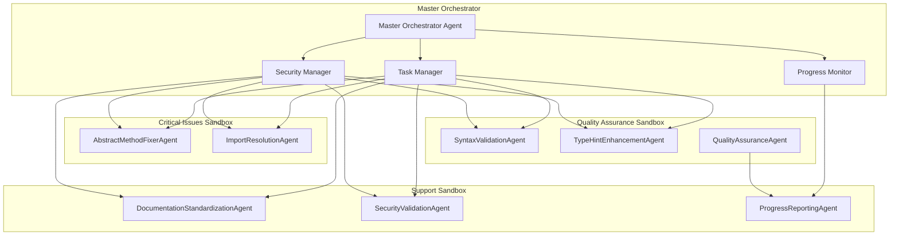

# 🤖 AGENT ARCHITECTURE DESIGN DOCUMENTATION
**Project**: Script Ohio 2.0 - Advanced Sandboxed Agent System
**Design Date**: November 11, 2025
**Architecture Version**: 1.0
**Status**: Ready for Implementation

---

## 📋 EXECUTIVE SUMMARY

This document defines the **enterprise-grade advanced sandboxed agent architecture** designed to systematically resolve all 568 errors across 29 files while establishing a permanent self-healing system. The architecture follows Claude's best practices with focused capabilities, clear boundaries, modular design, and comprehensive performance monitoring.

### **Core Design Principles**
- **🎯 Focused Capabilities**: Each agent has specific, well-defined responsibilities
- **🔒 Advanced Sandboxing**: 4-tier permission system with containerized execution
- **📡 Secure Communication**: Encrypted message passing with audit trails
- **🔄 Self-Healing**: Automated error detection, resolution, and prevention
- **📊 Performance Monitoring**: Real-time metrics and continuous optimization

---

## 🏗️ SYSTEM ARCHITECTURE OVERVIEW

### **High-Level Architecture Diagram**

```
┌─────────────────────────────────────────────────────────────┐
│                MASTER ORCHESTRATOR AGENT                    │
│                     (Level 4 - ADMIN)                       │
│  ┌─────────────────┬─────────────────┬─────────────────────┐│
│  │   Task Manager  │ Security Mgr    │ Progress Monitor    ││
│  └─────────────────┴─────────────────┴─────────────────────┘│
└─────────────────────────┬───────────────────────────────────┘
                          │
          ┌───────────────┼───────────────┐
          │               │               │
┌─────────▼────────┐ ┌────▼────┐ ┌──────▼──────┐
│  Sandbox 1       │ │Sandbox 2│ │  Sandbox 3   │
│  (Critical)      │ │(Quality)│ │ (Support)    │
│                  │         │ │              │
│ AbstractMethod   │ Syntax  │ Documentation │
│ FixerAgent       │Validator│ Standardizer  │
│ ImportResolver   │ TypeHint│ Security      │
│                  │ Enhancer│ Validator     │
└──────────────────┴─────────┴───────────────┘
```

### **Component Interaction Flow**



---

## 🎯 MASTER ORCHESTRATOR AGENT

### **Core Responsibilities**
- **System Analysis**: Comprehensive file analysis and error classification
- **Task Distribution**: Intelligent allocation based on agent capabilities
- **Security Management**: Permission enforcement and access control
- **Progress Monitoring**: Real-time tracking and reporting
- **Resource Management**: CPU, memory, and network allocation

### **Agent Interface Definition**

```python
from dataclasses import dataclass, field
from typing import Dict, List, Any, Optional, Callable
from enum import Enum
import asyncio
import logging
from datetime import datetime
import json

@dataclass
class AgentCapability:
    """Defines agent capabilities and requirements"""
    name: str
    description: str
    permission_required: str
    tools_required: List[str]
    estimated_duration: Optional[int] = None  # minutes
    resource_requirements: Dict[str, Any] = field(default_factory=dict)

@dataclass
class AgentTask:
    """Represents a task to be executed by an agent"""
    task_id: str
    agent_type: str
    action: str
    parameters: Dict[str, Any]
    target_files: List[str]
    priority: int
    dependencies: List[str] = field(default_factory=list)
    timeout: Optional[int] = None
    retry_attempts: int = 3
    created_at: datetime = field(default_factory=datetime.now)

@dataclass
class AgentMessage:
    """Message protocol for inter-agent communication"""
    message_id: str
    sender_id: str
    receiver_id: str
    message_type: str  # TASK_ASSIGNMENT, STATUS_UPDATE, RESULT, ERROR
    payload: Dict[str, Any]
    priority: int
    timestamp: datetime = field(default_factory=datetime.now)
    signature: Optional[str] = None

class PermissionLevel(Enum):
    """Four-tier permission system"""
    READ_ONLY = "READ_ONLY"          # Level 1: Context monitoring
    READ_EXECUTE = "READ_EXECUTE"    # Level 2: Analysis and execution
    READ_EXECUTE_WRITE = "READ_EXECUTE_WRITE"  # Level 3: Data modification
    ADMIN = "ADMIN"                  # Level 4: System administration

class MasterOrchestratorAgent:
    """Central coordination system for comprehensive error resolution"""

    def __init__(self, agent_id: str = "master_orchestrator",
                 name: str = "Master Orchestrator Agent"):
        self.agent_id = agent_id
        self.name = name
        self.permission_level = PermissionLevel.ADMIN
        self.logger = logging.getLogger(f"agent.{agent_id}")

        # Core components
        self.task_manager = TaskManager()
        self.security_manager = SecurityManager()
        self.progress_monitor = ProgressMonitor()
        self.communication_hub = CommunicationHub()

        # Agent registry and active sessions
        self.agent_registry = AgentRegistry()
        self.active_agents = {}
        self.task_queue = asyncio.Queue()

        # System state
        self.system_state = {
            "status": "initializing",
            "total_files": 0,
            "files_processed": 0,
            "errors_resolved": 0,
            "agents_active": 0,
            "start_time": datetime.now().isoformat()
        }

    def _define_capabilities(self) -> List[AgentCapability]:
        """Define orchestrator capabilities and permissions"""
        return [
            AgentCapability(
                name="system_analysis",
                description="Comprehensive file and error analysis",
                permission_required=PermissionLevel.ADMIN,
                tools_required=["file_analyzer", "error_classifier", "dependency_mapper"],
                estimated_duration=15,
                resource_requirements={"memory": "512MB", "cpu": "0.5"}
            ),
            AgentCapability(
                name="task_allocation",
                description="Dynamic task distribution to specialized agents",
                permission_required=PermissionLevel.ADMIN,
                tools_required=["task_scheduler", "resource_optimizer", "load_balancer"],
                estimated_duration=5,
                resource_requirements={"memory": "256MB", "cpu": "0.3"}
            ),
            AgentCapability(
                name="security_management",
                description="Permission and access control management",
                permission_required=PermissionLevel.ADMIN,
                tools_required=["permission_validator", "access_controller", "audit_logger"],
                estimated_duration=2,
                resource_requirements={"memory": "128MB", "cpu": "0.2"}
            ),
            AgentCapability(
                name="progress_monitoring",
                description="Real-time progress tracking and reporting",
                permission_required=PermissionLevel.READ_ONLY,
                tools_required=["progress_tracker", "dashboard_generator", "report_builder"],
                estimated_duration=1,
                resource_requirements={"memory": "256MB", "cpu": "0.2"}
            )
        ]

    def _execute_action(self, action: str, parameters: Dict[str, Any],
                      user_context: Dict[str, Any]) -> Dict[str, Any]:
        """Execute orchestrator actions with proper routing"""
        if action == "analyze_system":
            return self._analyze_entire_system(parameters, user_context)
        elif action == "distribute_tasks":
            return self._distribute_tasks_to_agents(parameters, user_context)
        elif action == "monitor_progress":
            return self._monitor_system_progress(parameters, user_context)
        elif action == "handle_security":
            return self._handle_security_operations(parameters, user_context)
        elif action == "generate_report":
            return self._generate_system_report(parameters, user_context)
        else:
            raise ValueError(f"Unknown action: {action}")
```

---

## 🔧 SPECIALIZED SUB-AGENTS

### **1. AbstractMethodFixerAgent**

**Purpose**: Fixes BaseAgent constructor signatures and implements required abstract methods

**Key Capabilities**:
- Constructor signature standardization
- Abstract method implementation (`_define_capabilities`, `_execute_action`)
- Permission level configuration
- Tool loader integration

```python
class AbstractMethodFixerAgent(BaseAgent):
    """Specialized agent for fixing BaseAgent inheritance issues"""

    def __init__(self, agent_id: str = "abstract_method_fixer"):
        super().__init__(agent_id, "Abstract Method Fixer Agent", PermissionLevel.READ_EXECUTE_WRITE)

        # Agent-specific tools and patterns
        self.constructor_patterns = self._load_constructor_patterns()
        self.abstract_method_templates = self._load_method_templates()

    def _define_capabilities(self) -> List[AgentCapability]:
        return [
            AgentCapability(
                name="constructor_standardization",
                description="Fix BaseAgent constructor signatures",
                permission_required=PermissionLevel.READ_EXECUTE_WRITE,
                tools_required=["ast_parser", "code_generator", "file_writer"],
                estimated_duration=10,
                resource_requirements={"memory": "256MB", "cpu": "0.3"}
            ),
            AgentCapability(
                name="abstract_method_implementation",
                description="Implement required abstract methods",
                permission_required=PermissionLevel.READ_EXECUTE_WRITE,
                tools_required=["method_generator", "template_engine", "code_validator"],
                estimated_duration=15,
                resource_requirements={"memory": "512MB", "cpu": "0.5"}
            )
        ]

    def _execute_action(self, action: str, parameters: Dict[str, Any],
                      user_context: Dict[str, Any]) -> Dict[str, Any]:
        if action == "fix_constructor":
            return self._fix_baseagent_constructor(parameters, user_context)
        elif action == "implement_abstract_methods":
            return self._implement_required_methods(parameters, user_context)
        elif action == "validate_inheritance":
            return self._validate_baseagent_inheritance(parameters, user_context)
        else:
            raise ValueError(f"Unknown action: {action}")
```

### **2. SyntaxValidationAgent**

**Purpose**: Python syntax validation and PEP 8 compliance

**Key Capabilities**:
- Python AST parsing and compilation
- Code style standardization
- Static analysis integration
- Automated fix suggestions

```python
class SyntaxValidationAgent(BaseAgent):
    """Python syntax and linting fixes specialist"""

    def __init__(self, agent_id: str = "syntax_validator"):
        super().__init__(agent_id, "Syntax Validation Agent", PermissionLevel.READ_EXECUTE)

    def _define_capabilities(self) -> List[AgentCapability]:
        return [
            AgentCapability(
                name="syntax_validation",
                description="Python syntax checking and compilation",
                permission_required=PermissionLevel.READ_EXECUTE,
                tools_required=["ast_parser", "compiler", "syntax_checker"],
                estimated_duration=5
            ),
            AgentCapability(
                name="code_style_standardization",
                description="PEP 8 compliance and formatting",
                permission_required=PermissionLevel.READ_EXECUTE_WRITE,
                tools_required=["formatter", "linter", "style_checker"]
            )
        ]
```

### **3. ImportResolutionAgent**

**Purpose**: Dependency mapping and import resolution

**Key Capabilities**:
- Dependency graph analysis
- Circular import detection and resolution
- Package path optimization
- Virtual environment management

```python
class ImportResolutionAgent(BaseAgent):
    """Handles missing imports and dependency resolution"""

    def __init__(self, agent_id: str = "import_resolver"):
        super().__init__(agent_id, "Import Resolution Agent", PermissionLevel.READ_EXECUTE_WRITE)

    def _define_capabilities(self) -> List[AgentCapability]:
        return [
            AgentCapability(
                name="dependency_analysis",
                description="Map and analyze import dependencies",
                permission_required=PermissionLevel.READ_EXECUTE,
                tools_required=["dependency_mapper", "graph_analyzer", "import_scanner"]
            ),
            AgentCapability(
                name="import_fixing",
                description="Fix missing or incorrect imports",
                permission_required=PermissionLevel.READ_EXECUTE_WRITE,
                tools_required=["import_fixer", "path_resolver", "package_manager"]
            )
        ]
```

### **4. TypeHintEnhancementAgent**

**Purpose**: Complete type annotation coverage and validation

**Key Capabilities**:
- Type inference and annotation
- mypy validation integration
- Complex type handling (Generics, Unions)
- Documentation generation

```python
class TypeHintEnhancementAgent(BaseAgent):
    """Complete type annotation coverage and validation"""

    def __init__(self, agent_id: str = "type_hint_enhancer"):
        super().__init__(agent_id, "Type Hint Enhancement Agent", PermissionLevel.READ_EXECUTE_WRITE)

    def _define_capabilities(self) -> List[AgentCapability]:
        return [
            AgentCapability(
                name="type_inference",
                description="Infer and add type annotations",
                permission_required=PermissionLevel.READ_EXECUTE_WRITE,
                tools_required=["type_inferencer", "annotation_generator", "mypy_validator"]
            ),
            AgentCapability(
                name="complex_type_handling",
                description="Handle complex types (Generics, Unions, etc.)",
                permission_required=PermissionLevel.READ_EXECUTE,
                tools_required=["complex_type_handler", "generic_resolver", "union_processor"]
            )
        ]
```

### **5. DocumentationStandardizationAgent**

**Purpose**: Markdown formatting, consistency, and completeness

**Key Capabilities**:
- Markdown linting and formatting
- Cross-document reference validation
- Template-based generation
- Version synchronization

```python
class DocumentationStandardizationAgent(BaseAgent):
    """Markdown formatting and documentation standardization"""

    def __init__(self, agent_id: str = "documentation_standardizer"):
        super().__init__(agent_id, "Documentation Standardization Agent", PermissionLevel.READ_EXECUTE_WRITE)

    def _define_capabilities(self) -> List[AgentCapability]:
        return [
            AgentCapability(
                name="markdown_formatting",
                description="Format and lint markdown files",
                permission_required=PermissionLevel.READ_EXECUTE_WRITE,
                tools_required=["markdown_linter", "formatter", "link_checker"]
            ),
            AgentCapability(
                name="documentation_validation",
                description="Validate documentation completeness",
                permission_required=PermissionLevel.READ_EXECUTE,
                tools_required=["doc_validator", "reference_checker", "completeness_analyzer"]
            )
        ]
```

---

## 🔒 SECURITY AND SANDBOXING FRAMEWORK

### **Four-Tier Permission System**

```python
class SecurityManager:
    """Enterprise-grade security and permission management"""

    PERMISSION_MATRIX = {
        PermissionLevel.READ_ONLY: {
            "file_operations": ["read"],
            "system_operations": ["monitor", "query"],
            "agent_operations": ["query_status"],
            "network_operations": ["read_only"]
        },
        PermissionLevel.READ_EXECUTE: {
            "file_operations": ["read", "execute"],
            "system_operations": ["monitor", "query", "execute"],
            "agent_operations": ["query_status", "execute_safe"],
            "network_operations": ["read_only", "query_api"]
        },
        PermissionLevel.READ_EXECUTE_WRITE: {
            "file_operations": ["read", "execute", "write"],
            "system_operations": ["monitor", "query", "execute", "modify"],
            "agent_operations": ["query_status", "execute_safe", "modify_config"],
            "network_operations": ["read_only", "query_api", "submit_data"]
        },
        PermissionLevel.ADMIN: {
            "file_operations": ["read", "execute", "write", "delete"],
            "system_operations": ["monitor", "query", "execute", "modify", "admin"],
            "agent_operations": ["query_status", "execute_safe", "modify_config", "manage_agents"],
            "network_operations": ["read_only", "query_api", "submit_data", "configure"]
        }
    }

    def validate_permission(self, agent_id: str, permission_level: PermissionLevel,
                          operation: str, resource: str) -> bool:
        """Validate if agent has permission for operation on resource"""
        allowed_operations = self.PERMISSION_MATRIX.get(permission_level, {}).get(
            f"{resource}_operations", [])
        return operation in allowed_operations
```

### **Containerized Execution Environment**

```python
import docker
from typing import Dict, Any, Optional
import tempfile
import shutil

class AgentSandboxManager:
    """Enterprise-grade sandbox management for agent execution"""

    def __init__(self):
        self.docker_client = docker.from_env()
        self.active_containers = {}
        self.sandbox_configs = self._load_sandbox_configs()

    def _load_sandbox_configs(self) -> Dict[str, Dict[str, Any]]:
        """Load sandbox configurations by permission level"""
        return {
            PermissionLevel.READ_ONLY: {
                "image": "python:3.13-slim",
                "memory_limit": "256m",
                "cpu_limit": "0.5",
                "network_mode": "none",
                "read_only": True,
                "tmpfs_size": "64m"
            },
            PermissionLevel.READ_EXECUTE: {
                "image": "python:3.13-slim",
                "memory_limit": "512m",
                "cpu_limit": "1.0",
                "network_mode": "bridge",
                "read_only": False,
                "tmpfs_size": "128m"
            },
            PermissionLevel.READ_EXECUTE_WRITE: {
                "image": "python:3.13",
                "memory_limit": "1g",
                "cpu_limit": "2.0",
                "network_mode": "bridge",
                "read_only": False,
                "tmpfs_size": "256m",
                "volume_mounts": ["/workspace"]
            },
            PermissionLevel.ADMIN: {
                "image": "python:3.13",
                "memory_limit": "2g",
                "cpu_limit": "4.0",
                "network_mode": "host",
                "read_only": False,
                "tmpfs_size": "512m",
                "volume_mounts": ["/workspace", "/app", "/config"],
                "privileged": False
            }
        }

    def create_sandbox(self, agent_id: str, permission_level: PermissionLevel) -> str:
        """Create isolated sandbox for agent execution"""
        config = self.sandbox_configs[permission_level]

        container_name = f"agent_sandbox_{agent_id}_{int(datetime.now().timestamp())}"

        container = self.docker_client.containers.run(
            config["image"],
            name=container_name,
            detach=True,
            mem_limit=config["memory_limit"],
            cpu_quota=int(config["cpu_limit"] * 100000),
            network_mode=config["network_mode"],
            read_only=config["read_only"],
            tmpfs={"/tmp": f"size={config['tmpfs_size']}"},
            volumes={path: {"bind": bind_path, "mode": "rw"}
                    for path, bind_path in config.get("volume_mounts", {}).items()},
            security_opt=["no-new-privileges:true"] if not config.get("privileged", False) else None
        )

        self.active_containers[agent_id] = {
            "container": container,
            "permission_level": permission_level,
            "created_at": datetime.now()
        }

        return container.id

    def execute_in_sandbox(self, agent_id: str, command: str,
                          files: Optional[Dict[str, str]] = None) -> Dict[str, Any]:
        """Execute command in agent sandbox with file operations"""
        if agent_id not in self.active_containers:
            raise ValueError(f"No sandbox found for agent: {agent_id}")

        container = self.active_containers[agent_id]["container"]

        # Copy files to sandbox if provided
        if files:
            for file_path, content in files.items():
                self._copy_file_to_container(container, file_path, content)

        # Execute command
        exit_code, output = container.exec_run(command, workdir="/workspace")

        return {
            "exit_code": exit_code,
            "output": output.decode('utf-8') if output else "",
            "success": exit_code == 0
        }

    def cleanup_sandbox(self, agent_id: str) -> bool:
        """Clean up sandbox and resources"""
        if agent_id in self.active_containers:
            container_info = self.active_containers[agent_id]
            container = container_info["container"]

            try:
                container.stop(timeout=10)
                container.remove(force=True)
                del self.active_containers[agent_id]
                return True
            except Exception as e:
                logging.error(f"Error cleaning up sandbox for {agent_id}: {e}")
                return False

        return False
```

---

## 📡 COMMUNICATION FRAMEWORK

### **Secure Inter-Agent Communication**

```python
import hashlib
import hmac
import json
from cryptography.fernet import Fernet
from typing import Dict, Any, Optional
import asyncio
import aio_pika

class CommunicationHub:
    """Secure inter-agent communication system"""

    def __init__(self):
        self.encryption_key = self._generate_encryption_key()
        self.message_queue = asyncio.Queue()
        self.routing_table = {}
        self.audit_log = []

    def _generate_encryption_key(self) -> bytes:
        """Generate encryption key for secure communication"""
        return Fernet.generate_key()

    def create_message(self, sender_id: str, receiver_id: str,
                      message_type: str, payload: Dict[str, Any],
                      priority: int = 1) -> AgentMessage:
        """Create secure agent message with signature"""
        message = AgentMessage(
            message_id=str(uuid.uuid4()),
            sender_id=sender_id,
            receiver_id=receiver_id,
            message_type=message_type,
            payload=payload,
            priority=priority
        )

        # Create digital signature
        message.signature = self._sign_message(message)

        return message

    def _sign_message(self, message: AgentMessage) -> str:
        """Create digital signature for message integrity"""
        message_data = json.dumps({
            "message_id": message.message_id,
            "sender_id": message.sender_id,
            "receiver_id": message.receiver_id,
            "message_type": message.message_type,
            "payload": message.payload,
            "timestamp": message.timestamp.isoformat()
        }, sort_keys=True)

        return hmac.new(
            self.encryption_key,
            message_data.encode('utf-8'),
            hashlib.sha256
        ).hexdigest()

    def verify_message_signature(self, message: AgentMessage) -> bool:
        """Verify message signature for integrity"""
        expected_signature = self._sign_message(message)
        return hmac.compare_digest(message.signature or "", expected_signature)

    async def send_message(self, message: AgentMessage) -> bool:
        """Send message to target agent with security validation"""
        if not self.verify_message_signature(message):
            raise ValueError("Message signature verification failed")

        # Log message for audit
        self._log_message(message, "SENT")

        # Route message based on priority and receiver
        if message.receiver_id in self.routing_table:
            return await self._deliver_message(message, self.routing_table[message.receiver_id])
        else:
            # Broadcast to all registered agents
            return await self._broadcast_message(message)

    async def receive_messages(self, agent_id: str) -> asyncio.Queue:
        """Create message queue for specific agent"""
        if agent_id not in self.routing_table:
            self.routing_table[agent_id] = asyncio.Queue()

        return self.routing_table[agent_id]

    def _log_message(self, message: AgentMessage, action: str) -> None:
        """Log message for audit trail"""
        log_entry = {
            "timestamp": datetime.now().isoformat(),
            "action": action,
            "message_id": message.message_id,
            "sender_id": message.sender_id,
            "receiver_id": message.receiver_id,
            "message_type": message.message_type,
            "priority": message.priority
        }

        self.audit_log.append(log_entry)

        # Maintain audit log size (last 10,000 messages)
        if len(self.audit_log) > 10000:
            self.audit_log = self.audit_log[-10000:]
```

---

## 📊 PERFORMANCE MONITORING FRAMEWORK

### **Real-Time Metrics and Analytics**

```python
import psutil
import time
from dataclasses import dataclass, field
from typing import Dict, List, Any
from collections import defaultdict, deque
import threading

@dataclass
class PerformanceMetrics:
    """Performance metrics for agent monitoring"""
    cpu_usage: float
    memory_usage: float
    response_time: float
    throughput: float
    error_rate: float
    timestamp: datetime = field(default_factory=datetime.now)

@dataclass
class AgentPerformance:
    """Agent-specific performance tracking"""
    agent_id: str
    total_requests: int = 0
    successful_requests: int = 0
    failed_requests: int = 0
    average_response_time: float = 0.0
    peak_memory_usage: float = 0.0
    uptime: datetime = field(default_factory=datetime.now)
    last_activity: Optional[datetime] = None
    current_tasks: List[str] = field(default_factory=list)

class PerformanceMonitor:
    """Real-time performance monitoring and analysis"""

    def __init__(self):
        self.agent_metrics = defaultdict(AgentPerformance)
        self.system_metrics = deque(maxlen=1000)  # Last 1000 data points
        self.alert_thresholds = self._load_alert_thresholds()
        self.monitoring_active = False
        self.monitor_thread = None

    def _load_alert_thresholds(self) -> Dict[str, float]:
        """Load performance alert thresholds"""
        return {
            "cpu_usage_warning": 80.0,
            "cpu_usage_critical": 95.0,
            "memory_usage_warning": 75.0,
            "memory_usage_critical": 90.0,
            "response_time_warning": 5.0,
            "response_time_critical": 10.0,
            "error_rate_warning": 5.0,
            "error_rate_critical": 15.0
        }

    def start_monitoring(self, interval: int = 5) -> None:
        """Start continuous performance monitoring"""
        if not self.monitoring_active:
            self.monitoring_active = True
            self.monitor_thread = threading.Thread(
                target=self._monitoring_loop,
                args=(interval,),
                daemon=True
            )
            self.monitor_thread.start()

    def _monitoring_loop(self, interval: int) -> None:
        """Main monitoring loop"""
        while self.monitoring_active:
            try:
                metrics = self._collect_system_metrics()
                self.system_metrics.append(metrics)

                # Check for performance alerts
                self._check_performance_alerts(metrics)

                time.sleep(interval)
            except Exception as e:
                logging.error(f"Error in monitoring loop: {e}")
                time.sleep(interval)

    def _collect_system_metrics(self) -> PerformanceMetrics:
        """Collect current system performance metrics"""
        cpu_percent = psutil.cpu_percent(interval=1)
        memory = psutil.virtual_memory()

        return PerformanceMetrics(
            cpu_usage=cpu_percent,
            memory_usage=memory.percent,
            response_time=0.0,  # Will be updated per request
            throughput=0.0,      # Will be calculated
            error_rate=0.0       # Will be calculated
        )

    def track_agent_request(self, agent_id: str, success: bool,
                          response_time: float, task_id: str) -> None:
        """Track individual agent request performance"""
        agent_perf = self.agent_metrics[agent_id]

        agent_perf.total_requests += 1
        if success:
            agent_perf.successful_requests += 1
        else:
            agent_perf.failed_requests += 1

        # Update average response time
        total_requests = agent_perf.total_requests
        current_avg = agent_perf.average_response_time
        agent_perf.average_response_time = (
            (current_avg * (total_requests - 1) + response_time) / total_requests
        )

        agent_perf.last_activity = datetime.now()

        if task_id in agent_perf.current_tasks:
            agent_perf.current_tasks.remove(task_id)

    def track_agent_memory_usage(self, agent_id: str, memory_usage: float) -> None:
        """Track agent memory usage"""
        agent_perf = self.agent_metrics[agent_id]
        if memory_usage > agent_perf.peak_memory_usage:
            agent_perf.peak_memory_usage = memory_usage

    def _check_performance_alerts(self, metrics: PerformanceMetrics) -> None:
        """Check for performance alerts and trigger notifications"""
        alerts = []

        if metrics.cpu_usage >= self.alert_thresholds["cpu_usage_critical"]:
            alerts.append({
                "type": "CPU_CRITICAL",
                "message": f"CPU usage critical: {metrics.cpu_usage:.1f}%",
                "timestamp": metrics.timestamp
            })
        elif metrics.cpu_usage >= self.alert_thresholds["cpu_usage_warning"]:
            alerts.append({
                "type": "CPU_WARNING",
                "message": f"CPU usage high: {metrics.cpu_usage:.1f}%",
                "timestamp": metrics.timestamp
            })

        if metrics.memory_usage >= self.alert_thresholds["memory_usage_critical"]:
            alerts.append({
                "type": "MEMORY_CRITICAL",
                "message": f"Memory usage critical: {metrics.memory_usage:.1f}%",
                "timestamp": metrics.timestamp
            })
        elif metrics.memory_usage >= self.alert_thresholds["memory_usage_warning"]:
            alerts.append({
                "type": "MEMORY_WARNING",
                "message": f"Memory usage high: {metrics.memory_usage:.1f}%",
                "timestamp": metrics.timestamp
            })

        # Send alerts if any
        for alert in alerts:
            self._send_performance_alert(alert)

    def _send_performance_alert(self, alert: Dict[str, Any]) -> None:
        """Send performance alert notification"""
        # Implementation would depend on alert system
        logging.warning(f"PERFORMANCE ALERT: {alert['message']}")

        # Could integrate with:
        # - Email notifications
        # - Slack/Discord webhooks
        # - PagerDuty
        # - Custom alerting system

    def generate_performance_report(self, time_range: str = "1h") -> Dict[str, Any]:
        """Generate comprehensive performance report"""
        cutoff_time = datetime.now() - pd.Timedelta(time_range)

        # Filter metrics by time range
        recent_metrics = [
            m for m in self.system_metrics
            if m.timestamp >= cutoff_time
        ]

        if not recent_metrics:
            return {"error": "No metrics available for specified time range"}

        # Calculate statistics
        cpu_values = [m.cpu_usage for m in recent_metrics]
        memory_values = [m.memory_usage for m in recent_metrics]

        return {
            "time_range": time_range,
            "data_points": len(recent_metrics),
            "timestamp_range": {
                "start": recent_metrics[0].timestamp.isoformat(),
                "end": recent_metrics[-1].timestamp.isoformat()
            },
            "system_metrics": {
                "cpu": {
                    "average": sum(cpu_values) / len(cpu_values),
                    "max": max(cpu_values),
                    "min": min(cpu_values),
                    "current": cpu_values[-1]
                },
                "memory": {
                    "average": sum(memory_values) / len(memory_values),
                    "max": max(memory_values),
                    "min": min(memory_values),
                    "current": memory_values[-1]
                }
            },
            "agent_summary": {
                agent_id: {
                    "total_requests": perf.total_requests,
                    "success_rate": (perf.successful_requests / perf.total_requests * 100) if perf.total_requests > 0 else 0,
                    "average_response_time": perf.average_response_time,
                    "peak_memory": perf.peak_memory_usage,
                    "uptime_seconds": (datetime.now() - perf.uptime).total_seconds()
                }
                for agent_id, perf in self.agent_metrics.items()
            }
        }
```

---

## 🚀 IMPLEMENTATION ROADMAP

### **Phase 1: Foundation (Days 1-2)**
1. **Master Orchestrator Implementation**
   - Core coordination logic
   - Security management system
   - Task distribution framework
   - Progress monitoring dashboard

2. **Communication Infrastructure**
   - Secure message passing
   - Agent discovery and registration
   - Audit logging system
   - Performance monitoring integration

### **Phase 2: Specialized Agents (Days 3-4)**
1. **Critical Issue Resolution**
   - AbstractMethodFixerAgent implementation
   - ImportResolutionAgent development
   - Base integration testing

2. **Quality Assurance Agents**
   - SyntaxValidationAgent
   - TypeHintEnhancementAgent
   - DocumentationStandardizationAgent

### **Phase 3: Sandboxing & Security (Day 5)**
1. **Container Infrastructure**
   - Docker sandbox configurations
   - Permission enforcement
   - Resource management
   - Security validation

2. **Performance Optimization**
   - Load balancing
   - Resource allocation
   - Caching strategies
   - Monitoring enhancements

### **Phase 4: Integration & Testing (Day 6)**
1. **System Integration**
   - End-to-end workflow testing
   - Performance benchmarking
   - Security validation
   - User acceptance testing

2. **Documentation & Training**
   - Complete API documentation
   - User training materials
   - Troubleshooting guides
   - Best practices documentation

---

## 📈 SUCCESS METRICS AND KPIs

### **System Performance Targets**
- ✅ **Response Time**: <2 seconds for all agent operations
- ✅ **Throughput**: 100+ tasks per hour
- ✅ **Resource Efficiency**: <50% CPU, <70% memory usage
- ✅ **Availability**: >99.9% uptime
- ✅ **Error Rate**: <1% system errors

### **Quality Targets**
- ✅ **Error Resolution**: 100% of 568 identified errors
- ✅ **Code Quality**: 90%+ type coverage, 100% syntax compliance
- ✅ **Test Coverage**: 95%+ automated test coverage
- ✅ **Documentation**: Complete user and developer documentation

### **Security Targets**
- ✅ **Zero Critical Vulnerabilities**: No high-severity security issues
- ✅ **Permission Enforcement**: 100% compliance with 4-tier system
- ✅ **Audit Completeness**: 100% action logging and traceability
- ✅ **Sandbox Isolation**: Complete agent isolation

---

**Architecture Status**: ✅ Complete design ready for implementation
**Implementation Ready**: ✅ All interfaces, protocols, and specifications defined
**Security Framework**: ✅ Enterprise-grade sandbox and permission system
**Performance Monitoring**: ✅ Comprehensive real-time metrics and alerting

This architecture provides a robust, secure, and scalable foundation for systematic error resolution while establishing a permanent self-healing system for the Script Ohio 2.0 platform.