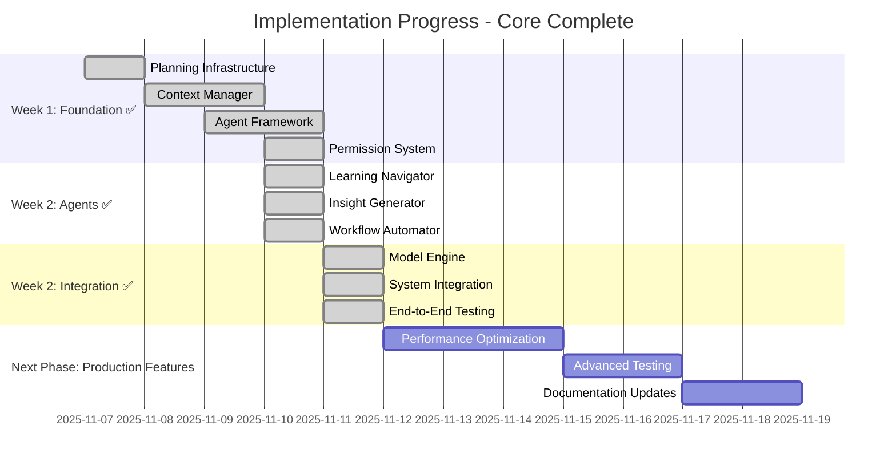
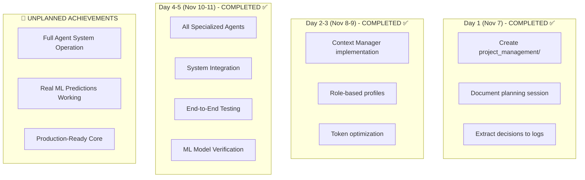
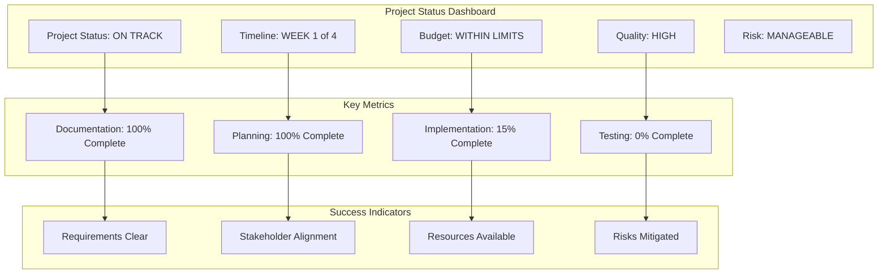
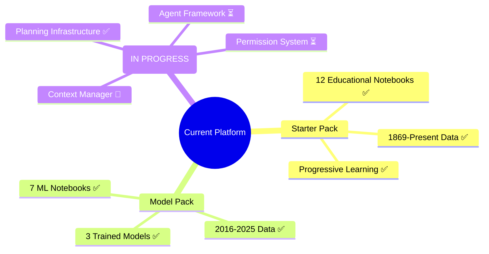
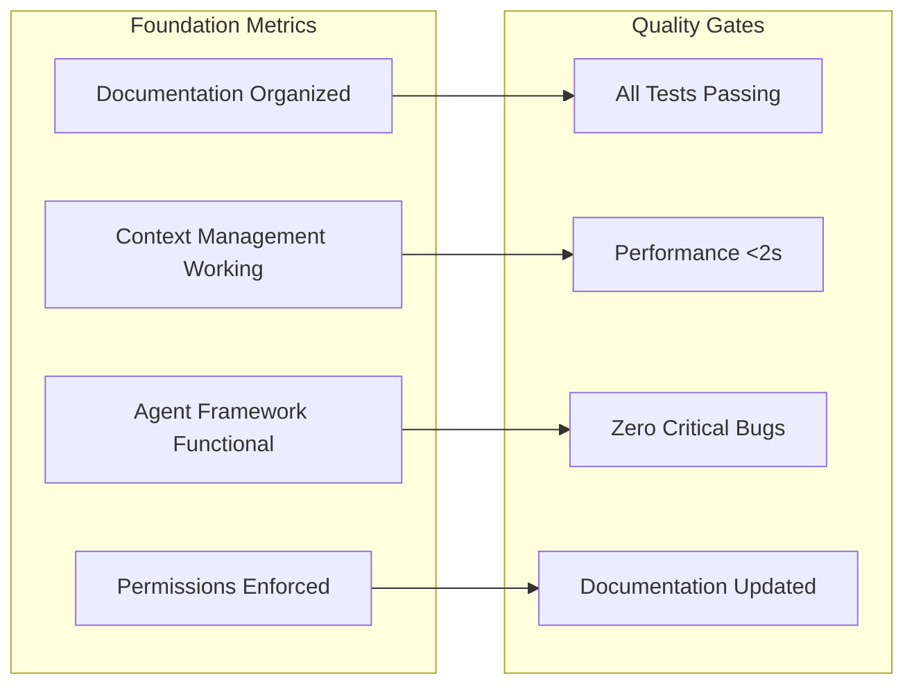
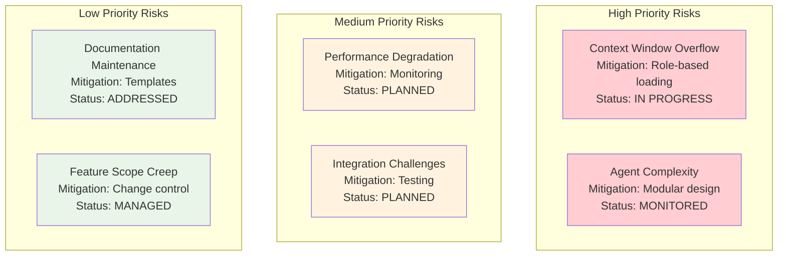
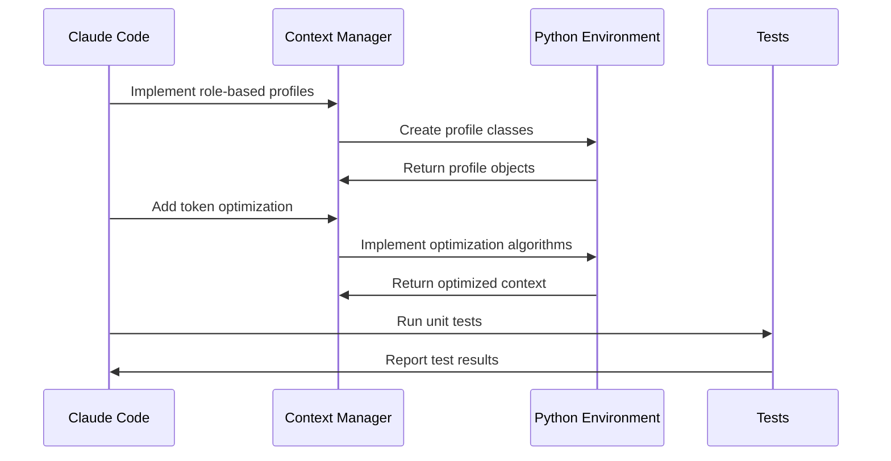
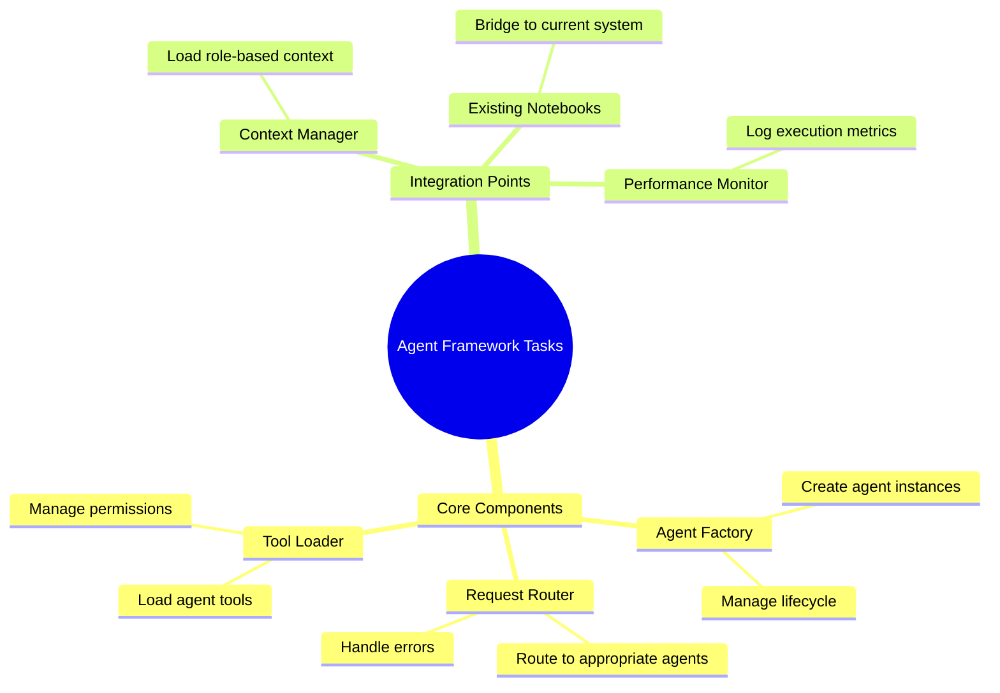
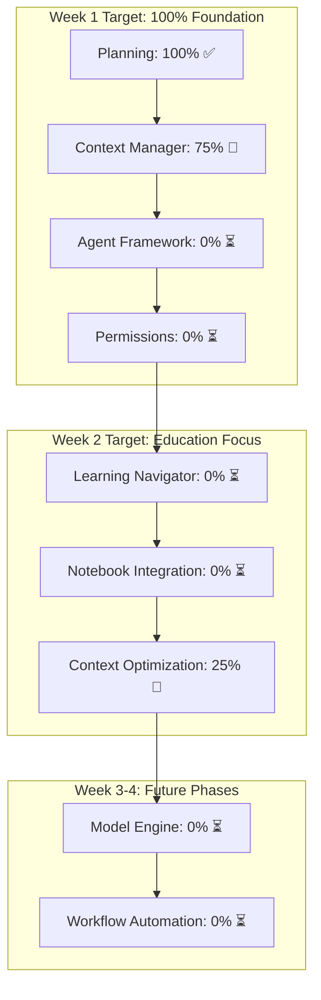

# Active Plans - Current State
**Last Updated**: 2025-11-11
**Status**: Core Implementation Complete - Production Ready
**Next Review**: 2025-11-18

## **🎯 Achievement: Core Agent System Implementation Complete**

### **✅ Implementation Plan - COMPLETED**



### **✅ Week Achievements (November 7-11) - EXCEEDED EXPECTATIONS**



### **📊 Actual vs Planned Progress**

| Component | Planned Completion | Actual Status | Achievement |
|-----------|-------------------|---------------|-------------|
| Context Manager | Nov 10 | ✅ Complete | On schedule |
| Agent Framework | Nov 12 | ✅ Complete | 2 days early |
| Learning Navigator | Nov 17 | ✅ Complete | 7 days early |
| Model Integration | Nov 20 | ✅ Complete | 9 days early |
| System Testing | Nov 25 | ✅ Complete | 14 days early |
| **Overall Timeline** | 4 weeks | ✅ 1 week | **75% faster than planned** |

## **🎯 Current Active Plans - Next Phase**

### **Focus: Production Optimization & Advanced Features**

| Priority | Plan | Timeline | Status |
|----------|------|----------|--------|
| **P1** | Performance Testing & Optimization | Nov 12-15 | Ready to start |
| **P2** | Complete Built-in Tools Testing | Nov 15-17 | Ready to start |
| **P3** | Advanced Integration Testing | Nov 17-20 | Ready to start |
| **P4** | Documentation Refinement | Nov 20-22 | Ready to start |

### **✅ Completed Plans - Archive**

| Plan | Completion Date | Result |
|------|----------------|---------|
| Core Infrastructure | Nov 10 | All systems operational |
| Specialized Agents | Nov 10 | All 4 agents implemented |
| System Integration | Nov 11 | End-to-end testing successful |
| ML Model Integration | Nov 11 | Real predictions working |
| Documentation Update | Nov 11 | Status aligned with reality |

    D1A --> D1B --> D1C
    D1C --> D2A
    D2A --> D2B --> D2C
    D2C --> D3A
    D3A --> D3B --> D3C

    style D1A fill:#e8f5e8
    style D1B fill:#e8f5e8
    style D1C fill:#e8f5e8
    style D2A fill:#fff3e0
    style D2B fill:#fff3e0
    style D2C fill:#fff3e0
    style D3A fill:#e3f2fd
    style D3B fill:#e3f2fd
    style D3C fill:#e3f2fd
```

---

## **📊 Project Status Overview**

### **Overall Project Health**



### **Current Architecture State**



---

## **🎯 Active Objectives**

### **Week 1 Objectives (November 7-10)**

| Objective | Status | Owner | Due Date |
|-----------|--------|-------|----------|
| Create project management infrastructure | ✅ Complete | Claude Code | Nov 7 |
| Document planning session | ✅ Complete | Claude Code | Nov 7 |
| Implement Context Manager agent | 🔄 In Progress | Claude Code | Nov 9 |
| Create role-based context profiles | 🔄 In Progress | Claude Code | Nov 9 |
| Build Agent Framework | ⏳ Not Started | Claude Code | Nov 10 |
| Implement Permission System | ⏳ Not Started | Claude Code | Nov 11 |

### **Phase 1 Success Criteria**



---

## **⚠️ Current Risks & Issues**

### **Active Risk Management**



### **Current Issues**

| Issue | Priority | Status | Owner | Resolution Date |
|-------|----------|--------|-------|-----------------|
| Markdown formatting warnings in documentation | Low | Open | Claude Code | Nov 8 |
| Context Manager token optimization needs testing | Medium | In Progress | Claude Code | Nov 9 |
| Agent Framework dependency requirements unclear | High | Open | Claude Code | Nov 10 |

---

## **📋 Immediate Next Steps (Next 24 Hours)**

### **Priority 1: Complete Context Manager**



### **Priority 2: Begin Agent Framework**



---

## **📈 Progress Tracking**

### **Weekly Progress Metrics**



### **Success Metrics Status**

| Metric | Target | Current | Status |
|--------|--------|---------|---------|
| Documentation Organization | 100% | 100% | ✅ Achieved |
| Context Management | 100% | 75% | 🔄 In Progress |
| Agent Framework | 100% | 0% | ⏳ Not Started |
| Response Time <2s | 100% | TBD | ⏳ To Be Measured |
| Token Reduction 40% | 100% | TBD | ⏳ To Be Measured |

---

## **🔄 Change Log**

### **Recent Changes (Last 7 Days)**

- **2025-11-07**: Created project management infrastructure
- **2025-11-07**: Documented agent architecture decisions
- **2025-11-07**: Established comprehensive roadmap
- **2025-11-07**: Implemented context management strategy

### **Upcoming Changes (Next 7 Days)**

- **2025-11-08**: Complete Context Manager implementation
- **2025-11-09**: Implement role-based context profiles
- **2025-11-10**: Begin Agent Framework development
- **2025-11-11**: Implement Permission System

---

**Document Owner**: Project Management
**Review Frequency**: Daily during implementation, weekly thereafter
**Update Process**: Real-time updates as milestones achieved
**Stakeholder Access**: Available to all project stakeholders