# Implementation Status Tracker
**Last Updated**: 2025-11-13
**Implementation Phase**: Core Production Ready - Agent System Verified + Infrastructure Improvements
**Overall Progress**: 80% Complete (Based on End-to-End Testing + Infrastructure)

## **🎯 Current Implementation Overview**

### **Week 12 Uncertainty Solution Progress**

### **Phase 1 Detailed Progress**

---

## **📋 Task Status Details**

### **✅ Completed Tasks**

| Task ID | Task Name | Completed | Duration | Owner | Notes |
|---------|-----------|-----------|----------|-------|-------|
| T001 | Create project_management/ directory | 2025-11-07 | 0.1h | Claude Code | ✅ Complete |
| T002 | Document planning session (initial plan) | 2025-11-07 | 0.5h | Claude Code | ✅ Complete |
| T003 | Document planning session (A+ revision) | 2025-11-07 | 0.5h | Claude Code | ✅ Complete |
| T004 | Document context management strategy | 2025-11-07 | 0.5h | Claude Code | ✅ Complete |
| T005 | Extract architecture decisions | 2025-11-07 | 0.5h | Claude Code | ✅ Complete |
| T006 | Extract scope decisions | 2025-11-07 | 0.5h | Claude Code | ✅ Complete |
| T007 | Extract prioritization decisions | 2025-11-07 | 0.5h | Claude Code | ✅ Complete |
| T008 | Create implementation roadmap | 2025-11-07 | 1h | Claude Code | ✅ Complete |
| T009 | Create feature evolution roadmap | 2025-11-07 | 1h | Claude Code | ✅ Complete |
| T010 | Create technology stack roadmap | 2025-11-07 | 1h | Claude Code | ✅ Complete |
| **W12-T001** | Week 12 Strategic Planning Session | 2025-11-10 | 1h | Stephen Bowman | ✅ Complete, template-based |
| **W12-T002** | DEC-001 Week 12 Data Strategy Decision | 2025-11-10 | 0.5h | Stephen Bowman | ✅ Uncertainty-aware approach |
| **W12-T003** | DEC-002 Agent Architecture Enhancement Decision | 2025-11-10 | 0.5h | Stephen Bowman | ✅ Hybrid enhancement approach |
| **W12-T004** | DEC-003 User Experience Strategy Decision | 2025-11-10 | 0.5h | Stephen Bowman | ✅ Progressive disclosure by role |
| **INFRA-T001** | Dependency Management Overhaul (DEC-006) | 2025-11-13 | 1d | Technical Team | ✅ Complete - pip-compile infrastructure, 7 files created, code improvements, docs updated |

### **🔄 In Progress Tasks**

| Task ID | Task Name | Started | Progress | Owner | ETA | Blockers |
|---------|-----------|---------|----------|-------|-----|----------|
| T011 | Context Manager implementation | 2025-11-07 | 25% | Claude Code | 2025-11-09 | None |
| T012 | Role-based context profiles | 2025-11-07 | 0% | Claude Code | 2025-11-09 | Waiting for T011 |
| T013 | Token optimization algorithms | 2025-11-07 | 0% | Claude Code | 2025-11-09 | Waiting for T011 |
| **W12-T005** | UncertaintyCommunicationAgent Design | 2025-11-10 | 0% | Agent Team | 2025-11-12 | DEC-002 approval |

### **⏳ Not Started Tasks**

| Task ID | Task Name | Planned Start | Duration | Owner | Dependencies |
|---------|-----------|---------------|----------|-------|--------------|
| T014 | Agent Framework foundation | 2025-11-10 | 2d | Claude Code | T011, T012, T013 |
| T015 | Permission System implementation | 2025-11-11 | 1d | Claude Code | T014 |
| T016 | Agent Factory pattern | 2025-11-10 | 0.5d | Claude Code | T014 |
| T017 | Request Router development | 2025-11-10 | 0.5d | Claude Code | T014 |
| T018 | Tool Loader implementation | 2025-11-11 | 0.5d | Claude Code | T015 |
| T019 | Integration Testing Suite | 2025-11-11 | 1d | Claude Code | T015, T018 |

### **🏈 Week 12 Uncertainty Solution Tasks**

| Task ID | Task Name | Planned Start | Duration | Owner | Dependencies |
|---------|-----------|---------------|----------|-------|--------------|
| **W12-T006** | Design UncertaintyCommunicationAgent | 2025-11-10 | 2d | Agent Team | W12-T005 |
| **W12-T007** | Enhance Week12PredictionGenerationAgent | 2025-11-13 | 1d | Agent Team | W12-T006 |
| **W12-T008** | Enhance Week12ModelValidationAgent | 2025-11-13 | 1d | Agent Team | W12-T006 |
| **W12-T009** | Enhance Week12MatchupAnalysisAgent | 2025-11-14 | 1d | Agent Team | W12-T007 |
| **W12-T010** | Enhance Week12MockEnhancementAgent | 2025-11-14 | 1d | Agent Team | W12-T008 |
| **W12-T011** | Update ContextManager for uncertainty contexts | 2025-11-16 | 1d | Agent Team | W12-T009 |
| **W12-T012** | Design role-specific uncertainty UX components | 2025-11-13 | 2d | UX Team | DEC-003 |
| **W12-T013** | Update Model Execution Engine for uncertainty | 2025-11-17 | 2d | ML Team | W12-T011 |

---

## **🏗️ Component Implementation Status**

### **🏈 Week 12 Uncertainty Components**

**Current Progress:**
- **UncertaintyCommunicationAgent**: 0% complete - design phase starting
- **Uncertainty Visualization Tools**: 0% complete - UX design planned
- **Uncertainty Calculator**: 0% complete - statistical framework design
- **Context Manager Extensions**: 0% complete - uncertainty contexts defined
- **Model Execution Engine Extensions**: 0% complete - ensemble uncertainty planning

### **Context Manager Component**

```mermaid
graph TB
    subgraph "Context Manager Status"
        CM[Context Manager Class]
        RP[Role-Based Profiles]
        TO[Token Optimizer]
        CC[Context Cache]
    end

    subgraph "Implementation Status"
        S1[🔄 In Progress]
        S2[⏳ Not Started]
        S3[⏳ Not Started]
        S4[⏳ Not Started]
    end

    CM --> S1
    RP --> S2
    TO --> S3
    CC --> S4

    style CM fill:#fff3e0
    style RP fill:#e3f2fd
    style TO fill:#e3f2fd
    style CC fill:#e3f2fd
```

**Current Progress:**
- **Context Manager Class**: 25% complete - basic structure defined
- **Role-Based Profiles**: 0% complete - design ready, implementation pending
- **Token Optimizer**: 0% complete - algorithms designed, not implemented
- **Context Cache**: 0% complete - requirements defined

### **Agent Framework Component**

```mermaid
graph TB
    subgraph "Agent Framework Status"
        AF[Agent Factory]
        RR[Request Router]
        TL[Tool Loader]
        PS[Permission System]
    end

    subgraph "Design Status"
        D1[✅ Design Complete]
        D2[✅ Design Complete]
        D3[✅ Design Complete]
        D4[✅ Design Complete]
    end

    subgraph "Implementation Status"
        I1[⏳ Not Started]
        I2[⏳ Not Started]
        I3[⏳ Not Started]
        I4[⏳ Not Started]
    end

    AF --> D1
    RR --> D2
    TL --> D3
    PS --> D4

    AF --> I1
    RR --> I2
    TL --> I3
    PS --> I4

    style AF fill:#e3f2fd
    style RR fill:#e3f2fd
    style TL fill:#e3f2fd
    style PS fill:#e3f2fd
```

**Current Progress:**
- **All Components**: Design complete, implementation ready to start
- **Dependencies**: Context Manager must be completed first
- **Resources**: Claude Code allocated for development

---

## **🧪 Testing Status**

### **Test Coverage Overview**

### **Testing Plan**

| Test Type | Status | Coverage Target | Execution Date |
|-----------|--------|-----------------|----------------|
| Unit Tests - Context Manager | ⏳ Planned | 90% | 2025-11-09 |
| Unit Tests - Agent Framework | ⏳ Planned | 90% | 2025-11-11 |
| Integration Tests | ⏳ Planned | 80% | 2025-11-12 |
| Performance Tests | ⏳ Planned | 100% | 2025-11-12 |
| Security Tests | ⏳ Planned | 70% | 2025-11-13 |

---

## **⚡ Performance Metrics**

### **Current Performance Baseline**

```mermaid
graph TB
    subgraph "Target Metrics"
        T1[Response Time < 2s]
        T2[Context Reduction 40%]
        T3[Error Rate < 1%]
        T4[Availability 99.9%]
    end

    subgraph "Current Status"
        S1[📊 TBD - To Be Measured]
        S2[📊 TBD - To Be Measured]
        S3[📊 TBD - To Be Measured]
        S4[📊 TBD - To Be Measured]
    end

    T1 --> S1
    T2 --> S2
    T3 --> S3
    T4 --> S4
```

**Performance Testing Schedule:**
- **Week 1**: Baseline measurements for Context Manager
- **Week 2**: Agent Framework performance testing
- **Week 3**: End-to-end performance validation
- **Week 4**: Production readiness assessment

---

## **🚧 Blockers & Issues**

### **Current Blockers**

| Blocker ID | Description | Priority | Impact | Resolution Plan | ETA |
|------------|-------------|----------|--------|----------------|-----|
| **W12-B001** | Week 12 game data missing from dataset | **Critical** | Blocks Week 12 deployment | Uncertainty-aware analytics approach (DEC-001) | Resolved ✅ |
| **W12-B002** | FastAI model file missing despite references | High | Reduces model ensemble diversity | Locate file or implement alternative | 2025-11-15 |
| **W12-B003** | Documentation predictions for non-existent data | Medium | User trust impact | Update with uncertainty communication | 2025-11-25 |
| B001 | Context Manager implementation complex | Medium | Delays Agent Framework | Incremental development approach | 2025-11-09 |
| B002 | Token optimization algorithms need validation | Low | May affect performance | Prototype testing | 2025-11-10 |

### **Resolved Issues**

| Issue ID | Description | Resolution Date | Resolution Method |
|----------|-------------|-----------------|-------------------|
| **W12-I001** | Week 12 data availability crisis | 2025-11-10 | Uncertainty-aware analytics strategy (DEC-001) |
| **W12-I002** | Week 12 agent architecture requirements | 2025-11-10 | Hybrid enhancement approach (DEC-002) |
| **W12-I003** | Week 12 uncertainty communication strategy | 2025-11-10 | Progressive disclosure by role (DEC-003) |
| I001 | Project structure unclear | 2025-11-07 | Created detailed directory structure |
| I002 | Documentation organization chaotic | 2025-11-07 | Implemented planning management system |

---

## **📅 Upcoming Milestones**

### **🏈 Week 12 Solution Milestones (November 10-25)**

```mermaid
timeline
    title Week 12 Solution Milestones
    section Week 1 (Nov 10)
    Planning & Decisions       : Complete ✅
    Strategic Framework        : Complete ✅
    section Week 2 (Nov 11-17)
    Agent Architecture Design  : Target Completion
    Uncertainty Components     : Target Completion
    section Week 3 (Nov 18-25)
    UX Implementation          : Target Completion
    Integration & Testing      : Target Completion
    Production Deployment       : Target Completion
```

### **Week 1 Milestones (November 7-10)**

### **Week 12 Solution Key Milestones**

| Milestone | Target Date | Status | Dependencies | Success Criteria |
|-----------|-------------|---------|--------------|------------------|
| **Week 12 Planning Complete** | 2025-11-10 | ✅ Complete | Strategic analysis | All decisions documented |
| **Uncertainty Agent Architecture** | 2025-11-12 | 🔄 In Progress | DEC-002 approval | Design specifications ready |
| **Agent Enhancements Complete** | 2025-11-16 | ⏳ Planned | Architecture design | All 4 agents enhanced |
| **UX Uncertainty Components** | 2025-11-18 | ⏳ Planned | DEC-003 approval | Role-specific UI ready |
| **Integration Testing Complete** | 2025-11-21 | ⏳ Planned | All components | System integration validated |
| **Week 12 Production Deployment** | 2025-11-25 | ⏳ Planned | Testing complete | Uncertainty-aware analytics live |

### **Phase 1 Milestones (November 7-14)**

| Milestone | Target Date | Status | Dependencies | Success Criteria |
|-----------|-------------|---------|--------------|------------------|
| Foundation Complete | 2025-11-11 | 🔄 In Progress | All Week 1 tasks | All agents functional |
| Testing Complete | 2025-11-12 | ⏳ Planned | Foundation complete | 90% test coverage |
| Phase 1 Sign-off | 2025-11-14 | ⏳ Planned | Testing complete | All metrics met |

---

## **📊 Resource Utilization**

### **Development Resources**

**Current Resource Status:**
- **Development**: Claude Code fully allocated
- **Testing**: Planned for Week 1 completion
- **Documentation**: Ongoing, 15% of effort
- **Management**: 10% overhead for planning and coordination

---

## **🔄 Change Request Log**

### **Approved Changes**

| Change ID | Description | Date | Impact | Status |
|-----------|-------------|------|--------|--------|
| CR001 | Added Mermaid diagrams for better visualization | 2025-11-07 | Low | ✅ Implemented |
| CR002 | Enhanced documentation structure | 2025-11-07 | Low | ✅ Implemented |

### **Pending Changes**

| Change ID | Description | Requested Date | Impact | Review Date |
|-----------|-------------|----------------|--------|-------------|
| CR003 | Add automated testing pipeline | 2025-11-07 | Medium | 2025-11-08 |

---

**Document Owner**: Implementation Team
**Update Frequency**: Daily during active development
**Review Process**: Weekly stakeholder review
**Approval Authority**: Project Lead