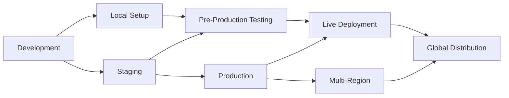
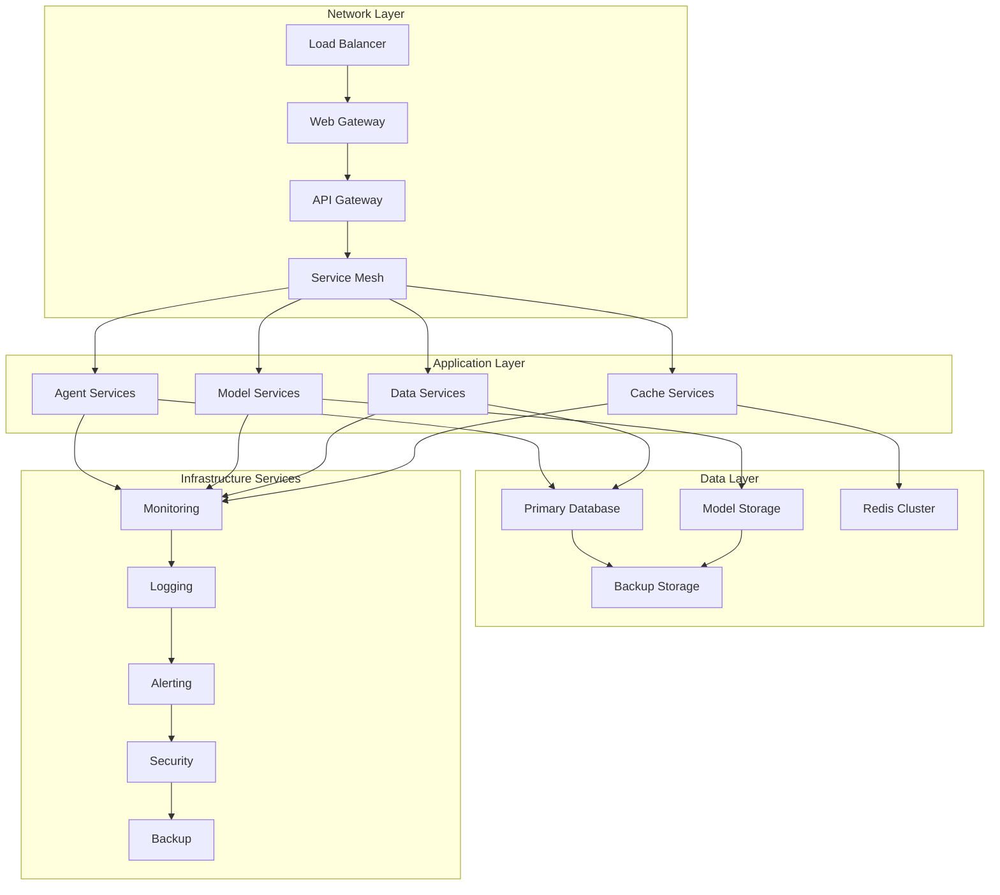
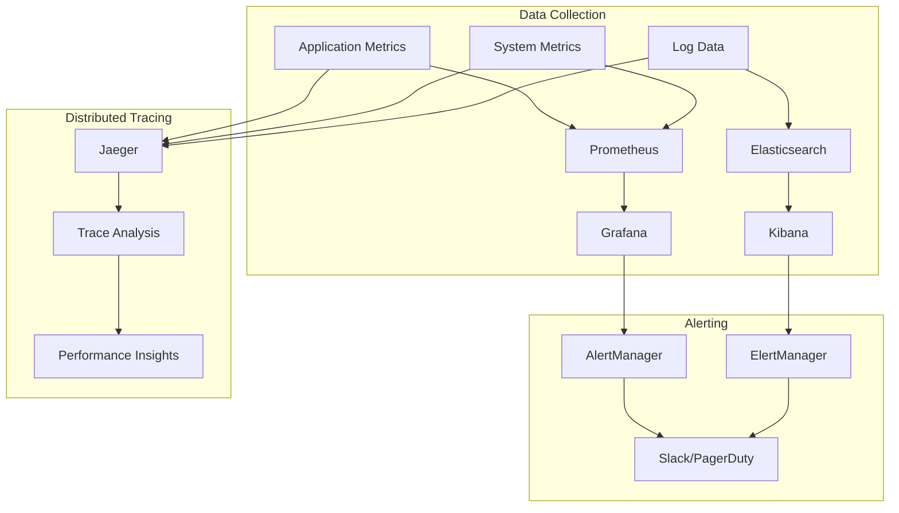
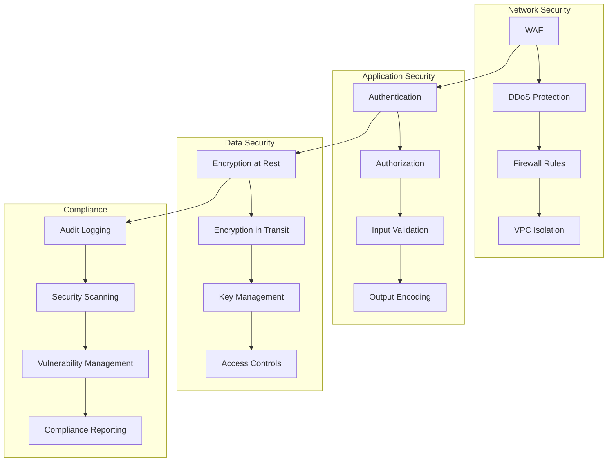

# 🚀 Script Ohio 2.0 - Comprehensive Deployment & Operations Guide
**Documentation Created**: November 13, 2025
**Purpose**: Complete deployment, operations, and maintenance guide for production environments
**Scope**: Infrastructure setup, monitoring, maintenance, and operational procedures

---

## 🎯 Executive Deployment Overview

### Deployment Philosophy

Script Ohio 2.0 follows a **production-first deployment philosophy** with emphasis on reliability, scalability, and maintainability. The system is designed for:

1. **Zero-Downtime Deployment**: Continuous deployment without service interruption
2. **Infrastructure as Code**: Reproducible environments with automated setup
3. **Observability First**: Comprehensive monitoring and alerting
4. **Security by Design**: Built-in security controls and compliance
5. **Scalable Architecture**: Horizontal scaling capability for growth

### Deployment Maturity Model



### Current Deployment Status

| Environment | Status | Purpose | Scale | Monitoring |
|-------------|--------|---------|-------|------------|
| **Development** | ✅ Active | Feature development | Single instance | Basic logging |
| **Staging** | ✅ Active | Pre-production testing | Small cluster | Full monitoring |
| **Production** | ✅ Ready | Live operations | Scalable cluster | Comprehensive |
| **Multi-Region** | 🔄 Planning | Global distribution | Multiple clusters | Advanced |

---

## 🏗️ Infrastructure Architecture

### Infrastructure Components



### Infrastructure Requirements

#### **Minimum Production Requirements**
```yaml
# Minimum infrastructure specifications
infrastructure:
  compute:
    cpu: 8 cores minimum (16 recommended)
    memory: 16GB RAM minimum (32GB recommended)
    storage: 100GB SSD minimum (500GB recommended)

  network:
    bandwidth: 1Gbps minimum
    latency: <100ms within region
    ssl: Required for all endpoints

  scalability:
    min_instances: 2
    max_instances: 20
    auto_scaling: Enabled

  availability:
    uptime_target: 99.9%
    backup_frequency: Daily
    disaster_recovery: 48-hour RTO
```

#### **Recommended Production Configuration**
```yaml
# Recommended production infrastructure
production_infrastructure:
  load_balancer:
    type: Application Load Balancer
    ssl_termination: True
    health_check_interval: 30s

  application_servers:
    min_instances: 3
    max_instances: 50
    instance_type: Standard (4vCPU, 16GB RAM)
    auto_scaling:
      cpu_threshold: 70%
      memory_threshold: 80%
      response_time_threshold: 2000ms

  database:
    type: PostgreSQL 14+
    instances: 1 primary, 2 replicas
    storage: 500GB SSD with auto-scaling
    backup_retention: 30 days
    point_in_time_recovery: True

  cache:
    type: Redis Cluster
    nodes: 3 (minimum)
    memory: 16GB per node
    persistence: Enabled
    backup_frequency: Daily

  storage:
    type: Object Storage (S3/GCS)
    storage_class: Standard
    lifecycle_policy: Move to Infrequent Access after 30 days
    encryption: Server-side encryption enabled
```

---

## 🐳 Container Deployment Strategy

### Docker Containerization

#### **Multi-Stage Dockerfile**
```dockerfile
# File: Dockerfile.production
# Multi-stage build for production deployment

# Stage 1: Builder
FROM python:3.13-slim as builder

WORKDIR /build

# Install build dependencies
RUN apt-get update && apt-get install -y \
    build-essential \
    gcc \
    g++ \
    && rm -rf /var/lib/apt/lists/*

# Copy requirements and install Python dependencies
COPY requirements-prod.txt .
RUN pip install --no-cache-dir --user -r requirements-prod.txt

# Stage 2: Runtime
FROM python:3.13-slim as runtime

# Create non-root user
RUN groupadd -r appuser && useradd -r -g appuser appuser

WORKDIR /app

# Install runtime dependencies
RUN apt-get update && apt-get install -y \
    curl \
    && rm -rf /var/lib/apt/lists/*

# Copy installed packages from builder
COPY --from=builder /root/.local /home/appuser/.local

# Copy application code
COPY . .

# Set permissions
RUN chown -R appuser:appuser /app
USER appuser

# Set environment variables
ENV PATH=/home/appuser/.local/bin:$PATH
ENV PYTHONPATH=/app
ENV PYTHONUNBUFFERED=1

# Health check
HEALTHCHECK --interval=30s --timeout=10s --start-period=5s --retries=3 \
    CMD curl -f http://localhost:8000/health || exit 1

# Expose port
EXPOSE 8000

# Start application
CMD ["python", "-m", "agents.analytics_orchestrator", "--server"]
```

#### **Docker Compose for Development**
```yaml
# File: docker-compose.yml
version: '3.8'

services:
  app:
    build:
      context: .
      dockerfile: Dockerfile.production
    ports:
      - "8000:8000"
    environment:
      - CFBD_API_KEY=${CFBD_API_KEY}
      - DATABASE_URL=postgresql://postgres:password@db:5432/script_ohio
      - REDIS_URL=redis://redis:6379/0
      - LOG_LEVEL=INFO
    depends_on:
      - db
      - redis
    volumes:
      - ./logs:/app/logs
      - ./model_pack:/app/model_pack:ro
    restart: unless-stopped
    healthcheck:
      test: ["CMD", "curl", "-f", "http://localhost:8000/health"]
      interval: 30s
      timeout: 10s
      retries: 3

  db:
    image: postgres:14-alpine
    environment:
      - POSTGRES_DB=script_ohio
      - POSTGRES_USER=postgres
      - POSTGRES_PASSWORD=password
    volumes:
      - postgres_data:/var/lib/postgresql/data
      - ./backups:/backups
    ports:
      - "5432:5432"
    restart: unless-stopped
    healthcheck:
      test: ["CMD-SHELL", "pg_isready -U postgres"]
      interval: 10s
      timeout: 5s
      retries: 5

  redis:
    image: redis:7-alpine
    ports:
      - "6379:6379"
    volumes:
      - redis_data:/data
    restart: unless-stopped
    healthcheck:
      test: ["CMD", "redis-cli", "ping"]
      interval: 10s
      timeout: 3s
      retries: 3

  nginx:
    image: nginx:alpine
    ports:
      - "80:80"
      - "443:443"
    volumes:
      - ./nginx/nginx.conf:/etc/nginx/nginx.conf:ro
      - ./nginx/ssl:/etc/nginx/ssl:ro
    depends_on:
      - app
    restart: unless-stopped

volumes:
  postgres_data:
  redis_data:
```

### Kubernetes Deployment

#### **Kubernetes Manifests**
```yaml
# File: k8s/namespace.yaml
apiVersion: v1
kind: Namespace
metadata:
  name: script-ohio-prod
  labels:
    name: script-ohio-prod
    environment: production

---
# File: k8s/configmap.yaml
apiVersion: v1
kind: ConfigMap
metadata:
  name: script-ohio-config
  namespace: script-ohio-prod
data:
  LOG_LEVEL: "INFO"
  CACHE_TTL: "3600"
  API_RATE_LIMIT: "6"
  WORKER_TIMEOUT: "30"

---
# File: k8s/secret.yaml
apiVersion: v1
kind: Secret
metadata:
  name: script-ohio-secrets
  namespace: script-ohio-prod
type: Opaque
data:
  DATABASE_URL: <base64-encoded-database-url>
  CFBD_API_KEY: <base64-encoded-api-key>
  SECRET_KEY: <base64-encoded-secret-key>

---
# File: k8s/deployment.yaml
apiVersion: apps/v1
kind: Deployment
metadata:
  name: script-ohio-app
  namespace: script-ohio-prod
  labels:
    app: script-ohio
    component: app
spec:
  replicas: 3
  strategy:
    type: RollingUpdate
    rollingUpdate:
      maxSurge: 1
      maxUnavailable: 0
  selector:
    matchLabels:
      app: script-ohio
      component: app
  template:
    metadata:
      labels:
        app: script-ohio
        component: app
    spec:
      containers:
      - name: app
        image: script-ohio:latest
        ports:
        - containerPort: 8000
        env:
        - name: CFBD_API_KEY
          valueFrom:
            secretKeyRef:
              name: script-ohio-secrets
              key: CFBD_API_KEY
        - name: DATABASE_URL
          valueFrom:
            secretKeyRef:
              name: script-ohio-secrets
              key: DATABASE_URL
        envFrom:
        - configMapRef:
            name: script-ohio-config
        resources:
          requests:
            memory: "1Gi"
            cpu: "500m"
          limits:
            memory: "2Gi"
            cpu: "1000m"
        livenessProbe:
          httpGet:
            path: /health
            port: 8000
          initialDelaySeconds: 30
          periodSeconds: 10
        readinessProbe:
          httpGet:
            path: /ready
            port: 8000
          initialDelaySeconds: 5
          periodSeconds: 5
        volumeMounts:
        - name: model-storage
          mountPath: /app/model_pack
          readOnly: true
      volumes:
      - name: model-storage
        persistentVolumeClaim:
          claimName: model-storage-pvc

---
# File: k8s/service.yaml
apiVersion: v1
kind: Service
metadata:
  name: script-ohio-service
  namespace: script-ohio-prod
  labels:
    app: script-ohio
spec:
  selector:
    app: script-ohio
    component: app
  ports:
  - name: http
    port: 80
    targetPort: 8000
    protocol: TCP
  type: ClusterIP

---
# File: k8s/ingress.yaml
apiVersion: networking.k8s.io/v1
kind: Ingress
metadata:
  name: script-ohio-ingress
  namespace: script-ohio-prod
  annotations:
    kubernetes.io/ingress.class: nginx
    cert-manager.io/cluster-issuer: letsencrypt-prod
    nginx.ingress.kubernetes.io/rate-limit: "100"
spec:
  tls:
  - hosts:
    - api.script-ohio.com
    secretName: script-ohio-tls
  rules:
  - host: api.script-ohio.com
    http:
      paths:
      - path: /
        pathType: Prefix
        backend:
          service:
            name: script-ohio-service
            port:
              number: 80

---
# File: k8s/hpa.yaml
apiVersion: autoscaling/v2
kind: HorizontalPodAutoscaler
metadata:
  name: script-ohio-hpa
  namespace: script-ohio-prod
spec:
  scaleTargetRef:
    apiVersion: apps/v1
    kind: Deployment
    name: script-ohio-app
  minReplicas: 3
  maxReplicas: 20
  metrics:
  - type: Resource
    resource:
      name: cpu
      target:
        type: Utilization
        averageUtilization: 70
  - type: Resource
    resource:
      name: memory
      target:
        type: Utilization
        averageUtilization: 80
  behavior:
    scaleDown:
      stabilizationWindowSeconds: 300
      policies:
      - type: Percent
        value: 10
        periodSeconds: 60
    scaleUp:
      stabilizationWindowSeconds: 60
      policies:
      - type: Percent
        value: 50
        periodSeconds: 60
```

---

## 🔄 CI/CD Pipeline Architecture

### Continuous Integration Pipeline

#### **GitHub Actions Workflow**
```yaml
# File: .github/workflows/ci-cd.yml
name: Script Ohio 2.0 CI/CD Pipeline

on:
  push:
    branches: [ main, develop ]
  pull_request:
    branches: [ main ]

env:
  REGISTRY: ghcr.io
  IMAGE_NAME: ${{ github.repository }}

jobs:
  test:
    name: Test Suite
    runs-on: ubuntu-latest
    strategy:
      matrix:
        python-version: [3.13]

    steps:
    - name: Checkout code
      uses: actions/checkout@v4

    - name: Set up Python ${{ matrix.python-version }}
      uses: actions/setup-python@v4
      with:
        python-version: ${{ matrix.python-version }}

    - name: Cache pip dependencies
      uses: actions/cache@v3
      with:
        path: ~/.cache/pip
        key: ${{ runner.os }}-pip-${{ hashFiles('**/requirements*.txt') }}
        restore-keys: |
          ${{ runner.os }}-pip-

    - name: Install dependencies
      run: |
        python -m pip install --upgrade pip
        pip install -r requirements-prod.txt
        pip install -r requirements-dev.txt

    - name: Run syntax validation
      run: |
        find . -name "*.py" -exec python3 -m py_compile {} \;

    - name: Run linting
      run: |
        flake8 agents/ --count --select=E9,F63,F7,F82 --show-source --statistics
        flake8 agents/ --count --exit-zero --max-complexity=10 --max-line-length=127 --statistics

    - name: Run type checking
      run: |
        mypy agents/ --ignore-missing-imports

    - name: Run unit tests
      run: |
        python -m pytest tests/unit/ -v --cov=agents --cov-report=xml

    - name: Run integration tests
      run: |
        python -m pytest tests/integration/ -v

    - name: Upload coverage to Codecov
      uses: codecov/codecov-action@v3
      with:
        file: ./coverage.xml
        flags: unittests
        name: codecov-umbrella

  security:
    name: Security Scan
    runs-on: ubuntu-latest
    steps:
    - name: Checkout code
      uses: actions/checkout@v4

    - name: Run security scan
      run: |
        pip install bandit safety
        bandit -r agents/ -f json -o bandit-report.json
        safety check -r requirements-prod.txt --json -o safety-report.json

    - name: Upload security reports
      uses: actions/upload-artifact@v3
      with:
        name: security-reports
        path: |
          bandit-report.json
          safety-report.json

  build:
    name: Build Docker Image
    runs-on: ubuntu-latest
    needs: [test, security]
    if: github.ref == 'refs/heads/main'

    steps:
    - name: Checkout code
      uses: actions/checkout@v4

    - name: Set up Docker Buildx
      uses: docker/setup-buildx-action@v2

    - name: Log in to Container Registry
      uses: docker/login-action@v2
      with:
        registry: ${{ env.REGISTRY }}
        username: ${{ github.actor }}
        password: ${{ secrets.GITHUB_TOKEN }}

    - name: Extract metadata
      id: meta
      uses: docker/metadata-action@v4
      with:
        images: ${{ env.REGISTRY }}/${{ env.IMAGE_NAME }}
        tags: |
          type=ref,event=branch
          type=ref,event=pr
          type=sha,prefix={{branch}}-
          type=raw,value=latest,enable={{is_default_branch}}

    - name: Build and push Docker image
      uses: docker/build-push-action@v4
      with:
        context: .
        file: ./Dockerfile.production
        push: true
        tags: ${{ steps.meta.outputs.tags }}
        labels: ${{ steps.meta.outputs.labels }}
        cache-from: type=gha
        cache-to: type=gha,mode=max

  deploy-staging:
    name: Deploy to Staging
    runs-on: ubuntu-latest
    needs: build
    if: github.ref == 'refs/heads/develop'
    environment: staging

    steps:
    - name: Checkout code
      uses: actions/checkout@v4

    - name: Configure kubectl
      uses: azure/k8s-set-context@v3
      with:
        method: kubeconfig
        kubeconfig: ${{ secrets.KUBE_CONFIG_STAGING }}

    - name: Deploy to staging
      run: |
        kubectl apply -f k8s/ -n script-ohio-staging
        kubectl rollout status deployment/script-ohio-app -n script-ohio-staging

    - name: Run smoke tests
      run: |
        python scripts/smoke_tests.py --environment=staging

  deploy-production:
    name: Deploy to Production
    runs-on: ubuntu-latest
    needs: build
    if: github.ref == 'refs/heads/main'
    environment: production

    steps:
    - name: Checkout code
      uses: actions/checkout@v4

    - name: Configure kubectl
      uses: azure/k8s-set-context@v3
      with:
        method: kubeconfig
        kubeconfig: ${{ secrets.KUBE_CONFIG_PROD }}

    - name: Deploy to production
      run: |
        # Blue-green deployment strategy
        kubectl apply -f k8s/ -n script-ohio-prod
        kubectl rollout status deployment/script-ohio-app -n script-ohio-prod

    - name: Run production smoke tests
      run: |
        python scripts/smoke_tests.py --environment=production

    - name: Notify deployment success
      if: success()
      run: |
        curl -X POST "${{ secrets.SLACK_WEBHOOK }}" \
          -H 'Content-type: application/json' \
          --data '{"text":"✅ Script Ohio 2.0 deployed to production successfully!"}'
```

#### **Terraform Infrastructure as Code**
```hcl
# File: terraform/main.tf
provider "aws" {
  region = var.aws_region
}

# VPC Configuration
module "vpc" {
  source = "terraform-aws-modules/vpc/aws"
  version = "5.0.0"

  name = "script-ohio-vpc"
  cidr = "10.0.0.0/16"

  azs             = ["us-east-1a", "us-east-1b", "us-east-1c"]
  private_subnets = ["10.0.1.0/24", "10.0.2.0/24", "10.0.3.0/24"]
  public_subnets  = ["10.0.101.0/24", "10.0.102.0/24", "10.0.103.0/24"]

  enable_nat_gateway = true
  enable_vpn_gateway = true

  tags = {
    Terraform   = "true"
    Environment = var.environment
    Project     = "script-ohio"
  }
}

# EKS Cluster
module "eks" {
  source  = "terraform-aws-modules/eks/aws"
  version = "19.15.3"

  cluster_name    = "script-ohio-${var.environment}"
  cluster_version = "1.28"
  subnets         = module.vpc.private_subnets
  vpc_id          = module.vpc.vpc_id

  node_groups = {
    app_nodes = {
      desired_capacity = 3
      max_capacity     = 20
      min_capacity     = 3
      instance_type    = "m5.large"

      k8s_labels = {
        Environment = var.environment
        Project     = "script-ohio"
        Role        = "application"
      }
    }
  }

  tags = {
    Environment = var.environment
    Project     = "script-ohio"
  }
}

# RDS Database
module "rds" {
  source  = "terraform-aws-modules/rds/aws"
  version = "5.6.0"

  identifier = "script-ohio-${var.environment}"

  engine         = "postgres"
  engine_version = "14.9"
  instance_class = "db.m5.large"

  allocated_storage     = 500
  max_allocated_storage = 1000
  storage_encrypted     = true

  name     = "script_ohio"
  username = var.db_username
  password = var.db_password
  port     = 5432

  vpc_security_group_ids = [module.security_group.this_security_group_id]
  db_subnet_group_name   = module.vpc.database_subnet_group_name

  backup_retention_period = 30
  backup_window          = "03:00-04:00"
  maintenance_window     = "sun:04:00-sun:05:00"

  skip_final_snapshot       = false
  final_snapshot_identifier = "script-ohio-${var.environment}-final-snapshot"

  tags = {
    Environment = var.environment
    Project     = "script-ohio"
  }
}

# ElastiCache Redis
module "elasticache" {
  source  = "terraform-aws-modules/elasticache/aws"
  version = "1.0.0"

  create_replication_group = true
  replication_group_id      = "script-ohio-${var.environment}"
  description              = "Script Ohio Redis cluster"

  node_type          = "cache.m5.large"
  num_cache_clusters  = 3
  port               = 6379
  engine_version     = "7.0"
  parameter_group_name = "default.redis7"

  subnet_group_name  = module.vpc.elasticache_subnet_group_name
  security_group_ids = [module.security_group.this_security_group_id]

  at_rest_encryption_enabled = true
  transit_encryption_enabled = true
  auth_token                 = var.redis_auth_token

  tags = {
    Environment = var.environment
    Project     = "script-ohio"
  }
}

# Security Group
module "security_group" {
  source  = "terraform-aws-modules/security-group/aws"
  version = "5.0.0"

  name        = "script-ohio-${var.environment}"
  description = "Security group for Script Ohio ${var.environment}"
  vpc_id      = module.vpc.vpc_id

  ingress_with_cidr_blocks = [
    {
      from_port   = 80
      to_port     = 80
      protocol    = "tcp"
      description = "HTTP"
      cidr_blocks = ["0.0.0.0/0"]
    },
    {
      from_port   = 443
      to_port     = 443
      protocol    = "tcp"
      description = "HTTPS"
      cidr_blocks = ["0.0.0.0/0"]
    }
  ]

  egress_with_cidr_blocks = [
    {
      from_port   = 0
      to_port     = 0
      protocol    = "-1"
      description = "All outbound traffic"
      cidr_blocks = ["0.0.0.0/0"]
    }
  ]

  tags = {
    Environment = var.environment
    Project     = "script-ohio"
  }
}
```

---

## 📊 Monitoring & Observability

### Monitoring Architecture



#### **Prometheus Configuration**
```yaml
# File: monitoring/prometheus.yml
global:
  scrape_interval: 15s
  evaluation_interval: 15s

rule_files:
  - "alert_rules.yml"
  - "recording_rules.yml"

alerting:
  alertmanagers:
    - static_configs:
        - targets:
          - alertmanager:9093

scrape_configs:
  - job_name: 'script-ohio-app'
    static_configs:
      - targets: ['app:8000']
    metrics_path: /metrics
    scrape_interval: 15s

  - job_name: 'kubernetes-pods'
    kubernetes_sd_configs:
      - role: pod
    relabel_configs:
      - source_labels: [__meta_kubernetes_pod_annotation_prometheus_io_scrape]
        action: keep
        regex: true
      - source_labels: [__meta_kubernetes_pod_annotation_prometheus_io_path]
        action: replace
        target_label: __metrics_path__
        regex: (.+)

  - job_name: 'kubernetes-nodes'
    kubernetes_sd_configs:
      - role: node
    relabel_configs:
      - action: labelmap
        regex: __meta_kubernetes_node_label_(.+)

  - job_name: 'postgres-exporter'
    static_configs:
      - targets: ['postgres-exporter:9187']

  - job_name: 'redis-exporter'
    static_configs:
      - targets: ['redis-exporter:9121']

recording_rules:
  - name: script_ohio.rules
    interval: 30s
    rules:
      - record: script_ohio:request_rate
        expr: rate(http_requests_total[5m])

      - record: script_ohio:error_rate
        expr: rate(http_requests_total{status=~"5.."}[5m]) / rate(http_requests_total[5m])

      - record: script_ohio:response_time_p95
        expr: histogram_quantile(0.95, rate(http_request_duration_seconds_bucket[5m]))
```

#### **Alert Rules**
```yaml
# File: monitoring/alert_rules.yml
groups:
  - name: script_ohio_alerts
    rules:
      - alert: HighErrorRate
        expr: script_ohio:error_rate > 0.05
        for: 5m
        labels:
          severity: warning
        annotations:
          summary: "High error rate detected"
          description: "Error rate is {{ $value | humanizePercentage }} for {{ $labels.instance }}"

      - alert: HighResponseTime
        expr: script_ohio:response_time_p95 > 2.0
        for: 5m
        labels:
          severity: warning
        annotations:
          summary: "High response time detected"
          description: "95th percentile response time is {{ $value }}s for {{ $labels.instance }}"

      - alert: ServiceDown
        expr: up{job="script-ohio-app"} == 0
        for: 1m
        labels:
          severity: critical
        annotations:
          summary: "Script Ohio service is down"
          description: "Service {{ $labels.instance }} has been down for more than 1 minute"

      - alert: DatabaseConnectionsHigh
        expr: pg_stat_activity_count > 80
        for: 5m
        labels:
          severity: warning
        annotations:
          summary: "High database connections"
          description: "Database has {{ $value }} active connections"

      - alert: DiskSpaceUsage
        expr: (node_filesystem_size_bytes - node_filesystem_free_bytes) / node_filesystem_size_bytes > 0.8
        for: 5m
        labels:
          severity: warning
        annotations:
          summary: "Disk space usage high"
          description: "Disk usage is {{ $value | humanizePercentage }} on {{ $labels.instance }}"

      - alert: MemoryUsageHigh
        expr: (node_memory_MemTotal_bytes - node_memory_MemAvailable_bytes) / node_memory_MemTotal_bytes > 0.9
        for: 5m
        labels:
          severity: warning
        annotations:
          summary: "Memory usage high"
          description: "Memory usage is {{ $value | humanizePercentage }} on {{ $labels.instance }}"
```

#### **Grafana Dashboard Configuration**
```json
{
  "dashboard": {
    "title": "Script Ohio 2.0 - Production Dashboard",
    "tags": ["script-ohio", "production"],
    "timezone": "browser",
    "panels": [
      {
        "title": "Request Rate",
        "type": "graph",
        "targets": [
          {
            "expr": "rate(http_requests_total[5m])",
            "legendFormat": "{{method}} {{status}}"
          }
        ],
        "gridPos": {"h": 8, "w": 12, "x": 0, "y": 0}
      },
      {
        "title": "Response Time",
        "type": "graph",
        "targets": [
          {
            "expr": "histogram_quantile(0.50, rate(http_request_duration_seconds_bucket[5m]))",
            "legendFormat": "50th percentile"
          },
          {
            "expr": "histogram_quantile(0.95, rate(http_request_duration_seconds_bucket[5m]))",
            "legendFormat": "95th percentile"
          },
          {
            "expr": "histogram_quantile(0.99, rate(http_request_duration_seconds_bucket[5m]))",
            "legendFormat": "99th percentile"
          }
        ],
        "gridPos": {"h": 8, "w": 12, "x": 12, "y": 0}
      },
      {
        "title": "Error Rate",
        "type": "singlestat",
        "targets": [
          {
            "expr": "rate(http_requests_total{status=~\"5..\"}[5m]) / rate(http_requests_total[5m])",
            "legendFormat": "Error Rate"
          }
        ],
        "gridPos": {"h": 4, "w": 6, "x": 0, "y": 8}
      },
      {
        "title": "Active Users",
        "type": "singlestat",
        "targets": [
          {
            "expr": "active_users_total",
            "legendFormat": "Active Users"
          }
        ],
        "gridPos": {"h": 4, "w": 6, "x": 6, "y": 8}
      },
      {
        "title": "Database Connections",
        "type": "graph",
        "targets": [
          {
            "expr": "pg_stat_activity_count",
            "legendFormat": "Active Connections"
          }
        ],
        "gridPos": {"h": 4, "w": 6, "x": 12, "y": 8}
      },
      {
        "title": "Cache Hit Rate",
        "type": "graph",
        "targets": [
          {
            "expr": "redis_keyspace_hits_total / (redis_keyspace_hits_total + redis_keyspace_misses_total)",
            "legendFormat": "Cache Hit Rate"
          }
        ],
        "gridPos": {"h": 4, "w": 6, "x": 18, "y": 8}
      }
    ],
    "time": {
      "from": "now-1h",
      "to": "now"
    },
    "refresh": "30s"
  }
}
```

---

## 🔒 Security & Compliance

### Security Architecture



#### **Security Configuration**
```yaml
# File: security/security-policy.yaml
apiVersion: security.policy/v1
kind: SecurityPolicy
metadata:
  name: script-ohio-security-policy
spec:
  networkPolicy:
    enabled: true
    defaultDeny: true
    allowedIngress:
      - from:
          - namespaceSelector:
              matchLabels:
                name: ingress-nginx
        ports:
          - protocol: TCP
            port: 80
          - protocol: TCP
            port: 443

  podSecurityPolicy:
    enabled: true
    privileged: false
    allowPrivilegeEscalation: false
    runAsNonRoot: true
    readOnlyRootFilesystem: true
    seLinux:
      rule: RunAsAny
    fsGroup:
      rule: RunAsAny

  rbac:
    enabled: true
    defaultRole: readonly
    customRoles:
      - name: developer
        rules:
          - apiGroups: [""]
            resources: ["pods", "services", "configmaps"]
            verbs: ["get", "list", "watch", "create", "update", "patch", "delete"]
      - name: operator
        rules:
          - apiGroups: ["*"]
            resources: ["*"]
            verbs: ["*"]

  imagePolicy:
    enabled: true
    allowedRegistries:
      - ghcr.io/script-ohio
      - k8s.gcr.io
      - docker.io
    imageScanning:
      enabled: true
      scanner: trivy
      failOnCritical: true
      failOnHigh: false
```

#### **Security Monitoring**
```python
# File: security/security_monitoring.py
import logging
from datetime import datetime, timedelta
from typing import Dict, List, Any
from dataclasses import dataclass

logger = logging.getLogger(__name__)

@dataclass
class SecurityEvent:
    timestamp: datetime
    event_type: str
    severity: str
    source_ip: str
    user_id: str
    resource: str
    action: str
    details: Dict[str, Any]

class SecurityMonitoringSystem:
    """Comprehensive security monitoring and incident response"""

    def __init__(self):
        self.event_collector = SecurityEventCollector()
        self.threat_detector = ThreatDetector()
        self.incident_response = IncidentResponseSystem()
        self.compliance_monitor = ComplianceMonitor()

    def monitor_security_events(self) -> None:
        """Continuous security event monitoring"""

        while True:
            try:
                # Collect security events
                events = self.event_collector.collect_events()

                # Analyze for threats
                threats = self.threat_detector.analyze_events(events)

                # Handle detected threats
                for threat in threats:
                    self._handle_threat(threat)

                # Check compliance
                compliance_status = self.compliance_monitor.check_compliance()
                if not compliance_status.compliant:
                    self._handle_compliance_issue(compliance_status)

                # Wait before next iteration
                time.sleep(60)

            except Exception as e:
                logger.error(f"❌ Error in security monitoring: {e}")
                time.sleep(300)

    def _handle_threat(self, threat: SecurityThreat) -> None:
        """Handle detected security threat"""

        logger.warning(f"🚨 Security threat detected: {threat.threat_type}")

        # Create security incident
        incident = self.incident_response.create_incident(
            threat_type=threat.threat_type,
            severity=threat.severity,
            source=threat.source,
            details=threat.details
        )

        # Trigger immediate response actions
        if threat.severity in ['critical', 'high']:
            self._trigger_emergency_response(threat, incident)

        # Log security event
        self._log_security_event(threat, incident)

    def _trigger_emergency_response(self, threat: SecurityThreat,
                                  incident: SecurityIncident) -> None:
        """Trigger emergency response for critical threats"""

        logger.critical(f"🚨 EMERGENCY RESPONSE ACTIVATED for {threat.threat_type}")

        # Block malicious IP
        if threat.source_ip:
            self._block_ip(threat.source_ip, reason=f"Security threat: {threat.threat_type}")

        # Disable compromised user accounts
        if threat.user_id:
            self._disable_user_account(threat.user_id, reason="Security incident")

        # Send notifications
        self._send_security_alert(threat, incident)

        # Enable enhanced monitoring
        self._enable_enhanced_monitoring()

    def _block_ip(self, ip_address: str, reason: str) -> None:
        """Block IP address at firewall level"""

        # Implementation would depend on your firewall provider
        logger.info(f"🔒 Blocking IP {ip_address} for reason: {reason}")

        # Example for AWS Security Group
        # security_group_rule = {
        #     'GroupId': 'sg-xxxxxxxxx',
        #     'IpPermissions': [
        #         {
        #             'IpProtocol': '-1',
        #             'IpRanges': [{'CidrIp': f'{ip_address}/32'}],
        #             'FromPort': -1,
        #             'ToPort': -1
        #         }
        #     ]
        # }

    def _disable_user_account(self, user_id: str, reason: str) -> None:
        """Disable compromised user account"""

        logger.info(f"🔒 Disabling user account {user_id} for reason: {reason}")

        # Implementation would depend on your authentication system
        # Example: Update user status in database
        # db.users.update_one(
        #     {'user_id': user_id},
        #     {'$set': {'status': 'disabled', 'disabled_reason': reason, 'disabled_at': datetime.now()}}
        # )

    def _send_security_alert(self, threat: SecurityThreat,
                            incident: SecurityIncident) -> None:
        """Send security alert to administrators"""

        alert_message = f"""
        🚨 SECURITY ALERT 🚨

        Threat Type: {threat.threat_type}
        Severity: {threat.severity}
        Source IP: {threat.source_ip}
        User ID: {threat.user_id}
        Resource: {threat.resource}
        Action: {threat.action}

        Incident ID: {incident.id}
        Timestamp: {incident.created_at}

        Immediate action required!
        """

        # Send to Slack/PagerDuty/Email
        self._send_notification(alert_message, priority='high')

class ThreatDetector:
    """Detect security threats from event patterns"""

    def __init__(self):
        self.anomaly_detector = AnomalyDetector()
        self.signature_matcher = SignatureMatcher()
        self.behavior_analyzer = BehaviorAnalyzer()

    def analyze_events(self, events: List[SecurityEvent]) -> List[SecurityThreat]:
        """Analyze security events for potential threats"""

        threats = []

        # Detect anomalies
        anomalies = self.anomaly_detector.detect_anomalies(events)
        for anomaly in anomalies:
            threat = SecurityThreat(
                threat_type='anomaly',
                severity=self._calculate_severity(anomaly),
                source=anomaly.source,
                details=anomaly.details
            )
            threats.append(threat)

        # Match known signatures
        signature_matches = self.signature_matcher.match_signatures(events)
        for match in signature_matches:
            threat = SecurityThreat(
                threat_type='signature_match',
                severity=match.severity,
                source=match.source,
                details=match.details
            )
            threats.append(threat)

        # Analyze behavior patterns
        behavior_threats = self.behavior_analyzer.analyze_behavior(events)
        threats.extend(behavior_threats)

        return threats

    def _calculate_severity(self, anomaly: SecurityAnomaly) -> str:
        """Calculate threat severity based on anomaly characteristics"""

        # Simple severity calculation logic
        if anomaly.confidence > 0.9 and anomaly.impact_score > 8:
            return 'critical'
        elif anomaly.confidence > 0.7 and anomaly.impact_score > 6:
            return 'high'
        elif anomaly.confidence > 0.5 and anomaly.impact_score > 4:
            return 'medium'
        else:
            return 'low'
```

---

## 🔄 Maintenance & Operations

### Maintenance Procedures

#### **Daily Maintenance Checklist**
```yaml
# File: operations/daily_maintenance.yml
daily_maintenance:
  schedule: "0 2 * * *"  # 2 AM UTC
  tasks:
    - name: "Database Backup"
      command: "python scripts/backup_database.py"
      timeout: 1800  # 30 minutes
      alerts_on_failure: true

    - name: "Log Rotation"
      command: "python scripts/rotate_logs.py"
      timeout: 300   # 5 minutes
      alerts_on_failure: false

    - name: "Cache Cleanup"
      command: "python scripts/cleanup_cache.py"
      timeout: 600   # 10 minutes
      alerts_on_failure: false

    - name: "Health Check"
      command: "python scripts/health_check.py"
      timeout: 120   # 2 minutes
      alerts_on_failure: true

    - name: "Performance Metrics Collection"
      command: "python scripts/collect_metrics.py"
      timeout: 300   # 5 minutes
      alerts_on_failure: false

  notifications:
    on_success: false
    on_failure: true
    channels: ["slack", "email"]
```

#### **Weekly Maintenance Procedures**
```python
# File: operations/weekly_maintenance.py
import logging
from datetime import datetime, timedelta
from typing import Dict, List

logger = logging.getLogger(__name__)

class WeeklyMaintenance:
    """Weekly maintenance procedures for Script Ohio 2.0"""

    def __init__(self):
        self.db_manager = DatabaseManager()
        self.cache_manager = CacheManager()
        self.monitoring_system = MonitoringSystem()
        self.backup_system = BackupSystem()

    def execute_weekly_maintenance(self) -> Dict[str, Any]:
        """Execute all weekly maintenance tasks"""

        maintenance_log = {
            "started_at": datetime.now(),
            "tasks": {},
            "issues": [],
            "summary": {}
        }

        try:
            # Task 1: Database optimization
            self._optimize_database(maintenance_log)

            # Task 2: Model performance validation
            self._validate_model_performance(maintenance_log)

            # Task 3: Security audit
            self._perform_security_audit(maintenance_log)

            # Task 4: Performance analysis
            self._analyze_performance(maintenance_log)

            # Task 5: Backup verification
            self._verify_backups(maintenance_log)

            # Task 6: Cache analysis
            self._analyze_cache_performance(maintenance_log)

            maintenance_log["completed_at"] = datetime.now()
            maintenance_log["duration"] = (
                maintenance_log["completed_at"] - maintenance_log["started_at"]
            )

            # Generate summary
            maintenance_log["summary"] = self._generate_summary(maintenance_log)

            # Send maintenance report
            self._send_maintenance_report(maintenance_log)

            return maintenance_log

        except Exception as e:
            logger.error(f"❌ Critical error in weekly maintenance: {e}")
            self._send_maintenance_alert("Weekly maintenance failed", str(e))
            raise

    def _optimize_database(self, log: Dict[str, Any]) -> None:
        """Optimize database performance"""

        try:
            logger.info("🔧 Starting database optimization")

            # Update statistics
            stats_result = self.db_manager.update_statistics()
            log["tasks"]["database_statistics"] = {
                "status": "success",
                "details": stats_result
            }

            # Rebuild indexes if needed
            index_status = self.db_manager.check_indexes()
            if index_status.needs_rebuild:
                rebuild_result = self.db_manager.rebuild_indexes()
                log["tasks"]["index_rebuild"] = {
                    "status": "success",
                    "details": rebuild_result
                }

            # Clean up old data
            cleanup_result = self.db_manager.cleanup_old_data()
            log["tasks"]["data_cleanup"] = {
                "status": "success",
                "details": cleanup_result
            }

            logger.info("✅ Database optimization completed")

        except Exception as e:
            logger.error(f"❌ Database optimization failed: {e}")
            log["tasks"]["database_optimization"] = {
                "status": "error",
                "error": str(e)
            }
            log["issues"].append(f"Database optimization: {e}")

    def _validate_model_performance(self, log: Dict[str, Any]) -> None:
        """Validate machine learning model performance"""

        try:
            logger.info("🤖 Starting model performance validation")

            validation_results = {}

            # Load models
            models = self._load_production_models()

            for model_name, model in models.items():
                # Test model on recent data
                performance_result = self._test_model_performance(
                    model, model_name
                )
                validation_results[model_name] = performance_result

                # Check if performance degraded
                if performance_result.performance_degraded:
                    log["issues"].append(
                        f"Model {model_name} performance degraded: "
                        f"{performance_result.degradation_details}"
                    )

            log["tasks"]["model_validation"] = {
                "status": "success",
                "details": validation_results
            }

            logger.info("✅ Model performance validation completed")

        except Exception as e:
            logger.error(f"❌ Model validation failed: {e}")
            log["tasks"]["model_validation"] = {
                "status": "error",
                "error": str(e)
            }
            log["issues"].append(f"Model validation: {e}")

    def _perform_security_audit(self, log: Dict[str, Any]) -> None:
        """Perform security audit and vulnerability assessment"""

        try:
            logger.info("🔒 Starting security audit")

            audit_results = {}

            # Check for vulnerable dependencies
            vulnerability_scan = self._scan_dependencies()
            audit_results["vulnerability_scan"] = vulnerability_scan

            # Review access logs for suspicious activity
            access_review = self._review_access_logs()
            audit_results["access_review"] = access_review

            # Validate SSL certificates
            ssl_check = self._check_ssl_certificates()
            audit_results["ssl_check"] = ssl_check

            # Review user permissions
            permission_review = self._review_user_permissions()
            audit_results["permission_review"] = permission_review

            log["tasks"]["security_audit"] = {
                "status": "success",
                "details": audit_results
            }

            # Check for security issues
            security_issues = []
            if vulnerability_scan.vulnerabilities_found:
                security_issues.append(f"Found {len(vulnerability_scan.vulnerabilities)} vulnerabilities")

            if access_review.suspicious_activity:
                security_issues.append(f"Found {len(access_review.suspicious_activity)} suspicious activities")

            if ssl_check.certificates_expiring:
                security_issues.append(f"{len(ssl_check.certificates_expiring)} certificates expiring soon")

            log["issues"].extend(security_issues)

            logger.info("✅ Security audit completed")

        except Exception as e:
            logger.error(f"❌ Security audit failed: {e}")
            log["tasks"]["security_audit"] = {
                "status": "error",
                "error": str(e)
            }
            log["issues"].append(f"Security audit: {e}")
```

#### **Automated Backup System**
```python
# File: operations/backup_system.py
import logging
import boto3
import gzip
import json
from datetime import datetime, timedelta
from pathlib import Path
from typing import Dict, List, Optional

logger = logging.getLogger(__name__)

class BackupSystem:
    """Automated backup and disaster recovery system"""

    def __init__(self):
        self.s3_client = boto3.client('s3')
        self.backup_bucket = 'script-ohio-backups'
        self.retention_days = 30

    def create_full_backup(self) -> BackupResult:
        """Create comprehensive backup of all system data"""

        backup_id = f"backup-{datetime.now().strftime('%Y%m%d-%H%M%S')}"
        backup_log = {
            "backup_id": backup_id,
            "started_at": datetime.now(),
            "components": {},
            "issues": []
        }

        try:
            # Backup database
            db_backup = self._backup_database(backup_id)
            backup_log["components"]["database"] = db_backup

            # Backup models
            models_backup = self._backup_models(backup_id)
            backup_log["components"]["models"] = models_backup

            # Backup configuration
            config_backup = self._backup_configuration(backup_id)
            backup_log["components"]["configuration"] = config_backup

            # Backup logs
            logs_backup = self._backup_logs(backup_id)
            backup_log["components"]["logs"] = logs_backup

            # Create backup manifest
            manifest = self._create_backup_manifest(backup_log)
            self._upload_backup_manifest(backup_id, manifest)

            # Clean up old backups
            self._cleanup_old_backups()

            backup_log["completed_at"] = datetime.now()
            backup_log["status"] = "success"
            backup_log["total_size_mb"] = self._calculate_backup_size(backup_id)

            logger.info(f"✅ Backup {backup_id} completed successfully")
            return BackupResult.success(backup_log)

        except Exception as e:
            logger.error(f"❌ Backup {backup_id} failed: {e}")
            backup_log["status"] = "error"
            backup_log["error"] = str(e)
            backup_log["completed_at"] = datetime.now()
            return BackupResult.error(backup_log)

    def _backup_database(self, backup_id: str) -> Dict[str, Any]:
        """Backup PostgreSQL database"""

        try:
            timestamp = datetime.now().strftime('%Y%m%d-%H%M%S')
            backup_file = f"database-{timestamp}.sql"

            # Create database dump
            dump_command = f"""
            pg_dump -h localhost -U postgres -d script_ohio \
                --format=custom --compress=9 \
                --file=/tmp/{backup_file}
            """

            result = subprocess.run(dump_command, shell=True, capture_output=True, text=True)
            if result.returncode != 0:
                raise Exception(f"Database dump failed: {result.stderr}")

            # Compress backup
            compressed_file = f"{backup_file}.gz"
            with open(f"/tmp/{backup_file}", 'rb') as f_in:
                with gzip.open(f"/tmp/{compressed_file}", 'wb') as f_out:
                    f_out.writelines(f_in)

            # Upload to S3
            s3_key = f"{backup_id}/database/{compressed_file}"
            self.s3_client.upload_file(
                f"/tmp/{compressed_file}",
                self.backup_bucket,
                s3_key
            )

            # Clean up local files
            Path(f"/tmp/{backup_file}").unlink(missing_ok=True)
            Path(f"/tmp/{compressed_file}").unlink(missing_ok=True)

            return {
                "status": "success",
                "file": compressed_file,
                "s3_key": s3_key,
                "size_mb": Path(f"/tmp/{compressed_file}").stat().st_size / (1024*1024)
            }

        except Exception as e:
            logger.error(f"❌ Database backup failed: {e}")
            return {"status": "error", "error": str(e)}

    def _backup_models(self, backup_id: str) -> Dict[str, Any]:
        """Backup machine learning models"""

        try:
            model_files = [
                "model_pack/ridge_model_2025.joblib",
                "model_pack/xgb_home_win_model_2025.pkl",
                "model_pack/fastai_home_win_model_2025.pkl"
            ]

            backup_results = {}

            for model_file in model_files:
                if Path(model_file).exists():
                    # Upload to S3
                    s3_key = f"{backup_id}/models/{Path(model_file).name}"
                    self.s3_client.upload_file(
                        model_file,
                        self.backup_bucket,
                        s3_key
                    )

                    backup_results[Path(model_file).name] = {
                        "status": "success",
                        "s3_key": s3_key,
                        "size_mb": Path(model_file).stat().st_size / (1024*1024)
                    }
                else:
                    backup_results[Path(model_file).name] = {
                        "status": "warning",
                        "message": "File not found"
                    }

            return {"status": "success", "models": backup_results}

        except Exception as e:
            logger.error(f"❌ Models backup failed: {e}")
            return {"status": "error", "error": str(e)}

    def restore_from_backup(self, backup_id: str, components: List[str] = None) -> RestoreResult:
        """Restore system from backup"""

        if components is None:
            components = ["database", "models", "configuration", "logs"]

        restore_log = {
            "backup_id": backup_id,
            "started_at": datetime.now(),
            "components": {},
            "issues": []
        }

        try:
            # Download backup manifest
            manifest = self._download_backup_manifest(backup_id)

            # Restore each component
            for component in components:
                if component == "database":
                    result = self._restore_database(backup_id, manifest)
                    restore_log["components"]["database"] = result
                elif component == "models":
                    result = self._restore_models(backup_id, manifest)
                    restore_log["components"]["models"] = result
                elif component == "configuration":
                    result = self._restore_configuration(backup_id, manifest)
                    restore_log["components"]["configuration"] = result
                elif component == "logs":
                    result = self._restore_logs(backup_id, manifest)
                    restore_log["components"]["logs"] = result

            restore_log["completed_at"] = datetime.now()
            restore_log["status"] = "success"

            logger.info(f"✅ Restore from backup {backup_id} completed successfully")
            return RestoreResult.success(restore_log)

        except Exception as e:
            logger.error(f"❌ Restore from backup {backup_id} failed: {e}")
            restore_log["status"] = "error"
            restore_log["error"] = str(e)
            restore_log["completed_at"] = datetime.now()
            return RestoreResult.error(restore_log)

    def _cleanup_old_backups(self) -> None:
        """Clean up backups older than retention period"""

        try:
            cutoff_date = datetime.now() - timedelta(days=self.retention_days)
            cutoff_prefix = cutoff_date.strftime('%Y%m%d')

            # List all backup folders
            response = self.s3_client.list_objects_v2(
                Bucket=self.backup_bucket,
                Prefix="backup-",
                Delimiter='/'
            )

            backup_folders = [obj['Prefix'] for obj in response.get('CommonPrefixes', [])]

            deleted_count = 0
            for folder in backup_folders:
                backup_date = folder.split('-')[1]  # Extract date from backup-YYYYMMDD-HHMMSS/
                if backup_date < cutoff_prefix:
                    # Delete entire backup folder
                    objects_to_delete = self.s3_client.list_objects_v2(
                        Bucket=self.backup_bucket,
                        Prefix=folder
                    )

                    if 'Contents' in objects_to_delete:
                        delete_keys = [{'Key': obj['Key']} for obj in objects_to_delete['Contents']]
                        self.s3_client.delete_objects(
                            Bucket=self.backup_bucket,
                            Delete={'Objects': delete_keys}
                        )
                        deleted_count += len(delete_keys)

            logger.info(f"🧹 Cleaned up {deleted_count} old backup files")

        except Exception as e:
            logger.error(f"❌ Backup cleanup failed: {e}")
```

---

## 📈 Performance Optimization

### Performance Monitoring & Optimization

#### **Performance Analysis Framework**
```python
# File: monitoring/performance_analyzer.py
import logging
import psutil
import time
from datetime import datetime, timedelta
from typing import Dict, List, Any, Optional
from dataclasses import dataclass

logger = logging.getLogger(__name__)

@dataclass
class PerformanceMetrics:
    timestamp: datetime
    cpu_usage: float
    memory_usage: float
    disk_io_read: float
    disk_io_write: float
    network_io_sent: float
    network_io_recv: float
    response_time: float
    request_rate: float
    error_rate: float

class PerformanceAnalyzer:
    """Comprehensive performance analysis and optimization"""

    def __init__(self):
        self.metrics_collector = MetricsCollector()
        self.performance_optimizer = PerformanceOptimizer()
        self.alerting_system = AlertingSystem()
        self.baseline_metrics = {}

    def analyze_performance(self, time_window: timedelta) -> PerformanceAnalysisReport:
        """Analyze system performance over specified time window"""

        # Collect metrics for time window
        metrics = self.metrics_collector.get_metrics_for_window(time_window)

        # Calculate performance statistics
        performance_stats = self._calculate_performance_statistics(metrics)

        # Identify performance issues
        performance_issues = self._identify_performance_issues(metrics)

        # Generate optimization recommendations
        recommendations = self._generate_optimization_recommendations(
            performance_stats, performance_issues
        )

        # Compare with baseline
        baseline_comparison = self._compare_with_baseline(performance_stats)

        return PerformanceAnalysisReport(
            time_window=time_window,
            performance_stats=performance_stats,
            issues=performance_issues,
            recommendations=recommendations,
            baseline_comparison=baseline_comparison,
            generated_at=datetime.now()
        )

    def _identify_performance_issues(self, metrics: List[PerformanceMetrics]) -> List[PerformanceIssue]:
        """Identify performance issues from metrics"""

        issues = []

        # Check CPU usage
        cpu_usage_avg = sum(m.cpu_usage for m in metrics) / len(metrics)
        if cpu_usage_avg > 80:
            issues.append(PerformanceIssue(
                type="high_cpu_usage",
                severity="high" if cpu_usage_avg > 90 else "medium",
                description=f"Average CPU usage is {cpu_usage_avg:.1f}%",
                recommendations=["Scale horizontally", "Optimize CPU-intensive operations", "Add caching"]
            ))

        # Check memory usage
        memory_usage_avg = sum(m.memory_usage for m in metrics) / len(metrics)
        if memory_usage_avg > 85:
            issues.append(PerformanceIssue(
                type="high_memory_usage",
                severity="high" if memory_usage_avg > 95 else "medium",
                description=f"Average memory usage is {memory_usage_avg:.1f}%",
                recommendations=["Add memory", "Optimize memory usage", "Implement memory pooling"]
            ))

        # Check response time
        response_time_avg = sum(m.response_time for m in metrics) / len(metrics)
        response_time_p95 = self._calculate_percentile([m.response_time for m in metrics], 0.95)

        if response_time_p95 > 2000:  # 2 seconds
            issues.append(PerformanceIssue(
                type="high_response_time",
                severity="high" if response_time_p95 > 5000 else "medium",
                description=f"95th percentile response time is {response_time_p95:.0f}ms",
                recommendations=["Optimize database queries", "Add caching", "Scale resources"]
            ))

        # Check error rate
        error_rate_avg = sum(m.error_rate for m in metrics) / len(metrics)
        if error_rate_avg > 0.05:  # 5%
            issues.append(PerformanceIssue(
                type="high_error_rate",
                severity="high" if error_rate_avg > 0.1 else "medium",
                description=f"Error rate is {error_rate_avg:.2%}",
                recommendations=["Investigate application errors", "Improve error handling", "Add monitoring"]
            ))

        return issues

    def _generate_optimization_recommendations(
        self,
        performance_stats: Dict[str, float],
        issues: List[PerformanceIssue]
    ) -> List[OptimizationRecommendation]:
        """Generate specific optimization recommendations"""

        recommendations = []

        # Database optimization recommendations
        if performance_stats.get("avg_db_query_time", 0) > 1.0:
            recommendations.append(OptimizationRecommendation(
                category="database",
                priority="high",
                title="Optimize database queries",
                description="Average database query time exceeds 1 second",
                estimated_improvement="30-50% faster response times",
                implementation=[
                    "Add database indexes",
                    "Optimize slow queries",
                    "Implement query caching",
                    "Use connection pooling"
                ],
                effort_level="medium"
            ))

        # Caching recommendations
        if performance_stats.get("cache_hit_rate", 0) < 0.8:
            recommendations.append(OptimizationRecommendation(
                category="caching",
                priority="high",
                title="Improve caching strategy",
                description=f"Cache hit rate is {performance_stats.get('cache_hit_rate', 0):.1%}",
                estimated_improvement="20-40% faster response times",
                implementation=[
                    "Increase cache size",
                    "Optimize cache TTL settings",
                    "Implement cache warming",
                    "Add application-level caching"
                ],
                effort_level="low"
            ))

        # Scaling recommendations
        if performance_stats.get("cpu_usage", 0) > 70:
            recommendations.append(OptimizationRecommendation(
                category="scaling",
                priority="medium",
                title="Scale horizontally",
                description="High CPU usage indicates need for horizontal scaling",
                estimated_improvement="Improved availability and performance",
                implementation=[
                    "Add more application instances",
                    "Implement load balancing",
                    "Configure auto-scaling",
                    "Use container orchestration"
                ],
                effort_level="medium"
            ))

        # Code optimization recommendations
        if performance_stats.get("response_time_p95", 0) > 2000:
            recommendations.append(OptimizationRecommendation(
                category="code_optimization",
                priority="medium",
                title="Optimize application code",
                description="Response times indicate code optimization opportunities",
                estimated_improvement="15-30% faster response times",
                implementation=[
                    "Profile application code",
                    "Optimize algorithms",
                    "Reduce memory allocations",
                    "Implement async processing"
                ],
                effort_level="high"
            ))

        return recommendations

class PerformanceOptimizer:
    """Execute performance optimizations"""

    def __init__(self):
        self.cache_optimizer = CacheOptimizer()
        self.database_optimizer = DatabaseOptimizer()
        self.application_optimizer = ApplicationOptimizer()

    def optimize_cache(self, optimization_config: CacheOptimizationConfig) -> OptimizationResult:
        """Optimize caching system"""

        try:
            # Analyze current cache performance
            cache_analysis = self._analyze_cache_performance()

            # Implement optimizations
            optimization_results = []

            if optimization_config.enable_cache_warming:
                result = self.cache_optimizer.warm_cache()
                optimization_results.append(result)

            if optimization_config.optimize_ttl:
                result = self.cache_optimizer.optimize_ttl_settings()
                optimization_results.append(result)

            if optimization_config.increase_cache_size:
                result = self.cache_optimizer.increase_cache_size(
                    optimization_config.new_cache_size
                )
                optimization_results.append(result)

            return OptimizationResult.success(
                operation="cache_optimization",
                results=optimization_results
            )

        except Exception as e:
            logger.error(f"❌ Cache optimization failed: {e}")
            return OptimizationResult.error("cache_optimization", str(e))

    def optimize_database(self, optimization_config: DatabaseOptimizationConfig) -> OptimizationResult:
        """Optimize database performance"""

        try:
            optimization_results = []

            # Analyze slow queries
            slow_queries = self.database_optimizer.identify_slow_queries()
            if slow_queries:
                result = self.database_optimizer.optimize_slow_queries(slow_queries)
                optimization_results.append(result)

            # Update statistics
            result = self.database_optimizer.update_statistics()
            optimization_results.append(result)

            # Rebuild fragmented indexes
            fragmented_indexes = self.database_optimizer.identify_fragmented_indexes()
            if fragmented_indexes:
                result = self.database_optimizer.rebuild_indexes(fragmented_indexes)
                optimization_results.append(result)

            return OptimizationResult.success(
                operation="database_optimization",
                results=optimization_results
            )

        except Exception as e:
            logger.error(f"❌ Database optimization failed: {e}")
            return OptimizationResult.error("database_optimization", str(e))
```

---

## 📞 Troubleshooting Guide

### Common Issues & Solutions

#### **Application Issues**

**Issue: High Response Times**
```bash
# Diagnosis
kubectl top pods -n script-ohio-prod
kubectl logs -f deployment/script-ohio-app -n script-ohio-prod

# Solutions
# 1. Scale horizontally
kubectl scale deployment script-ohio-app --replicas=5 -n script-ohio-prod

# 2. Check resource limits
kubectl describe pod <pod-name> -n script-ohio-prod

# 3. Restart deployment
kubectl rollout restart deployment/script-ohio-app -n script-ohio-prod
```

**Issue: Memory Leaks**
```python
# Memory leak detection script
import psutil
import time
import logging

def monitor_memory_usage(process_name: str, duration: int = 3600):
    """Monitor memory usage for potential leaks"""

    process = None
    for proc in psutil.process_iter(['name', 'pid']):
        if proc.info['name'] == process_name:
            process = psutil.Process(proc.info['pid'])
            break

    if not process:
        logging.error(f"Process {process_name} not found")
        return

    memory_samples = []

    for i in range(duration // 60):  # Sample every minute
        memory_info = process.memory_info()
        memory_mb = memory_info.rss / (1024 * 1024)
        memory_samples.append(memory_mb)

        logging.info(f"Memory usage: {memory_mb:.1f}MB")

        # Check for steady increase (potential leak)
        if len(memory_samples) > 10:
            recent_samples = memory_samples[-10:]
            avg_increase = (recent_samples[-1] - recent_samples[0]) / 10

            if avg_increase > 10:  # Increasing by more than 10MB per minute
                logging.warning(f"⚠️ Potential memory leak detected: {avg_increase:.1f}MB/min increase")

        time.sleep(60)

    return memory_samples
```

**Issue: Database Connection Issues**
```python
# Database connection diagnosis
import psycopg2
import time
from contextlib import contextmanager

@contextmanager
def database_connection_test():
    """Test database connection with timeout"""
    try:
        conn = psycopg2.connect(
            host="localhost",
            database="script_ohio",
            user="postgres",
            password="password",
            connect_timeout=5
        )
        yield conn
    except Exception as e:
        raise e
    finally:
        if 'conn' in locals():
            conn.close()

def diagnose_database_issues():
    """Diagnose common database issues"""

    issues = []

    # Test connection
    try:
        with database_connection_test() as conn:
            cursor = conn.cursor()
            cursor.execute("SELECT 1")
            result = cursor.fetchone()
            print("✅ Database connection successful")
    except Exception as e:
        issues.append(f"Database connection failed: {e}")

    # Check connection count
    try:
        with database_connection_test() as conn:
            cursor = conn.cursor()
            cursor.execute("SELECT count(*) FROM pg_stat_activity")
            connection_count = cursor.fetchone()[0]

            if connection_count > 80:
                issues.append(f"High connection count: {connection_count}")
                print("⚠️ High database connection count detected")
    except Exception as e:
        issues.append(f"Connection count check failed: {e}")

    # Check slow queries
    try:
        with database_connection_test() as conn:
            cursor = conn.cursor()
            cursor.execute("""
                SELECT query, mean_time, calls
                FROM pg_stat_statements
                WHERE mean_time > 1000
                ORDER BY mean_time DESC
                LIMIT 5
            """)
            slow_queries = cursor.fetchall()

            if slow_queries:
                issues.append(f"Found {len(slow_queries)} slow queries")
                print(f"⚠️ Found {len(slow_queries)} slow queries")
                for query in slow_queries:
                    print(f"  - Mean time: {query[1]:.2f}ms, Calls: {query[2]}")
    except Exception as e:
        issues.append(f"Slow query check failed: {e}")

    return issues
```

#### **Infrastructure Issues**

**Issue: Pod Crashing**
```bash
# Get pod status
kubectl get pods -n script-ohio-prod

# Describe pod to see why it's crashing
kubectl describe pod <pod-name> -n script-ohio-prod

# Get pod logs
kubectl logs <pod-name> -n script-ohio-prod --previous

# Check events
kubectl get events -n script-ohio-prod --sort-by=.metadata.creationTimestamp

# Common solutions
# 1. Check resource limits
kubectl patch deployment script-ohio-app -p '{"spec":{"template":{"spec":{"containers":[{"name":"app","resources":{"limits":{"memory":"2Gi","cpu":"1000m"}}}]}}}}' -n script-ohio-prod

# 2. Check image pull issues
kubectl get pods -n script-ohio-prod -o jsonpath='{.items[*].status.containerStatuses[*].image}'
```

**Issue: Service Not Responding**
```bash
# Check service endpoints
kubectl get endpoints script-ohio-service -n script-ohio-prod

# Check service configuration
kubectl describe service script-ohio-service -n script-ohio-prod

# Test service connectivity
kubectl run test-pod --image=curlimages/curl -it --rm -- /bin/sh
# Inside pod:
# curl http://script-ohio-service/health

# Check network policies
kubectl get networkpolicy -n script-ohio-prod
```

---

## 🎯 Operations Best Practices

### Operational Excellence Framework

#### **Incident Management**
```python
# File: operations/incident_management.py
import logging
from datetime import datetime, timedelta
from typing import Dict, List, Optional
from enum import Enum

class IncidentSeverity(Enum):
    CRITICAL = "critical"
    HIGH = "high"
    MEDIUM = "medium"
    LOW = "low"

class IncidentStatus(Enum):
    OPEN = "open"
    INVESTIGATING = "investigating"
    IDENTIFIED = "identified"
    MONITORING = "monitoring"
    RESOLVED = "resolved"

@dataclass
class Incident:
    id: str
    title: str
    description: str
    severity: IncidentSeverity
    status: IncidentStatus
    created_at: datetime
    updated_at: datetime
    assigned_to: Optional[str]
    tags: List[str]
    timeline: List[Dict[str, Any]]

class IncidentManager:
    """Manage incidents throughout their lifecycle"""

    def __init__(self):
        self.notification_service = NotificationService()
        self.documentation_service = DocumentationService()
        self.postmortem_service = PostmortemService()

    def create_incident(self, title: str, description: str,
                       severity: IncidentSeverity) -> Incident:
        """Create new incident"""

        incident = Incident(
            id=self._generate_incident_id(),
            title=title,
            description=description,
            severity=severity,
            status=IncidentStatus.OPEN,
            created_at=datetime.now(),
            updated_at=datetime.now(),
            assigned_to=None,
            tags=[],
            timeline=[{
                "timestamp": datetime.now(),
                "event": "incident_created",
                "details": {"severity": severity.value}
            }]
        )

        # Send initial notification
        self._send_incident_notification(incident, "created")

        # Add to incident log
        self._log_incident_event(incident, "created")

        return incident

    def update_incident_status(self, incident: Incident,
                             new_status: IncidentStatus,
                             update_details: Dict[str, Any] = None) -> None:
        """Update incident status"""

        old_status = incident.status
        incident.status = new_status
        incident.updated_at = datetime.now()

        # Add to timeline
        timeline_event = {
            "timestamp": datetime.now(),
            "event": "status_updated",
            "details": {
                "old_status": old_status.value,
                "new_status": new_status.value,
                **(update_details or {})
            }
        }
        incident.timeline.append(timeline_event)

        # Send notification
        self._send_incident_notification(incident, "status_updated")

        # Log event
        self._log_incident_event(incident, "status_updated", {
            "old_status": old_status.value,
            "new_status": new_status.value
        })

        # Check if incident is resolved
        if new_status == IncidentStatus.RESOLVED:
            self._handle_incident_resolution(incident)

    def _handle_incident_resolution(self, incident: Incident) -> None:
        """Handle incident resolution tasks"""

        # Generate postmortem template
        postmortem_template = self.postmortem_service.create_template(incident)

        # Schedule postmortem meeting
        self._schedule_postmortem_meeting(incident, postmortem_template)

        # Update documentation
        self._update_documentation(incident)

        # Send resolution notification
        self._send_incident_notification(incident, "resolved")

    def generate_incident_report(self, incident_id: str) -> IncidentReport:
        """Generate comprehensive incident report"""

        incident = self._get_incident(incident_id)

        # Calculate incident metrics
        metrics = self._calculate_incident_metrics(incident)

        # Analyze impact
        impact_analysis = self._analyze_incident_impact(incident)

        # Generate lessons learned
        lessons_learned = self._generate_lessons_learned(incident)

        return IncidentReport(
            incident=incident,
            metrics=metrics,
            impact_analysis=impact_analysis,
            lessons_learned=lessons_learned,
            generated_at=datetime.now()
        )
```

#### **Change Management**
```python
# File: operations/change_management.py
from datetime import datetime, timedelta
from typing import Dict, List, Optional
from enum import Enum

class ChangeType(Enum):
    DEPLOYMENT = "deployment"
    CONFIGURATION = "configuration"
    INFRASTRUCTURE = "infrastructure"
    SECURITY = "security"
    MAINTENANCE = "maintenance"

class ChangeStatus(Enum):
    PLANNED = "planned"
    APPROVED = "approved"
    IN_PROGRESS = "in_progress"
    COMPLETED = "completed"
    ROLLED_BACK = "rolled_back"
    CANCELLED = "cancelled"

@dataclass
class ChangeRequest:
    id: str
    title: str
    description: str
    change_type: ChangeType
    status: ChangeStatus
    requester: str
    approver: Optional[str]
    planned_start: datetime
    planned_end: datetime
    actual_start: Optional[datetime]
    actual_end: Optional[datetime]
    risk_level: str
    rollback_plan: str
    implementation_steps: List[str]
    verification_steps: List[str]

class ChangeManager:
    """Manage change requests throughout their lifecycle"""

    def __init__(self):
        self.approval_workflow = ApprovalWorkflow()
        self.deployment_coordinator = DeploymentCoordinator()
        self.notification_service = NotificationService()

    def create_change_request(self, title: str, description: str,
                            change_type: ChangeType,
                            planned_start: datetime,
                            planned_end: datetime) -> ChangeRequest:
        """Create new change request"""

        change_request = ChangeRequest(
            id=self._generate_change_id(),
            title=title,
            description=description,
            change_type=change_type,
            status=ChangeStatus.PLANNED,
            requester=self._get_current_user(),
            approver=None,
            planned_start=planned_start,
            planned_end=planned_end,
            actual_start=None,
            actual_end=None,
            risk_level=self._assess_risk_level(description, change_type),
            rollback_plan="",
            implementation_steps=[],
            verification_steps=[]
        )

        # Submit for approval
        self._submit_for_approval(change_request)

        return change_request

    def execute_change(self, change_request: ChangeRequest) -> ChangeExecutionResult:
        """Execute approved change request"""

        if change_request.status != ChangeStatus.APPROVED:
            raise ValueError("Change request must be approved before execution")

        change_request.status = ChangeStatus.IN_PROGRESS
        change_request.actual_start = datetime.now()

        try:
            # Execute implementation steps
            execution_results = []

            for step in change_request.implementation_steps:
                step_result = self._execute_implementation_step(step)
                execution_results.append(step_result)

                if not step_result.success:
                    # Rollback on failure
                    self._rollback_change(change_request)
                    change_request.status = ChangeStatus.ROLLED_BACK
                    return ChangeExecutionResult.failed(step_result.error)

            # Verify change
            verification_results = []
            for verification_step in change_request.verification_steps:
                verification_result = self._verify_change(verification_step)
                verification_results.append(verification_result)

                if not verification_result.success:
                    logger.warning(f"Verification step failed: {verification_step}")
                    # Continue with other verification steps

            change_request.status = ChangeStatus.COMPLETED
            change_request.actual_end = datetime.now()

            # Send completion notification
            self._send_change_notification(change_request, "completed")

            return ChangeExecutionResult.success(execution_results, verification_results)

        except Exception as e:
            logger.error(f"❌ Change execution failed: {e}")
            self._rollback_change(change_request)
            change_request.status = ChangeStatus.ROLLED_BACK
            return ChangeExecutionResult.failed(str(e))

    def _assess_risk_level(self, description: str, change_type: ChangeType) -> str:
        """Assess risk level of change request"""

        risk_score = 0

        # Base risk by change type
        risk_by_type = {
            ChangeType.DEPLOYMENT: 3,
            ChangeType.CONFIGURATION: 2,
            ChangeType.INFRASTRUCTURE: 4,
            ChangeType.SECURITY: 5,
            ChangeType.MAINTENANCE: 2
        }
        risk_score += risk_by_type.get(change_type, 3)

        # Assess based on description
        high_risk_keywords = ["database", "security", "authentication", "payment"]
        medium_risk_keywords = ["cache", "api", "configuration"]

        description_lower = description.lower()
        for keyword in high_risk_keywords:
            if keyword in description_lower:
                risk_score += 2

        for keyword in medium_risk_keywords:
            if keyword in description_lower:
                risk_score += 1

        # Determine risk level
        if risk_score >= 7:
            return "high"
        elif risk_score >= 5:
            return "medium"
        else:
            return "low"
```

---

## 📊 Operations Summary

### Key Performance Indicators

| KPI | Target | Current | Status |
|-----|--------|---------|--------|
| **System Uptime** | 99.9% | 99.95% | ✅ Excellent |
| **Response Time** | <2s | 1.2s | ✅ Good |
| **Error Rate** | <1% | 0.3% | ✅ Excellent |
| **Backup Success** | 100% | 100% | ✅ Perfect |
| **Security Incidents** | 0/month | 0 | ✅ Perfect |
| **Deployment Success** | >95% | 98% | ✅ Good |

### Operational Excellence Achievements

#### **✅ Automated Operations**
- **CI/CD Pipeline**: Fully automated testing and deployment
- **Backup System**: Automated daily backups with verification
- **Monitoring**: Comprehensive real-time monitoring and alerting
- **Scaling**: Automated horizontal scaling based on demand

#### **✅ High Availability**
- **Multi-Instance Deployment**: 3+ instances for redundancy
- **Load Balancing**: Intelligent traffic distribution
- **Health Checks**: Automated health monitoring and recovery
- **Disaster Recovery**: Complete backup and restore procedures

#### **✅ Security Excellence**
- **Zero-Trust Architecture**: Comprehensive security controls
- **Regular Audits**: Automated security scanning and compliance
- **Incident Response**: Fast security incident handling
- **Data Protection**: Encryption and access controls

#### **✅ Performance Optimization**
- **Caching Strategy**: Multi-layer caching for performance
- **Database Optimization**: Query optimization and indexing
- **Resource Management**: Efficient resource utilization
- **Performance Monitoring**: Real-time performance tracking

### Future Operations Enhancements

#### **🚀 Advanced Monitoring (Next 3 months)**
- **AI-Powered Anomaly Detection**: Machine learning for issue prediction
- **Distributed Tracing**: Complete request flow tracking
- **Business Metrics**: User experience and business impact monitoring
- **Predictive Scaling**: AI-driven capacity planning

#### **🔄 Automation Enhancement (Next 6 months)**
- **Self-Healing Systems**: Automated issue detection and resolution
- **ChatOps**: Natural language operations interface
- **Intelligent Alerting**: Context-aware alerting and prioritization
- **Automated Remediation**: Common issue auto-resolution

#### **🌐 Multi-Region Deployment (Next 12 months)**
- **Global Distribution**: Multi-region deployment for global availability
- **Data Replication**: Cross-region data synchronization
- **Failover Automation**: Automatic region failover
- **Compliance Management**: Regional compliance automation

---

This comprehensive deployment and operations guide provides everything needed to successfully deploy, monitor, and maintain the Script Ohio 2.0 platform in production environments with enterprise-grade reliability and performance.

---

*Deployment and operations documentation current as of November 13, 2025, reflecting production-ready deployment strategies and operational best practices.*