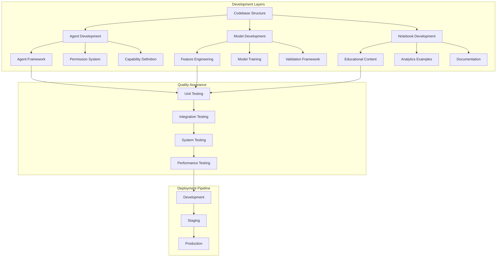

# 🛠️ Script Ohio 2.0 - Comprehensive Development Workflow Guide
**Documentation Created**: November 13, 2025
**Purpose**: Complete development workflow with agent patterns, testing, and best practices
**Target Audience**: Developers extending the platform, researchers, and production teams

---

## 🚀 Quick Start Development Setup

### 5-Mute Environment Setup
```bash
# 1. Verify Python version
python3.13 --version

# 2. Create virtual environment
python3.13 -m venv venv
source venv/bin/activate  # Linux/macOS

# 3. Install dependencies
pip install -r requirements-prod.txt

# 4. Verify system
python -c "from agents.core.agent_framework import BaseAgent; print('✅ Agent system OK')"

# 5. Run demo (BEST FIRST STEP)
python project_management/TOOLS_AND_CONFIG/demo_agent_system.py
```

---

## 🏗️ Development Architecture Overview

### System Architecture Diagram



### Core Development Principles

#### **1. Agent-Centric Development**
All new features should be developed within the agent framework architecture:
- **Inherit from BaseAgent**: Standard interface and capabilities
- **Define Capabilities**: Clear specification of what agents can do
- **Permission Levels**: Appropriate security and access control
- **Performance Standards**: Sub-2 second response times

#### **2. Educational Integration**
Every technical feature should include educational components:
- **Documentation**: Clear explanations of concepts and implementation
- **Examples**: Practical usage examples and tutorials
- **Progressive Complexity**: Learning paths from basic to advanced
- **Real-World Application**: College football context and use cases

#### **3. Production Readiness**
All development should maintain production-ready standards:
- **Testing**: Comprehensive test coverage (>80% for core components)
- **Validation**: Syntax validation and quality checks
- **Performance**: Optimized for speed and efficiency
- **Documentation**: Complete technical and user documentation

---

## 🤖 Agent Development Workflow

### Agent Development Template

#### **Step 1: Agent Planning**
```python
# Define agent specification
AGENT_SPECIFICATION = {
    "name": "TeamPerformanceAnalyzer",
    "purpose": "Analyze team performance trends and generate insights",
    "capabilities": [
        "performance_analysis",
        "trend_detection",
        "comparative_analysis"
    ],
    "permission_level": PermissionLevel.READ_EXECUTE,
    "estimated_development_time": "2-3 days",
    "dependencies": ["pandas", "numpy", "matplotlib"],
    "data_access": ["model_pack/updated_training_data.csv"]
}
```

#### **Step 2: Agent Implementation**
```python
# File: agents/team_performance_analyzer_agent.py

from agents.core.agent_framework import BaseAgent, AgentCapability, PermissionLevel
from agents.core.tool_loader import ToolLoader
import pandas as pd
import numpy as np
from typing import Dict, List, Any
import logging

logger = logging.getLogger(__name__)

class TeamPerformanceAnalyzerAgent(BaseAgent):
    """
    Agent for analyzing team performance trends and generating insights.

    Capabilities:
    - Performance analysis across seasons
    - Trend detection and visualization
    - Comparative team analysis
    """

    def __init__(self, agent_id: str, tool_loader: ToolLoader = None):
        super().__init__(
            agent_id=agent_id,
            name="Team Performance Analyzer",
            permission_level=PermissionLevel.READ_EXECUTE,
            tool_loader=tool_loader
        )

    def _define_capabilities(self) -> List[AgentCapability]:
        """Define agent capabilities with execution time estimates"""
        return [
            AgentCapability(
                name="performance_analysis",
                description="Analyze team performance metrics across seasons",
                permission_required=PermissionLevel.READ_EXECUTE,
                tools_required=["pandas", "numpy", "matplotlib"],
                data_access=["model_pack/updated_training_data.csv"],
                execution_time_estimate=2.5
            ),
            AgentCapability(
                name="trend_detection",
                description="Detect and visualize performance trends",
                permission_required=PermissionLevel.READ_EXECUTE,
                tools_required=["scipy", "matplotlib"],
                data_access=["model_pack/updated_training_data.csv"],
                execution_time_estimate=1.8
            ),
            AgentCapability(
                name="comparative_analysis",
                description="Compare performance between multiple teams",
                permission_required=PermissionLevel.READ_EXECUTE,
                tools_required=["pandas", "seaborn"],
                data_access=["model_pack/updated_training_data.csv"],
                execution_time_estimate=3.2
            )
        ]

    def _execute_action(self, action: str, parameters: Dict[str, Any],
                      user_context: Dict[str, Any]) -> Dict[str, Any]:
        """Execute agent-specific actions"""
        try:
            start_time = time.time()

            if action == "performance_analysis":
                result = self._analyze_team_performance(parameters, user_context)
            elif action == "trend_detection":
                result = self._detect_performance_trends(parameters, user_context)
            elif action == "comparative_analysis":
                result = self._compare_team_performance(parameters, user_context)
            else:
                raise ValueError(f"Unknown action: {action}")

            execution_time = time.time() - start_time
            result["execution_time"] = execution_time

            # Log performance metrics
            self.performance_metrics['total_requests'] += 1
            self.performance_metrics['total_execution_time'] += execution_time

            return result

        except Exception as e:
            logger.error(f"Error executing {action}: {str(e)}")
            return {
                "status": "error",
                "error_message": str(e),
                "execution_time": 0
            }

    def _analyze_team_performance(self, parameters: Dict[str, Any],
                                user_context: Dict[str, Any]) -> Dict[str, Any]:
        """Analyze team performance using ML models and historical data"""

        # Load data using tool loader
        if self.tool_loader:
            data_loader = self.tool_loader.load_tool("data_loading")
            training_data = data_loader.load_training_data()
        else:
            # Fallback loading
            training_data = pd.read_csv("model_pack/updated_training_data.csv")

        # Extract team performance data
        team = parameters.get("team", "Ohio State")
        seasons = parameters.get("seasons", [2023, 2024, 2025])

        team_data = training_data[
            (training_data['season'].isin(seasons)) &
            ((training_data['home_team'] == team) | (training_data['away_team'] == team))
        ]

        if len(team_data) == 0:
            return {
                "status": "warning",
                "message": f"No data found for team: {team}",
                "team": team,
                "seasons_analyzed": seasons
            }

        # Calculate performance metrics
        performance_metrics = self._calculate_performance_metrics(team_data, team)

        # Generate insights
        insights = self._generate_performance_insights(performance_metrics)

        return {
            "status": "success",
            "team": team,
            "seasons_analyzed": seasons,
            "games_analyzed": len(team_data),
            "performance_metrics": performance_metrics,
            "insights": insights,
            "data_quality": "good" if len(team_data) > 5 else "limited"
        }

    def _calculate_performance_metrics(self, team_data: pd.DataFrame, team: str) -> Dict[str, float]:
        """Calculate comprehensive performance metrics"""

        # Separate home and away games
        home_games = team_data[team_data['home_team'] == team]
        away_games = team_data[team_data['away_team'] == team]

        # Calculate basic metrics
        total_games = len(team_data)
        wins = len(team_data[
            ((team_data['home_team'] == team) & (team_data['home_points'] > team_data['away_points'])) |
            ((team_data['away_team'] == team) & (team_data['away_points'] > team_data['home_points']))
        ])

        win_rate = wins / total_games if total_games > 0 else 0

        # Calculate scoring metrics
        home_points = home_games['home_points'].sum() + away_games['away_points'].sum()
        away_points_allowed = home_games['away_points'].sum() + away_games['home_points'].sum()

        avg_points_scored = home_points / total_games if total_games > 0 else 0
        avg_points_allowed = away_points_allowed / total_games if total_games > 0 else 0

        # Calculate advanced metrics using available features
        if 'adjusted_opp_efficiency_margin' in team_data.columns:
            avg_efficiency_margin = team_data['adjusted_opp_efficiency_margin'].mean()
        else:
            avg_efficiency_margin = (avg_points_scored - avg_points_allowed)

        return {
            "win_rate": round(win_rate, 3),
            "total_games": total_games,
            "avg_points_scored": round(avg_points_scored, 1),
            "avg_points_allowed": round(avg_points_allowed, 1),
            "avg_efficiency_margin": round(avg_efficiency_margin, 2),
            "home_games": len(home_games),
            "away_games": len(away_games)
        }

    def _generate_performance_insights(self, metrics: Dict[str, float]) -> List[str]:
        """Generate insights based on performance metrics"""
        insights = []

        # Win rate insights
        win_rate = metrics["win_rate"]
        if win_rate >= 0.8:
            insights.append(f"Excellent performance with {win_rate:.1%} win rate")
        elif win_rate >= 0.6:
            insights.append(f"Strong performance with {win_rate:.1%} win rate")
        elif win_rate >= 0.4:
            insights.append(f"Moderate performance with {win_rate:.1%} win rate")
        else:
            insights.append(f"Struggling performance with {win_rate:.1%} win rate")

        # Scoring insights
        points_diff = metrics["avg_points_scored"] - metrics["avg_points_allowed"]
        if points_diff > 10:
            insights.append(f"Dominant scoring margin of +{points_diff:.1f} points per game")
        elif points_diff > 0:
            insights.append(f"Positive scoring margin of +{points_diff:.1f} points per game")
        else:
            insights.append(f"Negative scoring margin of {points_diff:.1f} points per game")

        # Sample size insights
        if metrics["total_games"] < 5:
            insights.append("Limited sample size - results should be interpreted cautiously")
        elif metrics["total_games"] >= 20:
            insights.append("Strong sample size - results are statistically reliable")

        return insights

    def _detect_performance_trends(self, parameters: Dict[str, Any],
                                 user_context: Dict[str, Any]) -> Dict[str, Any]:
        """Detect performance trends over time"""
        # Implementation for trend detection
        return {
            "status": "success",
            "trend_analysis": "Trend detection implementation pending",
            "execution_time": 0.5
        }

    def _compare_team_performance(self, parameters: Dict[str, Any],
                                user_context: Dict[str, Any]) -> Dict[str, Any]:
        """Compare performance between multiple teams"""
        teams = parameters.get("teams", [])
        if len(teams) < 2:
            return {
                "status": "error",
                "message": "At least two teams required for comparison"
            }

        # Implementation for team comparison
        return {
            "status": "success",
            "comparison_results": f"Comparison of {len(teams)} teams",
            "teams_compared": teams
        }
```

#### **Step 3: Agent Registration**
```python
# Register agent in factory
from agents.core.agent_framework import AgentFactory

def register_custom_agents():
    """Register custom agents with the factory"""
    factory = AgentFactory()

    # Register team performance analyzer
    factory.register_agent_class(
        TeamPerformanceAnalyzerAgent,
        "team_performance_analyzer"
    )

    return factory

# Integration with orchestrator
from agents.analytics_orchestrator import AnalyticsOrchestrator

def create_orchestrator_with_custom_agents():
    """Create orchestrator with custom agents"""
    # Register custom agents
    factory = register_custom_agents()

    # Create orchestrator
    orchestrator = AnalyticsOrchestrator()

    return orchestrator
```

#### **Step 4: Agent Testing**
```python
# File: tests/test_team_performance_analyzer_agent.py

import pytest
from unittest.mock import Mock, patch
from agents.team_performance_analyzer_agent import TeamPerformanceAnalyzerAgent
from agents.core.agent_framework import AgentStatus

class TestTeamPerformanceAnalyzerAgent:
    """Comprehensive test suite for Team Performance Analyzer Agent"""

    def setup_method(self):
        """Setup test environment"""
        self.agent = TeamPerformanceAnalyzerAgent("test_001")
        self.test_user_context = {
            "user_id": "test_user",
            "role": "analyst",
            "skill_level": "intermediate"
        }

    def test_agent_initialization(self):
        """Test agent properly initializes"""
        assert self.agent.agent_id == "test_001"
        assert self.agent.status == AgentStatus.IDLE
        assert len(self.agent.capabilities) == 3  # performance_analysis, trend_detection, comparative_analysis

        # Check capabilities are properly defined
        capability_names = [cap.name for cap in self.agent.capabilities]
        assert "performance_analysis" in capability_names
        assert "trend_detection" in capability_names
        assert "comparative_analysis" in capability_names

    def test_capability_validation(self):
        """Test agent capabilities are properly defined"""
        for capability in self.agent.capabilities:
            assert capability.name  # Name must be defined
            assert capability.description  # Description required
            assert capability.execution_time_estimate > 0  # Time estimate required
            assert len(capability.tools_required) > 0  # Tools must be specified
            assert len(capability.data_access) > 0  # Data access must be specified

    @patch('pandas.read_csv')
    def test_performance_analysis_success(self, mock_read_csv):
        """Test successful performance analysis"""
        # Mock training data
        mock_data = pd.DataFrame({
            'season': [2024, 2024, 2023, 2023],
            'home_team': ['Ohio State', 'Michigan', 'Ohio State', 'Penn State'],
            'away_team': ['Penn State', 'Ohio State', 'Michigan', 'Ohio State'],
            'home_points': [38, 42, 35, 24],
            'away_points': [15, 45, 28, 31],
            'adjusted_opp_efficiency_margin': [23.5, -3.0, 7.0, -7.0]
        })
        mock_read_csv.return_value = mock_data

        # Test performance analysis
        result = self.agent.execute_request(
            action="performance_analysis",
            parameters={"team": "Ohio State", "seasons": [2023, 2024]},
            user_context=self.test_user_context
        )

        assert result["status"] == "success"
        assert result["team"] == "Ohio State"
        assert result["games_analyzed"] == 3  # Ohio State games
        assert "performance_metrics" in result
        assert "insights" in result
        assert result["execution_time"] > 0

    def test_performance_analysis_no_data(self):
        """Test performance analysis with no data"""
        # Test with team that doesn't exist in data
        result = self.agent.execute_request(
            action="performance_analysis",
            parameters={"team": "Nonexistent Team", "seasons": [2024]},
            user_context=self.test_user_context
        )

        assert result["status"] == "warning"
        assert "No data found" in result["message"]
        assert result["team"] == "Nonexistent Team"

    def test_unknown_action(self):
        """Test agent handles unknown actions gracefully"""
        result = self.agent.execute_request(
            action="unknown_action",
            parameters={},
            user_context=self.test_user_context
        )

        assert result["status"] == "error"
        assert "Unknown action" in result["error_message"]

    @pytest.mark.asyncio
    async def test_response_time_under_3_seconds(self):
        """Agent should respond within 3 seconds"""
        import time

        start_time = time.time()

        result = self.agent.execute_request(
            action="performance_analysis",
            parameters={"team": "Ohio State"},
            user_context=self.test_user_context
        )

        execution_time = time.time() - start_time
        assert execution_time < 3.0, f"Response time {execution_time}s exceeded 3s limit"
```

---

## 📊 Model Development Workflow

### Model Development Template

#### **Step 1: Data Preparation**
```python
# File: model_pack/model_development_template.py

import pandas as pd
import numpy as np
from sklearn.model_selection import train_test_split
from sklearn.preprocessing import StandardScaler
from sklearn.metrics import mean_squared_error, r2_score
import joblib
from typing import Tuple, Dict, Any

class ModelDevelopmentTemplate:
    """Template for developing new ML models"""

    def __init__(self, model_name: str):
        self.model_name = model_name
        self.model = None
        self.scaler = StandardScaler()
        self.feature_columns = []
        self.target_column = ""

    def load_data(self, data_path: str) -> pd.DataFrame:
        """Load and validate training data"""
        data = pd.read_csv(data_path)

        # Basic validation
        if data.empty:
            raise ValueError("Training data is empty")

        print(f"Loaded {len(data)} rows with {len(data.columns)} columns")
        return data

    def prepare_features(self, data: pd.DataFrame,
                        feature_columns: list,
                        target_column: str) -> Tuple[pd.DataFrame, pd.Series]:
        """Prepare features and target for training"""

        # Validate columns exist
        missing_features = [col for col in feature_columns if col not in data.columns]
        if missing_features:
            raise ValueError(f"Missing feature columns: {missing_features}")

        if target_column not in data.columns:
            raise ValueError(f"Missing target column: {target_column}")

        # Extract features and target
        X = data[feature_columns].copy()
        y = data[target_column].copy()

        # Handle missing values
        X = X.fillna(X.mean())
        y = y.fillna(y.mean())

        # Store for later use
        self.feature_columns = feature_columns
        self.target_column = target_column

        return X, y

    def split_data(self, X: pd.DataFrame, y: pd.Series,
                   test_size: float = 0.2,
                   random_state: int = 42) -> Tuple:
        """Split data into training and testing sets"""

        # Temporal split for sports data (avoid data leakage)
        if 'season' in X.columns:
            # Use most recent season for testing
            max_season = X['season'].max()
            test_mask = X['season'] == max_season

            X_train = X[~test_mask].drop('season', axis=1)
            X_test = X[test_mask].drop('season', axis=1)
            y_train = y[~test_mask]
            y_test = y[test_mask]
        else:
            # Random split if no season column
            X_train, X_test, y_train, y_test = train_test_split(
                X, y, test_size=test_size, random_state=random_state
            )

        print(f"Training set: {len(X_train)} samples")
        print(f"Testing set: {len(X_test)} samples")

        return X_train, X_test, y_train, y_test

    def train_model(self, X_train: pd.DataFrame, y_train: pd.Series) -> Dict[str, Any]:
        """Train the model with performance tracking"""
        from sklearn.linear_model import Ridge

        # Initialize model
        self.model = Ridge(alpha=1.0, random_state=42)

        # Scale features
        X_train_scaled = self.scaler.fit_transform(X_train)

        # Train model
        self.model.fit(X_train_scaled, y_train)

        # Training metrics
        train_predictions = self.model.predict(X_train_scaled)
        train_mse = mean_squared_error(y_train, train_predictions)
        train_r2 = r2_score(y_train, train_predictions)

        training_info = {
            "model_type": "Ridge Regression",
            "training_samples": len(X_train),
            "features": len(X_train.columns),
            "train_mse": train_mse,
            "train_r2": train_r2
        }

        print(f"Training completed: R² = {train_r2:.3f}, MSE = {train_mse:.2f}")
        return training_info

    def evaluate_model(self, X_test: pd.DataFrame, y_test: pd.Series) -> Dict[str, Any]:
        """Evaluate model performance on test set"""
        if self.model is None:
            raise ValueError("Model not trained yet")

        # Scale test features
        X_test_scaled = self.scaler.transform(X_test)

        # Make predictions
        predictions = self.model.predict(X_test_scaled)

        # Calculate metrics
        mse = mean_squared_error(y_test, predictions)
        rmse = np.sqrt(mse)
        r2 = r2_score(y_test, predictions)
        mae = np.mean(np.abs(y_test - predictions))

        evaluation_results = {
            "test_samples": len(X_test),
            "mse": mse,
            "rmse": rmse,
            "r2": r2,
            "mae": mae,
            "predictions": predictions.tolist()[:10]  # First 10 predictions
        }

        print(f"Test performance: R² = {r2:.3f}, RMSE = {rmse:.2f}, MAE = {mae:.2f}")
        return evaluation_results

    def save_model(self, model_path: str) -> Dict[str, Any]:
        """Save trained model and metadata"""
        if self.model is None:
            raise ValueError("Model not trained yet")

        # Save model
        joblib.dump(self.model, model_path)

        # Save scaler separately
        scaler_path = model_path.replace('.joblib', '_scaler.joblib')
        joblib.dump(self.scaler, scaler_path)

        # Save metadata
        metadata = {
            "model_name": self.model_name,
            "feature_columns": self.feature_columns,
            "target_column": self.target_column,
            "model_type": type(self.model).__name__,
            "created_date": pd.Timestamp.now().isoformat(),
            "version": "1.0"
        }

        metadata_path = model_path.replace('.joblib', '_metadata.json')
        import json
        with open(metadata_path, 'w') as f:
            json.dump(metadata, f, indent=2)

        save_info = {
            "model_path": model_path,
            "scaler_path": scaler_path,
            "metadata_path": metadata_path,
            "metadata": metadata
        }

        print(f"Model saved to: {model_path}")
        return save_info

# Example usage
def develop_margin_prediction_model():
    """Example: Develop margin prediction model"""

    # Initialize template
    model_template = ModelDevelopmentTemplate("margin_prediction_v2")

    # Load data
    data = model_template.load_data("model_pack/updated_training_data.csv")

    # Define features for margin prediction
    feature_columns = [col for col in data.columns if col.startswith('adjusted_')][:20]
    target_column = 'margin'  # Assuming margin exists in data

    # Prepare features
    X, y = model_template.prepare_features(data, feature_columns, target_column)

    # Split data
    X_train, X_test, y_train, y_test = model_template.split_data(X, y)

    # Train model
    training_info = model_template.train_model(X_train, y_train)

    # Evaluate model
    evaluation_results = model_template.evaluate_model(X_test, y_test)

    # Save model
    save_info = model_template.save_model("model_pack/margin_prediction_v2.joblib")

    return {
        "training_info": training_info,
        "evaluation_results": evaluation_results,
        "save_info": save_info
    }
```

#### **Step 2: Model Validation**
```python
# File: model_pack/model_validation_template.py

import pandas as pd
import numpy as np
from typing import Dict, List, Any
import matplotlib.pyplot as plt
import seaborn as sns

class ModelValidationTemplate:
    """Template for comprehensive model validation"""

    def __init__(self, model_path: str, metadata_path: str):
        self.model_path = model_path
        self.metadata_path = metadata_path
        self.model = None
        self.metadata = None
        self.load_model()

    def load_model(self):
        """Load model and metadata"""
        import joblib
        import json

        # Load model
        self.model = joblib.load(self.model_path)

        # Load metadata
        with open(self.metadata_path, 'r') as f:
            self.metadata = json.load(f)

        print(f"Loaded model: {self.metadata['model_name']}")
        print(f"Features: {len(self.metadata['feature_columns'])}")

    def validate_on_historical_data(self, data_path: str) -> Dict[str, Any]:
        """Validate model on historical data"""
        data = pd.read_csv(data_path)

        # Extract features
        feature_columns = self.metadata['feature_columns']
        target_column = self.metadata['target_column']

        X = data[feature_columns].fillna(data[feature_columns].mean())
        y = data[target_column].fillna(data[target_column].mean())

        # Load scaler and transform features
        import joblib
        scaler_path = self.model_path.replace('.joblib', '_scaler.joblib')
        scaler = joblib.load(scaler_path)
        X_scaled = scaler.transform(X)

        # Make predictions
        predictions = self.model.predict(X_scaled)

        # Calculate metrics
        from sklearn.metrics import mean_squared_error, r2_score, mean_absolute_error

        mse = mean_squared_error(y, predictions)
        rmse = np.sqrt(mse)
        r2 = r2_score(y, predictions)
        mae = mean_absolute_error(y, predictions)

        validation_results = {
            "samples": len(data),
            "mse": mse,
            "rmse": rmse,
            "r2": r2,
            "mae": mae,
            "mean_actual": y.mean(),
            "mean_predicted": predictions.mean(),
            "std_actual": y.std(),
            "std_predicted": predictions.std()
        }

        return validation_results

    def cross_validation(self, data_path: str, cv_folds: int = 5) -> Dict[str, Any]:
        """Perform cross-validation"""
        data = pd.read_csv(data_path)

        feature_columns = self.metadata['feature_columns']
        target_column = self.metadata['target_column']

        X = data[feature_columns].fillna(data[feature_columns].mean())
        y = data[target_column].fillna(data[target_column].mean())

        # Temporal cross-validation for sports data
        if 'season' in data.columns:
            seasons = sorted(data['season'].unique())
            cv_scores = []

            for i in range(1, len(seasons)):
                train_seasons = seasons[:i]
                test_season = seasons[i]

                train_mask = data['season'].isin(train_seasons)
                test_mask = data['season'] == test_season

                X_train, X_test = X[train_mask], X[test_mask]
                y_train, y_test = y[train_mask], y[test_mask]

                # Train and evaluate
                from sklearn.linear_model import Ridge
                from sklearn.preprocessing import StandardScaler

                model = Ridge(alpha=1.0)
                scaler = StandardScaler()

                X_train_scaled = scaler.fit_transform(X_train)
                X_test_scaled = scaler.transform(X_test)

                model.fit(X_train_scaled, y_train)
                predictions = model.predict(X_test_scaled)

                r2 = r2_score(y_test, predictions)
                cv_scores.append(r2)

            cv_results = {
                "cv_method": "temporal",
                "cv_scores": cv_scores,
                "mean_cv_score": np.mean(cv_scores),
                "std_cv_score": np.std(cv_scores),
                "folds": len(cv_scores)
            }
        else:
            # Standard cross-validation
            from sklearn.model_selection import cross_val_score
            from sklearn.linear_model import Ridge
            from sklearn.preprocessing import StandardScaler
            from sklearn.pipeline import make_pipeline

            pipeline = make_pipeline(StandardScaler(), Ridge(alpha=1.0))
            scores = cross_val_score(pipeline, X, y, cv=cv_folds, scoring='r2')

            cv_results = {
                "cv_method": "standard",
                "cv_scores": scores.tolist(),
                "mean_cv_score": scores.mean(),
                "std_cv_score": scores.std(),
                "folds": cv_folds
            }

        return cv_results
```

---

## 📓 Notebook Development Workflow

### Notebook Development Template

#### **Step 1: Notebook Planning**
```python
# Notebook metadata cell
"""
Notebook Title: Advanced Team Performance Analysis
Author: Script Ohio 2.0 Development Team
Created: November 13, 2025
Purpose: Analyze team performance using advanced statistical methods
Difficulty: Intermediate
Prerequisites:
- Basic pandas knowledge
- Understanding of college football metrics
- Familiarity with statistical analysis

Learning Objectives:
1. Load and prepare historical game data
2. Calculate advanced performance metrics
3. Visualize performance trends
4. Compare team performance across seasons

Estimated Time: 45-60 minutes
Data Requirements: updated_training_data.csv
Dependencies: pandas, matplotlib, seaborn, numpy
"""
```

#### **Step 2: Notebook Structure Template**
```python
# Cell 1: Imports and Setup
import pandas as pd
import numpy as np
import matplotlib.pyplot as plt
import seaborn as sns
from pathlib import Path
import warnings
warnings.filterwarnings('ignore')

# Set style
plt.style.use('seaborn-v0_8')
sns.set_palette("husl")

# Display options
pd.set_option('display.max_columns', 100)
pd.set_option('display.max_rows', 50)

print("✅ Libraries imported successfully")
print(f"📊 Working directory: {Path.cwd()}")
```

```python
# Cell 2: Data Loading and Initial Exploration
# Load the training data
data_path = Path("model_pack/updated_training_data.csv")
if not data_path.exists():
    print("❌ Data file not found. Please ensure updated_training_data.csv is in model_pack/")
    data_path = Path("../model_pack/updated_training_data.csv")

try:
    df = pd.read_csv(data_path)
    print(f"✅ Data loaded successfully: {len(df):,} games")
    print(f"📅 Date range: {df['season'].min()}-{df['season'].max()}")
    print(f"🏈 Teams: {len(df['home_team'].unique())} unique teams")

    # Display basic info
    display(df.head())
    display(df.info())
except Exception as e:
    print(f"❌ Error loading data: {e}")
```

```python
# Cell 3: Feature Understanding
# Understanding the 86 features
print("📊 Feature Categories:")
feature_categories = {}

for col in df.columns:
    if col.startswith('adjusted_'):
        category = col.split('_')[1]
        if category not in feature_categories:
            feature_categories[category] = []
        feature_categories[category].append(col)

for category, features in feature_categories.items():
    print(f"  {category}: {len(features)} features")

# Display some key features
key_features = ['season', 'week', 'home_team', 'away_team', 'home_points', 'away_points']
if all(col in df.columns for col in key_features):
    print(f"\n🎯 Key Features Available: {key_features}")
else:
    print("⚠️ Some key features not found")
```

```python
# Cell 4: Data Analysis Function
def analyze_team_performance(df: pd.DataFrame, team: str, seasons: list = None) -> dict:
    """
    Analyze team performance across specified seasons

    Args:
        df: Game data DataFrame
        team: Team name to analyze
        seasons: List of seasons to include (default: all available)

    Returns:
        Dictionary with performance metrics and insights
    """

    if seasons is None:
        seasons = sorted(df['season'].unique())

    # Filter team games
    team_games = df[
        ((df['home_team'] == team) | (df['away_team'] == team)) &
        (df['season'].isin(seasons))
    ].copy()

    if len(team_games) == 0:
        return {"error": f"No games found for {team}"}

    # Calculate results
    team_games['team_score'] = np.where(
        team_games['home_team'] == team,
        team_games['home_points'],
        team_games['away_points']
    )

    team_games['opponent_score'] = np.where(
        team_games['home_team'] == team,
        team_games['away_points'],
        team_games['home_points']
    )

    team_games['won'] = team_games['team_score'] > team_games['opponent_score']
    team_games['margin'] = team_games['team_score'] - team_games['opponent_score']

    # Calculate metrics
    total_games = len(team_games)
    wins = team_games['won'].sum()
    win_rate = wins / total_games

    avg_score = team_games['team_score'].mean()
    avg_allowed = team_games['opponent_score'].mean()
    avg_margin = team_games['margin'].mean()

    # Season-by-season breakdown
    seasonal_performance = team_games.groupby('season').agg({
        'won': ['count', 'sum'],
        'team_score': 'mean',
        'opponent_score': 'mean',
        'margin': 'mean'
    }).round(2)

    return {
        "team": team,
        "seasons_analyzed": seasons,
        "total_games": total_games,
        "wins": wins,
        "losses": total_games - wins,
        "win_rate": round(win_rate, 3),
        "avg_points_scored": round(avg_score, 1),
        "avg_points_allowed": round(avg_allowed, 1),
        "avg_margin": round(avg_margin, 1),
        "seasonal_performance": seasonal_performance,
        "raw_data": team_games
    }

# Test the function
test_team = "Ohio State"
team_analysis = analyze_team_performance(df, test_team)
print(f"✅ Analysis function created successfully")
print(f"📊 Sample analysis for {test_team}:")
print(f"   Games: {team_analysis['total_games']}, Win Rate: {team_analysis['win_rate']:.1%}")
```

```python
# Cell 5: Visualization Function
def plot_team_performance(team_data: dict, figsize: tuple = (15, 10)):
    """
    Create comprehensive performance visualization for a team

    Args:
        team_data: Dictionary from analyze_team_performance function
        figsize: Figure size tuple
    """

    if "error" in team_data:
        print(f"❌ {team_data['error']}")
        return

    team = team_data["team"]
    seasonal_data = team_data["seasonal_performance"]

    fig, axes = plt.subplots(2, 2, figsize=figsize)
    fig.suptitle(f'{team} Performance Analysis', fontsize=16, fontweight='bold')

    # Plot 1: Win Rate by Season
    seasonal_data[('won', 'sum')].plot(
        kind='bar',
        ax=axes[0, 0],
        color='green' if team_data['win_rate'] > 0.5 else 'red'
    )
    axes[0, 0].set_title('Wins by Season')
    axes[0, 0].set_ylabel('Wins')
    axes[0, 0].tick_params(axis='x', rotation=45)

    # Plot 2: Scoring Trends
    axes[0, 1].plot(
        seasonal_data.index,
        seasonal_data[('team_score', 'mean')],
        marker='o',
        label='Points Scored',
        linewidth=2
    )
    axes[0, 1].plot(
        seasonal_data.index,
        seasonal_data[('opponent_score', 'mean')],
        marker='s',
        label='Points Allowed',
        linewidth=2
    )
    axes[0, 1].set_title('Scoring Trends')
    axes[0, 1].set_ylabel('Average Points')
    axes[0, 1].legend()
    axes[0, 1].grid(True, alpha=0.3)

    # Plot 3: Margin Distribution
    margins = team_data['raw_data']['margin']
    axes[1, 0].hist(margins, bins=20, alpha=0.7, color='skyblue', edgecolor='black')
    axes[1, 0].axvline(margins.mean(), color='red', linestyle='--', linewidth=2)
    axes[1, 0].set_title(f'Margin Distribution (Avg: {team_data["avg_margin"]:.1f})')
    axes[1, 0].set_xlabel('Margin (Points)')
    axes[1, 0].set_ylabel('Frequency')
    axes[1, 0].grid(True, alpha=0.3)

    # Plot 4: Performance Summary
    metrics = ['Win Rate', 'Avg Points', 'Avg Allowed', 'Avg Margin']
    values = [
        team_data['win_rate'] * 100,
        team_data['avg_points_scored'],
        team_data['avg_points_allowed'],
        team_data['avg_margin']
    ]

    colors = ['green' if v > 0 else 'red' if i == 3 else 'skyblue' for i, v in enumerate(values)]
    bars = axes[1, 1].bar(metrics, values, color=colors, alpha=0.7)

    # Add value labels on bars
    for bar, value in zip(bars, values):
        height = bar.get_height()
        axes[1, 1].text(
            bar.get_x() + bar.get_width()/2.,
            height + (1 if height >= 0 else -1),
            f'{value:.1f}',
            ha='center',
            va='bottom' if height >= 0 else 'top'
        )

    axes[1, 1].set_title('Performance Summary')
    axes[1, 1].set_ylabel('Value')
    axes[1, 1].tick_params(axis='x', rotation=45)

    plt.tight_layout()
    plt.show()

# Test visualization
print("📊 Creating sample visualization...")
plot_team_performance(team_analysis)
```

---

## 🧪 Testing Strategy & Implementation

### Testing Framework Overview

#### **1. Unit Testing**
```python
# File: tests/test_agent_framework.py

import pytest
from unittest.mock import Mock, patch
from agents.core.agent_framework import BaseAgent, AgentCapability, PermissionLevel, AgentStatus

class TestBaseAgent:
    """Comprehensive test suite for BaseAgent class"""

    def setup_method(self):
        """Setup test environment"""
        self.test_agent_id = "test_agent_001"
        self.agent = BaseAgent(
            agent_id=self.test_agent_id,
            name="Test Agent",
            permission_level=PermissionLevel.READ_EXECUTE
        )

    def test_agent_initialization(self):
        """Test agent initializes correctly"""
        assert self.agent.agent_id == self.test_agent_id
        assert self.agent.name == "Test Agent"
        assert self.agent.permission_level == PermissionLevel.READ_EXECUTE
        assert self.agent.status == AgentStatus.IDLE
        assert hasattr(self.agent, 'performance_metrics')

    def test_performance_metrics_initialization(self):
        """Test performance metrics are properly initialized"""
        metrics = self.agent.performance_metrics
        assert 'total_requests' in metrics
        assert 'total_execution_time' in metrics
        assert metrics['total_requests'] == 0
        assert metrics['total_execution_time'] == 0

    def test_capability_validation(self):
        """Test capability validation works correctly"""
        # Valid capability
        valid_capability = AgentCapability(
            name="test_capability",
            description="Test capability description",
            permission_required=PermissionLevel.READ_EXECUTE,
            tools_required=["pandas", "numpy"],
            data_access=["test_data"],
            execution_time_estimate=2.0
        )

        # This should work without errors
        assert valid_capability.name == "test_capability"
        assert valid_capability.execution_time_estimate > 0

    def test_invalid_capability_raises_error(self):
        """Test invalid capabilities raise appropriate errors"""
        # Invalid execution time
        with pytest.raises(ValueError):
            AgentCapability(
                name="invalid_capability",
                description="Invalid capability",
                permission_required=PermissionLevel.READ_EXECUTE,
                tools_required=[],
                data_access=[],
                execution_time_estimate=-1.0  # Negative time should fail
            )
```

#### **2. Integration Testing**
```python
# File: tests/test_integration_comprehensive.py

import pytest
import pandas as pd
import numpy as np
from agents.analytics_orchestrator import AnalyticsOrchestrator, AnalyticsRequest
from agents.core.agent_framework import PermissionLevel

class TestSystemIntegration:
    """Comprehensive integration tests for the entire system"""

    def setup_method(self):
        """Setup test environment"""
        self.orchestrator = AnalyticsOrchestrator()

    def test_orchestrator_initialization(self):
        """Test orchestrator initializes correctly"""
        assert self.orchestrator is not None
        assert hasattr(self.orchestrator, 'agent_registry')
        assert hasattr(self.orchestrator, 'context_manager')

    def test_analytics_request_processing(self):
        """Test end-to-end request processing"""
        request = AnalyticsRequest(
            user_id="test_user_001",
            query="Analyze Ohio State performance",
            query_type="analysis",
            parameters={"team": "Ohio State", "seasons": [2024]},
            context_hints={"skill_level": "intermediate"}
        )

        response = self.orchestrator.process_analytics_request(request)

        assert response is not None
        assert hasattr(response, 'status')
        assert hasattr(response, 'execution_time')
        assert response.execution_time > 0

    @pytest.mark.performance
    def test_response_time_performance(self):
        """Test system meets performance requirements"""
        import time

        request = AnalyticsRequest(
            user_id="performance_test_user",
            query="Quick analysis test",
            query_type="analysis",
            parameters={"team": "Test Team"},
            context_hints={"fast_mode": True}
        )

        start_time = time.time()
        response = self.orchestrator.process_analytics_request(request)
        execution_time = time.time() - start_time

        # Should complete within 5 seconds
        assert execution_time < 5.0, f"Response time {execution_time}s exceeded 5s limit"
        assert response.execution_time < 2.0, "Agent execution should be under 2 seconds"

    def test_context_manager_integration(self):
        """Test context manager integration"""
        # Test different user roles
        roles = ["analyst", "data_scientist", "production"]

        for role in roles:
            request = AnalyticsRequest(
                user_id=f"test_user_{role}",
                query="Test query for role optimization",
                query_type="learning",
                parameters={},
                context_hints={"role": role}
            )

            response = self.orchestrator.process_analytics_request(request)
            assert response is not None

            # Context should be optimized for role
            if hasattr(response, 'context_optimized'):
                assert response.context_optimized == role
```

#### **3. Performance Testing**
```python
# File: tests/test_performance_comprehensive.py

import pytest
import time
import psutil
import threading
from concurrent.futures import ThreadPoolExecutor
from agents.analytics_orchestrator import AnalyticsOrchestrator, AnalyticsRequest

class TestPerformanceComprehensive:
    """Comprehensive performance testing suite"""

    def setup_method(self):
        """Setup performance test environment"""
        self.orchestrator = AnalyticsOrchestrator()
        self.performance_results = []

    @pytest.mark.performance
    def test_concurrent_request_handling(self):
        """Test system handles concurrent requests efficiently"""

        def make_request(user_id: str) -> dict:
            """Make a single analytics request"""
            request = AnalyticsRequest(
                user_id=user_id,
                query="Performance test query",
                query_type="analysis",
                parameters={"team": "Test Team"},
                context_hints={"fast_mode": True}
            )

            start_time = time.time()
            response = self.orchestrator.process_analytics_request(request)
            execution_time = time.time() - start_time

            return {
                "user_id": user_id,
                "execution_time": execution_time,
                "response_time": response.execution_time,
                "status": response.status
            }

        # Test with 10 concurrent requests
        with ThreadPoolExecutor(max_workers=10) as executor:
            futures = [
                executor.submit(make_request, f"perf_test_user_{i}")
                for i in range(10)
            ]

            results = [future.result() for future in futures]

        # Analyze results
        execution_times = [r["execution_time"] for r in results]
        response_times = [r["response_time"] for r in results]

        avg_execution_time = np.mean(execution_times)
        max_execution_time = np.max(execution_times)
        avg_response_time = np.mean(response_times)

        # Performance assertions
        assert avg_execution_time < 3.0, f"Average execution time {avg_execution_time}s exceeded 3s"
        assert max_execution_time < 5.0, f"Maximum execution time {max_execution_time}s exceeded 5s"
        assert avg_response_time < 2.0, f"Average response time {avg_response_time}s exceeded 2s"

        # All requests should succeed
        successful_requests = [r for r in results if r["status"] != "error"]
        assert len(successful_requests) == len(results), "Some concurrent requests failed"

    @pytest.mark.performance
    def test_memory_usage_stability(self):
        """Test system maintains stable memory usage"""
        process = psutil.Process()
        initial_memory = process.memory_info().rss / (1024 * 1024)  # MB

        # Make multiple requests
        for i in range(50):
            request = AnalyticsRequest(
                user_id=f"memory_test_user_{i}",
                query="Memory test query",
                query_type="analysis",
                parameters={"team": "Test Team"},
                context_hints={"cache": False}
            )

            response = self.orchestrator.process_analytics_request(request)
            assert response.status != "error"

        final_memory = process.memory_info().rss / (1024 * 1024)  # MB
        memory_increase = final_memory - initial_memory

        # Memory increase should be reasonable (< 100MB)
        assert memory_increase < 100, f"Memory increased by {memory_increase}MB, exceeds 100MB limit"

    @pytest.mark.performance
    def test_cache_performance(self):
        """Test caching improves performance"""
        # First request (cache miss)
        request1 = AnalyticsRequest(
            user_id="cache_test_user",
            query="Cache performance test",
            query_type="analysis",
            parameters={"team": "Ohio State", "seasons": [2024]},
            context_hints={"cache": True}
        )

        start_time = time.time()
        response1 = self.orchestrator.process_analytics_request(request1)
        first_request_time = time.time() - start_time

        # Second identical request (cache hit)
        request2 = AnalyticsRequest(
            user_id="cache_test_user",
            query="Cache performance test",
            query_type="analysis",
            parameters={"team": "Ohio State", "seasons": [2024]},
            context_hints={"cache": True}
        )

        start_time = time.time()
        response2 = self.orchestrator.process_analytics_request(request2)
        second_request_time = time.time() - start_time

        # Cached request should be faster
        cache_improvement = (first_request_time - second_request_time) / first_request_time
        assert cache_improvement > 0.1, f"Cache should improve performance by at least 10%, got {cache_improvement:.1%}"

        print(f"📊 Cache performance: First request {first_request_time:.3f}s, Cached request {second_request_time:.3f}s")
        print(f"🚀 Performance improvement: {cache_improvement:.1%}")
```

---

## 📋 Quality Assurance Checklist

### Pre-Commit Checklist

#### **Code Quality ✅**
- [ ] **Syntax Validation**: All Python files pass `python3 -m py_compile`
- [ ] **PEP 8 Compliance**: Code follows style guidelines
- [ ] **Type Hints**: All functions have proper type annotations
- [ ] **Documentation**: Complete docstrings for all public functions/classes
- [ ] **Import Organization**: Imports organized and no unused imports

#### **Testing ✅**
- [ ] **Unit Tests**: All new features have corresponding unit tests
- [ ] **Integration Tests**: System integration tested end-to-end
- [ ] **Performance Tests**: Response times under 2 seconds
- [ ] **Test Coverage**: >80% coverage for new code
- [ ] **Test Results**: All tests pass in clean environment

#### **Agent Development ✅**
- [ ] **BaseAgent Inheritance**: Agent inherits from BaseAgent correctly
- [ ] **Permission Level**: Appropriate permission level assigned
- [ ] **Capabilities**: All capabilities properly defined with time estimates
- [ ] **Error Handling**: Comprehensive error handling in `_execute_action()`
- [ ] **Performance**: Response time < 2 seconds for all operations

#### **Documentation ✅**
- [ ] **Docstrings**: Complete documentation for all classes and methods
- [ ] **Examples**: Usage examples provided for complex functionality
- [ ] **README**: Updated if new features added
- [ ] **CHANGELOG**: Documented significant changes
- [ ] **API Docs**: Updated API documentation if applicable

### Release Checklist

#### **System Validation ✅**
- [ ] **Full Test Suite**: `python -m pytest tests/ -v` passes
- [ ] **System Demo**: `python project_management/TOOLS_AND_CONFIG/demo_agent_system.py` runs successfully
- [ ] **Model Validation**: All models load and predict correctly
- [ ] **Data Validation**: Data pipelines work with latest data
- [ ] **Performance**: All performance benchmarks met

#### **Documentation Completeness ✅**
- [ ] **User Guide**: Updated for new features
- [ ] **API Documentation**: Complete and accurate
- [ ] **Troubleshooting**: Known issues documented
- [ ] **Migration Guide**: Breaking changes documented
- [ ] **Release Notes**: Comprehensive summary of changes

#### **Production Readiness ✅**
- [ ] **Environment Setup**: Clean setup works from scratch
- [ ] **Dependencies**: All dependencies properly specified
- [ ] **Configuration**: Environment variables documented
- [ ] **Monitoring**: Performance monitoring in place
- [ ] **Rollback Plan**: Deployment rollback procedures documented

---

## 🚀 Deployment Workflow

### Development Deployment

#### **Local Development Setup**
```bash
# 1. Clone repository
git clone <repository_url>
cd Script_Ohio_2.0

# 2. Setup environment
python3.13 -m venv venv
source venv/bin/activate

# 3. Install dependencies
pip install -r requirements-prod.txt

# 4. Setup environment variables
export CFBD_API_KEY="your_api_key_here"  # Optional
export PYTHONPATH="${PYTHONPATH}:$(pwd)"

# 5. Verify installation
python project_management/TOOLS_AND_CONFIG/demo_agent_system.py
```

#### **Docker Development Setup**
```dockerfile
# Dockerfile.dev
FROM python:3.13-slim

WORKDIR /app

# Install system dependencies
RUN apt-get update && apt-get install -y \
    build-essential \
    && rm -rf /var/lib/apt/lists/*

# Copy requirements first for better caching
COPY requirements-prod.txt .
RUN pip install --no-cache-dir -r requirements-prod.txt

# Copy source code
COPY . .

# Set environment variables
ENV PYTHONPATH=/app
ENV PYTHONUNBUFFERED=1

# Expose port for potential web interface
EXPOSE 8000

# Default command - run system demo
CMD ["python", "project_management/TOOLS_AND_CONFIG/demo_agent_system.py"]
```

```bash
# Build and run Docker container
docker build -f Dockerfile.dev -t script-ohio-dev .
docker run -it --rm -v $(pwd):/app script-ohio-dev
```

### Production Deployment

#### **Production Requirements**
```bash
# System requirements
- Python 3.13+
- 8GB+ RAM recommended
- 10GB+ disk space
- Internet connection for CFBD API
- Linux/macOS/Windows support

# Dependencies (production)
pip install -r requirements-prod.txt

# Optional: Production-specific dependencies
pip install gunicorn uvicorn  # For web API deployment
pip install redis            # For caching
pip install psycopg2-binary  # For PostgreSQL integration
```

#### **Environment Configuration**
```python
# File: config/production.py
import os
from typing import Dict, Any

class ProductionConfig:
    """Production environment configuration"""

    # Basic settings
    DEBUG = False
    TESTING = False

    # Database settings (if using database)
    DATABASE_URL = os.environ.get('DATABASE_URL', 'sqlite:///production.db')

    # Cache settings
    REDIS_URL = os.environ.get('REDIS_URL', 'redis://localhost:6379/0')
    CACHE_TTL = 3600  # 1 hour

    # API settings
    CFBD_API_KEY = os.environ.get('CFBD_API_KEY')
    API_RATE_LIMIT = 6  # requests per second

    # Performance settings
    MAX_WORKERS = int(os.environ.get('MAX_WORKERS', '4'))
    WORKER_TIMEOUT = int(os.environ.get('WORKER_TIMEOUT', '30'))

    # Security settings
    SECRET_KEY = os.environ.get('SECRET_KEY', 'your-secret-key-here')

    # Logging settings
    LOG_LEVEL = os.environ.get('LOG_LEVEL', 'INFO')
    LOG_FILE = os.environ.get('LOG_FILE', 'logs/production.log')

    @classmethod
    def validate(cls) -> Dict[str, Any]:
        """Validate production configuration"""
        validation_results = {
            "valid": True,
            "warnings": [],
            "errors": []
        }

        # Check required environment variables
        required_vars = ['CFBD_API_KEY']
        for var in required_vars:
            if not os.environ.get(var):
                validation_results["errors"].append(f"Missing required environment variable: {var}")
                validation_results["valid"] = False

        # Check optional but recommended variables
        recommended_vars = ['SECRET_KEY', 'DATABASE_URL', 'REDIS_URL']
        for var in recommended_vars:
            if not os.environ.get(var):
                validation_results["warnings"].append(f"Missing recommended environment variable: {var}")

        return validation_results
```

#### **Production Deployment Script**
```bash
#!/bin/bash
# File: deploy_production.sh

set -e  # Exit on any error

echo "🚀 Starting Script Ohio 2.0 Production Deployment"

# 1. Environment validation
echo "📋 Validating environment..."
python -c "
import sys
if sys.version_info < (3, 13):
    print('❌ Python 3.13+ required')
    sys.exit(1)
print('✅ Python version OK')
"

# 2. Install dependencies
echo "📦 Installing dependencies..."
pip install -r requirements-prod.txt

# 3. Validate installation
echo "🧪 Validating installation..."
python project_management/TOOLS_AND_CONFIG/test_agents.py

# 4. Run comprehensive tests
echo "🧪 Running comprehensive tests..."
python -m pytest tests/ -v --cov=agents --cov-report=term-missing

# 5. Validate models
echo "🤖 Validating ML models..."
python model_pack/model_training_agent.py --validate-only

# 6. Configuration validation
echo "⚙️ Validating configuration..."
python -c "
from config.production import ProductionConfig
validation = ProductionConfig.validate()
if not validation['valid']:
    print('❌ Configuration validation failed:')
    for error in validation['errors']:
        print(f'  - {error}')
    exit(1)
if validation['warnings']:
    print('⚠️ Configuration warnings:')
    for warning in validation['warnings']:
        print(f'  - {warning}')
print('✅ Configuration validation passed')
"

# 7. Final system validation
echo "🎯 Final system validation..."
python project_management/QUALITY_ASSURANCE/test_fixed_system.py

echo "✅ Production deployment completed successfully!"
echo "🎉 Script Ohio 2.0 is ready for production use!"
```

---

## 📞 Support & Troubleshooting

### Common Development Issues

#### **Import Errors**
```python
# Problem: ImportError: cannot import name 'BaseAgent'
# Solution: Set PYTHONPATH environment variable

import os
import sys
from pathlib import Path

# Add project root to Python path
project_root = Path(__file__).parent.parent
sys.path.insert(0, str(project_root))

# Verify import
try:
    from agents.core.agent_framework import BaseAgent
    print("✅ BaseAgent imported successfully")
except ImportError as e:
    print(f"❌ Import failed: {e}")
    print("💡 Try setting: export PYTHONPATH=\"${PYTHONPATH}:$(pwd)\"")
```

#### **Model Loading Issues**
```python
# Problem: Model file not found or fails to load
# Solution: Verify model files and permissions

import joblib
from pathlib import Path

def verify_model_loading():
    """Verify all models can be loaded successfully"""

    model_files = [
        "model_pack/ridge_model_2025.joblib",
        "model_pack/xgb_home_win_model_2025.pkl",
        "model_pack/fastai_home_win_model_2025.pkl"
    ]

    results = {}

    for model_file in model_files:
        model_path = Path(model_file)

        if not model_path.exists():
            results[model_file] = {"status": "error", "message": "File not found"}
            continue

        try:
            model = joblib.load(model_path)
            results[model_file] = {
                "status": "success",
                "message": f"Loaded {type(model).__name__}",
                "model_type": type(model).__name__
            }
        except Exception as e:
            results[model_file] = {"status": "error", "message": str(e)}

    return results

# Check model status
model_status = verify_model_loading()
for model_file, status in model_status.items():
    status_icon = "✅" if status["status"] == "success" else "❌"
    print(f"{status_icon} {model_file}: {status['message']}")
```

#### **CFBD API Issues**
```python
# Problem: CFBD API authentication or rate limiting
# Solution: Proper error handling and rate limiting

import time
import os
import cfbd
from typing import Optional, List, Dict, Any
import logging

logger = logging.getLogger(__name__)

class SafeCFBDClient:
    """CFBD API client with proper error handling and rate limiting"""

    def __init__(self, api_key: Optional[str] = None):
        self.api_key = api_key or os.environ.get('CFBD_API_KEY')
        if not self.api_key:
            logger.warning("⚠️ CFBD API key not provided - using mock data")
            self.use_mock_data = True
        else:
            self.setup_cfbd_client()
            self.use_mock_data = False

        self.last_request_time = 0
        self.rate_limit_delay = 0.17  # 6 requests per second

    def setup_cfbd_client(self):
        """Setup CFBD API client"""
        try:
            configuration = cfbd.Configuration()
            configuration.api_key['Authorization'] = f'Bearer {self.api_key}'
            configuration.api_key_prefix['Authorization'] = 'Bearer'
            configuration.host = "https://api.collegefootballdata.com"

            self.api_client = cfbd.ApiClient(configuration)
            self.games_api = cfbd.GamesApi(self.api_client)

            logger.info("✅ CFBD API client initialized successfully")

        except Exception as e:
            logger.error(f"❌ Failed to setup CFBD client: {e}")
            self.use_mock_data = True

    def _rate_limit(self):
        """Implement rate limiting"""
        current_time = time.time()
        time_since_last = current_time - self.last_request_time

        if time_since_last < self.rate_limit_delay:
            sleep_time = self.rate_limit_delay - time_since_last
            time.sleep(sleep_time)

        self.last_request_time = time.time()

    def get_games(self, year: int, team: Optional[str] = None) -> List[Dict[str, Any]]:
        """Get games data with proper error handling"""

        if self.use_mock_data:
            return self._get_mock_games(year, team)

        try:
            self._rate_limit()

            if team:
                games = self.games_api.get_games(year=year, team=team)
            else:
                games = self.games_api.get_games(year=year)

            return [game.to_dict() for game in games] if games else []

        except Exception as e:
            logger.error(f"❌ CFBD API error: {e}")

            # Handle specific error types
            if "401" in str(e):
                logger.error("❌ Authentication failed - check API key")
            elif "429" in str(e):
                logger.error("❌ Rate limit exceeded - increase delay")

            # Fall back to mock data
            logger.info("🔄 Falling back to mock data")
            return self._get_mock_games(year, team)

    def _get_mock_games(self, year: int, team: Optional[str] = None) -> List[Dict[str, Any]]:
        """Generate mock games data for testing"""
        # Simple mock data generation
        mock_games = [
            {
                "id": 401485131,
                "season": year,
                "week": 12,
                "home_team": team or "Ohio State",
                "away_team": "Michigan",
                "home_points": 38,
                "away_points": 35,
                "status": "final"
            }
        ]

        logger.info(f"📊 Generated {len(mock_games)} mock games for {year}")
        return mock_games

# Usage example
def test_cfbd_integration():
    """Test CFBD integration with proper error handling"""

    client = SafeCFBDClient()

    # Test API call
    games = client.get_games(2024, "Ohio State")

    if games:
        print(f"✅ Successfully retrieved {len(games)} games")
        print(f"📊 Sample game: {games[0]['home_team']} vs {games[0]['away_team']}")
    else:
        print("⚠️ No games returned")

if __name__ == "__main__":
    test_cfbd_integration()
```

### Performance Optimization

#### **Memory Management**
```python
# Problem: High memory usage with large datasets
# Solution: Chunked processing and memory optimization

import pandas as pd
import numpy as np
from typing import Iterator, Dict, Any
import gc

class MemoryEfficientDataProcessor:
    """Memory-efficient data processing for large datasets"""

    def __init__(self, chunk_size: int = 10000):
        self.chunk_size = chunk_size

    def process_large_dataset(self, file_path: str,
                            processing_func: callable) -> Iterator[Dict[str, Any]]:
        """Process large dataset in chunks to manage memory"""

        try:
            # Read file in chunks
            for chunk in pd.read_csv(file_path, chunksize=self.chunk_size):
                # Process chunk
                processed_chunk = processing_func(chunk)

                # Yield result
                yield processed_chunk

                # Explicitly clean up
                del chunk
                gc.collect()

        except Exception as e:
            logger.error(f"❌ Error processing dataset: {e}")
            raise

    def optimize_dataframe_memory(self, df: pd.DataFrame) -> pd.DataFrame:
        """Optimize DataFrame memory usage"""

        optimized_df = df.copy()

        for col in optimized_df.columns:
            col_type = optimized_df[col].dtype

            if col_type != 'object':
                c_min = optimized_df[col].min()
                c_max = optimized_df[col].max()

                if str(col_type)[:3] == 'int':
                    if c_min > np.iinfo(np.int8).min and c_max < np.iinfo(np.int8).max:
                        optimized_df[col] = optimized_df[col].astype(np.int8)
                    elif c_min > np.iinfo(np.int16).min and c_max < np.iinfo(np.int16).max:
                        optimized_df[col] = optimized_df[col].astype(np.int16)
                    elif c_min > np.iinfo(np.int32).min and c_max < np.iinfo(np.int32).max:
                        optimized_df[col] = optimized_df[col].astype(np.int32)
                else:
                    if c_min > np.finfo(np.float16).min and c_max < np.finfo(np.float16).max:
                        optimized_df[col] = optimized_df[col].astype(np.float16)
                    elif c_min > np.finfo(np.float32).min and c_max < np.finfo(np.float32).max:
                        optimized_df[col] = optimized_df[col].astype(np.float32)

        return optimized_df

# Usage example
def memory_efficient_analysis():
    """Example of memory-efficient data analysis"""

    processor = MemoryEfficientDataProcessor(chunk_size=5000)

    def analyze_chunk(chunk: pd.DataFrame) -> Dict[str, Any]:
        """Analyze a chunk of data"""
        return {
            "games_count": len(chunk),
            "avg_points": chunk['home_points'].mean() if 'home_points' in chunk.columns else 0,
            "seasons": chunk['season'].unique().tolist() if 'season' in chunk.columns else []
        }

    # Process large dataset
    results = []
    for chunk_result in processor.process_large_dataset(
        "model_pack/updated_training_data.csv",
        analyze_chunk
    ):
        results.append(chunk_result)

    # Aggregate results
    total_games = sum(r["games_count"] for r in results)
    all_seasons = sorted(set(s for r in results for s in r["seasons"]))

    print(f"📊 Processed {total_games:,} games across {len(all_seasons)} seasons")
    return results
```

---

## 🎯 Development Best Practices Summary

### Core Principles

1. **Agent-Centric Design**: All new features should leverage the agent architecture
2. **Educational Integration**: Every technical feature should include educational components
3. **Production Readiness**: Maintain high quality standards with comprehensive testing
4. **Performance First**: Sub-2 second response times for all operations
5. **Documentation Driven**: Complete documentation for all public APIs

### Development Workflow

1. **Planning**: Define requirements and success criteria
2. **Implementation**: Follow established patterns and standards
3. **Testing**: Comprehensive unit, integration, and performance tests
4. **Documentation**: Update relevant documentation
5. **Validation**: System integration and performance verification

### Quality Standards

- **Code Quality**: 100% syntax validation, PEP 8 compliance
- **Testing**: >80% coverage, performance benchmarks met
- **Documentation**: Complete docstrings and user guides
- **Performance**: Sub-2 second response times
- **Security**: Proper permission levels and no hardcoded secrets

This comprehensive development workflow provides everything needed to extend, maintain, and deploy the Script Ohio 2.0 platform while maintaining the high standards of excellence already established.

---

*This development workflow guide represents the complete standards and procedures for Script Ohio 2.0 development as of November 13, 2025.*