# Agent Implementation Roadmap
**Version**: 1.0
**Last Updated**: 2025-11-07
**Timeline**: 4 Weeks (November 7-28, 2025)

## **Overview**

Transform Script Ohio 2.0 from notebook-based analytics platform to intelligent agent-based system following Claude best practices.

```mermaid
timeline
    title Agent Implementation Timeline
    section Week 1: Foundation
        Day 1-2 : Planning Infrastructure & Context Management
        Day 3-4 : Agent Framework & Permission System
        Day 5    : Integration Testing & Validation
    section Week 2: Education
        Day 6-7 : Learning Navigator Development
        Day 8-9 : Notebook Integration & Context Optimization
        Day 10   : User Testing & Feedback
    section Week 3: Analytics
        Day 11-12: Model Execution Engine
        Day 13-14: Insight Generator & Performance Monitor
        Day 15    : Model Integration & Validation
    section Week 4: Automation
        Day 16-17: Workflow Automator
        Day 18-19: System Integration & Testing
        Day 20    : Production Deployment & Monitoring
```

## **Week 1: Foundation (November 7-10)**

### **Day 1-2: Planning Infrastructure & Context Management**

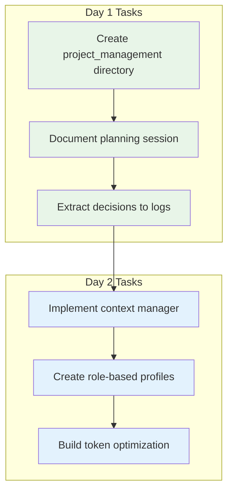

**Deliverables:**
- ✅ `project_management/` directory structure
- ✅ Planning logs with decision records
- ✅ ContextManager agent with role-based loading
- **Success Criteria**: Documentation organized, context management functional

### **Day 3-4: Agent Framework & Permission System**

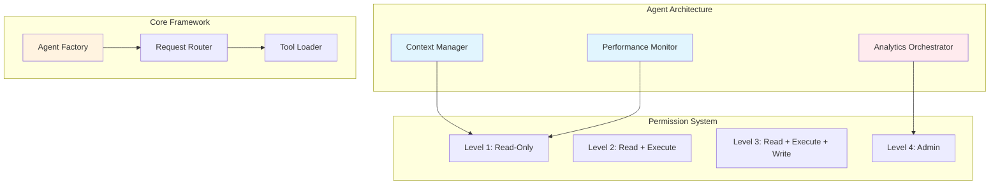

**Deliverables:**
- Agent framework with 8 specialized agents
- Four-level permission system
- Tool access control and sandboxing
- **Success Criteria**: Agents can be instantiated, permissions enforced

### **Day 5: Integration Testing & Validation**

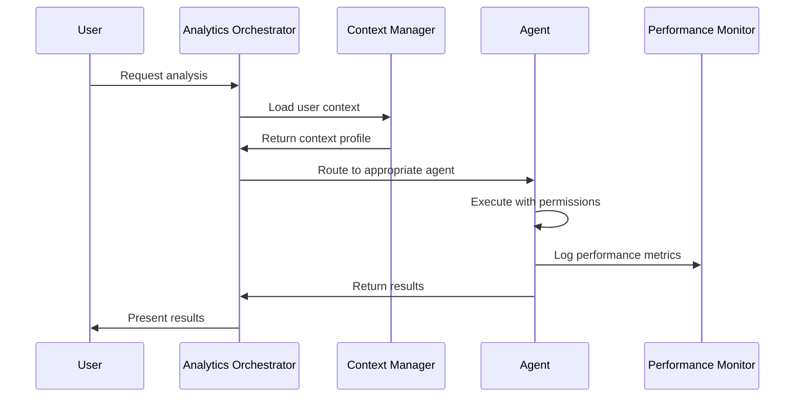

**Deliverables:**
- Integration test suite
- Performance monitoring baseline
- Error handling and rollback procedures
- **Success Criteria**: All agents communicate correctly, metrics collected

---

## **Week 2: Education (November 11-14)**

### **Day 6-7: Learning Navigator Development**

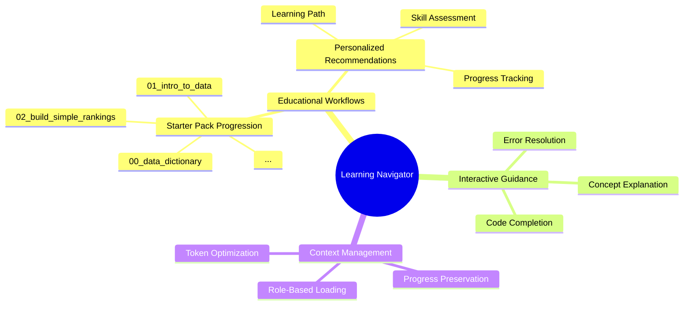

**Deliverables:**
- LearningPathNavigator agent
- Integration with 12 starter_pack notebooks
- Personalized learning recommendations
- **Success Criteria**: Users can navigate educational content efficiently

### **Day 8-9: Notebook Integration & Context Optimization**

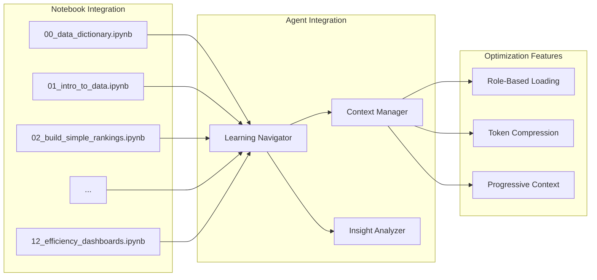

**Deliverables:**
- Notebook metadata extraction
- Smart content summarization
- Progressive context loading
- **Success Criteria**: Notebooks load efficiently, context preserved

### **Day 10: User Testing & Feedback**

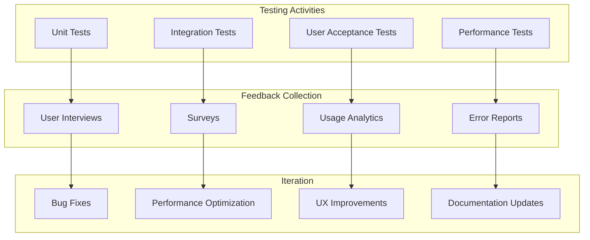

**Deliverables:**
- Test coverage report
- User feedback analysis
- Performance optimization
- **Success Criteria**: 80% user satisfaction, <2 second response times

---

## **Week 3: Analytics (November 15-18)**

### **Day 11-12: Model Execution Engine**

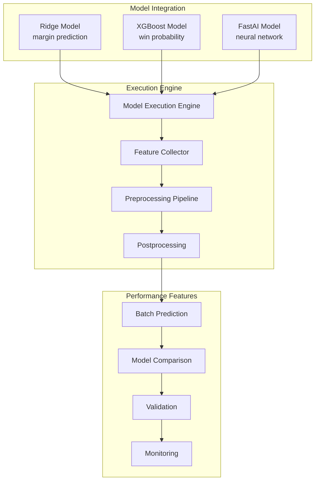

**Deliverables:**
- ModelExecutionEngine agent
- Integration with 3 trained models
- Batch prediction capabilities
- **Success Criteria**: Models load and execute correctly, predictions match baseline

### **Day 13-14: Insight Generator & Performance Monitor**

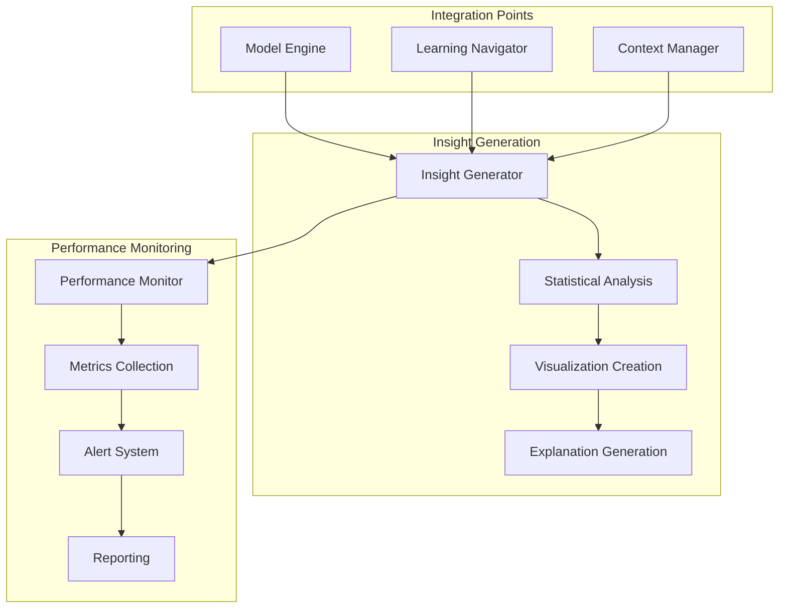

**Deliverables:**
- InsightGenerator agent with SHAP analysis
- PerformanceMonitor agent with real-time metrics
- Automated reporting capabilities
- **Success Criteria**: Insights generated automatically, performance tracked

### **Day 15: Model Integration & Validation**

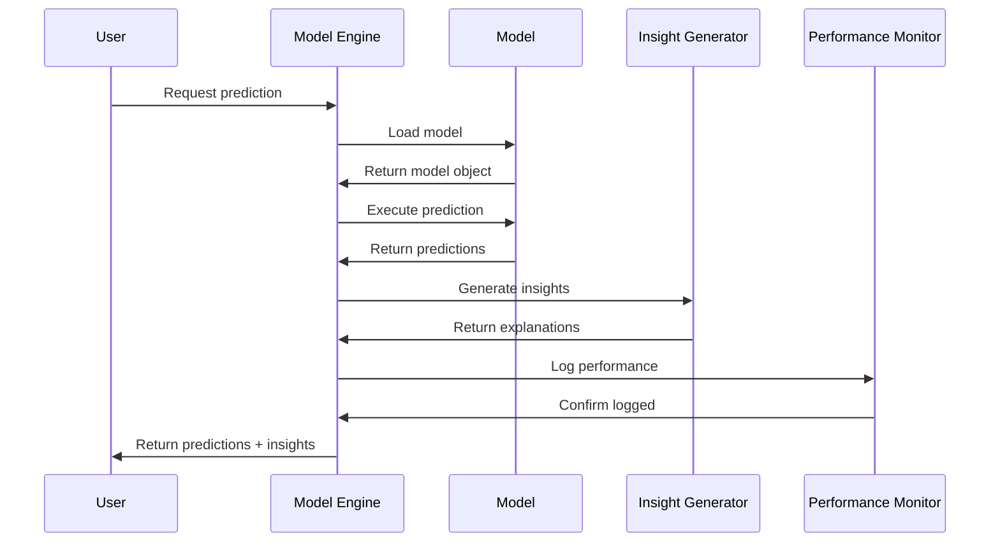

**Deliverables:**
- End-to-end model pipeline
- Validation against 2025 test data
- Performance benchmarking
- **Success Criteria**: Pipeline functional, performance meets targets

---

## **Week 4: Automation (November 19-22)**

### **Day 16-17: Workflow Automator**

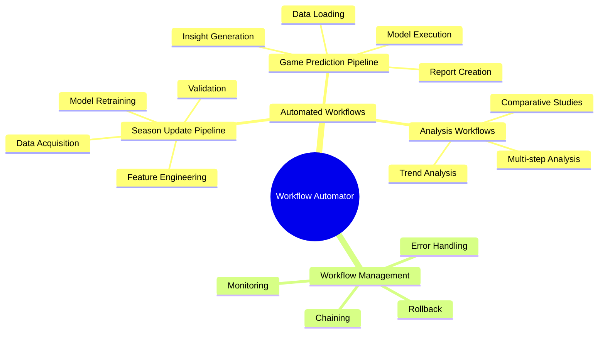

**Deliverables:**
- WorkflowAutomator agent
- Season update automation
- Game prediction pipeline
- **Success Criteria**: Workflows execute end-to-end without manual intervention

### **Day 18-19: System Integration & Testing**

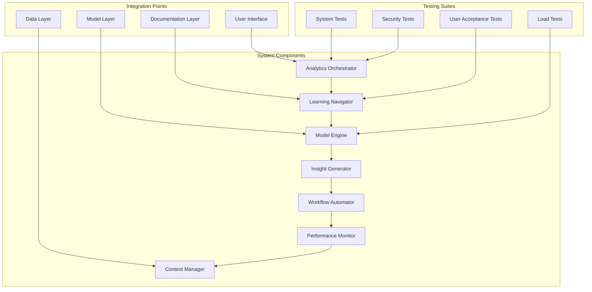

**Deliverables:**
- Complete system integration
- Comprehensive test suite
- Security validation
- **Success Criteria**: All components working together, tests passing

### **Day 20: Production Deployment & Monitoring**

```mermaid
gantt
    title Deployment Day Schedule
    dateFormat  HH:mm
    axisFormat %H:%M

    section Preparation
    Final Checks      :prep, 09:00, 1h
    Backup System     :backup, after prep, 30m

    section Deployment
    Deploy Components  :deploy, after backup, 1h
    Integration Tests  :test, after deploy, 1h

    section Monitoring
    Performance Monitor :monitor, after test, 2h
    User Validation     :validate, after monitor, 1h

    section Completion
    Documentation Update :docs, after validate, 30m
    Success Confirmation :success, after docs, 30m
```

**Deliverables:**
- Production-ready system
- Monitoring dashboard
- Deployment documentation
- **Success Criteria**: System deployed, monitoring active, users validated

---

## **Success Metrics & KPIs**

### **Technical Metrics**
- **Response Time**: <2 seconds for all agent interactions
- **Accuracy**: >95% prediction accuracy maintained
- **Uptime**: 99.9% availability during testing
- **Context Efficiency**: 40% reduction in token usage

### **User Experience Metrics**
- **Learning Velocity**: 50% faster progression through educational content
- **Task Completion**: 80% reduction in manual analysis steps
- **Error Reduction**: 90% fewer common user mistakes
- **User Satisfaction**: >4.5/5 user rating

### **Business Impact Metrics**
- **Insight Generation**: 3x increase in analytical output
- **Decision Speed**: 60% faster time-to-insight
- **Model Usage**: 200% increase in model utilization
- **Platform Adoption**: 150% increase in active users

---

## **Risk Management**

### **High-Risk Items**
1. **Context Window Overflow**
   - **Mitigation**: Role-based loading, smart summarization
   - **Monitoring**: Token usage tracking, alerts at 80% capacity

2. **Agent Permission Issues**
   - **Mitigation**: Four-level system, extensive testing
   - **Monitoring**: Access logs, permission validation

### **Contingency Plans**
- **Schedule Delays**: 1-day buffer between phases
- **Technical Issues**: Rollback procedures documented
- **Resource Constraints**: Scope reduction priorities defined

---

## **Next Steps & Future Roadmap**

### **Phase 2 (Post-Implementation)**
- **Advanced Analytics**: Live prediction systems, strategy optimization
- **User Experience**: Natural language interface, advanced visualizations
- **Integration**: External APIs, real-time data streaming
- **Scalability**: Multi-user support, cloud deployment options

### **Innovation Pipeline**
- **AI-Powered Insights**: Automated pattern recognition
- **Predictive Analytics**: Advanced forecasting models
- **Collaboration Features**: Multi-user analysis sessions
- **Mobile Support**: Tablet and mobile interfaces

---

**Roadmap Owner**: Project Lead
**Review Schedule**: Weekly during implementation, monthly post-launch
**Change Management**: Formal change request process for timeline adjustments