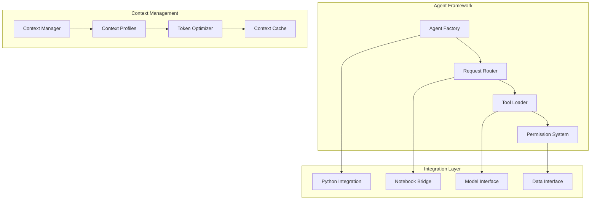

# Technology Stack Roadmap
**Version**: 1.0
**Last Updated**: 2025-11-07
**Planning Horizon**: 12 Months

## **Current Technology Stack**

## **Phase 1: Agent Foundation (November 2025)**

### **Agent Technology Stack**

**Key Technologies:**
- **Agent Framework**: Custom Python architecture
- **Context Management**: Token optimization algorithms
- **Permission System**: Role-based access control
- **Integration**: Bridge to existing Jupyter/Python ecosystem

---

## **Phase 2: Enhanced Analytics (December 2025 - February 2026)**

### **Advanced ML Infrastructure**

### **Data Infrastructure Evolution**

**Timeline:**
- **December 2025**: Model registry and deployment pipeline
- **January 2026**: Real-time processing infrastructure
- **February 2026**: Advanced analytics integration

---

## **Phase 3: User Experience Revolution (March - May 2026)**

### **Frontend & Interface Technologies**

### **Natural Language Processing Stack**

**Timeline:**
- **March 2026**: Web dashboard and API development
- **April 2026**: Natural language interface integration
- **May 2026**: Mobile and voice interfaces

---

## **Phase 4: Collaboration & Intelligence (June - August 2026)**

### **Collaboration Technology Stack**

### **AI/ML Infrastructure Scaling**

**Timeline:**
- **June 2026**: Real-time collaboration infrastructure
- **July 2026**: AI/ML pipeline scaling
- **August 2026**: Advanced user management and communication

---

## **Phase 5: Enterprise & Scale (September - October 2026)**

### **Enterprise Architecture**

### **Advanced Analytics Platform**

**Timeline:**
- **September 2026**: Enterprise multi-tenant architecture
- **October 2026**: Advanced analytics and big data integration

---

## **Infrastructure Evolution Timeline**

---

## **Technology Risk Assessment**

### **High-Risk Technologies**
- **Real-time Processing**: Complexity and performance challenges
- **Multi-tenant Architecture**: Security and isolation requirements
- **Advanced ML Models**: Computational resource requirements

### **Medium-Risk Technologies**
- **Natural Language Processing**: Accuracy and reliability concerns
- **Mobile Development**: Platform fragmentation and maintenance
- **Cloud Migration**: Data migration and cost management

### **Mitigation Strategies**
- **Phased Implementation**: Gradual technology adoption
- **Proof of Concepts**: Validate technologies before full implementation
- **Vendor Partnerships**: Leverage external expertise when needed
- **Continuous Monitoring**: Performance and reliability tracking

---

## **Technology Decision Framework**

### **Evaluation Criteria**

### **Decision Process**
1. **Technology Research**: Market analysis and evaluation
2. **Proof of Concept**: Small-scale validation
3. **Performance Testing**: Load and stress testing
4. **Security Review**: Vulnerability assessment
5. **Cost-Benefit Analysis**: ROI calculation
6. **Stakeholder Approval**: Final decision and resource allocation

---

## **Skills & Resource Planning**

### **Required Skills Evolution**

### **Team Structure Evolution**
- **Current**: 1-2 person team with data science focus
- **Phase 1**: Add systems architect and agent specialist
- **Phase 2**: Add MLOps engineer and frontend developer
- **Phase 3**: Add NLP engineer and mobile developer
- **Phase 4**: Add DevOps engineer and collaboration specialist
- **Phase 5**: Add enterprise architect and security specialist

---

**Technology Roadmap Owner**: CTO/Technical Lead
**Review Cadence**: Monthly technology reviews, quarterly strategy updates
**Budget Planning**: Annual technology budget with quarterly allocations
**Vendor Management**: Strategic partnerships for key technologies