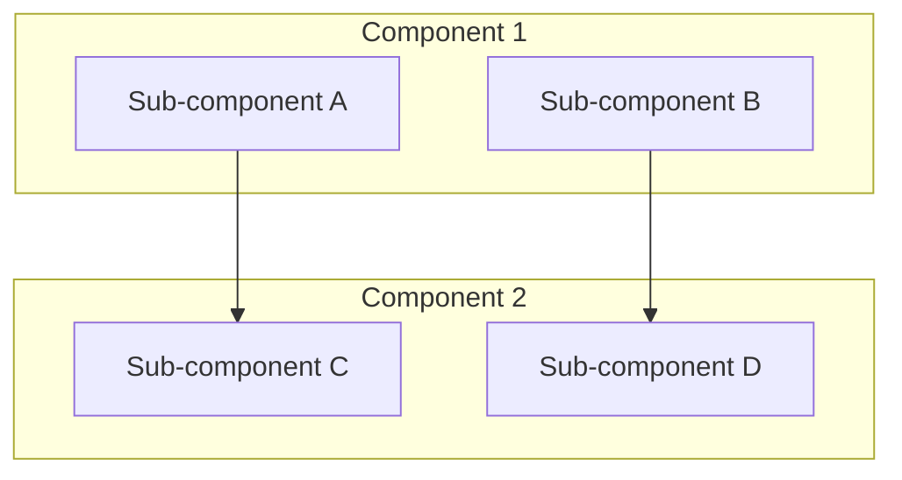
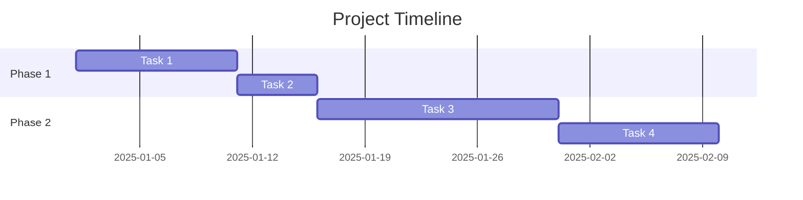
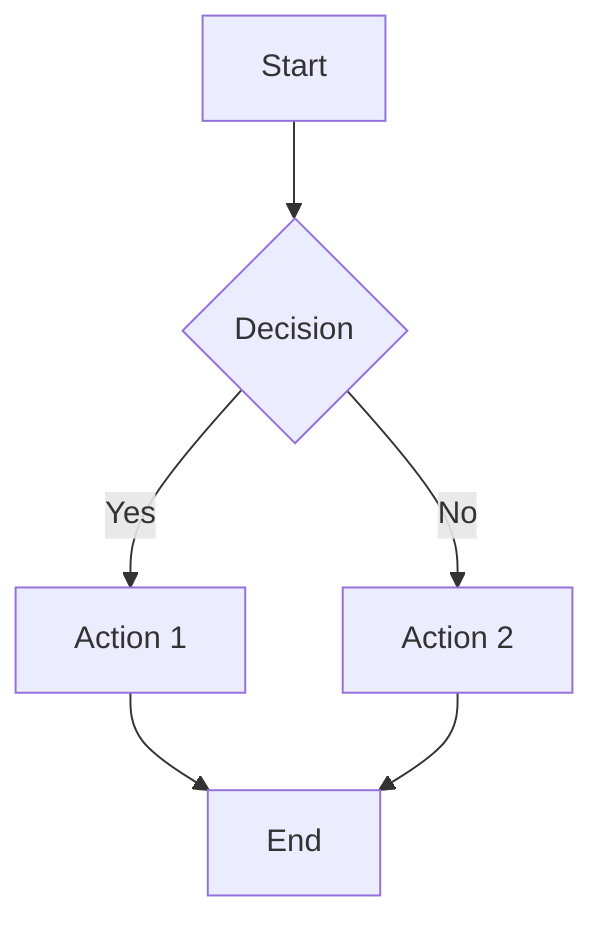

# Planning Session Template
**Template Version**: 1.0
**Last Updated**: 2025-11-07

---

## 📋 Planning Session Details

**Date**: [YYYY-MM-DD]
**Session Type**: [e.g., Architecture Design, Feature Planning, Risk Assessment]
**Duration**: [e.g., 2 hours]
**Participants**: [List all participants]
**Project Phase**: [e.g., Phase 1: Foundation]

### **Session Objectives**
1. [Primary objective 1]
2. [Primary objective 2]
3. [Primary objective 3]

### **Preparation Required**
- [Materials/documents needed]
- [Stakeholder input required]
- [Research/analysis completed]

---

## 🎯 Current Project Status

### **Overall Progress**

### **Current Phase Status**
- **Phase**: [Current phase name]
- **Progress**: [X%]
- **Start Date**: [Date]
- **Target Completion**: [Date]
- **Health Status**: [Green/Yellow/Red]

### **Recent Accomplishments**
- ✅ [Recent achievement 1]
- ✅ [Recent achievement 2]
- ✅ [Recent achievement 3]

### **Current Blockers**
- ⚠️ [Blocker 1] - [Impact Level] - [Owner]
- ⚠️ [Blocker 2] - [Impact Level] - [Owner]

---

## 💡 Session Topics & Discussions

### **Topic 1: [Topic Name]**
**Background**: [Context for this topic]
**Discussion Points**:
- [Point 1 with pros/cons]
- [Point 2 with pros/cons]
- [Point 3 with pros/cons]

**Decision Made**: [Final decision with rationale]
**Action Items**:
- [ ] [Action item 1] - [Owner] - [Due date]
- [ ] [Action item 2] - [Owner] - [Due date]

### **Topic 2: [Topic Name]**
**Background**: [Context for this topic]
**Discussion Points**:
- [Point 1 with pros/cons]
- [Point 2 with pros/cons]
- [Point 3 with pros/cons]

**Decision Made**: [Final decision with rationale]
**Action Items**:
- [ ] [Action item 1] - [Owner] - [Due date]
- [ ] [Action item 2] - [Owner] - [Due date]

### **Topic 3: [Topic Name]**
**Background**: [Context for this topic]
**Discussion Points**:
- [Point 1 with pros/cons]
- [Point 2 with pros/cons]
- [Point 3 with pros/cons]

**Decision Made**: [Final decision with rationale]
**Action Items**:
- [ ] [Action item 1] - [Owner] - [Due date]
- [ ] [Action item 2] - [Owner] - [Due date]

---

## 📊 Visual Diagrams

### **Architecture Diagram (if applicable)**

### **Timeline (if applicable)**

### **Process Flow (if applicable)**

---

## 🎯 Decisions Made

### **Decision Matrix**
| Decision | Options Considered | Selected Option | Rationale | Impact |
|----------|-------------------|-----------------|-----------|---------|
| [Decision 1] | [Option A, Option B, Option C] | [Selected] | [Why selected] | [Impact level] |
| [Decision 2] | [Option A, Option B, Option C] | [Selected] | [Why selected] | [Impact level] |
| [Decision 3] | [Option A, Option B, Option C] | [Selected] | [Why selected] | [Impact level] |

### **Decision Summary**
1. **[Decision 1]**: [Brief description with rationale]
2. **[Decision 2]**: [Brief description with rationale]
3. **[Decision 3]**: [Brief description with rationale]

---

## 📋 Action Items & Next Steps

### **Immediate Actions (Next 24-48 hours)**
| Priority | Action Item | Owner | Due Date | Status |
|----------|-------------|-------|----------|---------|
| [High] | [Action 1] | [Owner] | [Date] | [Not Started/In Progress/Completed] |
| [High] | [Action 2] | [Owner] | [Date] | [Not Started/In Progress/Completed] |

### **Short-term Actions (Next 1-2 weeks)**
| Priority | Action Item | Owner | Due Date | Status |
|----------|-------------|-------|----------|---------|
| [Medium] | [Action 1] | [Owner] | [Date] | [Not Started/In Progress/Completed] |
| [Medium] | [Action 2] | [Owner] | [Date] | [Not Started/In Progress/Completed] |

### **Long-term Actions (Next 1-3 months)**
| Priority | Action Item | Owner | Due Date | Status |
|----------|-------------|-------|----------|---------|
| [Low] | [Action 1] | [Owner] | [Date] | [Not Started/In Progress/Completed] |
| [Low] | [Action 2] | [Owner] | [Date] | [Not Started/In Progress/Completed] |

---

## ⚠️ Risks & Issues

### **New Risks Identified**
| Risk | Probability | Impact | Mitigation Strategy | Owner |
|------|-------------|---------|-------------------|-------|
| [Risk 1] | [Low/Medium/High] | [Low/Medium/High] | [Strategy to mitigate] | [Owner] |
| [Risk 2] | [Low/Medium/High] | [Low/Medium/High] | [Strategy to mitigate] | [Owner] |

### **Issues Raised**
| Issue | Priority | Description | Proposed Solution | Owner | Status |
|-------|----------|-------------|-------------------|-------|---------|
| [Issue 1] | [High/Medium/Low] | [Description] | [Solution] | [Owner] | [Open/In Progress/Resolved] |

---

## 📊 Success Metrics & KPIs

### **Metrics to Track**
| Metric | Current Value | Target Value | Measurement Method | Review Date |
|--------|---------------|--------------|-------------------|-------------|
| [Metric 1] | [Current] | [Target] | [How to measure] | [Date] |
| [Metric 2] | [Current] | [Target] | [How to measure] | [Date] |
| [Metric 3] | [Current] | [Target] | [How to measure] | [Date] |

### **Success Criteria**
- ✅ [Success criterion 1]
- ✅ [Success criterion 2]
- ✅ [Success criterion 3]

---

## 📝 Session Notes

### **Key Discussion Points**
- [Important point 1 with details]
- [Important point 2 with details]
- [Important point 3 with details]

### **Concerns Raised**
- [Concern 1] - [Context] - [Proposed resolution]
- [Concern 2] - [Context] - [Proposed resolution]

### **Ideas for Future Consideration**
- [Idea 1] - [Potential benefits]
- [Idea 2] - [Potential benefits]
- [Idea 3] - [Potential benefits]

---

## 🔄 Follow-up & Review

### **Next Review Meeting**
**Date**: [YYYY-MM-DD]
**Time**: [HH:MM]
**Attendees**: [Required attendees]
**Purpose**: [Review progress on action items]

### **Documentation Updates Required**
- [ ] Update project backlog
- [ ] Update risk register
- [ ] Update current state documentation
- [ ] Communicate decisions to stakeholders

### **Stakeholder Communication**
- **Who needs to be informed**: [List of stakeholders]
- **What to communicate**: [Key messages]
- **When**: [Timing]
- **How**: [Email/meeting/document]

---

## 📎 Attachments & References

### **Documents Referenced**
- [Document 1] - [Brief description]
- [Document 2] - [Brief description]
- [Document 3] - [Brief description]

### **Resources Created**
- [Resource 1] - [Location/Link]
- [Resource 2] - [Location/Link]
- [Resource 3] - [Location/Link]

---

## 🎉 Session Summary

### **Key Outcomes**
1. [Major outcome 1]
2. [Major outcome 2]
3. [Major outcome 3]

### **Session Assessment**
- **Objectives Met**: [Yes/No/Partially] - [Details]
- **Time Management**: [Effective/Adequate/Poor] - [Notes]
- **Participation**: [Excellent/Good/Fair] - [Notes]
- **Decision Quality**: [High/Medium/Low] - [Notes]

### **Overall Session Rating**
**Rating**: [1-10] - [Brief explanation of rating]

---

**Document Status**: [Draft/Final/Approved]
**Next Review**: [Date]
**Document Owner**: [Name/Role]
**Approval Required**: [Yes/No] - [Who needs to approve]

---

*Template created for Script Ohio 2.0 project management*
*For questions about template usage, refer to project_management guidelines*