# Next Priorities - Action Plan
**Last Updated**: 2025-11-07
**Planning Horizon**: 30 Days
**Focus**: Foundation Phase Completion

## **🎯 Immediate Priorities (Next 72 Hours)**

### **Priority 1: Complete Context Manager Implementation**

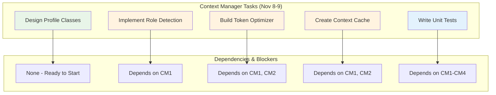

**Success Criteria:**
- ✅ Role-based profiles functional (Analyst, Data Scientist, Production)
- ✅ Token usage reduced by 40% in test scenarios
- ✅ Context caching operational
- ✅ All unit tests passing (90% coverage)

### **Priority 2: Begin Agent Framework Development**

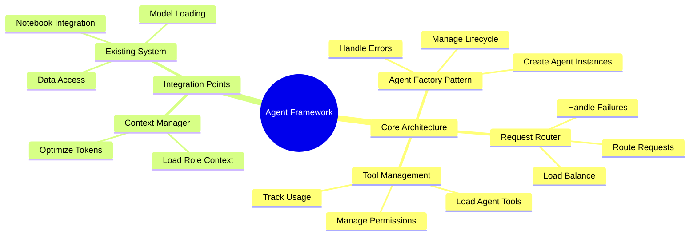

**Timeline:**
- **November 10**: Agent Factory and Request Router
- **November 11**: Tool Management and Permission System
- **November 12**: Integration testing with Context Manager

---

## **📋 Week 2 Priorities (November 12-18)**

### **Priority 3: Learning Navigator Development**

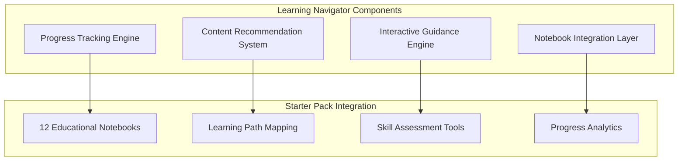

**Week 2 Success Criteria:**
- ✅ Learning Navigator can guide users through starter_pack
- ✅ Personalized recommendations based on user skill level
- ✅ Progress tracking across 12 notebooks
- ✅ Integration with Context Manager for role-based content

### **Priority 4: System Integration & Testing**

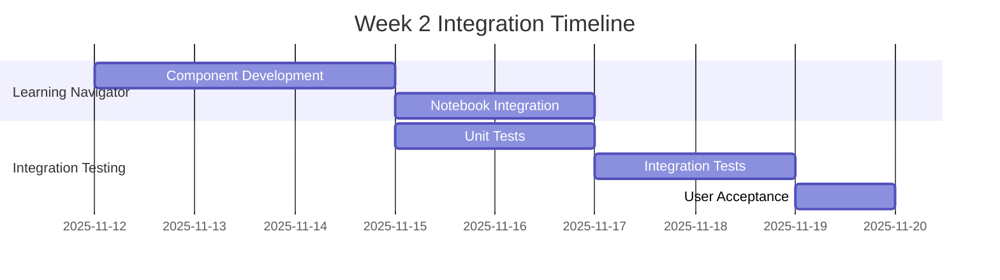

---

## **🚀 Week 3-4 Priorities (November 19-30)**

### **Priority 5: Model Execution Engine**

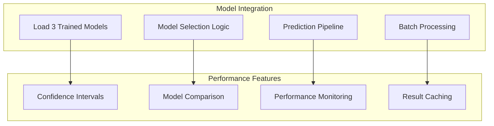

### **Priority 6: Workflow Automation**

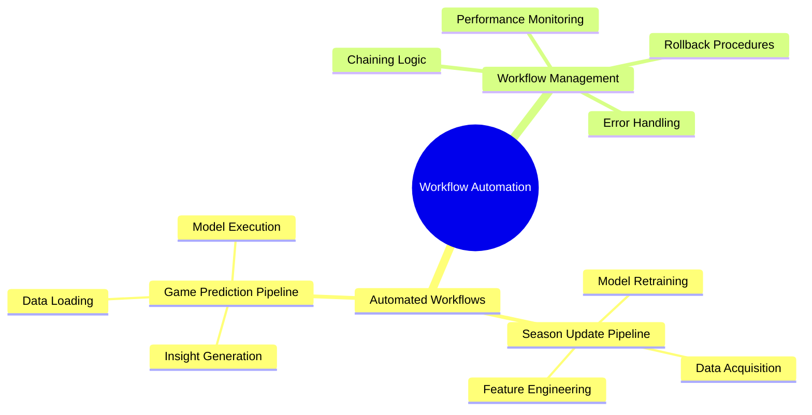

---

## **📊 Priority Matrix**

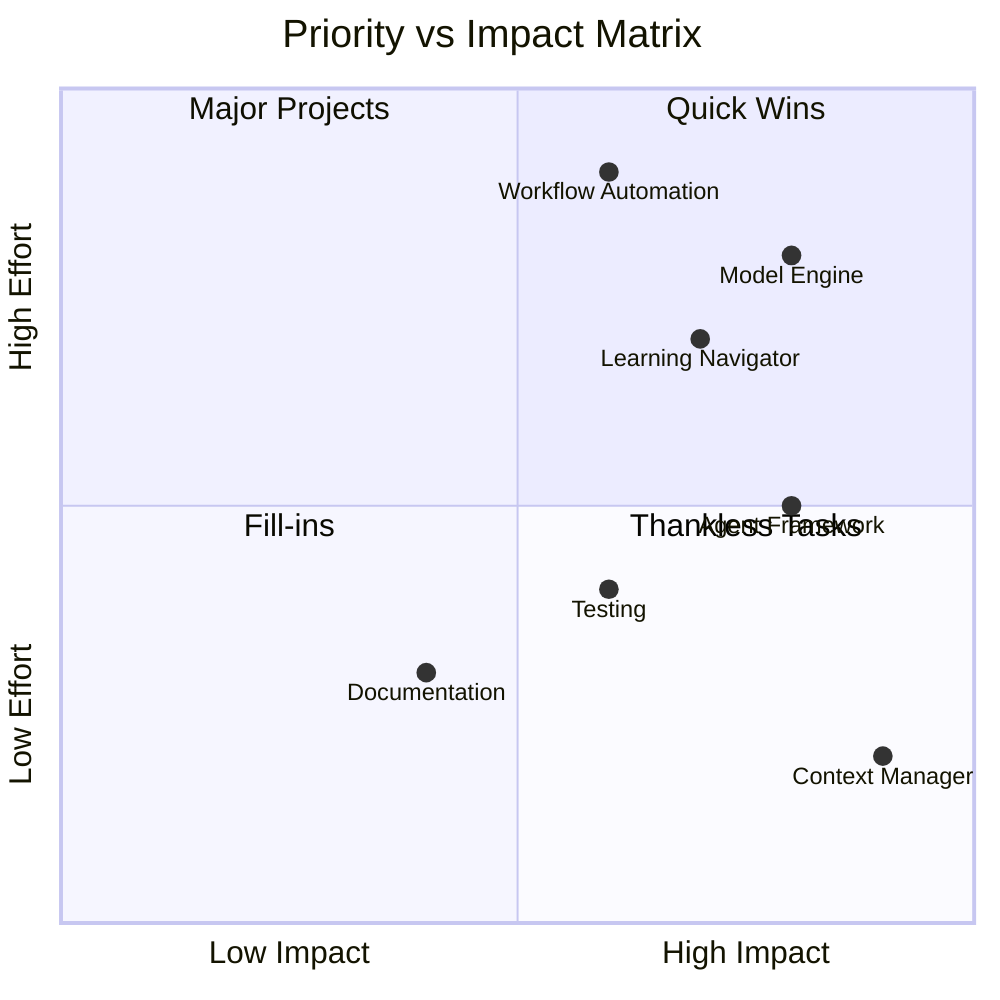

### **Priority Breakdown**

| Priority | Task | Impact | Effort | Timeline | Dependencies |
|----------|------|--------|--------|----------|--------------|
| 1 | Context Manager | High | Low | 2 days | None |
| 2 | Agent Framework | High | Medium | 3 days | Context Manager |
| 3 | Learning Navigator | Medium-High | Medium | 5 days | Agent Framework |
| 4 | Model Execution Engine | High | High | 4 days | Agent Framework |
| 5 | Workflow Automation | Medium | High | 5 days | Model Engine |
| 6 | Testing & Validation | High | Medium | Ongoing | All components |

---

## **⚠️ Risk-Based Prioritization**

### **High-Risk, High-Priority Items**

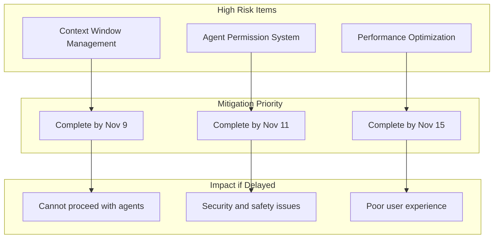

### **Risk Mitigation Timeline**

| Risk | Mitigation Strategy | Target Date | Owner | Success Criteria |
|------|-------------------|-------------|-------|------------------|
| Context Overflow | Role-based loading + compression | Nov 9 | Claude Code | 40% token reduction |
| Permission Issues | Four-level system + testing | Nov 11 | Claude Code | Zero unauthorized access |
| Performance Issues | Monitoring + optimization | Nov 15 | Claude Code | <2s response time |

---

## **🎯 Success Metrics & Milestones**

### **Immediate Success Metrics (Next 7 Days)**

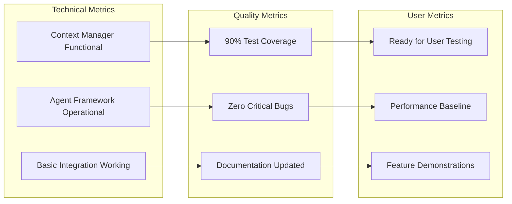

### **30-Day Success Targets**

| Metric | Target | Current | Gap | Priority |
|--------|--------|---------|-----|----------|
| Context Management | 100% | 25% | 75% | High |
| Agent Framework | 100% | 0% | 100% | High |
| Learning Navigator | 100% | 0% | 100% | Medium |
| Model Integration | 80% | 0% | 80% | Medium |
| Test Coverage | 90% | 0% | 90% | High |
| Documentation | 100% | 90% | 10% | Low |

---

## **🔄 Resource Allocation Plan**

### **Development Resource Distribution**

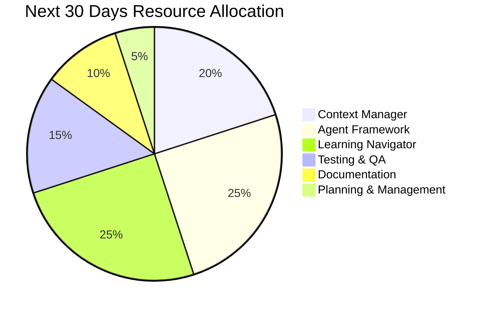

### **Skill Requirements**

| Phase | Required Skills | Current Availability | Gap | Action |
|-------|----------------|---------------------|-----|--------|
| Context Management | Python, Optimization | High | None | Proceed |
| Agent Framework | Architecture, Design | High | None | Proceed |
| Learning Navigator | Education, UX | Medium | Some | Learning |
| Testing | QA, Automation | Medium | Some | Planning |

---

## **🚀 Contingency Planning**

### **If-Then Scenarios**

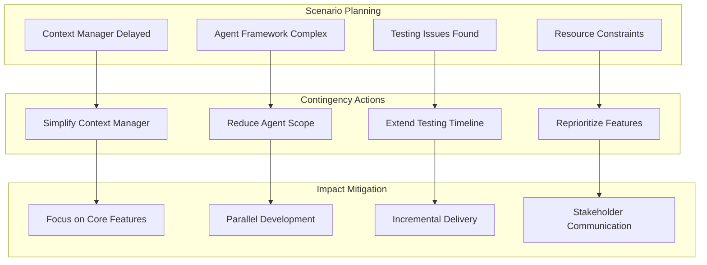

### **Decision Points**

| Decision Point | Trigger Date | Decision Required | Options |
|----------------|--------------|-------------------|---------|
| Context Manager Complete | Nov 9 | Proceed to Agent Framework? | Yes/No/Modify |
| Week 1 Review | Nov 11 | Adjust Week 2 plan? | Yes/No |
| Phase 1 Review | Nov 14 | Ready for Phase 2? | Yes/No/Extend |

---

**Document Owner**: Project Management
**Review Frequency**: Daily priority review, weekly reprioritization
**Escalation Process**: Blockers → Project Lead immediately
**Success Criteria**: All priorities completed within timeline with quality standards