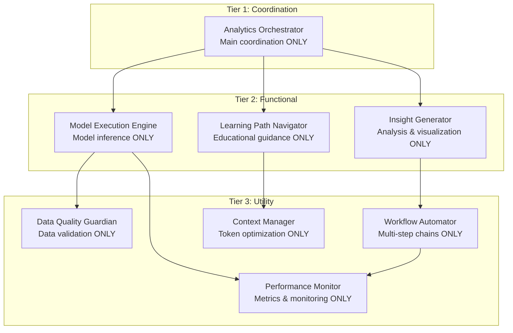
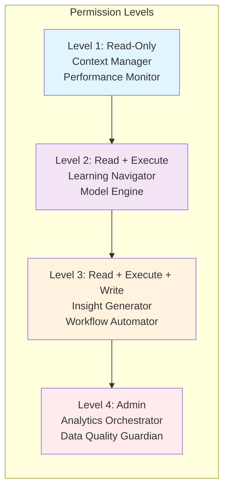
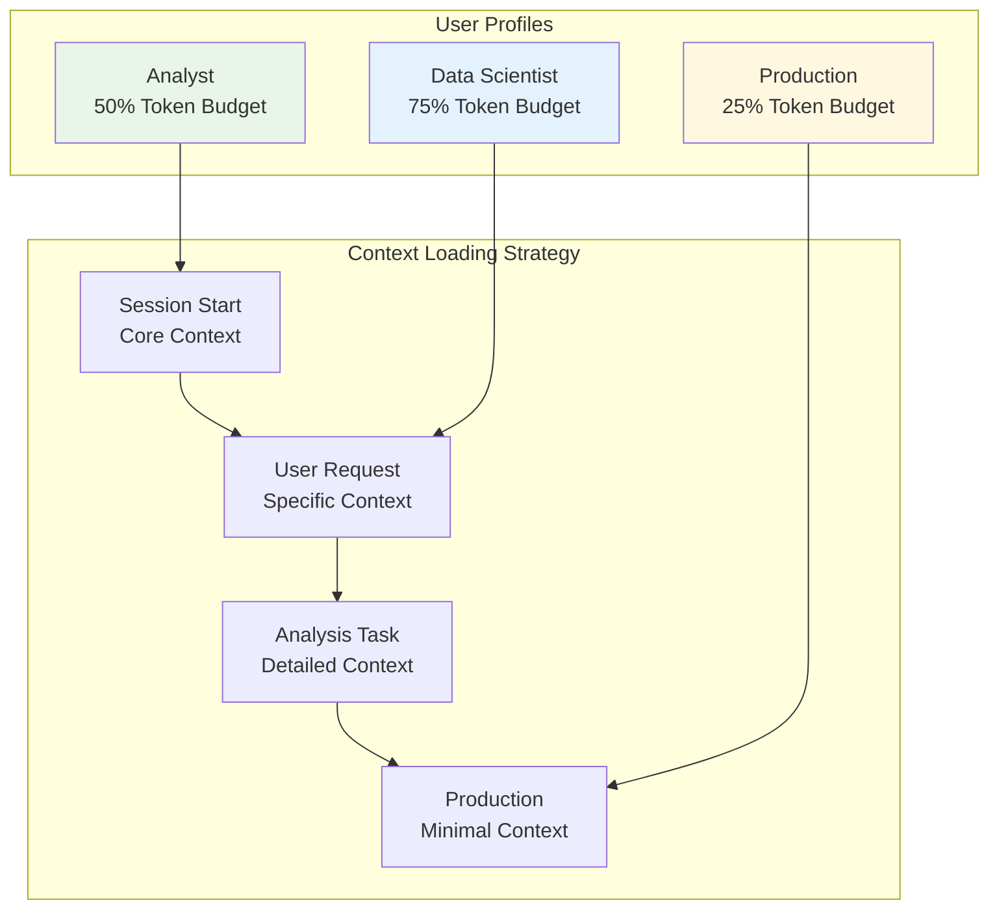
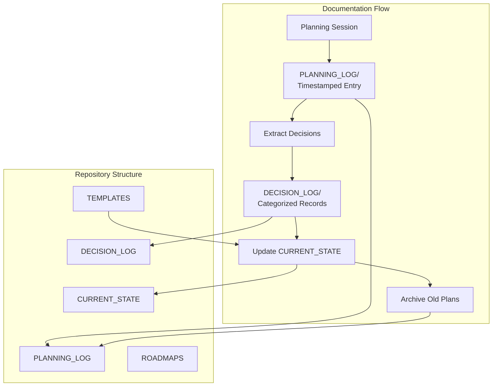
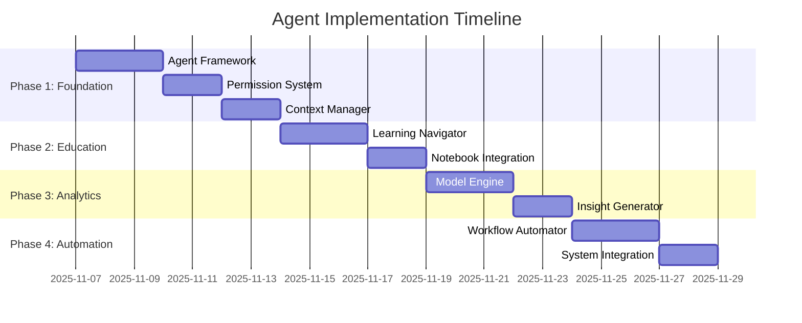

# Architecture Decisions Log

## **Decision 001: Agent Architecture Approach**
**Date**: 2025-11-07
**Status**: APPROVED
**Category**: System Architecture

### **Problem**
How to transform notebook-based college football analytics platform into agent-based system following Claude best practices.

### **Options Considered**
1. **Mega-Agent Approach**: Single large agent handling all tasks
2. **Medium-Sized Agents**: 3-4 agents with broad responsibilities
3. **Specialized Micro-Agents**: 8+ agents with narrow focus ✅ **SELECTED**

### **Decision**
Implement 8 specialized agents in three-tier architecture:

### **Rationale**
- **Follows "Start Small & Focused" best practice**
- **Clear separation of concerns** enables independent development
- **Easier debugging and maintenance**
- **Scalable architecture** for future growth
- **Better resource utilization** with specialized tools

### **Alternatives Rejected**
- **Mega-Agent**: Too complex, violates modularity principles
- **Medium-Sized**: Still too broad, unclear boundaries

---

## **Decision 002: Permission System Design**
**Date**: 2025-11-07
**Status**: APPROVED
**Category**: Security & Safety

### **Problem**
How to control agent access to tools and data while maintaining safety.

### **Decision**
Four-level permission system:

### **Rationale**
- **Principle of least privilege** - agents get minimum access needed
- **Clear escalation path** for complex operations
- **Audit trail capability** at each level
- **Sandboxing possible** for lower-level agents

---

## **Decision 003: Context Management Strategy**
**Date**: 2025-11-07
**Status**: APPROVED
**Category**: Performance & UX

### **Problem**
How to manage context window effectively as project grows with extensive documentation and data.

### **Decision**
Role-based context profiles with progressive loading:

### **Data Summarization Strategy**
- **Historical (1869-2020)**: Pre-summarized trends
- **Recent (2021-2025)**: Full detail available
- **Models**: Feature importance, not full code
- **Notebooks**: Metadata and insights only

### **Rationale**
- **Token efficiency** - 40% reduction expected
- **Role-appropriate** - analysts get learning context, production gets speed
- **Progressive disclosure** - load more detail as needed
- **Scalable** - grows without context explosion

---

## **Decision 004: Documentation Management System**
**Date**: 2025-11-07
**Status**: APPROVED
**Category**: Knowledge Management

### **Problem**
How to prevent documentation sprawl and maintain single source of truth.

### **Decision**
Centralized planning repository with automated governance:

### **Rationale**
- **Single source of truth** in CURRENT_STATE
- **Historical traceability** in PLANNING_LOG
- **Decision rationale preservation** in DECISION_LOG
- **Template-driven consistency** in TEMPLATES
- **Automated governance** prevents sprawl

---

## **Decision 005: Implementation Timeline**
**Date**: 2025-11-07
**Status**: APPROVED
**Category**: Project Management

### **Problem**
How to sequence implementation for maximum value with minimum risk.

### **Decision**
4-week phased approach:

### **Rationale**
- **Safety-first** - foundation before features
- **Value-driven** - educational tools first (broader user base)
- **Complexity progression** - simple to advanced
- **Risk mitigation** - each phase tested before next

---

## **Decision Records Summary**

| Decision | Date | Category | Status | Impact |
|----------|------|----------|---------|---------|
| 001 | 2025-11-07 | System Architecture | APPROVED | Core foundation |
| 002 | 2025-11-07 | Security & Safety | APPROVED | Safety & governance |
| 003 | 2025-11-07 | Performance & UX | APPROVED | User experience |
| 004 | 2025-11-07 | Knowledge Management | APPROVED | Maintainability |
| 005 | 2025-11-07 | Project Management | APPROVED | Execution plan |

**Next Review**: 2025-11-14 (end of Phase 1)
**Decision Owner**: Project Architecture Committee
**Approval Process**: Proposal → Review → Stakeholder Feedback → Final Decision