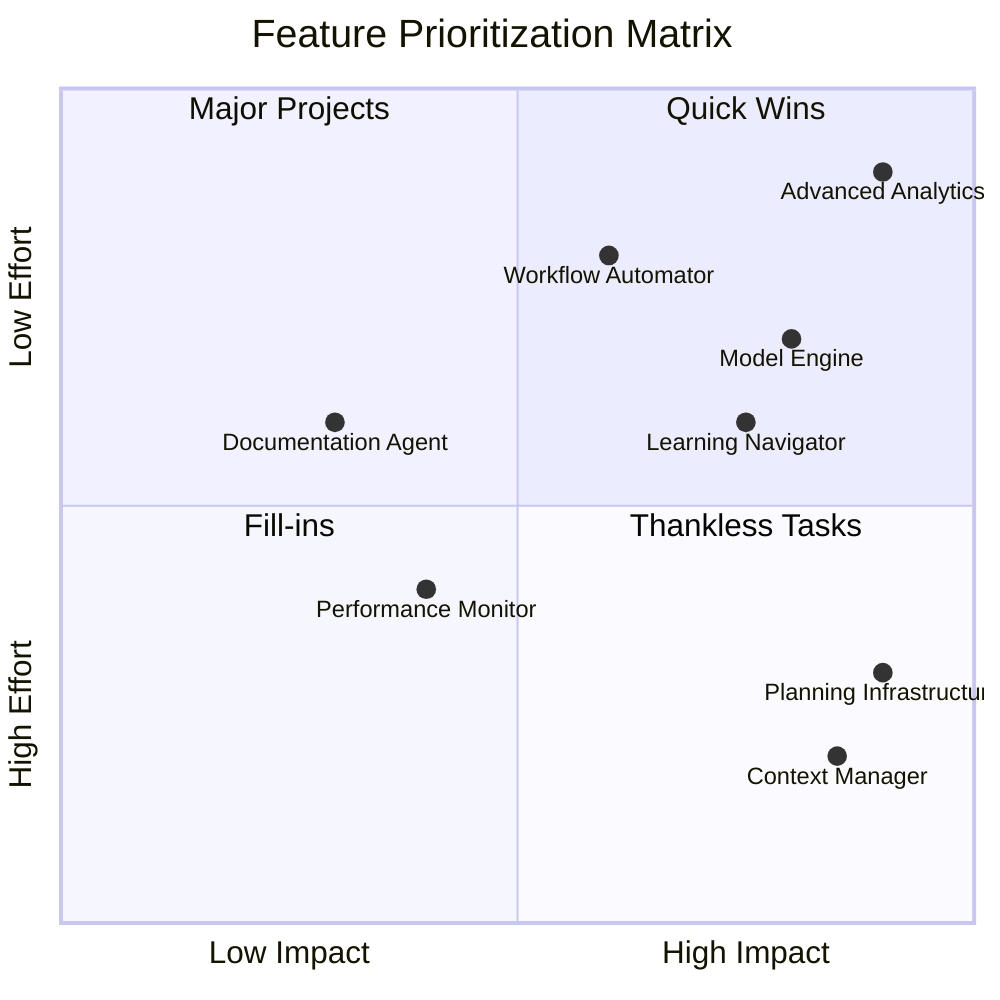
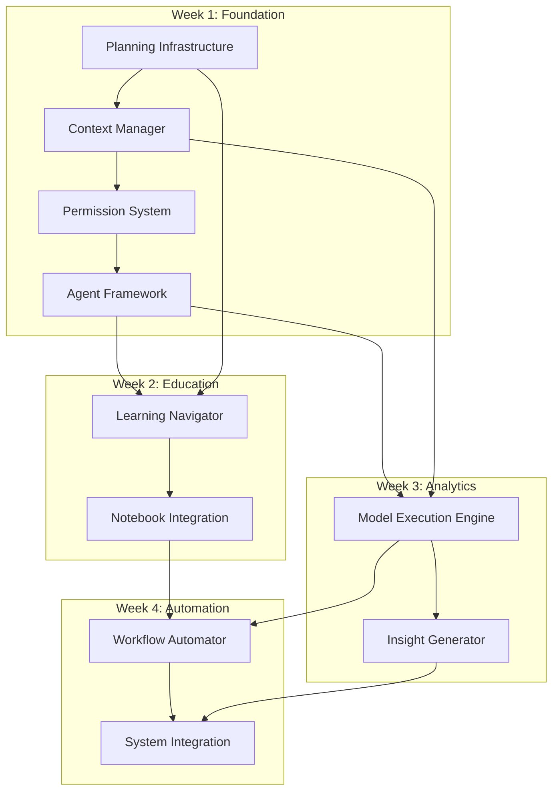
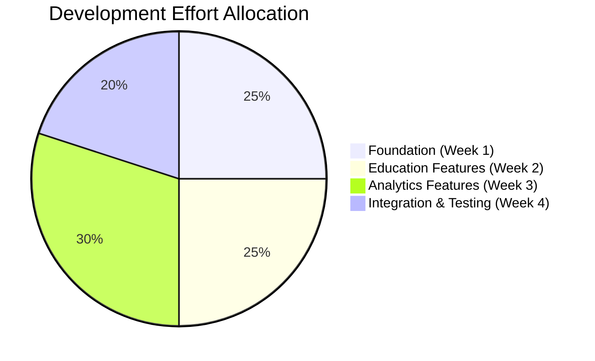
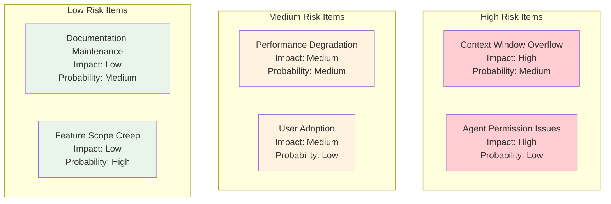

# Prioritization Decisions Log

## **Decision 010: Feature Prioritization Framework**
**Date**: 2025-11-07
**Status**: APPROVED
**Category**: Prioritization

### **Prioritization Matrix**

### **Priority Tiers**

**Tier 1: Quick Wins (Immediate - Week 1)**
- **Context Manager** - High impact, low effort
- **Planning Infrastructure** - High impact, low effort
- **Permission System** - Foundation requirement

**Tier 2: Core Features (Week 2-3)**
- **Learning Navigator** - Medium-high impact, medium effort
- **Model Execution Engine** - High impact, medium-high effort
- **Performance Monitor** - Medium impact, medium effort

**Tier 3: Advanced Features (Week 4+)**
- **Workflow Automator** - Medium impact, high effort
- **Documentation Agent** - Low-medium impact, medium effort
- **Advanced Analytics** - High impact, high effort (future phase)

### **Rationale**
- **Value-first approach** - highest impact features first
- **Momentum building** - quick wins build confidence
- **Foundation dependency** - core features enable advanced ones
- **Risk management** - complex features after proven foundation

---

## **Decision 011: Implementation Sequencing**
**Date**: 2025-11-07
**Status**: APPROVED
**Category**: Implementation Planning

### **Dependency Analysis**

### **Critical Path Analysis**
- **Critical Path**: Planning → Context → Agent Framework → Model Engine → Workflow Automator
- **Parallel Work**: Learning Navigator can start after Agent Framework
- **Buffer Time**: 1 day buffer between major milestones
- **Integration Points**: Daily integration checks

### **Risk Mitigation**
- **Foundation First**: Context and permissions before agents
- **Parallel Development**: Education and analytics tracks
- **Continuous Integration**: Daily validation of components
- **Rollback Capability**: Each phase can be rolled back independently

---

## **Decision 012: Resource Allocation**
**Date**: 2025-11-07
**Status**: APPROVED
**Category**: Resource Management

### **Development Resource Distribution**

### **Resource Priorities by Week**

**Week 1 (25% effort - Foundation)**
- **60%** Planning & Documentation Infrastructure
- **25%** Context Manager Implementation
- **15%** Agent Framework Setup

**Week 2 (25% effort - Education)**
- **70%** Learning Navigator Development
- **20%** Notebook Integration
- **10%** Context Optimization

**Week 3 (30% effort - Analytics)**
- **60%** Model Execution Engine
- **25%** Insight Generator
- **15%** Performance Monitoring

**Week 4 (20% effort - Integration)**
- **50%** Workflow Automator
- **30%** System Integration
- **20%** Testing & Validation

### **Rationale**
- **Front-loaded planning** for strong foundation
- **Education focus** early (broader user impact)
- **Analytics heavy** (core value proposition)
- **Integration focus** end (system coherence)

---

## **Decision 013: Risk Prioritization**
**Date**: 2025-07-07
**Status**: APPROVED
**Category**: Risk Management

### **Risk Assessment Matrix**

### **Mitigation Strategies**

**High Risk Mitigation:**
- **Context Window**: Role-based loading, smart summarization
- **Permission Issues**: Four-level system, extensive testing

**Medium Risk Mitigation:**
- **Performance**: Monitoring, optimization, caching
- **User Adoption**: Training, documentation, gradual rollout

**Low Risk Mitigation:**
- **Documentation**: Automated maintenance, templates
- **Scope Creep**: Change control process, stakeholder approval

### **Monitoring Plan**
- **Daily**: Performance metrics, error rates
- **Weekly**: Risk assessment, mitigation effectiveness
- **Monthly**: Strategic risk review, planning adjustments

---

## **Prioritization Decisions Summary**

| Decision | Date | Category | Status | Key Priority |
|----------|------|----------|---------|--------------|
| 010 | 2025-11-07 | Feature Prioritization | APPROVED | Impact-Effort Matrix |
| 011 | 2025-11-07 | Implementation Sequencing | APPROVED | Foundation-First Approach |
| 012 | 2025-11-07 | Resource Allocation | APPROVED | Value-Driven Distribution |
| 013 | 2025-11-07 | Risk Management | APPROVED | Risk-Based Mitigation |

### **Priority Principles Established**
1. **Value First** - Highest impact features prioritized
2. **Foundation Before Features** - Infrastructure first
3. **Parallel Where Possible** - Independent tracks when feasible
4. **Risk-Aware** - High risks get early attention

### **Next Prioritization Review**
**Date**: 2025-11-14 (end of Week 1)
**Focus**: Foundation completion, Week 2 readiness
**Decision Authority**: Project Lead + Stakeholder input

---

**Change Process**: Any priority changes require formal proposal and stakeholder approval
**Escalation**: Blockers go to Project Lead immediately
**Success Criteria**: 90% of planned features completed on schedule