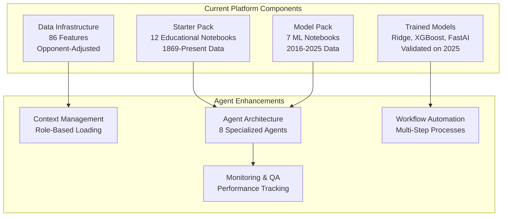
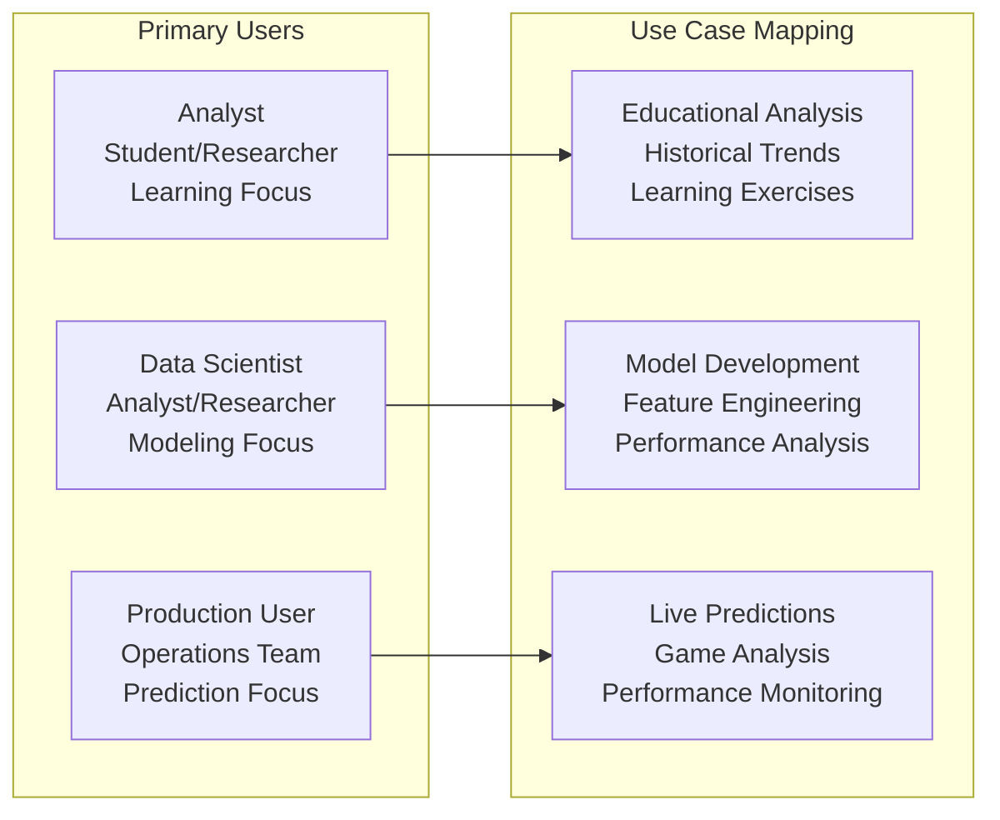
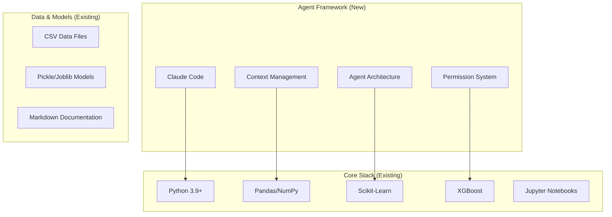
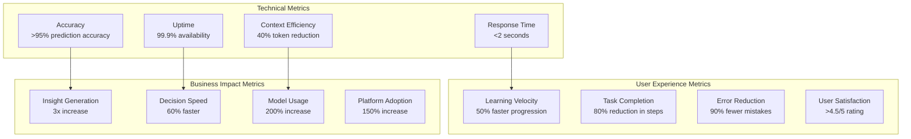

# Scope Decisions Log

## **Decision 006: Project Scope Definition**
**Date**: 2025-11-07
**Status**: APPROVED
**Category**: Project Scope

### **Core Scope (Phase 1)**
Transform existing notebook-based platform into agent-based system while preserving all current capabilities.

### **In Scope**

### **Out of Scope (Phase 1)**
- **New ML Models** - Use existing trained models
- **External API Integration** - Beyond current CFBD data
- **Real-Time Data Streaming** - Current batch processing only
- **Web Interface** - Focus on Jupyter/Claude interface
- **Mobile Applications** - Desktop/CLI focus

### **Rationale**
- **Manageable scope** for 4-week timeline
- **Leverage existing assets** (trained models, data pipelines)
- **Proven technology** (no experimental features)
- **Clear success metrics** based on current capabilities

---

## **Decision 007: User Role Definition**
**Date**: 2025-11-07
**Status**: APPROVED
**Category**: User Experience

### **Target User Personas**

### **Persona Details**

**Analyst Profile:**
- **Background**: Students, academic researchers, CFB enthusiasts
- **Goals**: Learn analytics, understand historical patterns
- **Tools**: Educational notebooks, visualizations, guided analysis
- **Data Access**: Sample datasets, summarized historical data

**Data Scientist Profile:**
- **Background**: Sports analysts, quantitative researchers
- **Goals**: Build models, test hypotheses, advanced analytics
- **Tools**: Full model suite, feature engineering, SHAP analysis
- **Data Access**: Complete feature sets, raw data when needed

**Production User Profile:**
- **Background**: Operations team, automated systems
- **Goals**: Fast predictions, monitoring, reporting
- **Tools**: Model inference APIs, dashboards, alerts
- **Data Access**: Current season, pre-computed features only

### **Rationale**
- **Clear role boundaries** enable focused user experiences
- **Progressive complexity** supports user growth
- **Resource optimization** - appropriate data/feature access per role
- **Security** - production users get minimal access

---

## **Decision 008: Technology Stack Boundaries**
**Date**: 2025-11-07
**Status**: APPROVED
**Category**: Technical Architecture

### **Approved Technologies**

### **Technology Constraints**
- **No new databases** - Continue with CSV files
- **No web frameworks** - Jupyter/Claude interface only
- **No cloud services** - Local deployment only
- **No real-time processing** - Batch workflows maintained

### **Rationale**
- **Leverage existing investments** in Python/ML stack
- **Minimal learning curve** for current users
- **Proven reliability** of existing tools
- **Focus budget** on agent architecture, not infrastructure

---

## **Decision 009: Success Metrics Definition**
**Date**: 2025-11-07
**Status**: APPROVED
**Category**: Measurement & KPIs

### **Primary Success Metrics**

### **Measurement Methods**
- **Technical Metrics**: Automated monitoring, performance logs
- **User Experience**: User surveys, session analytics, error tracking
- **Business Impact**: Usage analytics, model invocation counts, time-to-insight

### **Success Criteria**
- **Phase 1 Success**: 70% of technical metrics achieved
- **Phase 2 Success**: All technical metrics + 80% user metrics
- **Phase 3 Success**: All metrics achieved consistently for 4 weeks

---

## **Scope Decisions Summary**

| Decision | Date | Category | Status | Key Boundaries |
|----------|------|----------|---------|----------------|
| 006 | 2025-11-07 | Project Scope | APPROVED | Enhance existing, no new models |
| 007 | 2025-11-07 | User Experience | APPROVED | 3 personas, progressive complexity |
| 008 | 2025-11-07 | Technical Architecture | APPROVED | Python/Claude only, no new infra |
| 009 | 2025-11-07 | Measurement & KPIs | APPROVED | Technical, UX, Business metrics |

**Scope Review Schedule**: Bi-weekly during implementation
**Change Control**: Formal proposal required for scope changes
**Success Threshold**: 70% metrics achievement for phase completion

---

**Next Scope Review**: 2025-11-21 (Phase 1 completion)
**Scope Owner**: Project Management
**Stakeholder Approval**: Required for any scope expansion