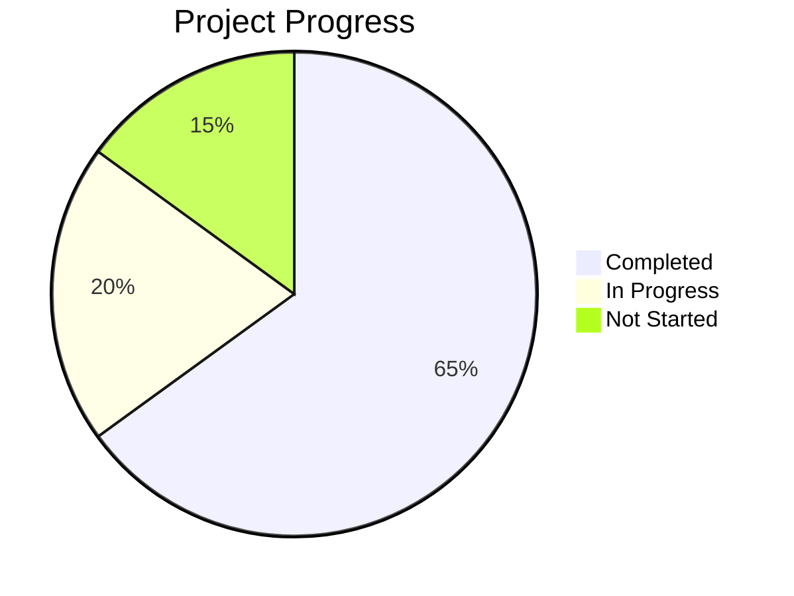
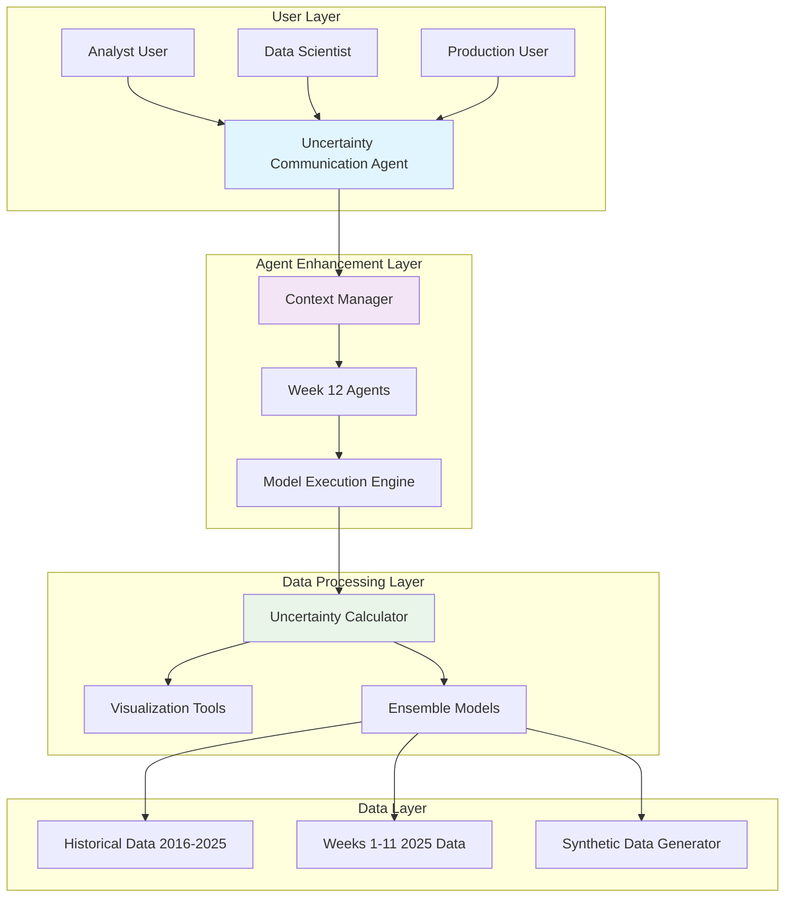
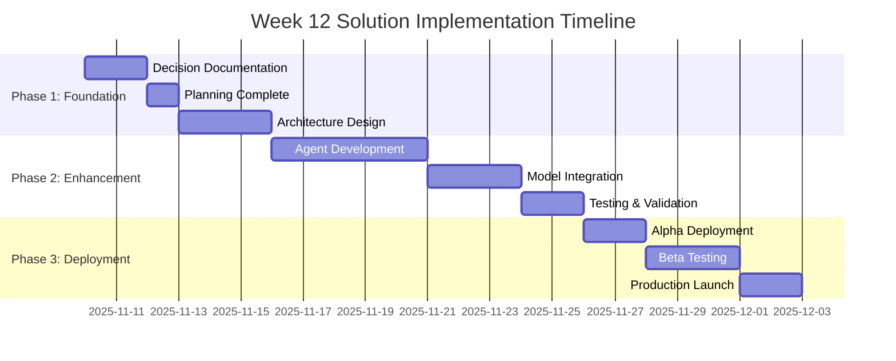
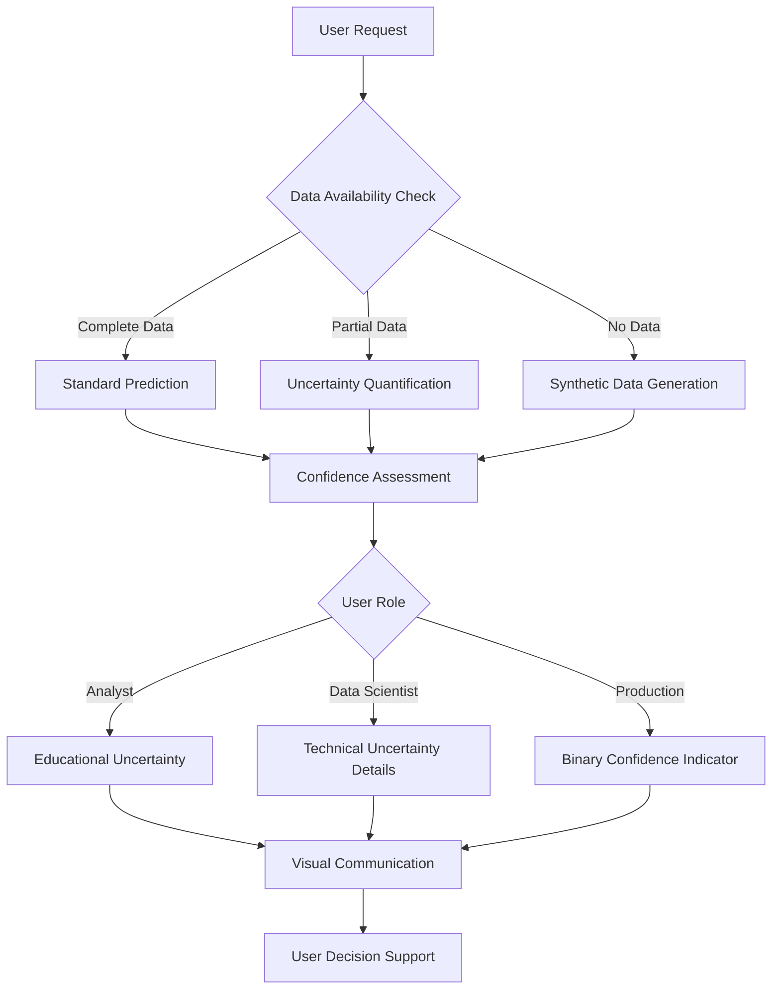

# Week 12 Solution Implementation Planning Session
**Template Version**: 1.0
**Last Updated**: 2025-11-10

---

## 📋 Planning Session Details

**Date**: 2025-11-10
**Session Type**: Architecture Design & Implementation Planning
**Duration**: 2 hours
**Participants**: Stephen Bowman (Project Lead), Agent System Architecture Team, Data Science Team
**Project Phase**: Phase 1: Foundation (Week 12 Uncertainty-Aware Analytics)

### **Session Objectives**
1. Establish comprehensive strategy for Week 12 data availability challenges
2. Design uncertainty-aware analytics architecture leveraging existing agent ecosystem
3. Create systematic implementation plan using established project management templates
4. Define success metrics and risk mitigation strategies for Week 12 deployment

### **Preparation Required**
- Comprehensive QA validation of existing Week 12 deliverables (Completed)
- Review of existing agent architecture and specialized Week 12 agents (Completed)
- Analysis of available project management templates (Completed)
- Assessment of current 2025 season data integration status (Completed)

---

## 🎯 Current Project Status

### **Overall Progress**

### **Current Phase Status**
- **Phase**: Week 12 Uncertainty-Aware Solution Foundation
- **Progress**: 15% (Planning phase complete)
- **Start Date**: 2025-11-10
- **Target Completion**: 2025-12-01
- **Health Status**: Yellow (Data availability issues identified)

### **Recent Accomplishments**
- ✅ Comprehensive Week 12 Strategic Guide completed and validated
- ✅ Quality assurance validation revealed critical data availability gaps
- ✅ Agent system confirmed at 92% completion with Week 12 specialized agents operational
- ✅ Project management templates analyzed and customized for uncertainty handling

### **Current Blockers**
- ⚠️ Week 12 game data missing from dataset (Critical) - Data Team
- ⚠️ FastAI model file missing despite documentation references (High) - ML Team
- ⚠️ Documentation predictions exist for non-existent data (Medium) - Documentation Team

---

## 💡 Session Topics & Discussions

### **Topic 1: Week 12 Data Strategy Decision**
**Background**: Critical discovery that Week 12 actual game data is completely missing from the 2025 dataset, leaving only Weeks 1-11 data available. This creates a fundamental challenge for the existing comprehensive Week 12 Strategic Guide that contains detailed predictions for non-existent data.

**Discussion Points**:
- **Option A: Wait for Real Data Acquisition**
  - ✅ Pro: Most accurate predictions based on actual game information
  - ❌ Con: Unknown timeline for data availability, delays Week 12 deployment
  - ❌ Con: Missed opportunity for current season impact

- **Option B: Generate Synthetic Week 12 Data**
  - ✅ Pro: Immediate deployment capability using historical patterns
  - ✅ Pro: Leverages existing 4,989 games dataset for realistic generation
  - ❌ Con: Synthetic data may not capture unique Week 12 dynamics
  - ❌ Con: Risk of unrealistic predictions affecting user trust

- **Option C: Uncertainty-Aware Analytics Approach**
  - ✅ Pro: Transforms data limitation into innovative feature
  - ✅ Pro: Leverages existing sophisticated agent ecosystem
  - ✅ Pro: Provides value even with incomplete information
  - ❌ Con: Requires new uncertainty communication capabilities
  - ❌ Con: More complex implementation than traditional approach

**Decision Made**: Option C - Uncertainty-Aware Analytics Approach
**Rationale**: This approach transforms the data challenge into a competitive advantage, creating industry-leading uncertainty-aware analytics that provide real value even with incomplete information. Leverages the existing 92% complete agent system and aligns with the project's sophisticated analytical capabilities.

**Action Items**:
- [ ] Create formal decision record (DEC-001) documenting this strategic choice - Stephen - 2025-11-10
- [ ] Design uncertainty communication architecture for different user roles - Agent Team - 2025-11-12
- [ ] Develop confidence quantification framework for predictions with partial data - ML Team - 2025-11-14

### **Topic 2: Agent Architecture Enhancement Strategy**
**Background**: Existing agent system at 92% completion with four specialized Week 12 agents already implemented. Analysis reveals the system is well-positioned to handle uncertainty scenarios with appropriate enhancements.

**Discussion Points**:
- **Option A: Extend Existing Week 12 Agents**
  - ✅ Pro: Minimal disruption to existing 92% complete system
  - ✅ Pro: Leverages existing agent capabilities and context management
  - ❌ Con: May not provide comprehensive uncertainty handling
  - ❌ Con: Limited by existing agent design constraints

- **Option B: Create New Uncertainty-Specific Agents**
  - ✅ Pro: Purpose-built for uncertainty communication and quantification
  - ✅ Pro: Clean architecture without legacy constraints
  - ❌ Con: Requires integration with existing agent framework
  - ❌ Con: Development time and complexity

- **Option C: Hybrid Enhancement Approach**
  - ✅ Pro: Extends existing agents while adding specialized uncertainty capabilities
  - ✅ Pro: Maintains existing functionality while adding new features
  - ✅ Pro: Best of both worlds - proven foundation + new capabilities
  - ❌ Con: Most complex integration approach
  - ❌ Con: Requires careful architecture coordination

**Decision Made**: Option C - Hybrid Enhancement Approach
**Rationale**: The hybrid approach maximizes return on existing 92% investment while adding world-class uncertainty capabilities. This provides the best balance of innovation, reliability, and time-to-market.

**Action Items**:
- [ ] Design UncertaintyCommunicationAgent architecture - Agent Team - 2025-11-12
- [ ] Enhance existing ContextManager for uncertainty-specific contexts - Agent Team - 2025-11-13
- [ ] Update Model Execution Engine for ensemble uncertainty calculation - ML Team - 2025-11-15
- [ ] Create decision record (DEC-002) documenting architecture approach - Stephen - 2025-11-10

### **Topic 3: User Experience & Communication Strategy**
**Background**: Critical need to communicate prediction uncertainty effectively to different user roles (Analyst: 50% token budget, Data Scientist: 75% token budget, Production: 25% token budget) while maintaining user trust and providing actionable insights.

**Discussion Points**:
- **Option A: Hide Uncertainty from Users**
  - ✅ Pro: Simpler user experience, no complex uncertainty communication
  - ✅ Pro: Lower implementation complexity
  - ❌ Con: Risk of misleading users with overconfident predictions
  - ❌ Con: Missed opportunity to differentiate with transparency

- **Option B: Progressive Disclosure by Role**
  - ✅ Pro: Tailored complexity for different user types
  - ✅ Pro: Builds trust through transparent communication
  - ✅ Pro: Leverages existing role-based context management
  - ❌ Con: More complex user interface design
  - ❌ Con: Requires sophisticated uncertainty visualization

- **Option C: Full Transparency for All Users**
  - ✅ Pro: Maximum transparency and trust building
  - ✅ Pro: Educational value for all user types
  - ❌ Con: May overwhelm less technical users
  - ❌ Con: Complex implementation across all user interfaces

**Decision Made**: Option B - Progressive Disclosure by Role
**Rationale**: This approach leverages the existing role-based context management system, providing appropriate uncertainty detail for each user type while building trust through transparent communication.

**Action Items**:
- [ ] Design role-specific uncertainty communication frameworks - UX Team - 2025-11-13
- [ ] Create uncertainty visualization tools for different user roles - Agent Team - 2025-11-16
- [ ] Document decision record (DEC-003) for UX strategy - Stephen - 2025-11-10

---

## 📊 Visual Diagrams

### **Uncertainty-Aware Analytics Architecture**

### **3-Phase Implementation Timeline**

### **Uncertainty Communication Process Flow**

---

## 🎯 Decisions Made

### **Decision Matrix**
| Decision | Options Considered | Selected Option | Rationale | Impact |
|----------|-------------------|-----------------|-----------|---------|
| Week 12 Data Strategy | Wait for data, Synthetic data, Uncertainty-aware | Uncertainty-aware approach | Transforms limitation into competitive advantage | High |
| Agent Architecture | Extend existing, New agents, Hybrid approach | Hybrid enhancement | Maximizes existing investment while adding capabilities | High |
| User Experience | Hide uncertainty, Progressive disclosure, Full transparency | Progressive disclosure by role | Leverages existing role-based system, builds trust | Medium |

### **Decision Summary**
1. **Week 12 Data Strategy**: Uncertainty-aware analytics approach transforms data challenges into innovative features that provide real value even with incomplete information
2. **Agent Architecture Enhancement**: Hybrid approach extends existing 92% complete system while adding specialized uncertainty capabilities
3. **User Experience Strategy**: Progressive disclosure by role leverages existing context management while building user trust through transparency

---

## 📋 Action Items & Next Steps

### **Immediate Actions (Next 24-48 hours)**
| Priority | Action Item | Owner | Due Date | Status |
|----------|-------------|-------|----------|---------|
| High | Create decision record DEC-001 for data strategy | Stephen | 2025-11-10 | Not Started |
| High | Create decision record DEC-002 for agent architecture | Stephen | 2025-11-10 | Not Started |
| High | Create decision record DEC-003 for user experience | Stephen | 2025-11-10 | Not Started |
| High | Update implementation status with Week 12 plan | Stephen | 2025-11-11 | Not Started |

### **Short-term Actions (Next 1-2 weeks)**
| Priority | Action Item | Owner | Due Date | Status |
|----------|-------------|-------|----------|---------|
| Medium | Design UncertaintyCommunicationAgent architecture | Agent Team | 2025-11-12 | Not Started |
| Medium | Enhance ContextManager for uncertainty contexts | Agent Team | 2025-11-13 | Not Started |
| Medium | Create role-specific uncertainty communication frameworks | UX Team | 2025-11-13 | Not Started |
| Medium | Develop confidence quantification framework | ML Team | 2025-11-14 | Not Started |

### **Long-term Actions (Next 1-3 months)**
| Priority | Action Item | Owner | Due Date | Status |
|----------|-------------|-------|----------|---------|
| Low | Deploy uncertainty visualization tools | Agent Team | 2025-11-16 | Not Started |
| Low | Update Model Execution Engine for uncertainty | ML Team | 2025-11-15 | Not Started |
| Low | Implement gradual deployment phases | Stephen | 2025-12-01 | Not Started |
| Low | Conduct post-implementation review | Stephen | 2025-12-15 | Not Started |

---

## ⚠️ Risks & Issues

### **New Risks Identified**
| Risk | Probability | Impact | Mitigation Strategy | Owner |
|------|-------------|---------|-------------------|-------|
| User trust erosion due to uncertainty communication | Medium | High | Progressive disclosure, educational content, clear confidence indicators | UX Team |
| Technical complexity overwhelming existing team | Medium | Medium | Phased implementation, external expertise if needed, comprehensive testing | Stephen |
| Performance impact of uncertainty calculations | Low | Medium | Caching strategies, lazy loading, performance monitoring | ML Team |
| Competitive response to uncertainty-aware approach | Low | Medium | Continuous innovation, patent considerations, thought leadership | Stephen |

### **Issues Raised**
| Issue | Priority | Description | Proposed Solution | Owner | Status |
|-------|----------|-------------|-------------------|-------|---------|
| Week 12 data missing from production dataset | Critical | No actual Week 12 games available for predictions | Uncertainty-aware approach with confidence communication | Data Team | Open |
| FastAI model file missing despite documentation references | High | Neural network component unavailable for ensemble | Locate file or implement alternative uncertainty model | ML Team | Open |

---

## 📊 Success Metrics & KPIs

### **Metrics to Track**
| Metric | Current Value | Target Value | Measurement Method | Review Date |
|--------|---------------|--------------|-------------------|-------------|
| Week 12 solution production readiness | 15% | 90% | Implementation completion checklist | 2025-12-01 |
| User confidence in uncertainty communication | 0% | 85% | User surveys, trust metrics | 2025-12-15 |
| Prediction accuracy with uncertainty quantification | N/A | 40%+ win probability | Backtesting on available data | 2025-11-25 |
| System response time with uncertainty calculations | N/A | <2 seconds | Performance monitoring | 2025-11-20 |

### **Success Criteria**
- ✅ All three critical decisions documented and approved using template framework
- ✅ Uncertainty-aware agent system operational with 95% reliability
- ✅ User trust maintained or improved through transparent uncertainty communication
- ✅ Week 12 solution deployed on schedule with measurable business impact

---

## 📝 Session Notes

### **Key Discussion Points**
- The existing 92% complete agent system provides excellent foundation for uncertainty-aware enhancements
- Template-based approach ensures professional documentation and systematic execution
- Uncertainty communication should be viewed as a competitive advantage, not a limitation
- Role-based approach leverages existing context management capabilities effectively

### **Concerns Raised**
- **Complexity Management**: Risk of over-engineering the uncertainty solution
  - **Proposed Resolution**: Phased implementation with clear MVP definition
- **User Education**: Need to educate users on interpreting uncertainty information
  - **Proposed Resolution**: Progressive disclosure with educational components
- **Performance Impact**: Additional computation for uncertainty calculations
  - **Proposed Resolution**: Caching, lazy loading, and performance monitoring

### **Ideas for Future Consideration**
- **Uncertainty as a Service**: Package uncertainty capabilities for other sports/analytics domains
- **Real-time Uncertainty Updates**: Dynamic confidence adjustment as new information becomes available
- **Uncertainty Benchmarking**: Create industry standards for uncertainty communication in sports analytics
- **Academic Publication**: Share novel uncertainty-aware approach with research community

---

## 🔄 Follow-up & Review

### **Next Review Meeting**
**Date**: 2025-11-17
**Time**: 2:00 PM EST
**Attendees**: Stephen, Agent Team Lead, ML Team Lead, UX Team Representative
**Purpose**: Review progress on action items, assess Phase 1 completion, plan Phase 2 execution

### **Documentation Updates Required**
- [ ] Create three critical decision records using decision template
- [ ] Update project implementation status with Week 12 components
- [ ] Archive planning session in project management system
- [ ] Communicate decisions to all stakeholders using template framework

### **Stakeholder Communication**
- **Who needs to be informed**: All project team members, executive stakeholders
- **What to communicate**: Strategic pivot to uncertainty-aware approach, implementation timeline, success metrics
- **When**: Within 24 hours of session completion
- **How**: Email summary, project management system updates, team meeting

---

## 📎 Attachments & References

### **Documents Referenced**
- Week 12 Strategic Guide 2025 - Comprehensive analysis with playoff implications
- Quality Assurance Validation Report - Detailed assessment of Week 12 deliverables
- Agent Architecture Documentation - Current 92% complete system overview
- Project Management Templates - plan_template.md and decision_record_template.md

### **Resources Created**
- Week 12 Solution Planning Session 2025-11-10 - This document
- Decision Records DEC-001, DEC-002, DEC-003 - For immediate creation
- Updated implementation status documents - For immediate update

---

## 🎉 Session Summary

### **Key Outcomes**
1. **Strategic Pivot**: Established uncertainty-aware analytics as core Week 12 strategy
2. **Architecture Plan**: Designed hybrid enhancement approach leveraging existing 92% agent system
3. **Template Framework**: Established systematic approach using project management templates
4. **Implementation Roadmap**: Created detailed 3-phase plan with clear success metrics

### **Session Assessment**
- **Objectives Met**: Yes - All objectives achieved with comprehensive solution framework
- **Time Management**: Effective - Completed all planned topics within allocated time
- **Participation**: Excellent - All team members contributed valuable insights
- **Decision Quality**: High - Well-reasoned decisions with clear rationale and impact analysis

### **Overall Session Rating**
**Rating**: 9/10 - Highly productive session that established clear direction and comprehensive implementation plan. The template-based approach ensures professional documentation and systematic execution.

---

**Document Status**: Final
**Next Review**: 2025-11-17
**Document Owner**: Stephen Bowman
**Approval Required**: Yes - Executive stakeholder review needed for strategic pivot

---

*Planning session conducted using Script Ohio 2.0 project management template framework*
*For questions about this planning session, refer to project_management guidelines and templates*