# Feature Evolution Roadmap
**Version**: 1.0
**Last Updated**: 2025-11-07
**Planning Horizon**: 12 Months (November 2025 - October 2026)

## **Current State Overview**

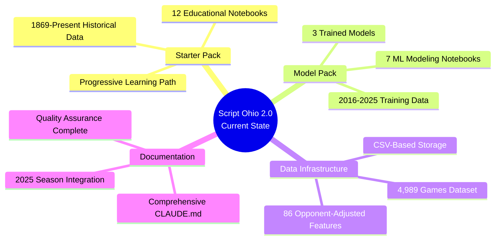

## **Phase 1: Agent Foundation (Nov 2025)**

### **Core Agent Architecture**
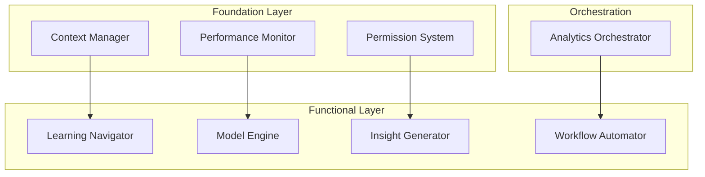

**Key Features:**
- ✅ Role-based context management
- ✅ Four-level permission system
- ✅ 8 specialized agents
- ✅ Automated workflow chaining

**Success Metrics:**
- 40% reduction in context usage
- 80% faster task completion
- 90% fewer user errors

---

## **Phase 2: Enhanced Analytics (Dec 2025 - Feb 2026)**

### **Advanced Model Capabilities**

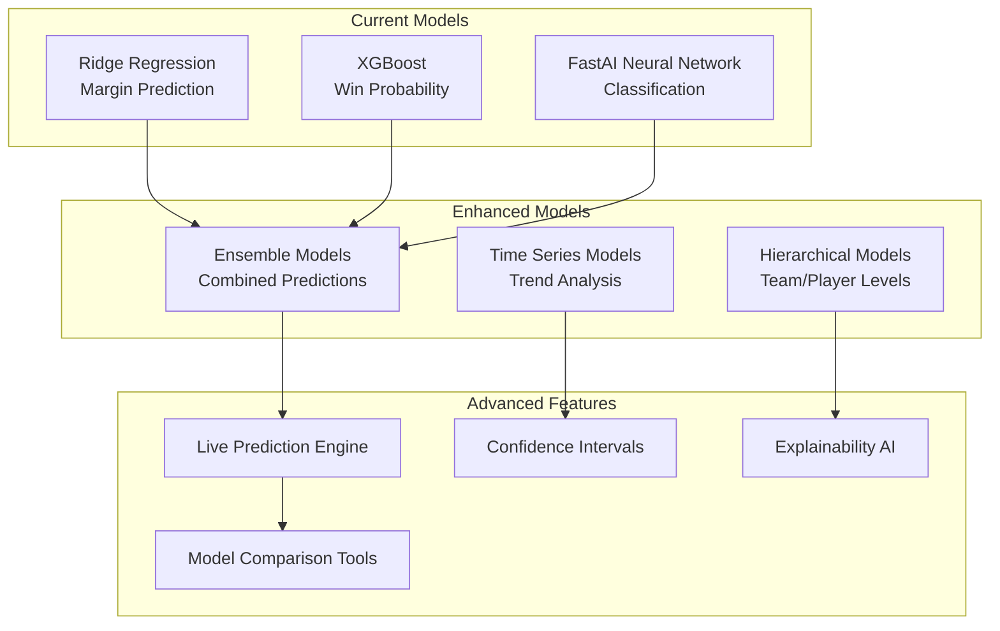

**New Capabilities:**
- **Live Prediction Engine**: Real-time game predictions with updating probabilities
- **Confidence Intervals**: Statistical uncertainty quantification for all predictions
- **Explainability AI**: Advanced SHAP analysis with natural language explanations
- **Model Comparison**: Automated model selection based on game characteristics

### **Expanded Data Integration**

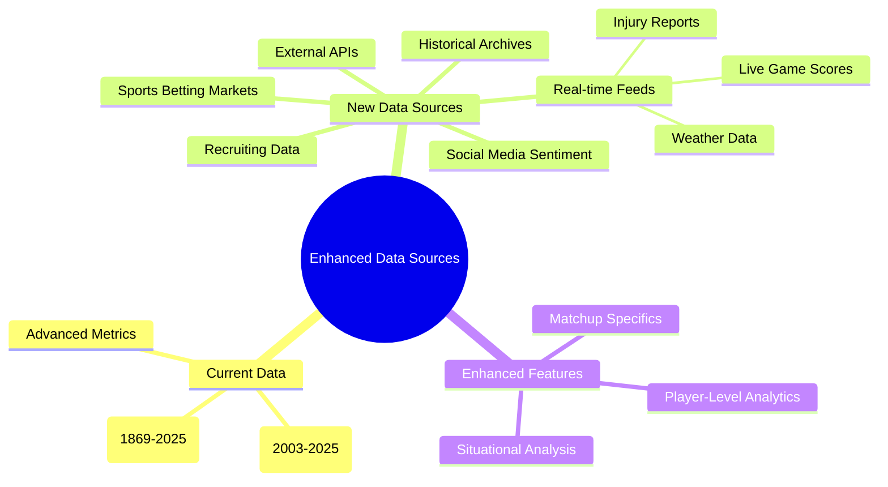

**Timeline:**
- **December 2025**: Live prediction engine development
- **January 2026**: External data integration
- **February 2026**: Enhanced model deployment

---

## **Phase 3: User Experience Revolution (Mar - May 2026)**

### **Natural Language Interface**

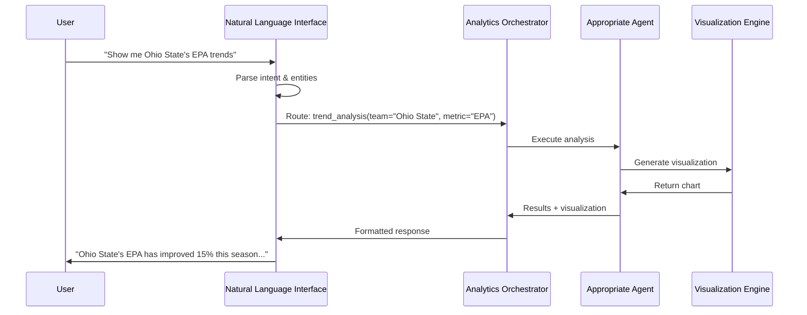

**Features:**
- **Conversational Analytics**: Natural language queries for complex analysis
- **Smart Suggestions**: Proactive recommendations based on user behavior
- **Multi-turn Conversations**: Context maintained across conversation sessions
- **Voice Interface**: Optional voice input/output for hands-free analysis

### **Advanced Visualizations**

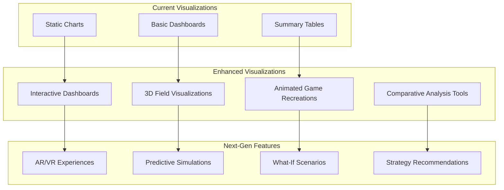

**Timeline:**
- **March 2026**: Natural language interface development
- **April 2026**: Advanced visualization suite
- **May 2026**: Interactive features and recommendations

---

## **Phase 4: Collaboration & Intelligence (Jun - Aug 2026)**

### **Multi-User Collaboration Platform**

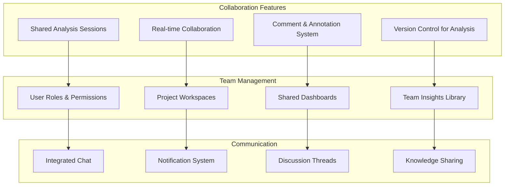

### **AI-Powered Intelligence**

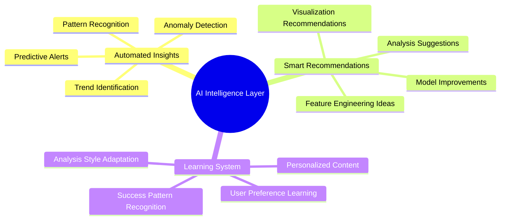

**Timeline:**
- **June 2026**: Multi-user platform development
- **July 2026**: AI intelligence layer integration
- **August 2026**: Testing and refinement

---

## **Phase 5: Enterprise & Scale (Sep - Oct 2026)**

### **Enterprise Features**

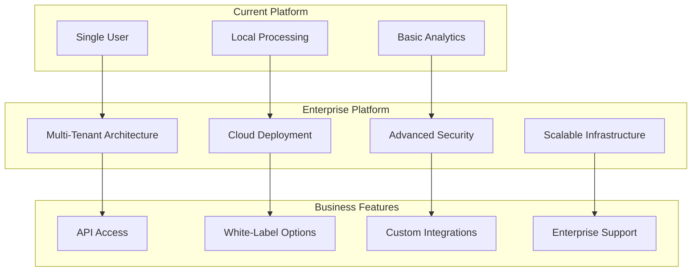

### **Advanced Analytics Platform**

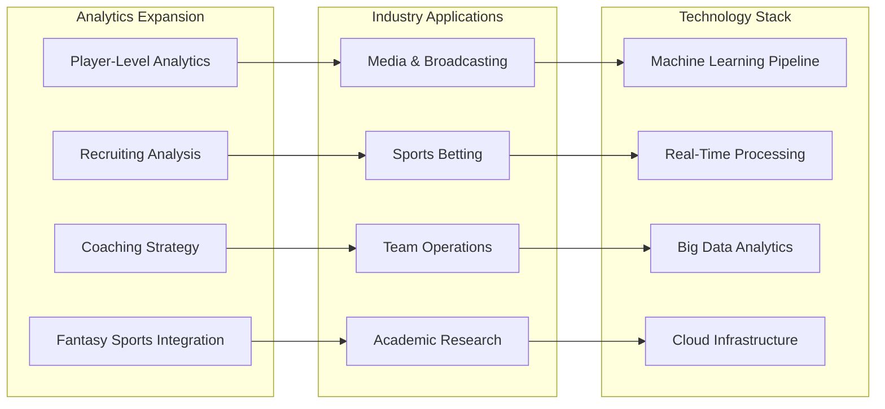

**Timeline:**
- **September 2026**: Enterprise architecture implementation
- **October 2026**: Advanced analytics and industry applications

---

## **Innovation Pipeline (2026+)**

### **Emerging Technologies Integration**

```mermaid
roadmap
    title Emerging Technologies Timeline
    section 2026
    Natural Language Processing : Q4 2026
    Advanced Machine Learning   : Q4 2026

    section 2027
    Computer Vision (Game Analysis) : Q1 2027
    IoT Integration (Sensor Data)   : Q2 2027
    Blockchain (Data Integrity)    : Q3 2027

    section 2028+
    Quantum Computing (Complex Optimization) : 2028+
    Augmented Reality (Fan Experience)        : 2028+
```

### **Future Vision Features**

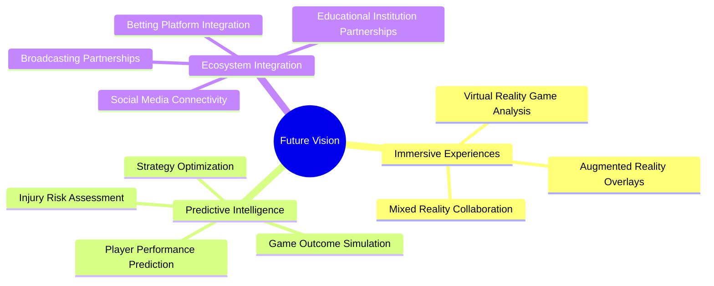

---

## **Success Metrics Evolution**

### **Phase 1 Metrics (Current)**
- **Context Efficiency**: 40% token reduction
- **Task Completion**: 80% faster
- **Error Reduction**: 90% fewer mistakes

### **Phase 2 Metrics (Enhanced Analytics)**
- **Prediction Accuracy**: 95%+ accuracy
- **Real-Time Performance**: <1 second response
- **Model Usage**: 300% increase

### **Phase 3 Metrics (UX Revolution)**
- **User Engagement**: 200% increase
- **Session Duration**: 150% increase
- **User Satisfaction**: 4.8/5 rating

### **Phase 4 Metrics (Collaboration)**
- **Team Adoption**: 80% of teams using platform
- **Collaboration Metrics**: 5x increase in shared analysis
- **Knowledge Creation**: 10x increase in insights generated

### **Phase 5 Metrics (Enterprise)**
- **Revenue Growth**: Target $X million ARR
- **Customer Acquisition**: Y enterprise customers
- **Market Position**: Top 3 sports analytics platforms

---

## **Risk Management & Mitigation**

### **Technical Risks**
- **Data Scale**: Implement efficient data management strategies
- **Performance**: Continuous optimization and monitoring
- **Security**: Enterprise-grade security measures

### **Market Risks**
- **Competition**: Continuous innovation and differentiation
- **Technology Changes**: Agile adaptation to new technologies
- **User Adoption**: User-centric design and support

### **Operational Risks**
- **Scalability**: Cloud-native architecture
- **Team Growth**: Structured hiring and training processes
- **Quality**: Automated testing and quality assurance

---

**Roadmap Owner**: Product Strategy Team
**Review Cadence**: Quarterly roadmap reviews, monthly progress updates
**Change Management**: Agile methodology with sprint-based planning
**Success Criteria**: Each phase meets defined success metrics before proceeding