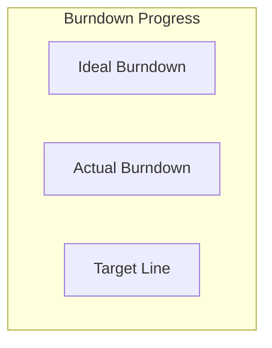
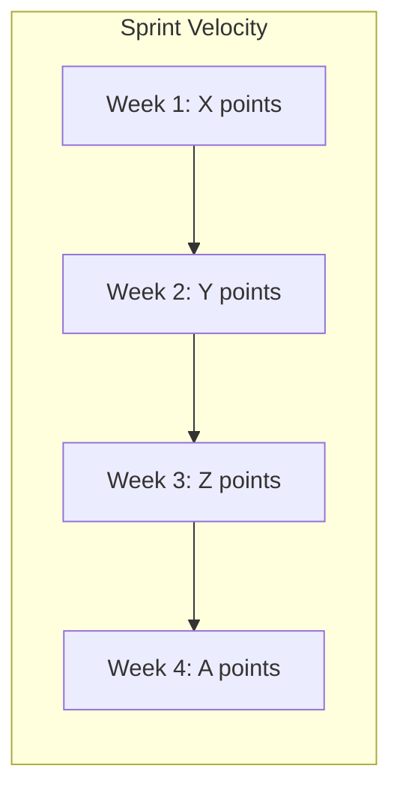

# Status Report Template
**Template Version**: 1.0
**Last Updated**: 2025-11-07

---

## 📋 Report Information

**Report Type**: [Weekly/Monthly/Phase Completion/Milestone]
**Reporting Period**: [Start Date] to [End Date]
**Report Date**: [YYYY-MM-DD]
**Project Phase**: [Current phase]
**Overall Project Health**: [Green/Yellow/Red]

**Prepared By**: [Name/Role]
**Reviewed By**: [Name/Role]
**Distribution List**: [Stakeholders who receive this report]

---

## 🎯 Executive Summary

### **Headline Status**
[One-sentence summary of project status]

### **Key Achievements This Period**
- ✅ [Major achievement 1]
- ✅ [Major achievement 2]
- ✅ [Major achievement 3]

### **Critical Issues & Blockers**
- ⚠️ [Critical issue 1] - [Impact] - [ETA for resolution]
- ⚠️ [Critical issue 2] - [Impact] - [ETA for resolution]

### **Overall Health Assessment**
**Status**: [On Track/At Risk/Delayed]
**Confidence Level**: [High/Medium/Low]
**Key Risk**: [Primary risk this period]

---

## 📊 Progress Overview

### **Overall Project Progress**


### **Phase Progress**
```mermaid
gantt
    title Current Phase Progress
    dateFormat  YYYY-MM-DD
    axisFormat %m/%d

    section [Current Phase Name]
    [Task 1] : [status], [start], [duration]
    [Task 2] : [status], [start], [duration]
    [Task 3] : [status], [start], [duration]
    [Task 4] : [status], [start], [duration]
```

### **Milestone Status**
| Milestone | Planned Date | Actual Date | Status | Notes |
|-----------|--------------|-------------|---------|-------|
| [Milestone 1] | [Date] | [Date] | [Completed/In Progress/Delayed] | [Notes] |
| [Milestone 2] | [Date] | [Date] | [Completed/In Progress/Delayed] | [Notes] |
| [Milestone 3] | [Date] | [Date] | [Completed/In Progress/Delayed] | [Notes] |

---

## 🏗️ Component Status

### **Development Components**
| Component | Status | Progress | Start Date | Target Completion | Owner | Blockers |
|-----------|--------|----------|------------|-------------------|-------|----------|
| [Component 1] | [Green/Yellow/Red] | [X%] | [Date] | [Date] | [Owner] | [Blockers] |
| [Component 2] | [Green/Yellow/Red] | [X%] | [Date] | [Date] | [Owner] | [Blockers] |
| [Component 3] | [Green/Yellow/Red] | [X%] | [Date] | [Date] | [Owner] | [Blockers] |

### **Infrastructure Components**
| Component | Status | Progress | Start Date | Target Completion | Owner | Notes |
|-----------|--------|----------|------------|-------------------|-------|-------|
| [Infrastructure 1] | [Green/Yellow/Red] | [X%] | [Date] | [Date] | [Owner] | [Notes] |
| [Infrastructure 2] | [Green/Yellow/Red] | [X%] | [Date] | [Date] | [Owner] | [Notes] |

### **Documentation Components**
| Component | Status | Progress | Start Date | Target Completion | Owner | Review Status |
|-----------|--------|----------|------------|-------------------|-------|--------------|
| [Documentation 1] | [Green/Yellow/Red] | [X%] | [Date] | [Date] | [Owner] | [Draft/Review/Approved] |
| [Documentation 2] | [Green/Yellow/Red] | [X%] | [Date] | [Date] | [Owner] | [Draft/Review/Approved] |

---

## 📈 Performance Metrics

### **Key Performance Indicators**
| Metric | Target | Current | Variance | Trend | Status |
|--------|--------|---------|----------|-------|--------|
| [KPI 1] | [Target] | [Current] | [+/- X%] | [📈/📉/➡️] | [Green/Yellow/Red] |
| [KPI 2] | [Target] | [Current] | [+/- X%] | [📈/📉/➡️] | [Green/Yellow/Red] |
| [KPI 3] | [Target] | [Current] | [+/- X%] | [📈/📉/➡️] | [Green/Yellow/Red] |

### **Quality Metrics**
| Metric | Target | Current | Status | Notes |
|--------|--------|---------|--------|-------|
| [Test Coverage] | [Target%] | [Current%] | [Green/Yellow/Red] | [Notes] |
| [Defect Density] | [Target] | [Current] | [Green/Yellow/Red] | [Notes] |
| [Performance] | [Target] | [Current] | [Green/Yellow/Red] | [Notes] |
| [User Satisfaction] | [Target] | [Current] | [Green/Yellow/Red] | [Notes] |

### **Resource Utilization**
| Resource | Planned | Actual | Utilization | Efficiency | Notes |
|----------|---------|--------|-------------|------------|-------|
| [Resource 1] | [Hours] | [Hours] | [X%] | [High/Medium/Low] | [Notes] |
| [Resource 2] | [Hours] | [Hours] | [X%] | [High/Medium/Low] | [Notes] |

---

## 🎯 Accomplishments This Period

### **Major Achievements**
#### **[Achievement 1]**
- **Description**: [Detailed description]
- **Impact**: [Business/technical impact]
- **Metrics**: [Measurable outcomes]
- **Owner**: [Team/individual responsible]

#### **[Achievement 2]**
- **Description**: [Detailed description]
- **Impact**: [Business/technical impact]
- **Metrics**: [Measurable outcomes]
- **Owner**: [Team/individual responsible]

#### **[Achievement 3]**
- **Description**: [Detailed description]
- **Impact**: [Business/technical impact]
- **Metrics**: [Measurable outcomes]
- **Owner**: [Team/individual responsible]

### **Completed Tasks**
| Task | Completion Date | Owner | Outcome |
|------|-----------------|-------|---------|
| [Task 1] | [Date] | [Owner] | [Result] |
| [Task 2] | [Date] | [Owner] | [Result] |
| [Task 3] | [Date] | [Owner] | [Result] |

### **Goals Met**
| Goal | Target | Achieved | Variance | Status |
|------|--------|----------|----------|--------|
| [Goal 1] | [Target] | [Actual] | [+/- X%] | [Met/Exceeded/Not Met] |
| [Goal 2] | [Target] | [Actual] | [+/- X%] | [Met/Exceeded/Not Met] |

---

## ⚠️ Issues & Blockers

### **Critical Blockers**
| Issue | Priority | Impact | Owner | Date Raised | Target Resolution | Status | Actions Taken |
|-------|----------|--------|-------|------------|-------------------|--------|---------------|
| [Blocker 1] | [Critical/High/Medium/Low] | [Impact Description] | [Owner] | [Date] | [Date] | [Open/In Progress/Resolved] | [Actions] |
| [Blocker 2] | [Critical/High/Medium/Low] | [Impact Description] | [Owner] | [Date] | [Date] | [Open/In Progress/Resolved] | [Actions] |

### **Active Issues**
| Issue | Priority | Category | Owner | Date Raised | Status | Resolution Plan |
|-------|----------|----------|-------|------------|--------|----------------|
| [Issue 1] | [High/Medium/Low] | [Technical/Business/Process] | [Owner] | [Date] | [Open/In Progress/Monitoring] | [Plan] |
| [Issue 2] | [High/Medium/Low] | [Technical/Business/Process] | [Owner] | [Date] | [Open/In Progress/Monitoring] | [Plan] |

### **Risk Status**
| Risk | Probability | Impact | Mitigation Status | Owner | Review Date |
|------|-------------|--------|-------------------|-------|------------|
| [Risk 1] | [Low/Medium/High] | [Low/Medium/High] | [Active/Complete/Monitoring] | [Owner] | [Date] |
| [Risk 2] | [Low/Medium/High] | [Low/Medium/High] | [Active/Complete/Monitoring] | [Owner] | [Date] |

---

## 📅 Next Period Priorities

### **High Priority Objectives**
| Priority | Objective | Owner | Target Completion | Success Criteria |
|----------|-----------|-------|-------------------|-----------------|
| [1] | [Objective 1] | [Owner] | [Date] | [Criteria] |
| [2] | [Objective 2] | [Owner] | [Date] | [Criteria] |
| [3] | [Objective 3] | [Owner] | [Date] | [Criteria] |

### **Planned Activities**
| Activity | Start Date | End Date | Owner | Dependencies | Status |
|----------|------------|----------|-------|--------------|--------|
| [Activity 1] | [Date] | [Date] | [Owner] | [Dependencies] | [Planned/Confirmed] |
| [Activity 2] | [Date] | [Date] | [Owner] | [Dependencies] | [Planned/Confirmed] |
| [Activity 3] | [Date] | [Date] | [Owner] | [Dependencies] | [Planned/Confirmed] |

### **Resource Needs**
| Resource | Need | Duration | Priority | Justification | Status |
|----------|------|----------|----------|----------------|--------|
| [Resource 1] | [Type/amount] | [Duration] | [High/Medium/Low] | [Why needed] | [Requested/Approved/Denied] |
| [Resource 2] | [Type/amount] | [Duration] | [High/Medium/Low] | [Why needed] | [Requested/Approved/Denied] |

---

## 💰 Budget & Financials

### **Budget Overview**
| Category | Budget | Spent | Remaining | Variance | Status |
|----------|--------|-------|-----------|----------|--------|
| [Category 1] | [$X] | [$Y] | [$Z] | [+/- $X] | [On Track/Over/Under] |
| [Category 2] | [$X] | [$Y] | [$Z] | [+/- $X] | [On Track/Over/Under] |
| **Total** | **[$X]** | **[$Y]** | **[$Z]** | **[+/- $X]** | **[On Track/Over/Under]** |

### **Financial Highlights**
- **Total Budget Utilization**: [X%]
- **Cost Variance**: [+/- $X] ([X%])
- **Burn Rate**: [$X per period]
- **Runway Remaining**: [X periods]

---

## 👥 Team & Stakeholder Updates

### **Team Performance**
| Team Member | Role | Availability | Performance | Notable Contributions |
|-------------|------|--------------|-------------|---------------------|
| [Name] | [Role] | [Full/Part/Contract] | [Exceeds/Meets/Needs Improvement] | [Contributions] |
| [Name] | [Role] | [Full/Part/Contract] | [Exceeds/Meets/Needs Improvement] | [Contributions] |

### **Stakeholder Communication**
| Stakeholder | Communication Type | Date | Outcome | Follow-up Required |
|-------------|-------------------|------|---------|-------------------|
| [Stakeholder 1] | [Meeting/Email/Report] | [Date] | [Summary] | [Yes/No] |
| [Stakeholder 2] | [Meeting/Email/Report] | [Date] | [Summary] | [Yes/No] |

---

## 📊 Visual Dashboards

### **Burndown Chart**


### **Velocity Trend**


---

## 📝 Lessons Learned

### **What Went Well**
- [Success 1] - [Why it worked well]
- [Success 2] - [Why it worked well]
- [Success 3] - [Why it worked well]

### **What Could Be Improved**
- [Improvement 1] - [How to improve]
- [Improvement 2] - [How to improve]
- [Improvement 3] - [How to improve]

### **Process Improvements Implemented**
- [Improvement 1] - [Impact]
- [Improvement 2] - [Impact]

---

## 🚀 Looking Ahead

### **Next Period Focus Areas**
1. **[Focus Area 1]**: [Why important, what success looks like]
2. **[Focus Area 2]**: [Why important, what success looks like]
3. **[Focus Area 3]**: [Why important, what success looks like]

### **Upcoming Milestones**
| Milestone | Target Date | Confidence Level | Dependencies | Success Criteria |
|-----------|-------------|------------------|--------------|-----------------|
| [Milestone 1] | [Date] | [High/Medium/Low] | [Dependencies] | [Criteria] |
| [Milestone 2] | [Date] | [High/Medium/Low] | [Dependencies] | [Criteria] |

### **Long-term Outlook**
**3-Month Forecast**: [Brief outlook for next quarter]
**6-Month Forecast**: [Brief outlook for next 6 months]
**Year-end Target**: [Brief year-end expectations]

---

## 📋 Action Items & Commitments

### **Commitments Made This Period**
| Commitment | Made To | Due Date | Owner | Status |
|------------|---------|----------|-------|--------|
| [Commitment 1] | [Stakeholder] | [Date] | [Owner] | [Open/In Progress/Completed] |
| [Commitment 2] | [Stakeholder] | [Date] | [Owner] | [Open/In Progress/Completed] |

### **Action Items for Next Period**
| Action | Priority | Owner | Due Date | Dependencies |
|--------|----------|-------|----------|--------------|
| [Action 1] | [High/Medium/Low] | [Owner] | [Date] | [Dependencies] |
| [Action 2] | [High/Medium/Low] | [Owner] | [Date] | [Dependencies] |

---

## 📎 Attachments & References

### **Reports & Documents**
- [Attachment 1] - [Description] - [Location]
- [Attachment 2] - [Description] - [Location]

### **Data Sources**
- [Data Source 1] - [Description] - [Location]
- [Data Source 2] - [Description] - [Location]

---

## 🎯 Executive Recommendations

### **Immediate Actions Required**
1. **[Action 1]**: [Urgency] - [Rationale] - [Owner]
2. **[Action 2]**: [Urgency] - [Rationale] - [Owner]

### **Strategic Recommendations**
1. **[Recommendation 1]**: [Expected impact] - [Timeline] - [Resources needed]
2. **[Recommendation 2]**: [Expected impact] - [Timeline] - [Resources needed]

### **Go/No-Go Recommendations**
| Decision | Recommendation | Rationale | Confidence | Risk Level |
|----------|----------------|-----------|------------|------------|
| [Decision 1] | [Go/No-Go/Conditional] | [Reasoning] | [High/Medium/Low] | [Low/Medium/High] |
| [Decision 2] | [Go/No-Go/Conditional] | [Reasoning] | [High/Medium/Low] | [Low/Medium/High] |

---

**Report Quality Assessment**:
- **Completeness**: [Complete/Partial] - [Missing elements]
- **Accuracy**: [High/Medium/Low] - [Data verification status]
- **Timeliness**: [On Time/Late] - [Reason if late]
- **Actionability**: [High/Medium/Low] - [Clarity of next steps]

---

**Next Report Date**: [Date]
**Distribution List**: [Stakeholders]
**Report Archive Location**: [Location]

---

*Template created for Script Ohio 2.0 project status reporting*
*For questions about template usage, refer to project_management guidelines*