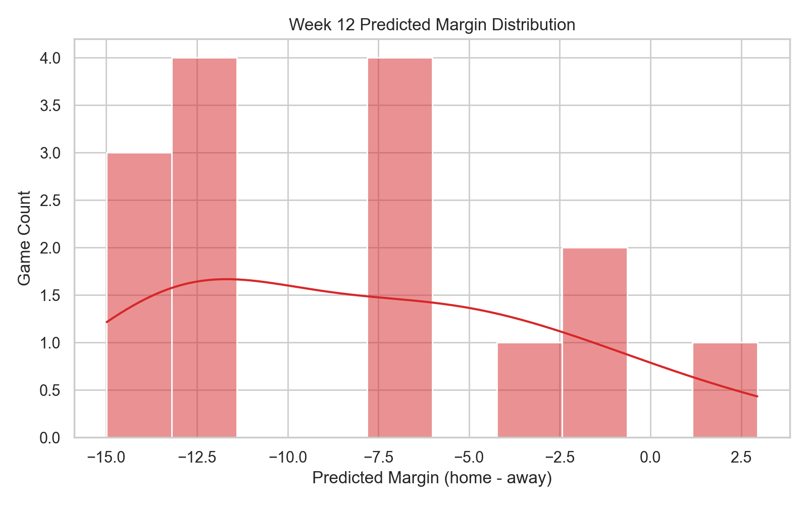
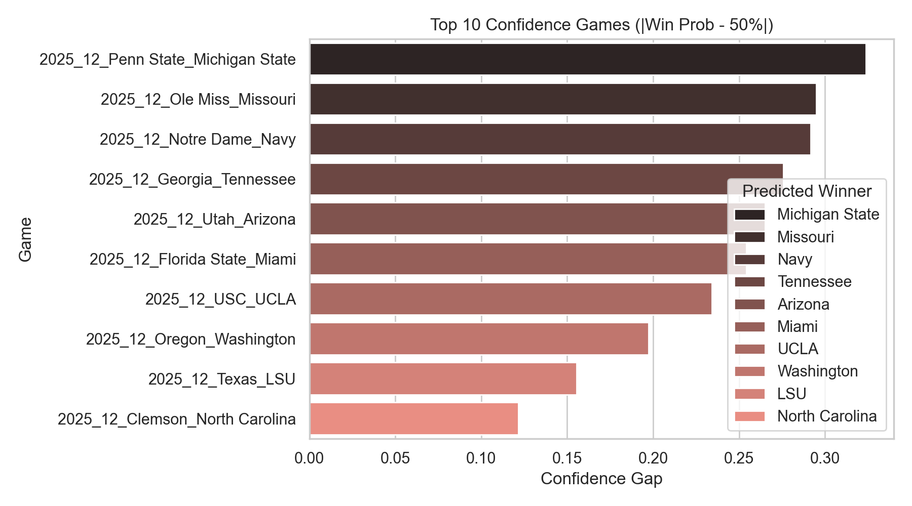
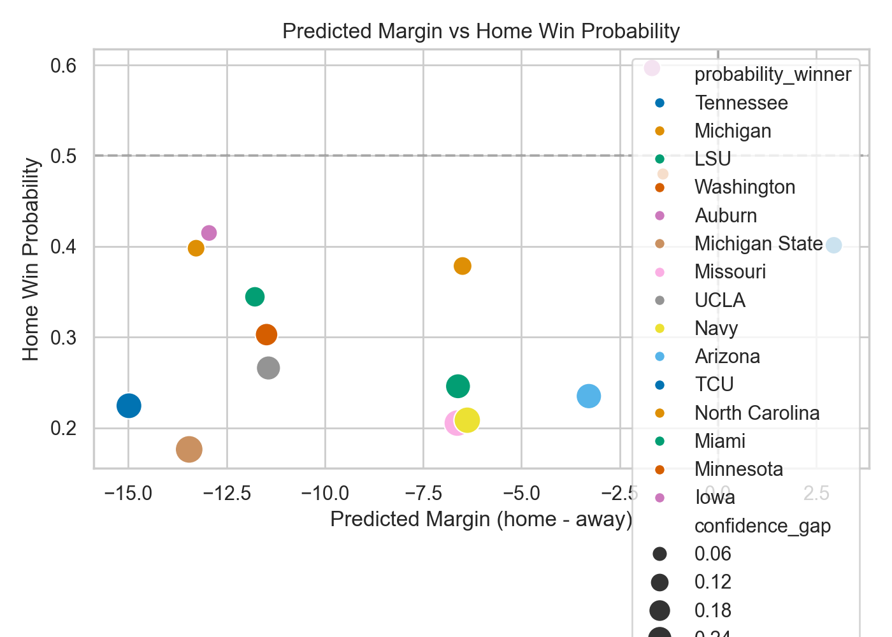

# Week 12 Prediction Report

**Generated:** November 14, 2025  
**Data & Scripts:**  
- Features: `model_pack/2025_raw_games_enhanced.csv` (season 2025, opponent-adjusted metrics)  
- Models: `model_pack/ridge_model_2025.joblib` (margin), `model_pack/xgb_home_win_model_2025.pkl` (home win probability)  
- Pipeline: `python3 reports/week12_prediction_pipeline.py`

## Executive Highlights

- **15 FBS games** on the slate; models heavily favor road teams, with an average projected margin of **-7.9 points** (home minus away) and only **one “Home ATS”** recommendation (Kansas State).  
- **Seven high-confidence picks** (|win probability − 50%| ≥ 20%) all tilt toward visiting squads, led by Penn State vs. Michigan State (home win probability 17.6%).  
- **Potential upset alert:** Kansas State is the lone game where the ridge model likes the home side by +2.9 despite the XGBoost classifier giving TCU a 59.9% win chance.  
- **Rivalry chaos incoming:** Georgia–Tennessee, Ohio State–Michigan, and Oregon–Washington all flash double-digit road edges, implying major board volatility for marquee matchups.

## Key Tables

### Top Confidence Plays (|P(home win) – 50%| ≥ 0.25)

| Home Team | Away Team | Predicted Margin | Home Win Probability | ATS Lean |
|-----------|-----------|-----------------:|---------------------:|---------|
| Penn State | Michigan State | -13.45 | 17.6% | Away ATS |
| Ole Miss | Missouri | -6.63 | 20.5% | Away ATS |
| Notre Dame | Navy | -6.38 | 20.8% | Away ATS |
| Georgia | Tennessee | -14.98 | 22.4% | Away ATS |
| Utah | Arizona | -3.29 | 23.5% | Away ATS |

### Toss-Ups & Watch List

| Home Team | Away Team | Predicted Margin | Home Win Probability | Note |
|-----------|-----------|-----------------:|---------------------:|------|
| Wisconsin | Minnesota | -1.40 | 48.0% | True coin flip, slight Gophers lean |
| Alabama | Auburn | -12.95 | 41.5% | Iron Bowl flagged as a lower-confidence projection despite large margin |
| Iowa | Nebraska | -1.68 | 59.7% | Only slate game with home-side probability above 55% |
| Kansas State | TCU | +2.95 | 40.1% | Only Home ATS call; big disagreement between models |

### ATS Recommendation Split

| Recommendation | Games |
|----------------|------:|
| Away ATS | 14 |
| Home ATS | 1 |

## Visuals







## Methodology Notes

1. Filtered the refreshed dataset for `season == 2025` and `week == 12` regular-season games.  
2. Used the ridge regression model (8 features) to project score margin; translated sign into ATS lean versus the market spread column.  
3. Ran the XGBoost classifier (13 features) for home win probability to capture outright results and confidence gaps.  
4. Generated artifacts:
   - Structured predictions: `reports/week12_predictions.csv`
   - JSON summary (counts, top games, upset watch): `reports/week12_prediction_summary.json`
   - Visual assets in `reports/week12_assets/`

## Re-run Instructions

```bash
cd /Users/stephen_bowman/Documents/GitHub/Script_Ohio_2.0
python3 reports/week12_prediction_pipeline.py
```

The command refreshes the CSV, JSON summary, and plots, enabling quick iteration when the feature dataset or models update.

